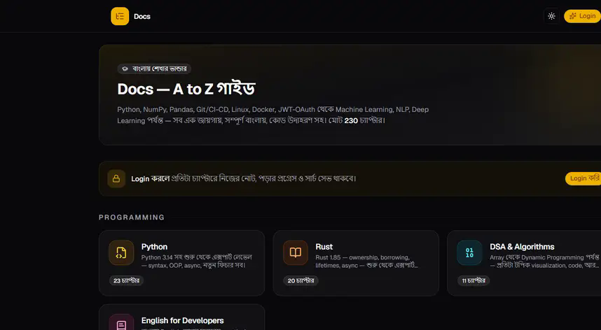
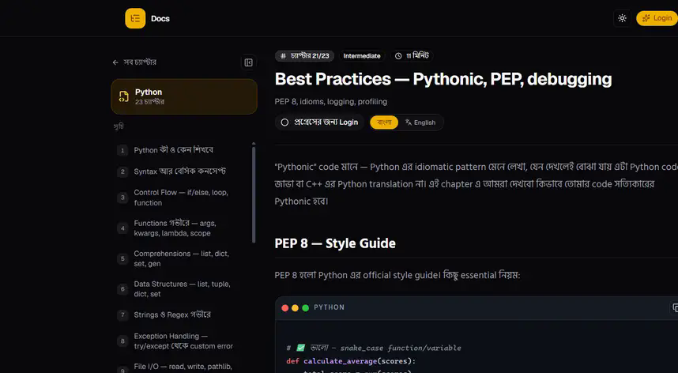
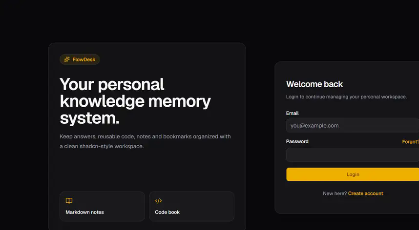

<div align="center">


# FlowDesk

**Your personal knowledge memory system.**

Bookmarks · Notes · Code Snippets · Routine · Expenses · AI Assistant — all in one place.

[](https://masud-rana.me)
[](https://pages.cloudflare.com)
[](https://masudranaxpert.github.io/flowdesk/)

</div>

---

## What is FlowDesk?

FlowDesk is a full-stack personal knowledge and productivity hub. Instead of
scattering your work across ten different apps, FlowDesk keeps everything behind
one login:

| Module | What it does |
|--------|-------------|
| **Bookmarks** | Save, tag, and organize links with automatic title/description detection |
| **Notebooks** | Markdown notes with live preview, AI assist, auto-save drafts and history |
| **Code Book** | Reusable snippets with syntax highlighting, search, and favorites |
| **Questions** | Competitive-programming tracker with "explain with AI" |
| **Routine** | Daily schedule with local notifications and `.ics` calendar export |
| **Hisab** | Expense and budget tracker with charts and transfers |
| **Progress** | Roadmaps, daily habits, and consistency charts |
| **Passwords** | Password manager with TOTP authenticator |
| **Files** | Cloud storage on R2 with shareable links and video streaming |
| **AI Chat** | Multi-provider assistant (Gemini / OpenAI / OpenRouter) that acts on your vault |
| **Docs** | 230+ chapters of developer documentation — DSA, Rust, Python, ML, and more |

## Gallery

**Documentation — 230 chapters across 23 categories, with interactive DSA
visualizations, math rendering, and English translations:**





*Chapter reader: sidebar TOC, level/minutes badges, read-progress tracking,
Bengali/English toggle.*



*Dark-first, clean authentication.*

## Tech Stack

| Layer | Technology |
|-------|------------|
| Frontend | React 19, TypeScript, Tailwind CSS 4, Vite |
| UI | Radix UI / shadcn-style components, Lucide Icons |
| Backend | Cloudflare Pages Functions (edge runtime) |
| Database | Cloudflare D1 (SQLite) with direct bindings |
| Storage | Cloudflare R2 (files, video streaming with range requests) |
| AI | Gemini · OpenAI · OpenRouter (bring-your-own-key) |
| Email | Resend (verification and password-reset codes) |
| Mobile | Capacitor (Android) with local and push notifications |
| Docs Site | MkDocs Material (this repository's `docs/`) |

## Getting Started

Full setup instructions — including Cloudflare provisioning, D1 schema, and
Android builds — live in the
**[project documentation](https://masudranaxpert.github.io/flowdesk/)**.

Quick start:

```bash
git clone https://github.com/masudranaxpert/flowdesk.git
cd flowdesk
npm install
cp .env.example .env   # fill in your values
npm run dev
```

### Environment Variables

| Variable | Required | Purpose |
|----------|----------|---------|
| `AUTH_SECRET` | Yes | Signs session tokens (HMAC-SHA256) — `openssl rand -hex 32` |
| `D1_REST_URL` / `D1_REST_TOKEN` | Local dev only | REST fallback when no D1 binding exists |
| `RESEND_API_KEY` / `EMAIL_FROM` | Production | Verification and reset emails |
| Cloudflare bindings `DB` (D1), `R2` | Production | Configured in the Pages dashboard |

> In production, D1 and R2 are bound directly in the Cloudflare Pages dashboard —
> the REST variables are only a local-development fallback.

## Deploying to Cloudflare Pages

1. Push this repository to GitHub and connect it to **Cloudflare Pages**.
2. Build command: `npm run build` · Output directory: `dist`
3. In **Pages → Settings → Functions → Bindings**, add:
   - `DB` → your D1 database
   - `R2` → your R2 bucket
4. Add the secrets from the table above.
5. Deploy — the schema is created automatically on first boot.

The legacy Vercel setup has been removed; Cloudflare Pages is the only
supported host.

## Android

APK releases are automated with GitHub Actions — push a tag like `v1.2.0` and
the workflow builds a debug APK and attaches it to a GitHub Release. See
[`.github/workflows/android-release.yml`](.github/workflows/android-release.yml).

## Security Notes

- Session tokens are HMAC-SHA256 signed; passwords are hashed with
  PBKDF2-SHA512 (100k iterations).
- `AUTH_SECRET` has **no default** — the API refuses to start without it.
- Share links use unguessable codes; bearer tokens via query string are
  supported only for ``/download endpoints that cannot send headers.

## Roadmap

- [ ] Public API docs
- [ ] Multi-device sync indicator
- [ ] PWA install support

---

<div align="center">
Built for personal knowledge management · <a href="https://masud-rana.me">masud-rana.me</a>
</div>
