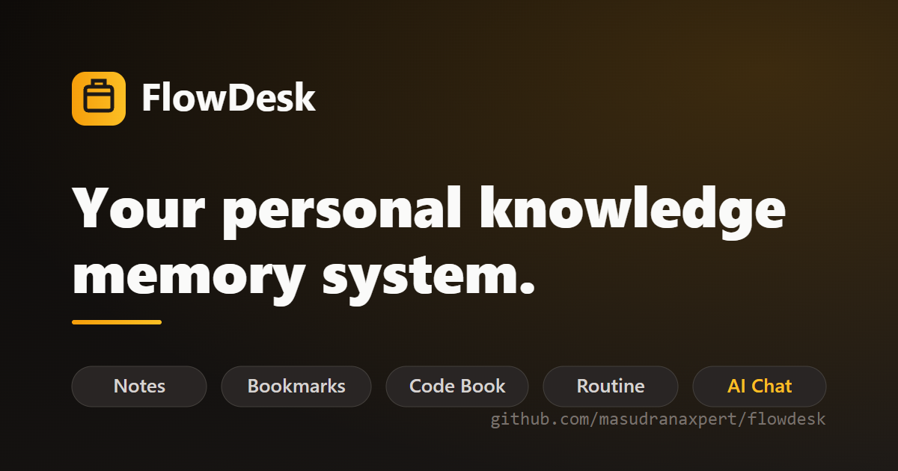
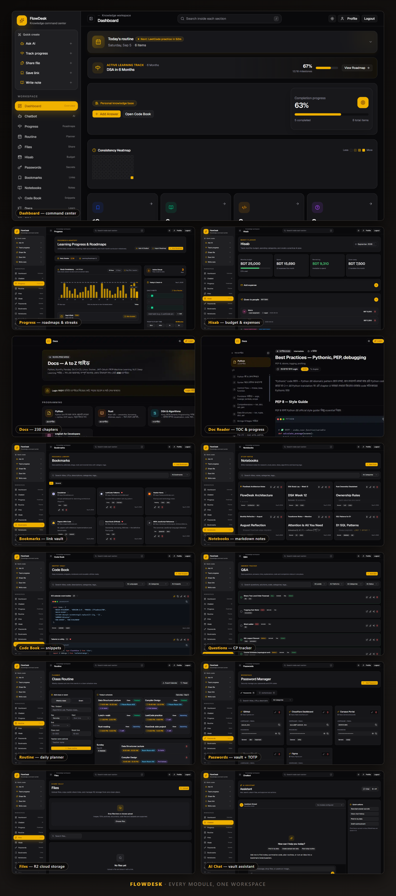

<div align="center">



# FlowDesk

**Your personal knowledge memory system.**

[](https://masud-rana.me)
[](https://pages.cloudflare.com)
[](https://masudranaxpert.github.io/flowdesk/)

</div>

---

FlowDesk is a full-stack productivity hub on the Cloudflare edge — bookmarks,
markdown notebooks, code snippets, routine and habit tracking, expenses, a
password manager with TOTP, file sharing with video streaming, and a
multi-provider AI assistant that acts on your vault. It also ships **230+
chapters of developer documentation** (DSA, Rust, Python, ML, and more) with
interactive visualizations.

<div align="center">
  
</div>

## Highlights

- **One vault, one login** — 10+ modules, unified search, dark-first UI
- **Docs that teach** — 230 chapters, 23 categories, Bengali with English translations
- **AI that acts** — Gemini / OpenAI / OpenRouter; the assistant creates bookmarks, notes, and routines for you
- **Edge-native** — Pages Functions + D1 + R2, nothing to manage
- **Android app** — Capacitor shell with local notifications, released automatically by GitHub Actions

## Tech Stack

React 19 · TypeScript · Tailwind CSS 4 · Vite · Cloudflare Pages Functions · D1 · R2 · Resend · Capacitor · MkDocs Material

## Quick Start

```bash
git clone https://github.com/masudranaxpert/flowdesk.git
cd flowdesk
npm install
cp .env.example .env   # add AUTH_SECRET (openssl rand -hex 32)
npm run dev
```

Setup, Cloudflare deployment, bindings, and Android builds are covered step by
step in the **[documentation](https://masudranaxpert.github.io/flowdesk/)**.

---

<div align="center">
Built for personal knowledge management · <a href="https://masud-rana.me">masud-rana.me</a>
</div>
