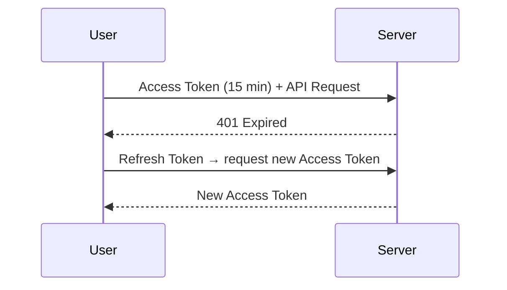

## JWT কী

**JWT** বা **JSON Web Token** হলো একটা compact, self-contained way যেটা দিয়ে দুই party এর মধ্যে নিরাপদে information পাঠানো যায়। এটা একটা JSON object যেটা digitally signed থাকে, তাই tamper করা গেলে ধরা যায়।

Authentication এ JWT ব্যাপক ব্যবহৃত হয়। User login করলে server একটা JWT দেয়, আর এর পরের সব request এ এই token পাঠালেই user identify হয়ে যায়।

## JWT এর Structure

JWT তিনটা অংশ নিয়ে গঠিত, যাকে dot (`.`) দিয়ে আলাদা করা হয়:

```text
eyJhbGciOiJIUzI1NiIsInR5cCI6IkpXVCJ9 . eyJzdWIiOiIxMjM0IiwibmFtZSI6IkthcmltIn0 . SflKxwRJSMeKKF2QT4fwpMeJf36POk6yJV_adQssw5c
\_____________ ___________________/   \___________ ___________________/   \_____________________ ____________________/
              V                                   V                                         V
          Header                             Payload                                 Signature
```

### Header

Header এ থাকে token এর type আর কোন signing algorithm ব্যবহার হয়েছে।

```json
{
  "alg": "HS256",
  "typ": "JWT"
}
```

### Payload

Payload এ থাকে আসল ডেটা — একে **claims** বলে। User id, role, expiration ইত্যাদি।

```json
{
  "sub": "1234567890",
  "name": "Karim",
  "role": "admin",
  "iat": 1700000000,
  "exp": 1700003600
}
```

কিছু standard claim:

| Claim | মানে | কী করে |
|-------|------|--------|
| `sub` | subject | user id |
| `iat` | issued at | কখন token তৈরি হয়েছে |
| `exp` | expiration | কখন expire হবে |
| `iss` | issuer | কে issue করেছে |
| `aud` | audience | কার জন্য |

### Signature

Signature হলো নিরাপত্তার মূল ভিত্তি। Header আর payload কে একসাথে নিয়ে secret key দিয়ে sign করা হয়।

```text
HMACSHA256(
  base64UrlEncode(header) + "." + base64UrlEncode(payload),
  secret_key
)
```

## Encoding নাকি Encryption?

অনেকের ভুল ধারণা আছে JWT encrypted। না, **JWT encoded, encrypted না**। Payload কে শুধু base64 encode করা হয়। যে কেউ decode করে ভেতরের ডেটা দেখতে পারে।

```python
import base64
import json

# যে কেউ এটা করতে পারে!
token = "eyJzdWIiOiIxMjM0IiwibmFtZSI6IkthcmltIn0"
decoded = base64.urlsafe_b64decode(token + "==")
print(json.loads(decoded))
# {'sub': '1234', 'name': 'Karim'}
```

Signature এর কাজ হলো শুধু verify করা — token টা পরিবর্তন হয়েছে কি না। গোপন রাখা নয়।

> [!danger] Sensitive ডেটা JWT তে রাখবে না
# Password, credit card number, secret key — এসব কখনো JWT payload এ রাখবে না। Payload base64 encode করা, যে কেউ decode করে পড়তে পারে। Signature শুধু tampering আটকায়, পড়া আটকায় না। যদি sensitive ডেটা রাখতেই হয়, encrypted JWT (JWE) ব্যবহার করো।

## Signing Algorithm

### HMAC (HS256)

Symmetric — একই secret key দিয়ে sign আর verify করা হয়। Simple, কিন্তু যে কেউ verify করতে পারলে sign ও করতে পারে।

### RSA (RS256)

Asymmetric — private key দিয়ে sign করা হয়, public key দিয়ে verify করা হয়। একটা service sign করে, আরেকটা service শুধু verify করে — এই scenario তে best।

| Algorithm | Key Type | Best For |
|-----------|---------|----------|
| HS256 | Symmetric | Single server |
| RS256 | Asymmetric | Distributed / microservices |
| ES256 | Asymmetric | Modern, smaller signature |

## Practical — Python এ JWT

PyJWT library দিয়ে create আর verify করা:

```bash
pip install PyJWT
```

### Token Create করা

```python
import jwt
from datetime import datetime, timedelta, timezone

SECRET_KEY = "super-secret-change-in-production"

payload = {
    "sub": "user_123",
    "name": "Karim Ahmed",
    "role": "admin",
    "iat": datetime.now(timezone.utc),
    "exp": datetime.now(timezone.utc) + timedelta(hours=1)
}

token = jwt.encode(payload, SECRET_KEY, algorithm="HS256")
print(token)
```

### Token Verify করা

```python
try:
    decoded = jwt.decode(
        token,
        SECRET_KEY,
        algorithms=["HS256"]
    )
    print(decoded["name"])  # Karim Ahmed
    print(decoded["role"])  # admin
except jwt.ExpiredSignatureError:
    print("Token expired!")
except jwt.InvalidTokenError:
    print("Invalid token!")
```

## Expiration আর Refresh Token

Access token short-lived রাখা উচিত — 15 থেকে 60 মিনিট। কিন্তু বারবার login করতে না হয় তাই **refresh token** ব্যবহার হয়।



```python
# Access token — short lived
access_token = jwt.encode({
    "sub": "user_123",
    "type": "access",
    "exp": datetime.now(timezone.utc) + timedelta(minutes=15)
}, SECRET_KEY, algorithm="HS256")

# Refresh token — long lived
refresh_token = jwt.encode({
    "sub": "user_123",
    "type": "refresh",
    "exp": datetime.now(timezone.utc) + timedelta(days=7)
}, SECRET_KEY, algorithm="HS256")
```

> [!warn] Algorithm Confusion Attack
# কিছু library আগে থেকে `alg: none` accept করত — মানে signature ছাড়াই token valid হয়ে যেত। আরেকটা attack — attacker `RS256` (asymmetric) কে `HS256` (symmetric) এ বদলে দিয়ে public key কে secret হিসেবে ব্যবহার করে। সবসময় `decode` করার সময় `algorithms=["HS256"]` স্পষ্টভাবে উল্লেখ করো।

## Security Checklist

| Issue | সমাধান |
|-------|--------|
| Weak secret | কমপক্ষে 256-bit random secret |
| No expiration | সবসময় `exp` claim দাও |
| Algorithm none | `algorithms` parameter স্পষ্টভাবে দাও |
| Token in URL | URL এ রাখবে না, header ব্যবহার করো |
| Long-lived token | Refresh token pattern ব্যবহার করো |
| No logout | Token blacklist বা version-based invalidation |

## Summary

JWT হলো header.payload.signature — encoded, encrypted না। Payload যে কেউ পড়তে পারে, শুধু tamper করা যায় না। HMAC (symmetric) single server এর জন্য, RSA (asymmetric) distributed system এর জন্য। Access token short-lived, refresh token long-lived। সবসময় explicit algorithm specify করো আর sensitive ডেটা payload এ রাখবে না।