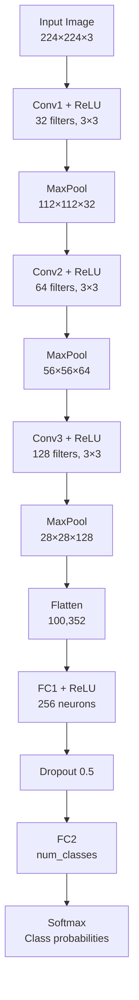

## CNN Architecture গভীরে

Convolutional Neural Network (CNN) হলো image recognition এর মেরুদণ্ড। সাধারণ Neural Network দিয়ে ছবি process করলে parameter সংখ্যা বিশাল হয়ে যায় আর spatial information (কোন pixel পাশে আছে) হারিয়ে যায়। CNN এই সমস্যা solve করে — parameter sharing আর spatial hierarchy দিয়ে।

## সাধারণ NN দিয়ে ছবি কেন নয়?

একটা 224×224 RGB ছবিতে 224×224×3 = 150,528 input আছে। প্রথম hidden layer এ যদি শুধু 1000 neuron থাকে, তাহলে weight = 150,528 × 1000 = 150 মিলিয়ন! এত parameter train করা প্রায় অসম্ভব। আর Fully Connected layer pixel গুলোর spatial relationship (পাশের pixel গুলোর সাথে সম্পর্ক) হারিয়ে ফেলে।

```text
Problem with Flat NN:
224×224×3 = 150,528 inputs
           ↓
    [Flatten] ← spatial info LOST
           ↓
    150M+ parameters ← too many!

CNN Solution:
224×224×3 → [Conv] → [Pool] → [Conv] → [Pool] → [FC]
  Parameter sharing + spatial hierarchy
```

## Convolution Layer

Convolution হলো CNN এর হৃদপিণ্ড। একটা ছোট matrix (kernel বা filter) ছবির উপর slide করে। প্রতিটা position এ element-wise multiply আর sum করে একটা value বের করে। এই kernel গুলো learn করতে পারে — edge, texture, shape ইত্যাদি detect করে।

নিচের diagram এ দেখানো হলো kernel কীভাবে image এর উপর slide করে feature map তৈরি করে:

```text
Image (5×5)          Kernel (3×3)        Feature Map (3×3)
┌───┬───┬───┬───┬───┐  ┌───┬───┬───┐    ┌───┬───┬───┐
│ 1 │ 2 │ 0 │ 1 │ 3 │  │ 1 │ 0 │-1 │    │ 5 │ 1 │ ? │
├───┼───┼───┼───┼───┤  ├───┼───┼───┤    ├───┼───┼───┤
│ 0 │ 1 │ 2 │ 1 │ 0 │  │ 1 │ 0 │-1 │    │ ? │ ? │ ? │
├───┼───┼───┼───┼───┤  ├───┼───┼───┤    ├───┼───┼───┤
│ 1 │ 0 │ 1 │ 3 │ 1 │  │ 1 │ 0 │-1 │    │ ? │ ? │ ? │
├───┼───┼───┼───┼───┘  └───┴───┴───┘    └───┴───┴───┘
│ 2 │ 1 │ 0 │ 1 │ 0 │
├───┼───┼───┼───┼───┘
│ 0 │ 1 │ 2 │ 1 │ 1 │

Convolution: slide kernel over image, multiply & sum at each position
```

### Convolution Parameters

প্রতিটা convolution layer এ কিছু গুরুত্বপূর্ণ parameter থাকে:

| Parameter | কী | Common Value |
|-----------|-----|-------------|
| `in_channels` | Input এ কতটা channel | 3 (RGB), 64, 128 |
| `out_channels` | কতগুলো filter (output channel) | 32, 64, 128, 256 |
| `kernel_size` | Filter এর size | 3×3, 5×5, 7×7 |
| `stride` | কত pixel করে jump | 1 (default), 2 |
| `padding` | Edge এর চারপাশে zero add | 0 (no), 1 (same) |

## Pooling Layer

Pooling দিয়ে feature map এর spatial size কমানো হয় — computation কমে, আর translation invariance বাড়ে। MaxPool সবচেয়ে common — প্রতিটা window এর maximum value নেয়।

নিচের উদাহরণে 2×2 MaxPool দেখানো হলো — প্রতিটা 2×2 window থেকে max value নিয়ে size অর্ধেক করা হয়:

```text
Max Pooling (2×2, stride=2):
Input (4×4)              Output (2×2)
┌───┬───┬───┬───┐       ┌───┬───┐
│ 1 │ 3 │ 2 │ 1 │       │ 3 │ 4 │
├───┼───┼───┼───┘  →    ├───┼───┤
│ 2 │ 0 │ 4 │ 2 │       │ 6 │ 2 │
├───┼───┼───┼───┘       └───┴───┘
│ 5 │ 6 │ 1 │ 0 │
├───┼───┼───┼───┘
│ 1 │ 2 │ 1 │ 2 │
```

## Building CNN with PyTorch

নিচের কোডে সম্পূর্ণ CNN model scratch থেকে বানানো হলো। তিনটা Conv block (Conv + ReLU + MaxPool), তারপর Fully Connected layer। `nn.Module` inherit করে, `forward` method এ data flow define করা হয়।

```python
import torch
import torch.nn as nn
import torch.nn.functional as F

class SimpleCNN(nn.Module):
    def __init__(self, num_classes=10):
        super(SimpleCNN, self).__init__()

        # Conv Block 1: 3 channels → 32 features
        self.conv1 = nn.Conv2d(3, 32, kernel_size=3, padding=1)
        self.pool1 = nn.MaxPool2d(2, 2)

        # Conv Block 2: 32 → 64 features
        self.conv2 = nn.Conv2d(32, 64, kernel_size=3, padding=1)
        self.pool2 = nn.MaxPool2d(2, 2)

        # Conv Block 3: 64 → 128 features
        self.conv3 = nn.Conv2d(64, 128, kernel_size=3, padding=1)
        self.pool3 = nn.MaxPool2d(2, 2)

        # Fully connected layers
        self.fc1 = nn.Linear(128 * 28 * 28, 256)
        self.fc2 = nn.Linear(256, num_classes)
        self.dropout = nn.Dropout(0.5)

    def forward(self, x):
        # Conv blocks: Conv → ReLU → Pool
        x = self.pool1(F.relu(self.conv1(x)))
        x = self.pool2(F.relu(self.conv2(x)))
        x = self.pool3(F.relu(self.conv3(x)))

        # Flatten for FC layers
        x = x.view(x.size(0), -1)

        # FC layers with dropout
        x = F.relu(self.fc1(x))
        x = self.dropout(x)
        x = self.fc2(x)
        return x

# Create model
model = SimpleCNN(num_classes=10)
print(f"Total parameters: {sum(p.numel() for p in model.parameters()):,}")
```

## Training Loop

Model train করার জন্য forward pass → loss calculation → backward pass → weight update এই চক্র repeat করতে হয়। নিচের কোডে সম্পূর্ণ training loop দেখানো হলো। `optimizer.zero_grad()` দিয়ে old gradient clear করা হয়, `loss.backward()` দিয়ে gradient compute হয়।

```python
import torch.optim as optim
from torch.utils.data import DataLoader
import torchvision.transforms as transforms
import torchvision.datasets as datasets

# Data augmentation and normalization
transform = transforms.Compose([
    transforms.Resize((224, 224)),
    transforms.RandomHorizontalFlip(),
    transforms.RandomRotation(10),
    transforms.ColorJitter(brightness=0.2, contrast=0.2),
    transforms.ToTensor(),
    transforms.Normalize(mean=[0.485, 0.456, 0.406],
                         std=[0.229, 0.224, 0.225])
])

# Load dataset
train_dataset = datasets.ImageFolder("data/train", transform=transform)
train_loader = DataLoader(train_dataset, batch_size=32, shuffle=True)

# Loss and optimizer
criterion = nn.CrossEntropyLoss()
optimizer = optim.Adam(model.parameters(), lr=0.001)

# Training loop
device = torch.device("cuda" if torch.cuda.is_available() else "cpu")
model = model.to(device)

for epoch in range(10):
    model.train()
    running_loss = 0.0

    for images, labels in train_loader:
        images, labels = images.to(device), labels.to(device)

        # Forward pass
        outputs = model(images)
        loss = criterion(outputs, labels)

        # Backward pass and optimize
        optimizer.zero_grad()
        loss.backward()
        optimizer.step()

        running_loss += loss.item()

    print(f"Epoch {epoch+1}, Loss: {running_loss/len(train_loader):.4f}")
```

## CNN Pipeline Diagram

নিচের diagram এ সম্পূর্ণ CNN pipeline দেখানো হলো — input image থেকে classification output পর্যন্ত:



## Architecture Evolution

CNN architecture সময়ের সাথে বিবর্তিত হয়েছে। প্রতিটা model আগেরটার limitation fix করেছে।

| Model | Year | Key Innovation | Depth |
|-------|------|----------------|-------|
| LeNet | 1998 | First CNN, handwritten digit | 5 layers |
| AlexNet | 2012 | ReLU, Dropout, GPU training | 8 layers |
| VGG | 2014 | Small 3×3 filters, deep | 16-19 layers |
| ResNet | 2015 | Skip connection, very deep | 50-152 layers |
| EfficientNet | 2019 | Compound scaling, efficient | varies |
| ViT | 2020 | Transformer for images | varies |

> [!danger] Kernel Size — বড় না ছোট?
> # নতুনরা প্রায়ই বড় kernel (7×7, 11×11) ব্যবহার করতে চায় — ভাবে বেশি area cover করবে। কিন্তু modern CNN গুলো সব 3×3 kernel ব্যবহার করে। কারণ: দুটা 3×3 conv stack করলে একটা 5×5 conv এর same receptive field পাওয়া যায়, কিন্তু অনেক কম parameter (18 vs 25)। আর ReLU nonlinearity বেশি থাকে — feature learning ভালো হয়। শুধু প্রথম layer এ 7×7 ব্যবহার করা হয় (VGG এর পর থেকে), বাকি সব 3×3। ভুল kernel size বাছলে হয় অনেক parameter (overfit), নয়ত খারাপ feature (underfit)।