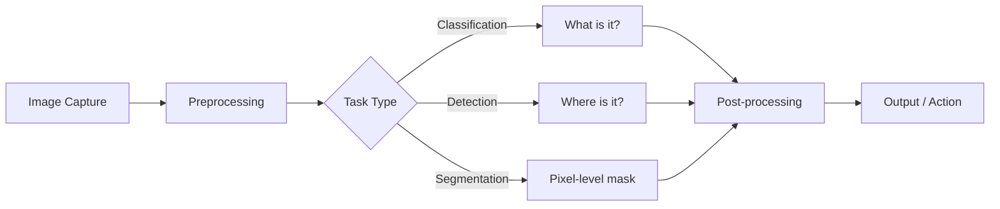

## Computer Vision কী

Computer Vision (CV) হলো AI এর এমন একটা branch যেখানে কম্পিউটারকে ছবি বা video "দেখতে" আর "বুঝতে" শেখানো হয়। মানুষ চোখ দিয়ে দেখে বোঝে — এটা কুকুর নাকি বিড়াল, রাস্তায় কোনটা গাড়ি আর কোনটা মানুষ। Computer Vision দিয়ে কম্পিউটার একই কাজ করতে পারে — face unlock, self-driving car, medical scan analysis সব CV এর application।

## Digital Image — ছবি কী?

কম্পিউটারের কাছে ছবি মানে সংখ্যার একটা grid — pixel বা picture element এর সমষ্টি। প্রতিটা pixel একটা ছোট square, যার রঙ number দিয়ে represent করা হয়।

- **Resolution** — কতগুলো pixel আছে (যেমন 1920×1080)
- **Bit Depth** — প্রতিটা pixel কত bit দিয়ে রঙ বোঝায় (8-bit = 256 value per channel)
- **Channel** — রঙ represent করার layer (RGB এ ৩টা channel)

```text
Digital Image:
┌─────┬─────┬─────┬─────┐
│ 255 │ 200 │ 150 │ 100 │   ← Pixel values (0-255 for 8-bit)
├─────┼─────┼─────┼─────┤
│ 180 │ 160 │ 140 │ 120 │
├─────┼─────┼─────┼─────┤
│  90 │  85 │  80 │  75 │
└─────┴─────┴─────┴─────┘
Each cell = one pixel with a numeric value
```

## Color Spaces

ছবির রঙ represent করার অনেক উপায় আছে — এদের color space বলে। প্রতিটার নিজস্ব সুবিধা আর use case আছে। ভুল color space ব্যবহার করলে অনেক সমস্যা হতে পারে।

নিচের diagram এ প্রতিটা color space এর structure দেখানো হলো:

```text
RGB (Red, Green, Blue)         BGR (Blue, Green, Red)
┌───┬───┬───┐                  ┌───┬───┬───┐
│ R │ G │ B │                  │ B │ G │ R │
└───┴───┴───┘                  └───┴───┴───┘
OpenCV default = BGR            Matplotlib = RGB

HSV (Hue, Saturation, Value)   Grayscale
┌─────┬───────────┬──────┐     ┌───────┐
│ Hue │ Saturation│ Value│     │Lumin. │
└─────┴───────────┴──────┘     └───────┘
Better for color filtering      Single channel, simpler
```

| Color Space | Channels | Use Case |
|-------------|----------|----------|
| RGB | Red, Green, Blue | General display, web |
| BGR | Blue, Green, Red | OpenCV default (historical) |
| HSV | Hue, Saturation, Value | Color detection, filtering |
| LAB | Lightness, A, B | Color difference, perception |
| Grayscale | Intensity only | Edge detection, simple processing |

> [!warning] OpenCV BGR ব্যবহার করে, RGB নয়
> # OpenCV historical কারণে ছবি BGR (Blue-Green-Red) format এ read করে, RGB তে নয়। তাই যদি OpenCV দিয়ে ছবি read করে Matplotlib দিয়ে দেখাও — রঙ উল্টো দেখাবে (লাল নীল হবে)। `cv2.cvtColor(img, cv2.COLOR_BGR2RGB)` করে convert করতে হবে। এটা CV তে সবচেয়ে common bug গুলোর একটা।

## CV কেন কঠিন?

মানুষের জন্য ছবি দেখা সহজ, কিন্তু কম্পিউটারের জন্য নয়। কারণ একই object অনেকভাবে দেখা যেতে পারে:

- **Lighting variation** — একই object সকালে আর রাতে আলাদা দেখায়
- **Occlusion** — object অর্ধেক ঢাকা থাকলে চিনতে সমস্যা
- **Viewpoint variation** — সামনে থেকে আর পাশ থেকে দেখলে আলাদা
- **Scale** — কাছে বড়, দূরে ছোট — একই object
- **Deformation** — বিড়াল বসে আছে নাকি দৌড়াচ্ছে — shape আলাদা
- **Background clutter** — অনেক object এর ভিড়ে মূল object খুঁজতে

## CV Pipeline

যেকোনো computer vision task এ একটা general pipeline থাকে। নিচের diagram এ সেই pipeline দেখানো হলো — image capture থেকে শুরু করে final output পর্যন্ত।



নিচে Python দিয়ে একটা খুব simple CV pipeline দেখানো হলো — image read থেকে display পর্যন্ত। `cv2.imread` দিয়ে ছবি load করা হয় NumPy array হিসেবে, আর `cv2.imshow` দিয়ে window এ দেখানো যায়।

```python
import cv2
import numpy as np

# Read image (OpenCV returns BGR by default)
image = cv2.imread("photo.jpg")
print(f"Shape: {image.shape}")  # (height, width, channels)
print(f"Dtype: {image.dtype}")  # uint8

# Convert to grayscale
gray = cv2.cvtColor(image, cv2.COLOR_BGR2GRAY)
print(f"Gray shape: {gray.shape}")  # (height, width) - 1 channel

# Resize
resized = cv2.resize(image, (224, 224))

# Display
cv2.imshow("Original", image)
cv2.imshow("Grayscale", gray)
cv2.waitKey(0)
cv2.destroyAllWindows()
```

## Applications — CV কোথায় ব্যবহার হয়?

Computer Vision আজকে সবখানে — এর কিছু গুরুত্বপূর্ণ application:

| Domain | Application | Example |
|--------|-------------|---------|
| Self-driving | Lane detection, pedestrian tracking | Tesla, Waymo |
| Medical | Tumor detection, X-ray analysis | Doctor assist |
| Security | Face recognition, surveillance | Face unlock |
| Retail | Self-checkout, inventory | Amazon Go |
| Manufacturing | Defect detection, quality control | Factory automation |
| Agriculture | Crop disease, yield estimation | Drone imaging |
| OCR | Text extraction from image | Google Lens |
| AR/VR | Object tracking, depth sensing | Apple Vision Pro |

নিচের কোডে একটা simple application দেখানো হলো — webcam থেকে real-time face detection। Haar Cascade classifier দিয়ে face detect করা হয়, আর rectangle দিয়ে mark করা হয়।

```python
import cv2

# Load pre-trained face detection model
face_cascade = cv2.CascadeClassifier(
    cv2.data.haarcascades + "haarcascade_frontalface_default.xml"
)

# Start webcam capture
cap = cv2.VideoCapture(0)

while True:
    ret, frame = cap.read()
    if not ret:
        break

    # Convert to grayscale for detection
    gray = cv2.cvtColor(frame, cv2.COLOR_BGR2GRAY)

    # Detect faces (returns list of bounding boxes)
    faces = face_cascade.detectMultiScale(gray, 1.1, 4)

    # Draw rectangle around each face
    for (x, y, w, h) in faces:
        cv2.rectangle(frame, (x, y), (x+w, y+h), (0, 255, 0), 2)

    cv2.imshow("Face Detection", frame)

    if cv2.waitKey(1) & 0xFF == ord('q'):
        break

cap.release()
cv2.destroyAllWindows()
```

> [!note] CV Pipeline এ Preprocessing সবচেয়ে গুরুত্বপূর্ণ
> # Model যতই ভালো হোক, খারাপ input দিলে ভালো result আসবে না — "Garbage in, garbage out"। তাই image preprocessing (resize, normalize, denoise, augment) খুব গুরুত্বপূর্ণ। Deep learning model গুলো fixed size input চায় (যেমন 224×224), আর pixel value normalize করা থাকতে হয় (0-1 বা ImageNet stats)। এই ছোট ছোট detail ঠিক রাখলে result অনেক ভালো হয়।