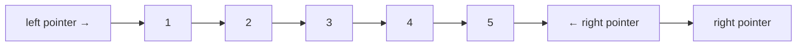

# Arrays & Strings

ধরো তোমার কাছে একটা বইয়ের তাক আছে। বইগুলো সাজানো আছে একটার পর একটা। এটাই হলো Array — উপাদানগুলো মেমোরিতে একটার পর একটা সাজানো থাকে। তুমি চাইলে ৩ নম্বর বই সরাসরি পেয়ে যাবে, পুরো তাক ঘাঁটতে হবে না।

## Array কী?

Array হলো একটা contiguous (পাশাপাশি) মেমোরি block যেখানে একই টাইপের ডেটা রাখা যায়। প্রতিটা element এর একটা index আছে — 0 থেকে শুরু।

> [!note]
> Array এর সবচেয়ে বড় সুবিধা হলো — index দিয়ে access করা $O(1)$। কারণ মেমোরি address সরাসরি হিসাব করা যায়: `address = base + index × element_size`।

### Static vs Dynamic Array

| Feature | Static Array | Dynamic Array |
|---------|-------------|---------------|
| Size | Fixed, আগেই ঠিক করতে হয় | Runtime এ বড়/ছোট হয় |
| Language | C, Java (primitive) | Python list, C++ vector |
| Insertion | সাইজ ফুলে গেলে নতুন করে বানাতে হয় | Automatically resize হয় |
| Access | $O(1)$ | $O(1)$ |

## Python List এর ভেতরে কী হয়?

Python list আসলে একটা dynamic array। যখন তুমি `append()` করো, list এ যদি জায়গা না থাকে, তখন Python একটা বড় array বানায় (পুরনোটার দ্বিগুণ), সব element copy করে, পুরনো array ফেলে দেয়।

নিচের কোড দেখি — এখানে একটা list বানিয়ে তাতে একটানা element যোগ করা হচ্ছে:

```python
arr = [1, 2, 3]
arr.append(4)
arr.append(5)
print(arr)
```

উপরের কোডে `[1, 2, 3]` list টার পেছনে Python একটা array allocate করেছে যেটাতে হয়তো ৪টা জায়গা আছে। `append(4)` এর পর সাইজ ৪, capacity ও ৪। কিন্তু `append(5)` করার সময় capacity ফুলে যাওয়ায় Python নতুন array বানায় (৮ জায়গার), সব copy করে।

> [!tip]
> Python list এর `append()` amortized $O(1)$। মানে বারবার append করলে average $O(1)$। কিন্তু insertion মাঝখানে করলে $O(n)$ কারণ পরের সব element সরাতে হয়।

## Two Pointers Technique

দুটো pointer দিয়ে array এর দুই পাশ থেকে বা একই পাশ থেকে চলা। অনেক সমস্যা $O(n^2)$ থেকে $O(n)$ এ নামিয়ে আনা যায়।



নিচের উদাহরণে একটা sorted array কে reverse করা হচ্ছে — দুটো pointer দিয়ে দুই পাশ থেকে swap করে:

```python
def reverse_array(arr):
    left, right = 0, len(arr) - 1
    while left < right:
        arr[left], arr[right] = arr[right], arr[left]
        left += 1
        right -= 1
    return arr
```

উপরের কোডে `left` শুরু থেকে আর `right` শেষ থেকে শুরু করে। দুজনে মাঝখানে এগিয়ে আসে। প্রতি ধাপে দুটো element swap হয়। মোট $n/2$ বার swap — মানে $O(n)$।

> [!tip]
> Two pointers এর দুটো common pattern: (১) **Opposite direction** — দুই প্রান্ত থেকে মাঝে আসা, (২) **Same direction** — দুটো pointer একই দিকে আলাদা গতিতে চলা (fast-slow)।

```dsa-viz
linear-search
```

## Sliding Window

Sliding window হলো array এর একটা "উইন্ডো" (subarray) নিয়ে সেটাকে স্লাইড করা। বারবার পুরো subarray হিসাব করার বদলে শুধু নতুন element যোগ আর পুরনো element বাদ দিয়ে হিসাব করা হয়।

```mermaid
graph LR
    subgraph "Window = 3"
        A["1"] -.-> B["2"] -.-> C["3"]
    end
    B --> D["4"]
    C --> D
    D --> E["5"]
    A -.->|"বাদ দাও"| X[""]
```

### Fixed Size Window

নিচের কোড একটা array তে `k` সাইজের উইন্ডোর maximum sum বের করে। পুরো উইন্ডো আবার যোগ করার বদলে শুধু নতুন element যোগ আর পুরনো বাদ দিয়ে $O(n)$ এ কাজ শেষ:

```python
def max_sum_window(arr, k):
    window_sum = sum(arr[:k])
    max_sum = window_sum
    for i in range(k, len(arr)):
        window_sum += arr[i] - arr[i - k]
        max_sum = max(max_sum, window_sum)
    return max_sum
```

উপরের কোডে প্রথমে প্রথম `k` টা element এর sum বের করা হয়। তারপর প্রতি ধাপে নতুন element যোগ হয় আর উইন্ডোর সবচেয়ে পুরনো element বাদ যায়। পুরো array একবারই চষা হয় — $O(n)$।

### Variable Size Window

কখনো উইন্ডোর সাইজ fixed থাকে না। condition অনুযায়ী উইন্ডো বড় বা ছোট হয়। যেমন — "sum যদি $k$ এর বেশি হয়ে যায়, তাহলে উইন্ডো ছোট করো।"

নিচের কোড এমন সব subarray এর count বের করে যাদের sum $k$ এর সমান। উইন্ডো বড় বা ছোট হয় condition অনুযায়ী:

```python
def subarray_sum_equals_k(arr, k):
    count = 0
    prefix_sum = 0
    freq = {0: 1}
    for num in arr:
        prefix_sum += num
        if prefix_sum - k in freq:
            count += freq[prefix_sum - k]
        freq[prefix_sum] = freq.get(prefix_sum, 0) + 1
    return count
```

উপরের কোডে `prefix_sum` দিয়ে এ পর্যন্ত যোগফল track করা হয়। যদি `prefix_sum - k` আগেও দেখা থাকে, তার মানে মাঝে এমন একটা subarray আছে যার sum ঠিক $k$। Hash map দিয়ে frequency count করা হয়।

> [!warning]
> Sliding window সব problem এ কাজ করে না। Window বড় বা ছোট করলে যদি হিসাবটা easily update করা যায় (যেমন sum, max, count), তবেই কাজ করে। কঠিন condition থাকলে কাজ করবে না।

## Prefix Sum

Prefix sum হলো একটা technique যেখানে array এর প্রতিটা position পর্যন্ত যোগফল আগে থেকে বের করে রাখা হয়। তারপর যেকোনো range এর sum $O(1)$ এ বের করা যায়।

নিচের কোড একটা prefix sum array বানায়। তারপর $l$ থেকে $r$ range এর sum $O(1)$ এ দেয়:

```python
def build_prefix_sum(arr):
    prefix = [0] * (len(arr) + 1)
    for i in range(len(arr)):
        prefix[i + 1] = prefix[i] + arr[i]
    return prefix

def range_sum(prefix, l, r):
    return prefix[r + 1] - prefix[l]
```

উপরের কোডে `prefix[i]` মানে array এর প্রথম $i$ টা element এর যোগফল। `prefix[r+1] - prefix[l]` দিলে $l$ থেকে $r$ পর্যন্ত sum পাওয়া যায়। বারবার লুপ চালানোর দরকার নেই।

> [!note]
> Prefix sum বিশেষ করে useful যখন একই array তে অনেকগুলো range query করতে হয়। একবার $O(n)$ এ prefix array বানালে, প্রতিটা query $O(1)$ এ উত্তর দেয়।

## Difference Array

Difference array হলো prefix sum এর উল্টো। Range update করতে দারুণ কাজে লাগে। $[l, r]$ range এ সব element এ $val$ যোগ করতে চাইলে — difference array তে মাত্র দুটো জায়গায় change করলেই হয়।

নিচের কোড দেখায় কীভাবে difference array তে range update $O(1)$ এ করা যায়, তারপর prefix sum করে actual array পাওয়া যায়:

```python
def range_update(diff, l, r, val):
    diff[l] += val
    if r + 1 < len(diff):
        diff[r + 1] -= val

def build_actual(diff):
    result = [0] * len(diff)
    result[0] = diff[0]
    for i in range(1, len(diff)):
        result[i] = result[i - 1] + diff[i]
    return result
```

উপরের কোডে `range_update` শুধু দুটো জায়গায় change করে — `diff[l]` এ যোগ করে আর `diff[r+1]` এ বিয়োগ করে। এরপর `build_actual` এ prefix sum চালালে actual array পাওয়া যায়। অনেকগুলো range update থাকলে এটা $O(1)$ per update — দারুণ fast।

## String এ যে Techniques গুলো কাজে লাগে

String মূলত character array। তাই array এর সব technique ই string এ apply হয়। তবে কিছু বিশেষ pattern আছে:

| Pattern | কখন ব্যবহার করবে | উদাহরণ |
|---------|-------------------|---------|
| **Two Pointers** | Palindrome check, reverse | দুই পাশ থেকে compare |
| **Sliding Window** | Longest substring, anagram | Fixed/variable window |
| **Frequency Array** | Character counting | 26 সাইজের array (a-z) |
| **Hash Map** | Anagram, pattern matching | Character → count |

> [!tip]
> String problem এ যদি শুধু lowercase English letter থাকে, তাহলে 26 সাইজের array ব্যবহার করো — hash map এর চেয়ে fast আর space-ও কম।

## Practice Problems

| Problem | Difficulty | Platform | Approach Hint |
|---------|-----------|----------|---------------|
| **Two Sum II** | Medium | LeetCode #167 | Two pointers — sorted array দুই পাশ থেকে |
| **Best Time to Buy & Sell Stock** | Easy | LeetCode #121 | Min price track করো, প্রতিদিন profit হিসাব করো |
| **Longest Substring Without Repeating** | Medium | LeetCode #3 | Variable sliding window + hash set |
| **Maximum Average Subarray** | Easy | LeetCode #643 | Fixed sliding window, sum update করে |
| **Container With Most Water** | Medium | LeetCode #11 | Two pointers দুই পাশ থেকে, ছোট height সরাও |
| **Product of Array Except Self** | Medium | LeetCode #238 | Prefix + suffix product, extra space ছাড়া |

## Two Pointers এর আরেকটা Pattern: Sorted Array থেকে Pair খোঁজা

ধরো একটা sorted array দেওয়া আছে। দুটো সংখ্যা খুঁজতে হবে যাদের যোগফল `target`। Brute force এ $O(n^2)$ — কিন্তু two pointers দিয়ে $O(n)$!

নিচের কোড sorted array তে two pointers দিয়ে target sum খুঁজছে। যোগফল ছোট হলে left বাড়াও, বড় হলে right কমাও:

```python
def two_sum_sorted(arr, target):
    left, right = 0, len(arr) - 1
    while left < right:
        current = arr[left] + arr[right]
        if current == target:
            return [left, right]
        elif current < target:
            left += 1
        else:
            right -= 1
    return []
```

উপরের কোডে যেহেতু array sorted, তাই একটা জাদু কাজ করে — যোগফল যদি target এর চেয়ে ছোট হয়, তার মানে ছোট সংখ্যা টা আরও বড় করতে হবে, তাই `left` বাড়ানো হয়। বড় হলে `right` কমানো হয়। এভাবে পুরো array একবারেই কাভার হয়ে যায় — $O(n)$।

> [!tip]
> Two pointers sorted array তে সবচেয়ে ভালো কাজ করে। যদি array sorted না থাকে, প্রথমে sort করে নিতে পারো ($O(n \log n)$), তারপর two pointers চালাও ($O(n)$)।

## Kadane's Algorithm — Maximum Subarray

এটা একটা বিখ্যাত technique। একটা array থেকে এমন contiguous subarray বের করতে হবে যার যোগফল সবচেয়ে বড়। Brute force এ সব subarray check করলে $O(n^2)$। কিন্তু Kadane's algorithm দিয়ে $O(n)$!

নিচের কোড দেখি — এটা প্রতিটা position এ দুটা বিকল্প থাকে: আগের subarray তে যুক্ত হবে, নাকি নতুন করে শুরু করবে:

```python
def max_subarray(nums):
    max_sum = nums[0]
    curr_sum = nums[0]
    for i in range(1, len(nums)):
        curr_sum = max(nums[i], curr_sum + nums[i])
        max_sum = max(max_sum, curr_sum)
    return max_sum
```

উপরের কোডে `curr_sum` দুটো জিনিসের মধ্যে সেরা বেছে নেয় — শুধু current element নেবে (নতুন শুরু), নাকি current element টা আগের যোগফলের সাথে যোগ করবে। যেটাই বড়, সেটা রাখা হয়। প্রতি ধাপে `max_sum` update হয়। পুরোটা $O(n)$ time আর $O(1)$ space — একদম perfect।

## Summary

Array আর string হলো DSA এর ভিত্তি। Two pointers, sliding window, prefix sum, difference array, Kadane's algorithm — এই technique গুলো দিয়ে interview এর অনেক সমস্যা সমাধান হয়ে যায়। মূল বিষয় হলো — বারবার একই হিসাব না করে আগের হিসাব reuse করা। পরের chapter এ Hash Tables শিখবো — $O(1)$ lookup এর জাদু।