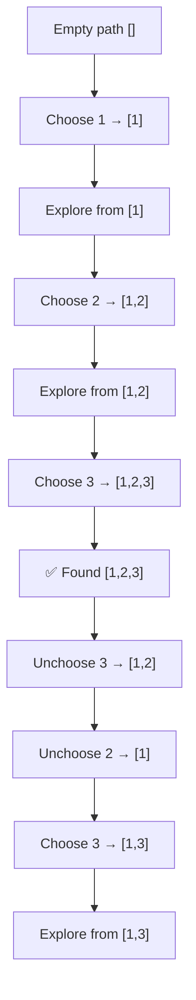
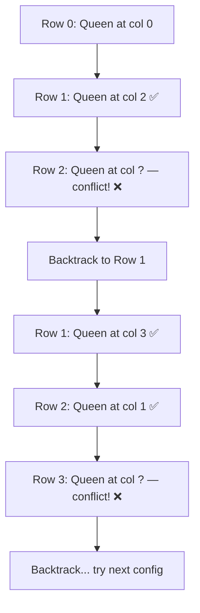

# Backtracking

Backtracking হলো সেই technique যেখানে তুমি সব possibility try করো — কিন্তু smart ভাবে। একটা choice নাও, এগিয়ে যাও, যদি dead end এ পড়ো তাহলে ফিরে এসো (backtrack) আর অন্য choice try করো। মনে করো একটা বিশাল maze — একটা রাস্তা ধরে হাঁটতে থাকো, dead end এ গিয়ে পড়লে পেছনে ফিরে এসো, আরেকটা রাস্তা ধরো।

ব্যতায়মান ব্রুট ফোর্স থেকে এর পার্থক্য হলো — backtracking এ তুমি বুঝতে পারলে যে এই রাস্তায় উত্তর নেই, সেই রাস্তার পুরো branch কে কেটে ফেলো। একে বলে **pruning** — অদরকারি branch ছাঁটাই করা।

## Backtracking Template

সব backtracking problem এ একটা common pattern আছে — **Choose → Explore → Unchoose**।

1. **Choose** — একটা choice করো (যেমন একটা element add করো)
2. **Explore** — সেই choice দিয়ে এগিয়ে যাও (recursion call)
3. **Unchoose** — choice টা undo করো (element remove করো), যাতে পরের choice try করা যায়



উপরের diagram এ দেখা যাচ্ছে — প্রতিটা choice এর পর explore করা হয়, তারপর unchoose করে পেছনে ফেরা হয়, আর নতুন choice try করা হয়। এই "পেছনে ফেরা" ই হলো backtracking।

> [!important] Backtracking = DFS এর special case
> মূলত backtracking হলো decision tree তে DFS করা। প্রতিটা node হলো একটা state, প্রতিটা edge হলো একটা choice। Tree এর পাতা (leaf) গুলো হলো complete solution।

## Permutations

একটা array এর সব permutation বের করতে হবে। যেমন `[1, 2, 3]` এর permutation: `[1,2,3], [1,3,2], [2,1,3], [2,3,1], [3,1,2], [3,2,1]` — মোট $3! = 6$ টা।

Template: প্রতিটা position এ বসানোর জন্য প্রতিটা available element try করো। Element টা বসাও, recursion করো, তারপর সরিয়ে দাও।

এই কোডে `path` তে current permutation তৈরি হয়। `used` array দিয়ে track করা হয় কোন কোন element ইতিমধ্যে `path` তে আছে। প্রতিটা element try করা হয় — যদি used না হয়, `path` তে যোগ করো, recursion করো, তারপর remove করো। এই choose-unchoose ই মূল।

```python
def permute(nums):
    result = []
    used = [False] * len(nums)

    def backtrack(path):
        if len(path) == len(nums):
            result.append(path[:])
            return

        for i in range(len(nums)):
            if used[i]:
                continue
            path.append(nums[i])
            used[i] = True
            backtrack(path)
            path.pop()
            used[i] = False

    backtrack([])
    return result

print(permute([1, 2, 3]))
```

Output: ৬টা permutation — `[[1,2,3], [1,3,2], [2,1,3], [2,3,1], [3,1,2], [3,2,1]]`। প্রতিটা branch এ গিয়ে সব possibility explore হয়েছে।

> [!note] `path[:]` কেন
> `result.append(path)` না করে `result.append(path[:])` করা হয়েছে। কারণ `path` একটা reference — পরে change হলে `result` এর ভেতরের সব value ও change হয়ে যাবে। `path[:]` একটা copy বানায়, তাই safe।

## Combinations

$1$ থেকে $n$ পর্যন্ত সংখ্যা থেকে $k$ টা নেওয়ার সব combination। Permutation এর মতো, কিন্তু এখানে order matter করে না — `[1,2]` আর `[2,1]` একই।

পার্থক্য: permutation এ প্রতিটা element সব position এ try করা হয়। Combination এ শুধু current index এর পরের element গুলো try করা হয় — যাতে duplicate না হয়।

এখানে `start` parameter দিয়ে ensure করা হয় যে প্রতিটা recursion level এ শুধু আগের index এর পরের element গুলো try হবে। এতে `[1,2]` আর `[2,1]` দুটো না হয়ে শুধু `[1,2]` তৈরি হয়।

```python
def combine(n, k):
    result = []

    def backtrack(start, path):
        if len(path) == k:
            result.append(path[:])
            return

        for i in range(start, n + 1):
            path.append(i)
            backtrack(i + 1, path)
            path.pop()

    backtrack(1, [])
    return result

print(combine(4, 2))
```

Output: `[[1,2], [1,3], [1,4], [2,3], [2,4], [3,4]]`। মোট $\binom{4}{2} = 6$ টা combination। প্রতিটা pair ascending order এ আছে, কোনো duplicate নেই।

## Subsets

একটা array এর সব subset বের করতে হবে। যেমন `[1, 2, 3]` এর subsets: `[[], [1], [1,2], [1,2,3], [1,3], [2], [2,3], [3]]` — মোট $2^3 = 8$ টা।

Combination এর মতোই — প্রতিটা recursion call এ `path` কে `result` এ যোগ করো। কারণ প্রতিটা intermediate state ই একটা valid subset।

এই কোডে প্রতিটা index থেকে শুরু করে সব possible subset তৈরি করা হয়। `backtrack` call হওয়ার সাথে সাথে `path` কে `result` এ add করা হয় — কারণ empty টাও একটা valid subset। তারপর পরের element গুলো try করা হয়।

```python
def subsets(nums):
    result = []

    def backtrack(start, path):
        result.append(path[:])

        for i in range(start, len(nums)):
            path.append(nums[i])
            backtrack(i + 1, path)
            path.pop()

    backtrack(0, [])
    return result

print(subsets([1, 2, 3]))
```

Output: `[[], [1], [1,2], [1,2,3], [1,3], [2], [2,3], [3]]`। প্রতিটা recursion level এ একটা নতুন subset তৈরি হয়।

> [!tip] Subset এ duplicate handle
> যদি input এ duplicate থাকে (যেমন `[1, 2, 2]`), তাহলে sort করে `nums[i] == nums[i-1]` skip করতে হবে। নাহলে same subset দুবার আসবে। এটাই Subsets II problem।

## N-Queens — The Classic

N-Queens হলো backtracking এর "Hello World" — সবচেয়ে classic problem। একটা $N \times N$ chessboard এ $N$ টা queen বসাতে হবে যাতে কোনো দুটো queen একে অপরকে attack না করে।

Queen যে কোনো দিকে যেতে পারে — row, column, diagonal। তাই প্রতিটা row তে একটা queen বসাতে হবে, আর check করতে হবে যে সেই column আর diagonal এ আর কোনো queen নেই।



এখানে দেখা যাচ্ছে — প্রতিটা row তে queen বসানোর চেষ্টা করা হয়। যদি conflict হয়, backtrack করে আগের row তে অন্য column try করা হয়। এভাবে সব valid configuration বের করা যায়।

নিচের কোডে `cols` set দিয়ে track করা হয় কোন কোন column এ queen আছে। `diag1` আর `diag2` দিয়ে দুই ধরনের diagonal track করা হয়। `row + col` আর `row - col` দিয়ে diagonal identify করা হয়। যদি কোনো column বা diagonal conflict করে, সেই placement skip করা হয়।

```python
def solve_n_queens(n):
    result = []
    cols = set()
    diag1 = set()
    diag2 = set()
    board = []

    def backtrack(row):
        if row == n:
            result.append(board[:])
            return

        for col in range(n):
            if col in cols or (row + col) in diag1 or (row - col) in diag2:
                continue

            cols.add(col)
            diag1.add(row + col)
            diag2.add(row - col)
            board.append(col)

            backtrack(row + 1)

            board.pop()
            cols.remove(col)
            diag1.remove(row + col)
            diag2.remove(row - col)

    backtrack(0)
    return result

solutions = solve_n_queens(4)
print(f"Found {len(solutions)} solutions")
for sol in solutions:
    print(sol)
```

Output: ২টা solution। 4×4 board এ মাত্র ২ ভাবে ৪টা queen বসানো যায়। প্রতিটা solution এ একটা list আছে যেখানে index = row, value = column।

> [!danger] N-Queens এর complexity
> N-Queens এর time complexity $O(N!)$ এর কাছাকাছি। কারণ প্রতিটা row তে সব column try করা হয়, pruning ছাড়া। $N = 8$ এই okay, কিন্তু $N > 15$ তে slow। Pruning এর জন্য set ব্যবহার করা হয়েছে — নাহলে আরও ধীর হতো।

## Sudoku Solver Concept

Sudoku ও backtracking এর classic application। ৯×৯ grid এ কিছু cell পূর্ণ, বাকিগুলো empty। ১-৯ পর্যন্ত সংখ্যা বসাতে হবে — row, column, আর ৩×৩ box এ কোনো সংখ্যা repeat হবে না।

Approach: প্রতিটা empty cell এ ১-৯ try করো। যদি valid হয়, বসাও আর পরের cell এ যাও। যদি কোনো valid সংখ্যা না থাকে, backtrack করে আগের cell এ ফিরে যাও।

নিচের কোডে প্রতিটা empty cell এর জন্য ১-৯ try করা হয়। `is_valid` function দিয়ে check করা হয় সেই সংখ্যা বসানো যায় কি না। যদি valid হয়, বসিয়ে recursion করা হয়। যদি recursion `True` ফেরত দেয়, solve হয়ে গেছে। নাহলে backtrack করে cell টা আবার empty করা হয়।

```python
def solve_sudoku(board):
    def is_valid(board, row, col, num):
        for i in range(9):
            if board[row][i] == num or board[i][col] == num:
                return False
        box_row, box_col = 3 * (row // 3), 3 * (col // 3)
        for i in range(box_row, box_row + 3):
            for j in range(box_col, box_col + 3):
                if board[i][j] == num:
                    return False
        return True

    def solve():
        for row in range(9):
            for col in range(9):
                if board[row][col] == 0:
                    for num in range(1, 10):
                        if is_valid(board, row, col, num):
                            board[row][col] = num
                            if solve():
                                return True
                            board[row][col] = 0
                    return False
        return True

    solve()
    return board

board = [
    [5, 3, 0, 0, 7, 0, 0, 0, 0],
    [6, 0, 0, 1, 9, 5, 0, 0, 0],
    [0, 9, 8, 0, 0, 0, 0, 6, 0],
    [8, 0, 0, 0, 6, 0, 0, 0, 3],
    [4, 0, 0, 8, 0, 3, 0, 0, 1],
    [7, 0, 0, 0, 2, 0, 0, 0, 6],
    [0, 6, 0, 0, 0, 0, 2, 8, 0],
    [0, 0, 0, 4, 1, 9, 0, 0, 5],
    [0, 0, 0, 0, 8, 0, 0, 7, 9],
]

solved = solve_sudoku(board)
for row in solved:
    print(row)
```

Output: পূর্ণ সমাধান করা Sudoku grid। প্রতিটা empty cell (0) এর জায়গায় সঠিক সংখ্যা বসে গেছে।

## Pruning — অদরকারি Branch ছাঁটাই

Pruning হলো backtracking এর সবচেয়ে important optimization। যদি বুঝতে পারো যে এই branch এ কোনো valid solution নেই, সেই branch কে একদম শুরুতেই কেটে ফেলো। পুরো branch explore না করেই time বাঁচাও।

> [!important] Pruning ছাড়া backtracking = brute force
> Pruning না থাকলে backtracking brute force এর মতোই ধীর। Pruning ই backtracking কে practical করে তোলে। যেমন N-Queens এ column conflict check করা এক ধরনের pruning — ভুল placement আগেই detect করা।

Common pruning strategies:

| Strategy | কখন ব্যবহার | উদাহরণ |
|----------|------------|--------|
| **Early termination** | লক্ষ্য পূরণ সম্ভব না | Sum already target ছাড়িয়ে গেছে |
| **Constraint check** | Current state invalid | Queen conflict, Sudoku conflict |
| **Sort + bound** | Remaining দিয়ে target পাবে না | Sorted array তে range check |
| **Duplicate skip** | Same branch আগে explore হয়েছে | `[1,2,2]` তে দ্বিতীয় 2 skip |

নিচের কোডে Combination Sum দেখানো হয়েছে pruning সহ। Target অর্ধেকে পৌঁছে গেলে বাকি positive সংখ্যা দিয়ে যাবে কিনা check করা হয়। যদি না যায়, সেই branch skip করা হয়।

```python
def combination_sum(candidates, target):
    result = []
    candidates.sort()

    def backtrack(start, path, remaining):
        if remaining == 0:
            result.append(path[:])
            return
        if remaining < 0:
            return

        for i in range(start, len(candidates)):
            if candidates[i] > remaining:
                break
            path.append(candidates[i])
            backtrack(i, path, remaining - candidates[i])
            path.pop()

    backtrack(0, [], target)
    return result

print(combination_sum([2, 3, 6, 7], 7))
```

Output: `[[2, 2, 3], [7]]`। `candidates[i] > remaining` check করে sort করা array তে বাকি সব সংখ্যা ও large — সেই branch কে `break` দিয়ে কেটে দেওয়া হয়। এটাই pruning।

## Backtracking vs Brute Force

| Aspect | Brute Force | Backtracking |
|--------|-------------|-------------|
| Approach | সব combination generate | Smart exploration + pruning |
| Speed | খুব ধীর | Pruning এ অনেক দ্রুত |
| Correctness | Guaranteed | Guaranteed (same result) |
| When to use | ছোট input | Medium input |

> [!tip] Backtracking master করার উপায়
> Permutations, Combinations, Subsets — এই তিনটা দিয়ে শুরু করো। এগুলো হলে backtracking এর basic template clear হবে। তারপর N-Queens আর Combination Sum — pruning practice এর জন্য। সবশেষে Word Search — grid backtracking এর জন্য।

## Complexity

Backtracking এর worst case complexity exponential — কারণ প্রতিটা level এ multiple choice থাকে। তাই pruning ছাড়া বড় input এ TLE।

| Problem | Time | Space |
|---------|------|-------|
| Permutations | $O(n \cdot n!)$ | $O(n)$ |
| Combinations | $O(k \cdot \binom{n}{k})$ | $O(k)$ |
| Subsets | $O(n \cdot 2^n)$ | $O(n)$ |
| N-Queens | $O(N!)$ | $O(N)$ |
| Sudoku | $O(9^{empty})$ | $O(1)$ |

## Practice Problems

| # | Problem | Difficulty | Concept |
|---|---------|-----------|---------|
| 1 | [LeetCode 46 — Permutations](https://leetcode.com/problems/permutations/) | Medium | Basic backtracking |
| 2 | [LeetCode 78 — Subsets](https://leetcode.com/problems/subsets/) | Medium | Power set generation |
| 3 | [LeetCode 39 — Combination Sum](https://leetcode.com/problems/combination-sum/) | Medium | Backtracking + pruning |
| 4 | [LeetCode 51 — N-Queens](https://leetcode.com/problems/n-queens/) | Hard | Classic constraint problem |
| 5 | [LeetCode 79 — Word Search](https://leetcode.com/problems/word-search/) | Medium | Grid backtracking |

> [!tip] Practice strategy
> Permutations আর Subsets দিয়ে শুরু করো — template clear হবে। Combination Sum তে pruning learn করো। N-Queens হলো milestone — এটা solve করলে backtracking এ confidence চলে আসবে। Word Search তে grid + backtracking combine হবে। এই ৫টা backtracking এর সম্পূর্ণ foundation।