ভাবো তুমি একটা dictionary খুঁজছো। পাতাগুলো এলোমেলো — তুমি মাঝখান থেকে খুললে। যদি তোমার শব্দটা মাঝখানের পাতার আগের অংশে হয়, পিছনের অর্ধেক বাদ দাও। এটাই Binary Search — প্রতি ধাপে অর্ধেক বাদ যায়।

এই চ্যাপ্টারে take U forward এর Binary Search Bootcamp প্লেলিস্টের সবগুলো টপিক (BS-1 থেকে BS-27) step-by-step dry run সহ আলোচনা করা হয়েছে।

---

## BS-1. Binary Search Introduction | Iterative | Recursive | Overflow Cases

### সমস্যা

একটা sorted array তে কোনো target element খুঁজে বের করতে হবে। Linear search এ $O(n)$ লাগে, কিন্তু sorted হওয়ায় আমরা $O(\log n)$ এ পাব।

### Intuition

Dictionary তে শব্দ খোঁজার মতো। মাঝখান থেকে দেখো — যদি target ছোট হয়, ডান অর্ধেক বাদ দাও। বড় হলে বাম অর্ধেক বাদ দাও। প্রতি ধাপে search space অর্ধেক হয়।

### Dry Run

```
Array: [1, 3, 5, 7, 9, 11, 13]
Target: 7

Step 1: left=0, right=6
        mid = 0 + (6-0)//2 = 3
        arr[3] = 7 → Match! Return 3
```

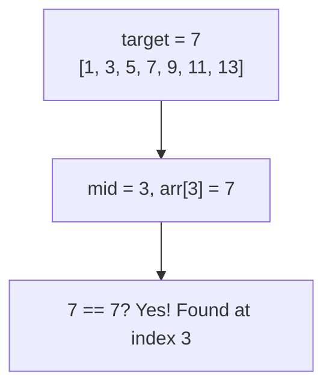

আরেকটা example দেখি যেখানে কয়েক ধাপ লাগে:

```
Array: [1, 3, 5, 7, 9, 11, 13]
Target: 11

Step 1: left=0, right=6, mid=3 → arr[3]=7, 7 < 11 → left=4
Step 2: left=4, right=6, mid=5 → arr[5]=11, 11 == 11 → Found! Return 5
```

### Iterative Code

```python
def binary_search(arr, target):
    left, right = 0, len(arr) - 1
    while left <= right:
        mid = left + (right - left) // 2
        if arr[mid] == target:
            return mid
        elif arr[mid] < target:
            left = mid + 1
        else:
            right = mid - 1
    return -1
```

### Recursive Code

```python
def binary_search_recursive(arr, target, left, right):
    if left > right:
        return -1
    mid = left + (right - left) // 2
    if arr[mid] == target:
        return mid
    elif arr[mid] < target:
        return binary_search_recursive(arr, target, mid + 1, right)
    else:
        return binary_search_recursive(arr, target, left, mid - 1)
```

Iterative আর recursive দুটোই $O(\log n)$ time। তবে recursive এ $O(\log n)$ extra space লাগে call stack এর জন্য। Interview এ iterative prefer করা হয়।

### Overflow Case

`mid = (left + right) // 2` — যদি `left` আর `right` দুটোই বড় হয় (যেমন $2^{31}-1$), তাহলে `left + right` overflow করতে পারে C++/Java তে।

সমাধান: `mid = left + (right - left) // 2` — এটা overflow safe।

Python এ integer unlimited, তাই overflow হয় না। কিন্তু অভ্যাস হিসেবে safe version ব্যবহার করো।

> [!tip]
> `mid = left + (right - left) // 2` সবসময় ব্যবহার করো — C++/Java তে overflow এড়ানো যায়। আরেকটা trick: `mid = (left + right) >>> 1` (unsigned right shift, Java তে)।

```dsa-viz
binary-search
```

### কেন $O(\log n)$?

প্রতি ধাপে search space অর্ধেক হয়: $n \to \frac{n}{2} \to \frac{n}{4} \to \ldots \to 1$। কত ধাপ? $k = \log_2 n$। ১ লাখ element → মাত্র ১৭ ধাপ।

---

## BS-2. Lower Bound & Upper Bound | Search Insert Position | Floor & Ceil

### Lower Bound

Lower bound হলো প্রথম index যেখানে `arr[index] >= target`।

**Dry Run:**

```
Array: [1, 2, 3, 3, 5, 8, 9]
Target: 3

Step 1: left=0, right=7, mid=3 → arr[3]=3, 3 >= 3 → right=3 (বামে আরও খুঁজি)
Step 2: left=0, right=3, mid=1 → arr[1]=2, 2 < 3 → left=2
Step 3: left=2, right=3, mid=2 → arr[2]=3, 3 >= 3 → right=2
Loop ends: left=2 → Lower bound = 2 (প্রথম 3 এর position)
```

```python
def lower_bound(arr, target):
    left, right = 0, len(arr)
    while left < right:
        mid = left + (right - left) // 2
        if arr[mid] < target:
            left = mid + 1
        else:
            right = mid
    return left
```

খেয়াল করো — `right = len(arr)` (exclusive), `arr[mid] >= target` হলে `right = mid`। কারণ আমরা প্রথম occurrence খুঁজছি, তাই সমান হলেও বামে যাই।

### Upper Bound

Upper bound হলো প্রথম index যেখানে `arr[index] > target`।

**Dry Run:**

```
Array: [1, 2, 3, 3, 5, 8, 9]
Target: 3

Step 1: left=0, right=7, mid=3 → arr[3]=3, 3 <= 3 → left=4
Step 2: left=4, right=7, mid=5 → arr[5]=8, 8 > 3 → right=5
Step 3: left=4, right=5, mid=4 → arr[4]=5, 5 > 3 → right=4
Loop ends: left=4 → Upper bound = 4 (প্রথম element যেটা 3 এর চেয়ে বড়)
```

```python
def upper_bound(arr, target):
    left, right = 0, len(arr)
    while left < right:
        mid = left + (right - left) // 2
        if arr[mid] <= target:
            left = mid + 1
        else:
            right = mid
    return left
```

পার্থক্য: lower bound এ `arr[mid] < target` (ছোট হলে ডানে), upper bound এ `arr[mid] <= target` (সমান বা ছোট হলে ডানে)।

### Search Insert Position

Lower bound এর সাথেই এক — যদি target না থাকে, কোন index এ insert করলে sorted থাকবে সেটাই lower bound।

```python
def search_insert(arr, target):
    left, right = 0, len(arr)
    while left < right:
        mid = left + (right - left) // 2
        if arr[mid] < target:
            left = mid + 1
        else:
            right = mid
    return left
```

### Floor ও Ceil

- **Floor**: array এ সবচেয়ে বড় element যেটা `<= target`
- **Ceil**: array এ সবচেয়ে ছোট element যেটা `>= target`

```
Array: [10, 20, 30, 40, 50]
Target: 25

Floor = 20 (সবচেয়ে বড় যেটা 25 এর ছোট বা সমান)
Ceil  = 30 (সবচেয়ে ছোট যেটা 25 এর বড় বা সমান)
```

Ceil হলো lower bound এর element (যদি index valid হয়)। Floor হলো lower bound এর আগের index এর element।

```python
def floor_ceil(arr, target):
    left, right = 0, len(arr)
    while left < right:
        mid = left + (right - left) // 2
        if arr[mid] < target:
            left = mid + 1
        else:
            right = mid
    # left = lower bound index
    ceil = arr[left] if left < len(arr) else -1
    floor = arr[left - 1] if left > 0 else -1
    return floor, ceil
```

> [!note]
> Lower bound আর upper bound হলো Binary Search এর সবচেয়ে important building blocks। BS-3 এর First/Last occurrence থেকে BS-27 এর Median পর্যন্ত সব জায়গায় এগুলো ব্যবহার হবে।

---

## BS-3. First & Last Occurrences | Count Occurrences

### সমস্যা

Sorted array তে একটা value এর প্রথম আর শেষ occurrence এর index বের করো।

### Intuition

First occurrence = Lower bound (প্রথম index যেখানে `arr[i] >= target`)
Last occurrence = Upper bound - 1 (upper bound হলো প্রথম index যেটা target এর বড়, তাই তার আগের index হবে শেষ occurrence)

### Dry Run

```
Array: [2, 4, 10, 10, 10, 18, 20]
Target: 10

First Occurrence:
  left=0, right=7
  mid=3 → arr[3]=10, 10>=10 → right=3
  mid=1 → arr[1]=4, 4<10 → left=2
  mid=2 → arr[2]=10, 10>=10 → right=2
  left=2, right=2 → loop ends
  First = 2

Last Occurrence:
  left=0, right=7
  mid=3 → arr[3]=10, 10<=10 → left=4
  mid=5 → arr[5]=18, 18>10 → right=5
  mid=4 → arr[4]=10, 10<=10 → left=5
  left=5, right=5 → loop ends
  Last = 5 - 1 = 4

Count = Last - First + 1 = 4 - 2 + 1 = 3
```

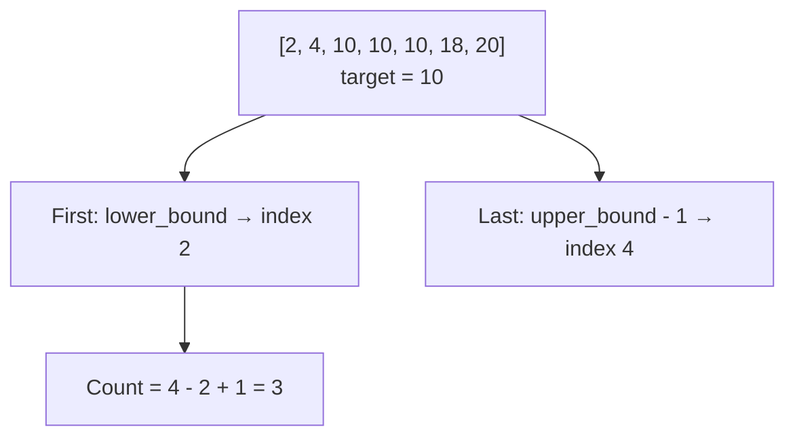

### Code

```python
def first_occurrence(arr, target):
    left, right = 0, len(arr)
    while left < right:
        mid = left + (right - left) // 2
        if arr[mid] < target:
            left = mid + 1
        else:
            right = mid
    return left if left < len(arr) and arr[left] == target else -1

def last_occurrence(arr, target):
    left, right = 0, len(arr)
    while left < right:
        mid = left + (right - left) // 2
        if arr[mid] <= target:
            left = mid + 1
        else:
            right = mid
    return left - 1 if left > 0 and arr[left - 1] == target else -1

def count_occurrences(arr, target):
    first = first_occurrence(arr, target)
    if first == -1:
        return 0
    last = last_occurrence(arr, target)
    return last - first + 1
```

> [!tip]
> `count_occurrences` = `upper_bound - lower_bound`। এটাই সবচেয়ে সহজ formula।

---

## BS-4. Search in Rotated Sorted Array I

### সমস্যা

একটা sorted array কে rotate করা হয়েছে। সেখানে target খুঁজে বের করো। Distinct values।

যেমন: `[4, 5, 6, 7, 0, 1, 2]` — original ছিল `[0, 1, 2, 4, 5, 6, 7]`, ৪ বার rotate হয়েছে।

### Intuition

Rotated array তে অন্তত একটা অংশ (বাম বা ডান) sorted থাকে। আমরা check করি কোন অংশ sorted, তারপর target সেই অংশে আছে কি না দেখি।

### Dry Run

```
Array: [4, 5, 6, 7, 0, 1, 2]
Target: 0

Step 1: left=0, right=6, mid=3 → arr[3]=7
        arr[0]=4 <= arr[3]=7 → বাম অংশ [4,5,6,7] sorted
        target=0, 0 in [4,7]? 4<=0? No → right half এ খুঁজি
        left = mid+1 = 4

Step 2: left=4, right=6, mid=5 → arr[5]=1
        arr[4]=0 <= arr[5]=1 → বাম অংশ [0,1] sorted
        target=0, 0 in [0,1]? 0<=0<1? Yes → বামে খুঁজি
        right = mid-1 = 4

Step 3: left=4, right=4, mid=4 → arr[4]=0 == 0 → Found! Return 4
```

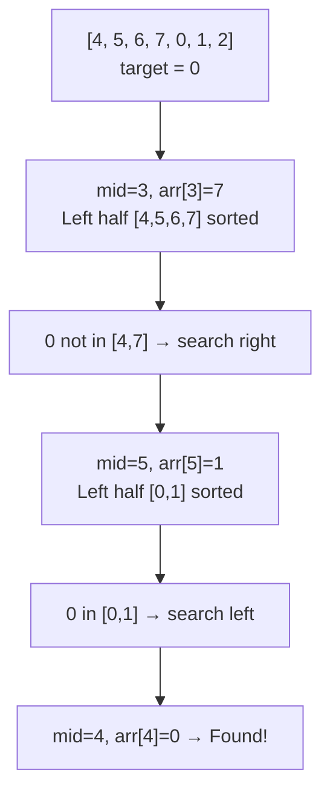

### Code

```python
def search_rotated(arr, target):
    left, right = 0, len(arr) - 1
    while left <= right:
        mid = left + (right - left) // 2
        if arr[mid] == target:
            return mid
        if arr[left] <= arr[mid]:
            if arr[left] <= target < arr[mid]:
                right = mid - 1
            else:
                left = mid + 1
        else:
            if arr[mid] < target <= arr[right]:
                left = mid + 1
            else:
                right = mid - 1
    return -1
```

> [!warning]
> `arr[left] <= arr[mid]` তে `<=` দরকার — যদি `left == mid` হয় (single element)। আর `arr[left] <= target < arr[mid]` range check টা ভুল করলে wrong answer।

---

## BS-5. Search in Rotated Sorted Array II

### সমস্যা

আগেরটার মতোই, কিন্তু array তে duplicate values থাকতে পারে।

যেমন: `[3, 1, 2, 3, 3, 3, 3]` — এখানে `arr[0] = arr[mid] = arr[right] = 3` হতে পারে।

### সমস্যা কোথায়?

যদি `arr[left] == arr[mid] == arr[right]` হয়, তাহলে কোন অংশ sorted সেটা বোঝা যায় না। এই ক্ষেত্রে আমরা `left++` আর `right--` করে এই ambiguous elements বাদ দিই।

### Dry Run

```
Array: [3, 1, 2, 3, 3, 3, 3]
Target: 2

Step 1: left=0, right=6, mid=3 → arr[3]=3
        arr[0]=3, arr[3]=3, arr[6]=3 → সব সমান!
        left++, right-- → left=1, right=5

Step 2: left=1, right=5, mid=3 → arr[3]=3
        arr[1]=1 <= arr[3]=3 → বাম অংশ [1,2,3] sorted
        target=2, 1<=2<3? Yes → right=2

Step 3: left=1, right=2, mid=1 → arr[1]=1
        arr[1]=1 <= arr[1]=1 → বাম sorted (single element)
        target=2, 1<=2<1? No → left=2

Step 4: left=2, right=2, mid=2 → arr[2]=2 == 2 → Found! Return 2
```

### Code

```python
def search_rotated_duplicates(arr, target):
    left, right = 0, len(arr) - 1
    while left <= right:
        mid = left + (right - left) // 2
        if arr[mid] == target:
            return True
        if arr[left] == arr[mid] == arr[right]:
            left += 1
            right -= 1
            continue
        if arr[left] <= arr[mid]:
            if arr[left] <= target < arr[mid]:
                right = mid - 1
            else:
                left = mid + 1
        else:
            if arr[mid] < target <= arr[right]:
                left = mid + 1
            else:
                right = mid - 1
    return False
```

> [!note]
> Worst case এ যদি সব elements একই হয় (`[1,1,1,1,1]`), তাহলে প্রতি ধাপে ২টা করে element বাদ যায়, তাই worst case $O(n)$।

---

## BS-6. Minimum in Rotated Sorted Array

### সমস্যা

Rotated sorted array (distinct) তে সবচেয়ে ছোট element বের করো।

যেমন: `[4, 5, 6, 7, 0, 1, 2]` → minimum = 0

### Intuition

Minimum element টা সেই জায়গায় যেখানে rotation হয়েছে — অর্থাৎ যেখানে `arr[mid] > arr[mid+1]`। যদি `arr[mid] > arr[right]` হয়, minimum ডান পাশে। নাহলে বাম পাশে (mid সহ)।

### Dry Run

```
Array: [4, 5, 6, 7, 0, 1, 2]

Step 1: left=0, right=6, mid=3 → arr[3]=7
        arr[3]=7 > arr[6]=2 → minimum ডান পাশে
        left = mid+1 = 4

Step 2: left=4, right=6, mid=5 → arr[5]=1
        arr[5]=1 <= arr[6]=2 → minimum বাম পাশে (mid সহ)
        right = mid = 5

Step 3: left=4, right=5, mid=4 → arr[4]=0
        arr[4]=0 <= arr[5]=1 → right = mid = 4

Loop ends: left=4, arr[4]=0 → Minimum = 0
```

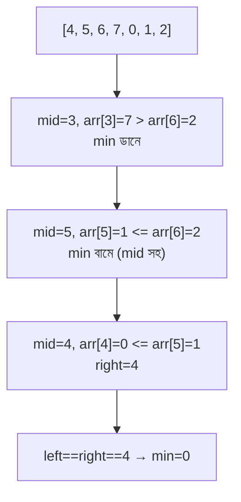

### Code

```python
def find_min_rotated(arr):
    left, right = 0, len(arr) - 1
    while left < right:
        mid = left + (right - left) // 2
        if arr[mid] > arr[right]:
            left = mid + 1
        else:
            right = mid
    return arr[left]
```

> [!tip]
> `arr[mid] > arr[right]` হলে minimum অবশ্যই ডান পাশে, কারণ বাম পাশের সব element বড়। নাহলে minimum বাম পাশে বা mid তেই আছে।

---

## BS-7. How Many Times Array Has Been Rotated

### সমস্যা

একটা sorted array কে কতবার rotate করা হয়েছে সেটা বের করো।

### Intuition

Rotation count = minimum element এর index। কারণ original sorted array তে minimum ০ নাম্বার index এ ছিল, rotate এর পর সেটা কত নাম্বার index এ গেছে সেটাই rotation count।

### Dry Run

```
Array: [4, 5, 6, 7, 0, 1, 2]
Original sorted: [0, 1, 2, 4, 5, 6, 7]

Minimum = 0, যেটা index 4 এ আছে।
তাই rotation count = 4 (BS-6 এর একই logic)
```

### Code

```python
def rotation_count(arr):
    left, right = 0, len(arr) - 1
    while left < right:
        mid = left + (right - left) // 2
        if arr[mid] > arr[right]:
            left = mid + 1
        else:
            right = mid
    return left
```

BS-6 এ return করতাম `arr[left]` (minimum value), এখানে return করছি `left` (minimum এর index = rotation count)।

---

## BS-8. Single Element in Sorted Array

### সমস্যা

একটা sorted array তে প্রতিটা element দুবার করে আছে, শুধু একটা element একবার আছে। সেই single element বের করো।

যেমন: `[1, 1, 2, 2, 3, 3, 4, 5, 5, 6, 6]` → single = 4

### Intuition

Single element এর আগে পর্যন্ত pairs এর index pattern হলো: (even, odd) — মানে প্রতিটা pair শুরু হয় even index এ। Single element এর পরে pattern উল্টে যায়: (odd, even)।

### Dry Run

```
Array: [1, 1, 2, 2, 3, 3, 4, 5, 5, 6, 6]
Index:  0  1  2  3  4  5  6  7  8  9  10

Step 1: left=0, right=10, mid=5 → arr[5]=3
        mid জোড়? mid=5 বিজোড় → mid=4 করি (pair এর প্রথম element)
        arr[4]=3, arr[5]=3 → same? Yes
        মানে single element ডান পাশে
        left = mid+2 = 6

Step 2: left=6, right=10, mid=8 → arr[8]=5
        mid জোড়? Yes → pair check: arr[8]=5, arr[9]=6 → same? No!
        মানে mid বা তার আগে single element আছে
        right = mid = 8

Step 3: left=6, right=8, mid=7 → arr[7]=5
        mid বিজোড় → mid=6
        arr[6]=4, arr[7]=5 → same? No!
        right = mid = 6

Step 4: left=6, right=6 → loop ends
        arr[6] = 4 → Single element = 4
```

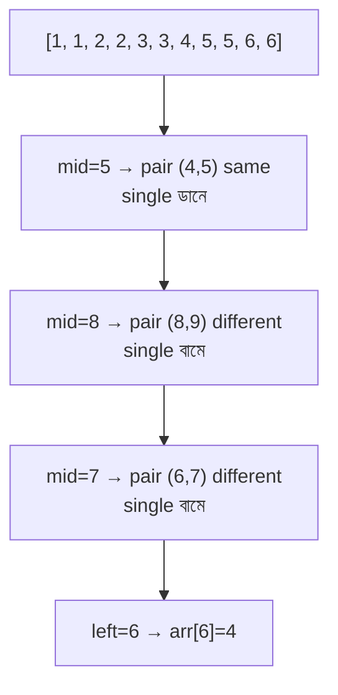

### Code

```python
def single_element(arr):
    left, right = 0, len(arr) - 1
    while left < right:
        mid = left + (right - left) // 2
        if mid % 2 == 1:
            mid -= 1
        if arr[mid] == arr[mid + 1]:
            left = mid + 2
        else:
            right = mid
    return arr[left]
```

> [!note]
> Key insight: single element এর আগে pairs (even,odd) index এ, পরে (odd,even) index এ। এই pattern break টাই binary search এর condition।

---

## BS-9. Find Peak Element

### সমস্যা

একটা array তে peak element বের করো — যেটা তার পাশের দুটোর চেয়ে বড় বা সমান। Array sorted না হতেও পারে।

যেমন: `[1, 2, 3, 1]` → peak = 3 (index 2)

### Intuition

যদি `arr[mid] < arr[mid+1]` হয়, ডান পাশে অবশ্যই একটা peak আছে (কারণ array শেষে গিয়ে `-∞` তে যায়)। নাহলে বাম পাশে peak আছে (mid নিজেও peak হতে পারে)।

### Dry Run

```
Array: [1, 2, 1, 2, 1]
       (multiple peaks: index 1 আর index 3)

Step 1: left=0, right=4, mid=2 → arr[2]=1
        arr[2]=1 < arr[3]=2 → ডান পাশে peak আছে
        left = mid+1 = 3

Step 2: left=3, right=4, mid=3 → arr[3]=2
        arr[3]=2 > arr[4]=1 → বাম পাশে (mid সহ) peak আছে
        right = mid = 3

Step 3: left=3, right=3 → loop ends
        arr[3]=2 → Peak at index 3
```

### Code

```python
def find_peak(arr):
    left, right = 0, len(arr) - 1
    while left < right:
        mid = left + (right - left) // 2
        if arr[mid] < arr[mid + 1]:
            left = mid + 1
        else:
            right = mid
    return left
```

> [!tip]
> এই algorithm কাজ করে কারণ — যেকোনো adjacent pair যেখানে `arr[i] < arr[i+1]`, সেই দিকে উঠলে অবশ্যই একটা peak পাওয়া যাবে।

---

## BS-10. Finding Sqrt Using Binary Search

### সমস্যা

কোনো number এর integer square root বের করো (floor value)।

যেমন: `sqrt(28) = 5` (কারণ $5^2 = 25 \leq 28$ আর $6^2 = 36 > 28$)

### Intuition

Answer range হলো `[1, n]`। এই range এ binary search করো — `mid * mid <= n` হলে ডান দিকে আরও বড় answer খুঁজি, নাহলে বাম দিকে।

### Dry Run

```
n = 28

Step 1: left=1, right=28, mid=14 → 14*14=196 > 28 → right=13
Step 2: left=1, right=13, mid=7  → 7*7=49 > 28 → right=6
Step 3: left=1, right=6, mid=3   → 3*3=9 <= 28 → left=4
Step 4: left=4, right=6, mid=5   → 5*5=25 <= 28 → left=6
Step 5: left=6, right=6, mid=6   → 6*6=36 > 28 → right=5

Loop ends: left=6, right=5
Answer = 5 (right), কারণ 5*5=25 <= 28
```

```python
def sqrt_binary(n):
    if n <= 1:
        return n
    left, right = 1, n
    ans = 1
    while left <= right:
        mid = left + (right - left) // 2
        if mid * mid <= n:
            ans = mid
            left = mid + 1
        else:
            right = mid - 1
    return ans
```

> [!warning]
> `mid * mid` overflow করতে পারে বড় n এর জন্য C++/Java তে। সেক্ষেত্রে `mid <= n / mid` ব্যবহার করো (integer division)।

---

## BS-11. Find the Nth Root of an Integer

### সমস্যা

`n` আর `m` দেওয়া, `x` বের করো যেন $x^n = m$। যদি exact root না থাকে, `-1` return করো।

যেমন: `n=3, m=27` → `x=3` (কারণ $3^3 = 27$)
কিন্তু `n=3, m=10` → `-1` (কারণ $2^3 = 8, 3^3 = 27$, কোনো integer এর cube 10 না)

### Intuition

Answer range `[1, m]`। Binary search করে `mid^n` বের করো।

### Dry Run

```
n = 3, m = 27

Step 1: left=1, right=27, mid=14 → 14^3 = 2744 > 27 → right=13
Step 2: left=1, right=13, mid=7  → 7^3 = 343 > 27 → right=6
Step 3: left=1, right=6, mid=3   → 3^3 = 27 == 27 → Found! Return 3
```

### Code

```python
def nth_root(n, m):
    left, right = 1, m
    while left <= right:
        mid = left + (right - left) // 2
        val = mid ** n
        if val == m:
            return mid
        elif val < m:
            left = mid + 1
        else:
            right = mid - 1
    return -1
```

> [!warning]
> `mid ** n` overflow করতে পারে। Overflow এড়াতে একটা helper function লিখো যেটা overflow হলে early return করে।

```python
def power_safe(base, exp, limit):
    result = 1
    for _ in range(exp):
        result *= base
        if result > limit:
            return float('inf')
    return result
```

---

## BS-12. Koko Eating Bananas

### সমস্যা

Koko কে banana খেতে হবে। `piles[i]` টা banana আছে প্রতি pile এ। ঘন্টায় `k` টা banana খেতে পারে। `h` ঘন্টায় সব খেতে হবে। Minimum `k` কত?

যেমন: `piles = [3, 6, 7, 11]`, `h = 8` → answer = 4

### Intuition

কটি Binary Search on Answer। `k` এর range: `[1, max(piles)]`। যদি `k` দিয়ে `h` ঘন্টায় সব খাওয়া যায়, আরও ছোট `k` চেষ্টা করো।

### Dry Run

```
piles = [3, 6, 7, 11], h = 8
max(piles) = 11

k=1: hours = 3+6+7+11 = 27 > 8 → No
k=6: hours = 1+1+2+2 = 6 <= 8 → Yes, try smaller
k=3: hours = 1+2+3+4 = 10 > 8 → No
k=4: hours = 1+2+2+3 = 8 <= 8 → Yes, try smaller
k=3: already checked → No

Answer = 4

Binary Search:
  left=1, right=11
  mid=6 → hours=6 <= 8 → right=5
  mid=3 → hours=10 > 8 → left=4
  mid=4 → hours=8 <= 8 → right=4
  mid=4 → left=4, right=4 → Answer=4
```

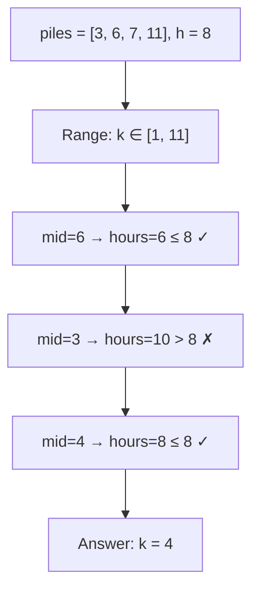

### Code

```python
import math

def min_eating_speed(piles, h):
    left, right = 1, max(piles)
    while left < right:
        mid = left + (right - left) // 2
        hours = sum(math.ceil(p / mid) for p in piles)
        if hours <= h:
            right = mid
        else:
            left = mid + 1
    return left
```

> [!note]
> `ceil(p / mid)` কে `(p + mid - 1) // mid` লেখা যায় integer overflow এড়াতে। এটা একটা common trick।

---

## BS-13. Minimum Days to Make M Bouquets

### সমস্যা

`bloomDay[i]` দেওয়া — i-th ফুল কত দিনে ফুলবে। `m` টা bouquet বানাতে হবে, প্রতিটায় `k` টা adjacent ফুল লাগবে। Minimum কত দিন?

যেমন: `bloomDay = [7, 7, 7, 7, 13, 11, 12, 7]`, `m = 2`, `k = 3` → answer = 12

### Intuition

Binary Search on Answer। Day range: `[min(bloomDay), max(bloomDay)]`। কোনো day এ adjacent `k` ফুল থাকলে কয়টা bouquet বানানো যায় count করো।

### Dry Run

```
bloomDay = [7, 7, 7, 7, 13, 11, 12, 7]
m = 2, k = 3

Day = 7:  bloomed = [✓, ✓, ✓, ✓, ✗, ✗, ✗, ✓]
         adjacent groups: 4, 1 → bouquets = 4//3 + 1//3 = 1+0 = 1 < 2 → No

Day = 12: bloomed = [✓, ✓, ✓, ✓, ✗, ✓, ✓, ✓]
         adjacent groups: 4, 3 → bouquets = 4//3 + 3//3 = 1+1 = 2 >= 2 → Yes!

Day = 11: bloomed = [✓, ✓, ✓, ✓, ✗, ✓, ✗, ✓]
          adjacent groups: 4, 1, 1 → bouquets = 1+0+0 = 1 < 2 → No

Answer = 12
```

### Code

```python
def min_days_bouquets(bloomDay, m, k):
    if m * k > len(bloomDay):
        return -1
    left, right = min(bloomDay), max(bloomDay)
    while left < right:
        mid = left + (right - left) // 2
        count = 0
        bouquets = 0
        for day in bloomDay:
            if day <= mid:
                count += 1
            else:
                bouquets += count // k
                count = 0
        bouquets += count // k
        if bouquets >= m:
            right = mid
        else:
            left = mid + 1
    return left
```

> [!tip]
> Adjacent ফুল count করার সময় — যদি ফুল না ফুলে থাকে, `count` reset করো আর `count // k` যোগ করো। Loop শেষে আরেকবার check করতে ভুলবে না।

---

## BS-14. Find the Smallest Divisor Given a Threshold

### সমস্যা

`nums[i]` কে একটা divisor দিয়ে ভাগ করো (ceil), সব যোগ করো। Sum যেন `threshold` এর সমান বা ছোট। Minimum divisor কত?

যেমন: `nums = [1, 2, 5, 9]`, `threshold = 6` → answer = 5

### Dry Run

```
nums = [1, 2, 5, 9], threshold = 6

divisor=5: ceil(1/5)+ceil(2/5)+ceil(5/5)+ceil(9/5)
         = 1+1+1+2 = 5 <= 6 → Yes, try smaller

divisor=4: 1+1+2+3 = 7 > 6 → No

divisor=5 is the minimum.
```

### Code

```python
import math

def smallest_divisor(nums, threshold):
    left, right = 1, max(nums)
    while left < right:
        mid = left + (right - left) // 2
        total = sum(math.ceil(n / mid) for n in nums)
        if total <= threshold:
            right = mid
        else:
            left = mid + 1
    return left
```

> [!note]
> এই problem আর BS-12 (Koko) প্রায় একই pattern — "Binary Search on Answer" যেখানে check function টা sum করে threshold এর সাথে compare করে।

---

## BS-15. Capacity to Ship Packages within D Days

### সমস্যা

`weights` array দেওয়া। প্রতিদিন একটা conveyor belt এ package পাঠাতে হবে। প্রতিদিনের total weight যেন capacity ছাড়ায় না। `D` দিনে সব পাঠাতে হবে। Minimum capacity কত?

### Intuition

Capacity range: `[max(weights), sum(weights)]`। যদি capacity `mid` তে `D` দিনে যায়, ছোট capacity চেষ্টা করো।

### Dry Run

```
weights = [1, 2, 3, 4, 5, 6, 7, 8, 9, 10], D = 5

Capacity = 15:
  Day 1: 1+2+3+4+5 = 15 (5 packages)
  Day 2: 6+7 = 13 (2 packages)
  Day 3: 8 = 8 (1 package)
  Day 4: 9 = 9 (1 package)
  Day 5: 10 = 10 (1 package)
  Total = 5 days → Yes, try smaller

Capacity = 10:
  Day 1: 1+2+3+4 = 10
  Day 2: 5 = 5
  Day 3: 6 = 6
  Day 4: 7 = 7
  Day 5: 8 = 8
  Day 6: 9 = 9 → Already 6 days > 5 → No

Binary search narrows down → Answer = 15
```

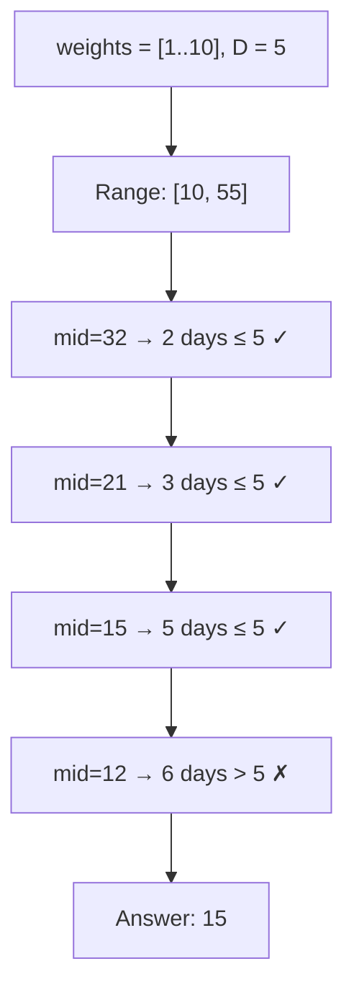

### Code

```python
def ship_within_days(weights, days):
    left = max(weights)
    right = sum(weights)
    while left < right:
        mid = left + (right - left) // 2
        current = 0
        need = 1
        for w in weights:
            if current + w > mid:
                need += 1
                current = 0
            current += w
        if need <= days:
            right = mid
        else:
            left = mid + 1
    return left
```

> [!danger]
> এই pattern টা মুখস্থ করো — "Binary Search on Answer" যেখানে minimize করতে হয়। এটা BS-17, BS-18, BS-19 তেও ব্যবহার হবে।

---

## BS-16. Kth Missing Positive Number

### সমস্যা

Sorted array দেওয়া। K-th missing positive integer বের করো।

যেমন: `arr = [2, 3, 4, 7, 11]`, `k = 5` → answer = 9 (missing: 1, 5, 6, 8, 9 — 5th = 9)

### Intuition (Math Approach)

index `i` এ পর্যন্ত missing count = `arr[i] - (i + 1)`। যদি এই count `k` এর ছোট হয়, ডানে যাও। নাহলে বামে।

### Dry Run

```
arr = [2, 3, 4, 7, 11], k = 5

Missing at each index:
  index 0: arr[0]=2, missing = 2 - 1 = 1
  index 1: arr[1]=3, missing = 3 - 2 = 1
  index 2: arr[2]=4, missing = 4 - 3 = 1
  index 3: arr[3]=7, missing = 7 - 4 = 3
  index 4: arr[4]=11, missing = 11 - 5 = 6

k = 5, first index where missing >= 5 is index 4 (missing=6)
answer = arr[4-1] + (k - missing at index 3)
       = 7 + (5 - 3)
       = 7 + 2
       = 9
```

### Binary Search Approach

```python
def kth_missing(arr, k):
    left, right = 0, len(arr) - 1
    while left <= right:
        mid = left + (right - left) // 2
        missing = arr[mid] - (mid + 1)
        if missing < k:
            left = mid + 1
        else:
            right = mid - 1
    # left = first index where missing >= k
    # answer = left + k (because arr[left-1] has missing < k)
    return left + k
```

> [!note]
> শেষে `left + k` কেন? কারণ index `left` এর আগে পর্যন্ত `missing < k`। তাই `left + k` ই হলো K-th missing number। উদাহরণ: `left=4, k=5` → `4+5=9`।

---

## BS-17. Aggressive Cows

### সমস্যা

`stalls` array তে গরুর জায়গা দেওয়া। `k` টা গরু বসাতে হবে। সর্বনিম্ন দূরত্ব যেটা পারে সেটা maximize করো।

যেমন: `stalls = [0, 3, 4, 7, 10, 9]`, `k = 4` → answer = 3

### Intuition

Binary Search on Answer। Distance range: `[1, max-min]`। যদি `mid` distance এ `k` গরু বসানো যায়, বড় distance চেষ্টা করো।

### Dry Run

```
stalls sorted = [0, 3, 4, 7, 9, 10], k = 4

Distance = 3:
  Cow 1: stall 0
  Cow 2: 0+3=3 ≤ 3? Yes → stall 3
  Cow 3: 3+3=6 ≤ 4? No, ≤ 7? Yes → stall 7
  Cow 4: 7+3=10 ≤ 9? No, ≤ 10? Yes → stall 10
  Total cows = 4 → Yes, try larger

Distance = 4:
  Cow 1: stall 0
  Cow 2: 0+4=4 ≤ 4? Yes → stall 4
  Cow 3: 4+4=8 ≤ 7? No, ≤ 9? Yes → stall 9
  Cow 4: 9+4=13 ≤ 10? No → Only 3 cows → No

Answer = 3
```

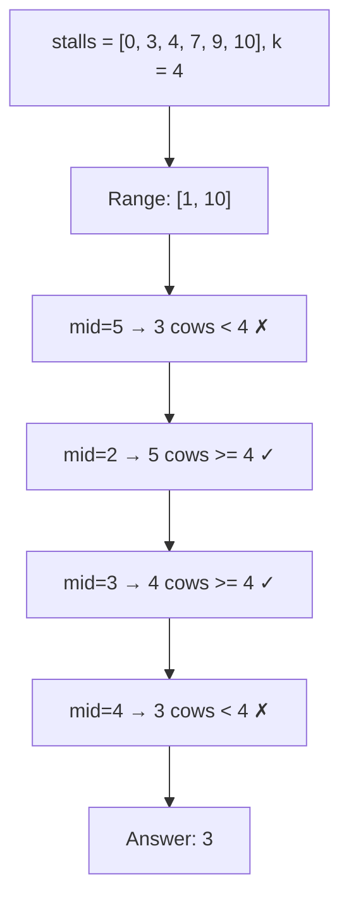

### Code

```python
def aggressive_cows(stalls, k):
    stalls.sort()
    left, right = 1, stalls[-1] - stalls[0]
    ans = 0
    while left <= right:
        mid = left + (right - left) // 2
        count = 1
        last_pos = stalls[0]
        for i in range(1, len(stalls)):
            if stalls[i] - last_pos >= mid:
                count += 1
                last_pos = stalls[i]
        if count >= k:
            ans = mid
            left = mid + 1
        else:
            right = mid - 1
    return ans
```

> [!warning]
> এই pattern এ maximize করতে হয় — তাই `count >= k` হলে `ans = mid` save করে রেখে ডানে যাও (larger distance)। BS-15 এ minimize ছিল, এখানে maximize।

---

## BS-18. Allocate Books / Book Allocation

### সমস্যা

`books[i]` পাতার সংখ্যা। `m` টা student এ ভাগ করো। প্রতিটা student consecutive books পাবে। যে ছাত্র সবচেয়ে বেশি পাবে সেটা minimize করো।

যেমন: `books = [12, 34, 67, 90]`, `m = 2` → answer = 113

### Intuition

Binary Search on Answer। Max pages range: `[max(books), sum(books)]`। যদি `mid` pages এ `m` student এ ভাগ হয়, ছোট চেষ্টা করো।

### Dry Run

```
books = [12, 34, 67, 90], m = 2

Max = 90, Sum = 203

mid = 146:
  Student 1: 12+34+67 = 113 ≤ 146, 113+90 = 203 > 146 → books [12,34,67]
  Student 2: 90 → books [90]
  Students needed = 2 ≤ 2 → Yes, try smaller

mid = 113:
  Student 1: 12+34 = 46 ≤ 113, 46+67 = 113 ≤ 113 → books [12,34,67]
  Student 2: 90 → books [90]
  Students needed = 2 ≤ 2 → Yes, try smaller

mid = 112:
  Student 1: 12+34 = 46 ≤ 112, 46+67 = 113 > 112 → books [12,34]
  Student 2: 67, 67+90 = 157 > 112 → books [67]
  Student 3: 90 → 3 students > 2 → No

Answer = 113
```

### Code

```python
def allocate_books(books, m):
    if m > len(books):
        return -1
    left, right = max(books), sum(books)
    ans = right
    while left <= right:
        mid = left + (right - left) // 2
        students = 1
        current = 0
        for pages in books:
            if current + pages > mid:
                students += 1
                current = 0
            current += pages
        if students <= m:
            ans = mid
            right = mid - 1
        else:
            left = mid + 1
    return ans
```

> [!note]
> BS-15 (Ship Packages), BS-18 (Book Allocation), BS-19 (Painter's Partition) — তিনটার check function একদম একই! শুধু semantics আলাদা। একবার pattern বুঝলে তিনটাই solve হয়ে যায়।

---

## BS-19. Painter's Partition / Split Array Largest Sum

### সমস্যা

`nums` array কে `k` ভাগে continuous subarray এ ভাগ করো। সবচেয়ে বড় subarray sum যেন minimize হয়।

যেমন: `nums = [7, 2, 5, 10, 8]`, `k = 2` → answer = 18

### Intuition

BS-18 এর সাথে একদম identical। Range: `[max(nums), sum(nums)]`।

### Dry Run

```
nums = [7, 2, 5, 10, 8], k = 2

mid = 18:
  Part 1: 7+2+5 = 14 ≤ 18, 14+10 = 24 > 18 → [7, 2, 5]
  Part 2: 10+8 = 18 ≤ 18 → [10, 8]
  Parts = 2 ≤ 2 → Yes, try smaller

mid = 17:
  Part 1: 7+2+5 = 14 ≤ 17, 14+10 = 24 > 17 → [7, 2, 5]
  Part 2: 10, 10+8 = 18 > 17 → [10]
  Part 3: 8 → 3 parts > 2 → No

Answer = 18
```

### Code

```python
def split_array(nums, k):
    left, right = max(nums), sum(nums)
    ans = right
    while left <= right:
        mid = left + (right - left) // 2
        count = 1
        current = 0
        for n in nums:
            if current + n > mid:
                count += 1
                current = 0
            current += n
        if count <= k:
            ans = mid
            right = mid - 1
        else:
            left = mid + 1
    return ans
```

> [!tip]
> Painter's Partition এ painters কে continuous boards দিতে হয় — Book Allocation এ students কে consecutive books। সম্পূর্ণ একই logic।

---

## BS-20. Minimise Maximum Distance between Gas Stations

### সমস্যা

Sorted `stations` array দেওয়া (gas station positions)। `k` টা নতুন station বসাতে হবে। Maximum adjacent distance যেন minimize হয়।

যেমন: `stations = [1, 2, 3, 4, 5]`, `k = 4` → answer = 0.5

### Intuition

Binary Search on Answer (floating point)। Distance range: `[0, max_gap]`। যদি `mid` distance maintain করতে `k` টা বা তার কম station লাগে, ছোট distance চেষ্টা করো।

### Dry Run (Simplified)

```
stations = [1, 2, 3, 4, 5], k = 4
gaps = [1, 1, 1, 1] (সব gap 1)

mid = 0.5:
  Gap 1: need ceil(1/0.5) - 1 = 2 - 1 = 1 station
  4 gaps × 1 = 4 stations ≤ 4 → Yes, try smaller

mid = 0.4:
  Gap 1: need ceil(1/0.4) - 1 = ceil(2.5) - 1 = 3 - 1 = 2 stations
  4 gaps × 2 = 8 stations > 4 → No

Answer ≈ 0.5
```

### Code (Binary Search with Precision)

```python
def minmax_gas_stations(stations, k):
    n = len(stations)
    left, right = 0, stations[-1] - stations[0]
    while right - left > 1e-6:
        mid = (left + right) / 2
        needed = 0
        for i in range(n - 1):
            gap = stations[i + 1] - stations[i]
            needed += int(gap / mid)
        if needed <= k:
            right = mid
        else:
            left = mid
    return right
```

> [!warning]
> Floating point binary search এ `while right - left > 1e-6` precision check দরকার। এটা একটু tricky — interview এ সাধারণত Heap/PriorityQueue approach ও acceptable।

---

## BS-21. Median of Two Sorted Arrays

### সমস্যা

দুটো sorted array এর median বের করো — $O(\log(\min(n, m)))$ এ।

যেমন: `a = [1, 3, 5]`, `b = [2, 4, 6]` → merged = `[1, 2, 3, 4, 5, 6]` → median = 3.5

### Brute Force

দুটো array merge করো, median বের করো। $O(n + m)$ time, $O(n + m)$ space।

### Binary Search Approach

ছোট array তে binary search করো — একটা partition বেছে নাও যেন বাম পাশের সব element ডান পাশের সব element এর ছোট বা সমান।

### Dry Run

```
a = [1, 3, 5, 7], b = [0, 2, 4, 6, 8]
n = 4, m = 5, total = 9, half = 4 (পুরো বাম পাশে 4+1 = 5টা)

Binary search on smaller array (a):

left=0, right=4, mid_a=2 (a থেকে ২টা নিব)
  mid_b = half - mid_a = 5 - 2 = 3 (b থেকে ৩টা নিব)

  Left part:  a[0,1] = [1, 3],  b[0,1,2] = [0, 2, 4]
  Right part: a[2,3] = [5, 7],  b[3,4]   = [6, 8]

  max_left = max(3, 4) = 4
  min_right = min(5, 6) = 5
  4 <= 5? Yes → valid partition!

  Odd total → median = max_left = 4... 
  wait, half = (4+5+1)//2 = 5, median = max_left = 4
```

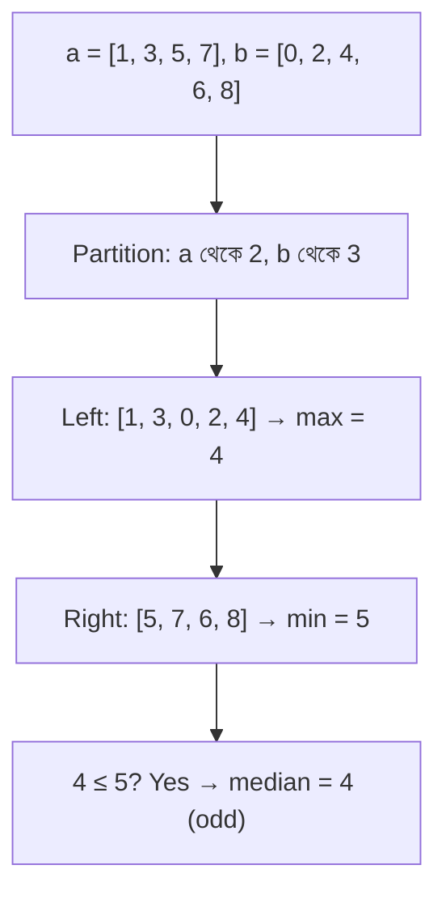

### Code

```python
def median_two_sorted(a, b):
    if len(a) > len(b):
        a, b = b, a
    n, m = len(a), len(b)
    total = n + m
    half = (total + 1) // 2
    left, right = 0, n
    while left <= right:
        mid_a = (left + right) // 2
        mid_b = half - mid_a
        a_left = a[mid_a - 1] if mid_a > 0 else float('-inf')
        a_right = a[mid_a] if mid_a < n else float('inf')
        b_left = b[mid_b - 1] if mid_b > 0 else float('-inf')
        b_right = b[mid_b] if mid_b < m else float('inf')
        if a_left <= b_right and b_left <= a_right:
            if total % 2:
                return max(a_left, b_left)
            return (max(a_left, b_left) + min(a_right, b_right)) / 2
        elif a_left > b_right:
            right = mid_a - 1
        else:
            left = mid_a + 1
```

> [!danger]
> এটা Binary Search এর সবচেয়ে কঠিন problem গুলোর একটা। মূল intuition: partition করো যেন বাম পাশের max ডান পাশের min এর ছোট বা সমান। ছোট array তে search করলে complexity $O(\log(\min(n, m)))$।

---

## BS-22. K-th Element of Two Sorted Arrays

### সমস্যা

দুটো sorted array এর merged version এর K-th element বের করো — $O(\log(\min(n, m)))$ এ।

### Intuition

BS-21 এর মতো partition approach। কিন্তু এখানে আমরা শুধু K-th element চাই।

### Simpler Approach (Binary Search)

ছোট array তে binary search করো — কতটা element ছোট array থেকে নিলে বাম পাশে ঠিক K টা হয়।

### Dry Run

```
a = [2, 3, 6, 7, 9], b = [1, 4, 8, 10]
k = 5

merged = [1, 2, 3, 4, 6, 7, 8, 9, 10]
5th element = 6

Binary search on a:
  take 2 from a → need 3 from b
  a[1]=3, b[2]=8 → max(3, 8)=8, min(6, 10)=6
  3 <= 10 and 8 <= 6? No (8 > 6) → take more from a
  
  take 3 from a → need 2 from b
  a[2]=6, b[1]=4 → max(6, 4)=6
  6 <= 8? Yes → 5th element = 6
```

### Code

```python
def kth_element(a, b, k):
    if len(a) > len(b):
        a, b = b, a
    n, m = len(a), len(b)
    left, right = max(0, k - m), min(k, n)
    while left <= right:
        mid_a = (left + right) // 2
        mid_b = k - mid_a
        a_left = a[mid_a - 1] if mid_a > 0 else float('-inf')
        a_right = a[mid_a] if mid_a < n else float('inf')
        b_left = b[mid_b - 1] if mid_b > 0 else float('-inf')
        b_right = b[mid_b] if mid_b < m else float('inf')
        if a_left <= b_right and b_left <= a_right:
            return max(a_left, b_left)
        elif a_left > b_right:
            right = mid_a - 1
        else:
            left = mid_a + 1
```

> [!note]
> BS-21 আর BS-22 একই pattern — partition based binary search। Median হলো actually K-th element এর একটা special case।

---

## BS-23. Row with Maximum Number of 1s

### সমস্যা

Binary matrix দেওয়া হয়েছে — প্রতিটা row sorted (প্রথমে 0, তারপর 1)। কোন row এ সবচেয়ে বেশি 1 আছে সেটা বের করো।

```
matrix = [
  [0, 0, 1, 1, 1],
  [0, 0, 0, 0, 0],
  [0, 1, 1, 1, 1],
  [0, 0, 0, 1, 1],
]
→ Row 2 (4টা 1)
```

### Intuition

প্রতিটা row তে প্রথম 1 এর position বের করো (lower bound of 1)। যে row এ প্রথম 1 সবচেয়ে আগে, সেই row এ 1 সবচেয়ে বেশি।

### Dry Run

```
Row 0: first 1 at index 2 → count = 5 - 2 = 3
Row 1: no 1 → count = 0
Row 2: first 1 at index 1 → count = 5 - 1 = 4
Row 3: first 1 at index 3 → count = 5 - 3 = 2

Max = Row 2 (4টা 1)
```

### Code

```python
def row_with_max_ones(matrix):
    m, n = len(matrix), len(matrix[0])
    max_count = 0
    max_row = -1
    for i in range(m):
        left, right = 0, n
        while left < right:
            mid = left + (right - left) // 2
            if matrix[i][mid] < 1:
                left = mid + 1
            else:
                right = mid
        count = n - left
        if count > max_count:
            max_count = count
            max_row = i
    return max_row
```

> [!tip]
> প্রতিটা row তে lower bound of 1 বের করছি — সেটাই BS-2 এর concept। পুরো complexity: $O(m \log n)$।

---

## BS-24. Search in a 2D Matrix I

### সমস্যা

`m × n` matrix যেখানে:
- প্রতিটা row ascending sorted
- প্রতিটা row এর first element আগের row এর last element এর বড়

মানে matrix কে flat করলে একটা sorted array হয়। Target খুঁজে বের করো।

```
matrix = [
  [1,  3,  5,  7],
  [10, 11, 16, 20],
  [23, 30, 34, 60],
]
target = 3 → (0, 1)
```

### Intuition

Flat array এর মতো binary search করো। `mid` index কে `(row, col)` এ convert করো: `row = mid // n, col = mid % n`।

### Dry Run

```
m=3, n=4, total=12 elements
target = 3

left=0, right=11
mid=5 → row=5//4=1, col=5%4=1 → matrix[1][1]=11
  11 > 3 → right=4

mid=2 → row=2//4=0, col=2%4=2 → matrix[0][2]=5
  5 > 3 → right=1

mid=0 → row=0, col=0 → matrix[0][0]=1
  1 < 3 → left=1

mid=1 → row=0, col=1 → matrix[0][1]=3
  3 == 3 → Found! Return (0, 1)
```

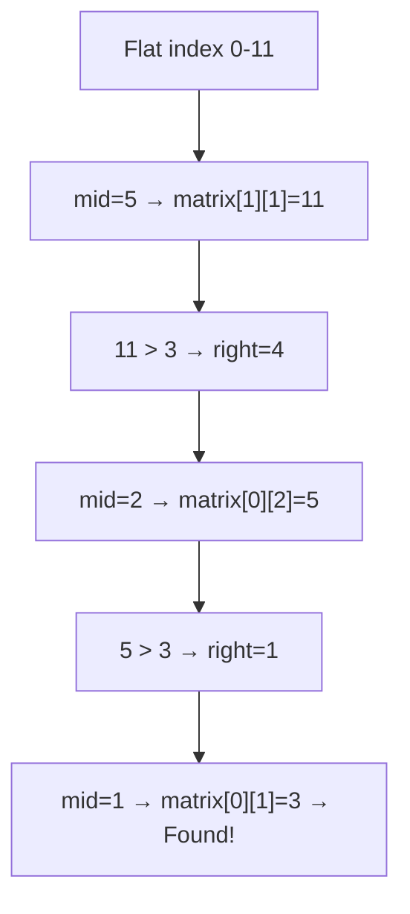

### Code

```python
def search_matrix_1(matrix, target):
    m, n = len(matrix), len(matrix[0])
    left, right = 0, m * n - 1
    while left <= right:
        mid = left + (right - left) // 2
        val = matrix[mid // n][mid % n]
        if val == target:
            return [mid // n, mid % n]
        elif val < target:
            left = mid + 1
        else:
            right = mid - 1
    return [-1, -1]
```

> [!note]
> মূল trick: 1D index কে 2D তে convert করা — `row = mid // n, col = mid % n`। এটা সব 2D binary search এ কাজে লাগে।

---

## BS-25. Search in a 2D Matrix II

### সমস্যা

`m × n` matrix যেখানে:
- প্রতিটা row ascending sorted
- প্রতিটা column ascending sorted

কিন্তু row গুলো একটার পর একটা sorted না (Matrix I এর মতো flat করা যায় না)।

```
matrix = [
  [1,  4,  7,  11],
  [2,  5,  8,  12],
  [3,  6,  9,  16],
  [10, 13, 14, 17],
]
target = 5 → True
```

### Intuition

Top-right corner থেকে শুরু করো। সেখান থেকে:
- বামে গেলে ছোট হয় (row sorted ascending)
- নিচে গেলে বড় হয় (column sorted ascending)

তাই target ছোট হলে বামে, বড় হলে নিচে।

### Dry Run

```
matrix = উপরের matrix, target = 5

Start: row=0, col=3 → matrix[0][3]=11
  11 > 5 → col-- → col=2

row=0, col=2 → matrix[0][2]=7
  7 > 5 → col-- → col=1

row=0, col=1 → matrix[0][1]=4
  4 < 5 → row++ → row=1

row=1, col=1 → matrix[1][1]=5
  5 == 5 → Found! Return True
```

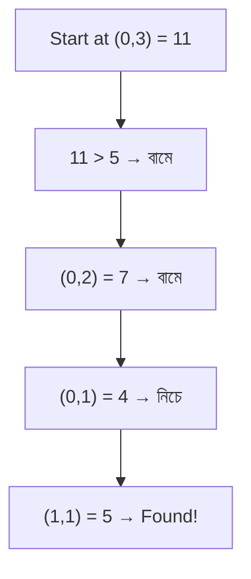

### Code

```python
def search_matrix_2(matrix, target):
    if not matrix or not matrix[0]:
        return False
    m, n = len(matrix), len(matrix[0])
    row, col = 0, n - 1
    while row < m and col >= 0:
        if matrix[row][col] == target:
            return True
        elif matrix[row][col] < target:
            row += 1
        else:
            col -= 1
    return False
```

> [!tip]
> Top-right বা bottom-left থেকে শুরু করলে প্রতি ধাপে একটা row বা column বাদ যায় — $O(m + n)$ এ solve হয়। এটা আসলে binary search না, কিন্তু sorted matrix এর জন্য optimal।

---

## BS-26. Find Peak Element II

### সমস্যা

2D matrix তে peak element বের করো — যেটা তার উপর, নিচ, বাম, ডান সবার চেয়ে বড়।

### Intuition

মাঝের column এর max element বের করো। যদি সে তার বাম আর ডান থেকে বড় হয়, সেই peak। নাহলে যেদিকে বড় neighbor আছে সেদিকে binary search করো।

### Dry Run

```
matrix = [
  [10, 20, 15],
  [21, 30, 14],
  [ 7, 16, 32],
]

Step 1: mid column = 1
        Max in column 1 = 30 at (1, 1)
        Left = 21, Right = 14
        30 > 21 and 30 > 14? Yes → 30 is a peak!
        Return (1, 1)
```

### Code

```python
def find_peak_2d(matrix):
    m, n = len(matrix), len(matrix[0])
    left, right = 0, n - 1
    while left <= right:
        mid = left + (right - left) // 2
        max_row = 0
        for i in range(m):
            if matrix[i][mid] > matrix[max_row][mid]:
                max_row = i
        left_val = matrix[max_row][mid - 1] if mid > 0 else -1
        right_val = matrix[max_row][mid + 1] if mid < n - 1 else -1
        if matrix[max_row][mid] > left_val and matrix[max_row][mid] > right_val:
            return [max_row, mid]
        elif left_val > matrix[max_row][mid]:
            right = mid - 1
        else:
            left = mid + 1
    return [-1, -1]
```

> [!note]
> প্রতিটা column এর max নিচ্ছি, তারপর 1D peak search এর মতো compare করছি। Complexity: $O(m \log n)$।

---

## BS-27. Median in a Row Wise Sorted Matrix

### সমস্যা

Row-wise sorted matrix এ median বের করো — $O(m \log n \log(\text{range}))$ এ।

```
matrix = [
  [1,  3,  5],
  [2,  6,  9],
  [3,  6,  9],
]
→ median = 5 (odd count, 5th element of 9)
```

### Intuition

Median হলো সেই value যেটার আগে পর্যন্ত `total/2` টা element আছে। Binary Search on value range `[min, max]`। প্রতিটা row তে lower bound দিয়ে count করো কতটা element `mid` এর ছোট বা সমান।

### Dry Run

```
matrix = উপরের matrix, m=3, n=3, total=9
median position = (9+1)//2 = 5

Value range: [1, 9]

mid = 5:
  Row 0: elements <= 5 → [1,3,5] = 3
  Row 1: elements <= 5 → [2] = 1
  Row 2: elements <= 5 → [3] = 1
  Total = 5 >= 5 → try smaller, right = 5

mid = 3:
  Row 0: elements <= 3 → [1,3] = 2
  Row 1: elements <= 3 → [2] = 1
  Row 2: elements <= 3 → [3] = 1
  Total = 4 < 5 → try larger, left = 4

mid = 4:
  Row 0: elements <= 4 → [1,3] = 2
  Row 1: elements <= 4 → [2] = 1
  Row 2: elements <= 4 → [3] = 1
  Total = 4 < 5 → left = 5

left=5, right=5 → Answer = 5
```

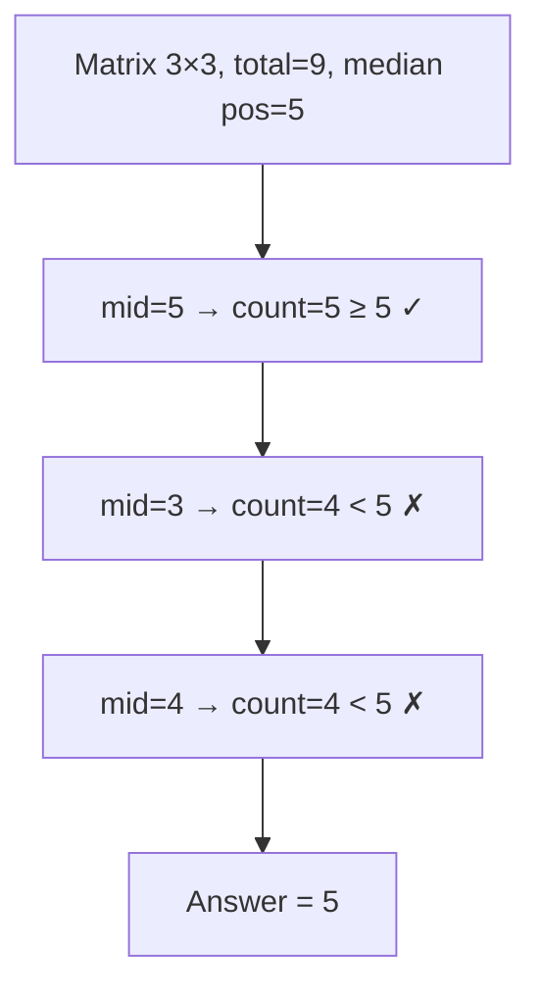

### Code

```python
def median_rowwise_sorted(matrix):
    m, n = len(matrix), len(matrix[0])
    total = m * n
    half = (total + 1) // 2
    left = matrix[0][0]
    right = matrix[0][0]
    for i in range(m):
        left = min(left, matrix[i][0])
        right = max(right, matrix[i][-1])
    while left < right:
        mid = left + (right - left) // 2
        count = 0
        for i in range(m):
            lo, hi = 0, n
            while lo < hi:
                mi = lo + (hi - lo) // 2
                if matrix[i][mi] <= mid:
                    lo = mi + 1
                else:
                    hi = mi
            count += lo
        if count >= half:
            right = mid
        else:
            left = mid + 1
    return left
```

> [!tip]
> প্রতিটা row তে `upper_bound(mid)` করে count করছি কতটা element `mid` এর ছোট বা সমান। যদি count >= half, median বাম দিকে বা mid তেই।

---

## Pattern Summary — কোন Problem এ কোন Approach

| Category | Problems | Key Insight |
|----------|----------|-------------|
| **Basic BS** | BS-1, BS-10, BS-11 | Sorted array, search for value |
| **Lower/Upper Bound** | BS-2, BS-3, BS-23 | Find first/last position, insert position |
| **Rotated Array** | BS-4, BS-5, BS-6, BS-7 | Determine which half is sorted |
| **Pattern Break** | BS-8, BS-9 | Index parity (BS-8), slope direction (BS-9) |
| **BS on Answer (min)** | BS-12, BS-13, BS-14, BS-15 | Minimize max — check(mid) ≤ threshold → go left |
| **BS on Answer (max)** | BS-17 | Maximize min — check(mid) ≥ k → go right |
| **BS on Answer (min max)** | BS-18, BS-19 | Same as BS-15 — minimize the maximum |
| **BS on Answer (float)** | BS-20 | Floating point precision loop |
| **Partition BS** | BS-21, BS-22 | Partition two arrays, check left max ≤ right min |
| **2D BS** | BS-24, BS-25, BS-26, BS-27 | Flatten (BS-24), staircase (BS-25), column max (BS-26), count-based (BS-27) |

### কোন Template কখন ব্যবহার করবে

**Template 1: Exact match (inclusive boundary)**
```python
left, right = 0, len(arr) - 1
while left <= right:
    mid = left + (right - left) // 2
    if arr[mid] == target: return mid
    elif arr[mid] < target: left = mid + 1
    else: right = mid - 1
```
ব্যবহার: BS-1, BS-4, BS-5, BS-24

**Template 2: Lower bound (exclusive boundary)**
```python
left, right = 0, len(arr)
while left < right:
    mid = left + (right - left) // 2
    if arr[mid] < target: left = mid + 1
    else: right = mid
return left
```
ব্যবহার: BS-2, BS-3, BS-8, BS-23, BS-27

**Template 3: BS on Answer (minimize)**
```python
left, right = lo_bound, hi_bound
while left < right:
    mid = left + (right - left) // 2
    if check(mid): right = mid
    else: left = mid + 1
return left
```
ব্যবহার: BS-12, BS-13, BS-14, BS-15

**Template 4: BS on Answer (maximize)**
```python
left, right = lo_bound, hi_bound
ans = 0
while left <= right:
    mid = left + (right - left) // 2
    if check(mid): ans = mid; left = mid + 1
    else: right = mid - 1
return ans
```
ব্যবহার: BS-17

---

## Common Bugs আর কীভাবে এড়াবে

> [!warning]
> সবচেয়ে common bug হলো `while left < right` নাকি `while left <= right`। Inclusive boundary (`right = len - 1`) হলে `<=`, exclusive boundary (`right = len`) হলে `<`।

> [!danger]
> দুটো template মিলিয়ে ফেললে infinite loop বা wrong answer আসবে। একটা template বেছে নাও, সেটাই practice করো।

> [!tip]
> যেকোনো Binary Search problem এ প্রথমে জিজ্ঞাসা করো:
> 1. Search space কী? (index range নাকি value range?)
> 2. Monotonic property কী? (`check(mid)` কীভাবে পরিবর্তন হয়?)
> 3. Which template? (exact match, lower bound, নাকি answer search?)

## Practice Problems Map

| Playlist # | Problem | LeetCode | Difficulty |
|-----------|---------|----------|------------|
| BS-1 | Binary Search | #704 | Easy |
| BS-2 | Search Insert Position | #35 | Easy |
| BS-3 | Find First and Last Position | #34 | Medium |
| BS-4 | Search in Rotated Sorted Array I | #33 | Medium |
| BS-5 | Search in Rotated Sorted Array II | #81 | Medium |
| BS-6 | Find Minimum in Rotated Sorted Array | #153 | Medium |
| BS-7 | Find Rotation Count | — | Medium |
| BS-8 | Single Element in Sorted Array | #540 | Medium |
| BS-9 | Find Peak Element | #162 | Medium |
| BS-10 | Sqrt(x) | #69 | Easy |
| BS-11 | Find Nth Root | — | Medium |
| BS-12 | Koko Eating Bananas | #875 | Medium |
| BS-13 | Minimum Days to Make M Bouquets | #1482 | Medium |
| BS-14 | Smallest Divisor Given Threshold | #1283 | Medium |
| BS-15 | Capacity to Ship Packages | #1011 | Medium |
| BS-16 | Kth Missing Positive Number | #1539 | Easy |
| BS-17 | Aggressive Cows | SPOJ | Hard |
| BS-18 | Allocate Books | InterviewBit | Hard |
| BS-19 | Split Array Largest Sum | #410 | Hard |
| BS-20 | Minimize Max Distance to Gas Station | #774 | Hard |
| BS-21 | Median of Two Sorted Arrays | #4 | Hard |
| BS-22 | K-th Element of Two Sorted Arrays | — | Medium |
| BS-23 | Row with Max 1s | GFG | Medium |
| BS-24 | Search a 2D Matrix I | #74 | Medium |
| BS-25 | Search a 2D Matrix II | #240 | Medium |
| BS-26 | Find a Peak Element II | #1901 | Medium |
| BS-27 | Median in Row Wise Sorted Matrix | GFG | Medium |