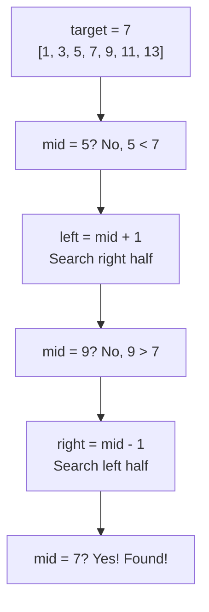
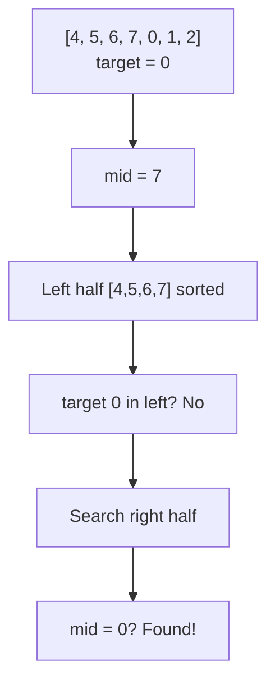
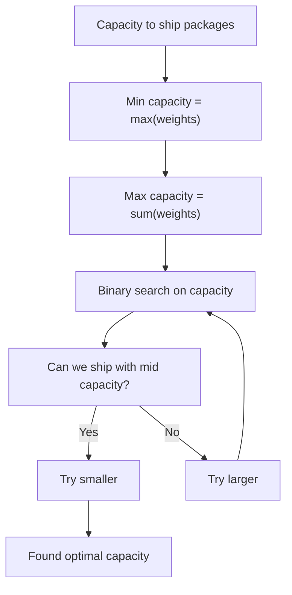

ভাবো তুমি একটা dictionary খুঁজছো। পাতাগুলো এলোমেলো — তুমি মাঝখান থেকে খুললে। যদি তোমার শব্দটা মাঝখানের পাতার আগের অংশে হয়, পিছনের অর্ধেক বাদ দাও। এটাই Binary Search — প্রতি ধাপে অর্ধেক বাদ যায়।

## Classic Binary Search

Binary Search শুধুমাত্র sorted array তে কাজ করে। প্রতি ধাপে middle element চেক করো — মিলে গেলে পেয়ে গেছো, ছোট হলে ডান দিকে যাও, বড় হলে বাম দিকে যাও।



ওপরের ছবিতে দেখো কীভাবে প্রতি ধাপে search space অর্ধেক হচ্ছে। পুরো array না ঘেঁটেই target পেয়ে গেলাম। এবার কোড দেখি।

```python
def binary_search(arr, target):
    left, right = 0, len(arr) - 1
    while left <= right:
        mid = left + (right - left) // 2
        if arr[mid] == target:
            return mid
        elif arr[mid] < target:
            left = mid + 1
        else:
            right = mid - 1
    return -1

print(binary_search([1, 3, 5, 7, 9, 11, 13], 7))
```

`left` আর `right` দুটো pointer। মাঝখানের index বের করে সেটা target এর সাথে মেলায়। `mid = left + (right - left) // 2` লেখার কারণ হলো overflow এড়ানো — `(left + right) // 2` ও কাজ করবে Python এ।

> [!tip]
> `mid = left + (right - left) // 2` overflow safe version। C++ বা Java তে integer overflow হতে পারে, তাই এই pattern অভ্যাস করো।

## কেন $O(\log n)$?

প্রতি ধাপে search space অর্ধেক হয়। $n$ টা element থেকে $\frac{n}{2}$, তারপর $\frac{n}{4}$, তারপর $\frac{n}{8}$... যতক্ষণ না ১ টা বাকি থাকে।

$$n, \frac{n}{2}, \frac{n}{4}, \ldots, 1$$

কত ধাপ লাগবে? সেটা হলো $k$ যেখানে $\frac{n}{2^k} = 1$, মানে $k = \log_2 n$। ১ লাখ element থেকে মাত্র ১৭ ধাপে যেকোনো element খুঁজে বের করা যায়। Linear search এ লাগতো ১ লাখ ধাপ।

## Leftmost আর Rightmost Variant

কী হবে যদি duplicate values থাকে? তুমি হয়তো প্রথম occurrence বা শেষ occurrence খুঁজছো।

```python
def leftmost(arr, target):
    left, right = 0, len(arr)
    while left < right:
        mid = (left + right) // 2
        if arr[mid] < target:
            left = mid + 1
        else:
            right = mid
    return left

print(leftmost([1, 2, 2, 2, 3, 4, 5], 2))
```

খেয়াল করো — `right = len(arr)` (exclusive), আর match হলে `right = mid` করছি `mid - 1` না। কারণ target এর সমান হলেও আমরা বাম দিকে আরও খুঁজতে চাই — হয়তো আরও বামে একই value আছে।

```python
def rightmost(arr, target):
    left, right = 0, len(arr)
    while left < right:
        mid = (left + right) // 2
        if arr[mid] <= target:
            left = mid + 1
        else:
            right = mid
    return left - 1

print(rightmost([1, 2, 2, 2, 3, 4, 5], 2))
```

এখানে উল্টো — `arr[mid] <= target` হলে ডান দিকে যাচ্ছি। কারণ আমরা শেষ occurrence খুঁজছি। শেষে `left - 1` return করছি কারণ loop শেষে `left` এক ঘর ডানে চলে যায়।

> [!note]
> Leftmost আর rightmost এই দুটো pattern মুখস্থ না — বুঝে নাও। `right = mid` (exclusive boundary) বনাম `right = mid - 1` (inclusive boundary) এই পার্থক্য টা খুব important।

## lower_bound আর upper_bound

C++ এর `lower_bound` আর `upper_bound` কে Python এ implement করা যায়।

```python
import bisect

arr = [1, 2, 2, 2, 3, 4, 5]

pos = bisect.bisect_left(arr, 2)
print(pos)

pos = bisect.bisect_right(arr, 2)
print(pos)
```

`bisect_left` হলো প্রথম index যেখানে `arr[index] >= target`। `bisect_right` হলো প্রথম index যেখানে `arr[index] > target`। দুটোর মাঝেই Binary Search লুকিয়ে আছে।

> [!tip]
> `bisect` module টা Python এ অনেক কাজে দেয়। Sorted list এ insert position খুঁজতে বা duplicate range বের করতে সরাসরি ব্যবহার করো।

## Search in Rotated Sorted Array

এটা একটা classic problem। Sorted array কে rotate করা হয়েছে — যেমন `[4, 5, 6, 7, 0, 1, 2]`। এখানে কীভাবে search করবে?



Pivot বা rotation point এর উপর ভিত্তি করে কোন অংশ sorted সেটা বের করতে হয়। এবার কোড দেখি।

```python
def search_rotated(arr, target):
    left, right = 0, len(arr) - 1
    while left <= right:
        mid = (left + right) // 2
        if arr[mid] == target:
            return mid
        if arr[left] <= arr[mid]:
            if arr[left] <= target < arr[mid]:
                right = mid - 1
            else:
                left = mid + 1
        else:
            if arr[mid] < target <= arr[right]:
                left = mid + 1
            else:
                right = mid - 1
    return -1

print(search_rotated([4, 5, 6, 7, 0, 1, 2], 0))
```

প্রথমে check করো বাম অংশ sorted কি না (`arr[left] <= arr[mid]`)। যদি sorted হয় আর target ওই অংশে থাকে, বামে যাও। নাহলে ডান অংশে। ঠিক একই logic ডান অংশের জন্যও।

> [!warning]
> Rotated array এ condition গুলো একটু tricky। `arr[left] <= target < arr[mid]` এই comparison টা ভুল করলে answer ভুল আসবে। ধৈর্য ধরে trace করো।

## Binary Search on Answer — সবচেয়ে Important Technique

এটা হলো সেই technique যেটা interview এ অনেক আসে কিন্তু অনেকেই চিনতে পারে না। ভাবো তুমি কোনো value খুঁজছো না — বরং একটা answer খুঁজছো যেটা একটা range এর মধ্যে থাকতে পারে।



উদাহণ হিসেবে — ship এ package পাঠাতে হবে। Minimum capacity কত হলে সব package $D$ দিনে পাঠানো যায়? Capacity এর range হলো `[max(weights), sum(weights)]`।

```python
def ship_within_days(weights, days):
    left = max(weights)
    right = sum(weights)

    while left < right:
        mid = (left + right) // 2
        current = 0
        need = 1
        for w in weights:
            if current + w > mid:
                need += 1
                current = 0
            current += w
        if need <= days:
            right = mid
        else:
            left = mid + 1
    return left

print(ship_within_days([1, 2, 3, 4, 5, 6, 7, 8, 9, 10], 5))
```

`can_ship(mid)` function টা check করে — এই capacity তে $D$ দিনে সব package যাবে কি না। যদি যায়, আরও ছোট capacity চেষ্টা করো। নাহলে বড় capacity দরকার।

> [!danger]
> Binary Search on Answer সবচেয়ে কঠিন অংশ হলো — বুঝতে পারা যে এখানে Binary Search লাগবে। সাধারণত যেকোনো problem যেখানে "minimum" বা "maximum" খুঁজতে বলে আর একটা monotonic property থাকে — সেখানে Binary Search on Answer ভাবতে পারো।

## কখন Binary Search ব্যবহার করবে

| Condition | কাজ করবে? |
|-----------|----------|
| Sorted array | Yes |
| Sorted but rotated | Yes |
| Monotonic function | Yes |
| Unsorted array | No |
| Duplicate values | Yes (variant দরকার) |

> [!tip]
> একটা pattern মনে রাখো — যদি problem এ "minimum possible" বা "maximum possible" খুঁজতে বলে, আর তুমি একটা range বের করতে পারো, তাহলে Binary Search on Answer ভাবো।

## Practice Problems

| Problem | Difficulty | Platform | Approach Hint |
|---------|-----------|----------|---------------|
| Binary Search | Easy | LeetCode #704 | Classic template |
| Search Insert Position | Easy | LeetCode #35 | Leftmost variant |
| Search in Rotated Sorted Array | Medium | LeetCode #33 | Determine sorted half |
| Find First and Last Position | Medium | LeetCode #34 | Leftmost + rightmost |
| Koko Eating Bananas | Medium | LeetCode #875 | Binary search on answer |
| Split Array Largest Sum | Hard | LeetCode #410 | Binary search on answer |
| Median of Two Sorted Arrays | Hard | LeetCode #4 | Partition based binary search |

> [!note]
> Binary Search on Answer অন্তত ৫-৬ টা problem solve করো। প্রথমবার বুঝতে সময় লাগবে কিন্তু একবার click করলে এই pattern সবথেকে powerful মনে হবে।

## Common Bugs আর কীভাবে এড়াবে

> [!warning]
> সবচেয়ে common bug হলো `while left < right` নাকি `while left <= right`। এটা নির্ভর করে তোমার `right` boundary inclusive না exclusive। Inclusive হলে `<=`, exclusive হলে `<`।

```python
left, right = 0, len(arr) - 1
while left <= right:
    mid = (left + right) // 2
    if arr[mid] == target:
        return mid
    elif arr[mid] < target:
        left = mid + 1
    else:
        right = mid - 1
return -1
```

এই template এ `right = len(arr) - 1` (inclusive), তাই `while left <= right`। Return -1 যদি না পাও।

```python
left, right = 0, len(arr)
while left < right:
    mid = (left + right) // 2
    if arr[mid] < target:
        left = mid + 1
    else:
        right = mid
return left
```

আর এই template এ `right = len(arr)` (exclusive), তাই `while left < right`। Return `left` — সেটা insert position হবে।

> [!danger]
> দুটো template মিলিয়ে ফেললে infinite loop বা wrong answer আসবে। একটা template বেছে নাও, সেটাই practice করো যতক্ষণ না স্বাভাবিক মনে হয়।