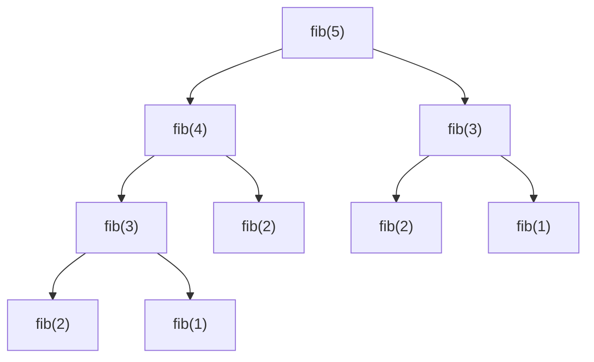
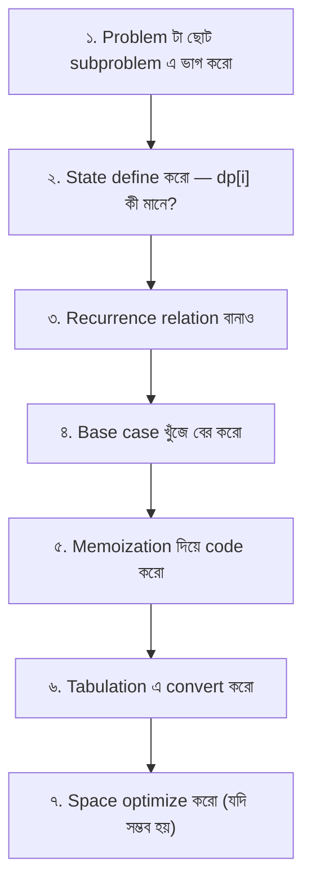

# Dynamic Programming

DP হলো একটা স্মার্ট পদ্ধতি — একই সমস্যা বারবার solve না করে, আগের উত্তর মনে রেখে (memoize) পরের ধাপে ব্যবহার করা। মনে করো তুমি পরীক্ষায় একটা প্রশ্ন পেয়েছো, solve করেছো, আবার সেই প্রশ্ন এলো — তোমাকে আবার করতে হবে না, আগের উত্তরটা দিয়ে দেবে।

এই chapter টা সবচেয়ে বেশি important — কারণ DP হলো সেই জিনিস যা beginner আর expert এর মধ্যে পার্থক্য গোছায়। Interview এ, contest এ, সব জায়গায় DP আসে। তাই এই chapter টা বড় আর detailed।

## DP কখন ব্যবহার করবে

DP তে দুটো শর্ত থাকতে হবে:

1. **Overlapping Subproblems** — একই subproblem বারবার আসছে। Fibonacci তে `fib(5)` করতে গেলে `fib(3)` দুবার, `fib(2)` তিনবার calculate হয়। এই repetition থাকলেই DP।

2. **Optimal Substructure** — বড় problem এর optimal solution ছোট subproblem এর optimal solution দিয়ে বানানো যায়। Shortest path A→C যদি A→B→C হয়, তাহলে A→B আর B→C ও shortest হতে হবে।

> [!important] DP vs Divide and Conquer
> Divide and Conquer এ subproblem গুলো overlap করে না (যেমন merge sort)। DP তে overlap করে। যদি একই subproblem বারবার আসে — DP। নাহলে divide and conquer। সহজ কথায়: overlap থাকলে DP, না থাকলে D&C।

## Fibonacci — দিয়ে শুরু

Fibonacci হলো DP এর "Hello World"। `fib(n) = fib(n-1) + fib(n-2)` — সবাই জানে। কিন্তু naive recursion এ এটা ভয়াবহ ধীর।

### Naive Recursion — $O(2^n)$



খেয়াল করো — `fib(3)` দুবার, `fib(2)` তিনবার calculate হচ্ছে। এই overlapping subproblems ই হলো DP এর সুযোগ। যদি একবার calculate করে রেখে দিই, পরের বার instant পাবো।

নিচের কোডে naive recursion দেখানো হয়েছে। এটা $O(2^n)$ time নেয় — কারণ প্রতি call দুটো নতুন call তৈরি করে। $n = 40$ হলে প্রায় $10^{12}$ operation — কোনো computer এই রাত পার করবে না।

```python
def fib_naive(n):
    if n <= 1:
        return n
    return fib_naive(n - 1) + fib_naive(n - 2)

print(fib_naive(10))
```

Output: `55`। ছোট $n$ এ ঠিক আছে, কিন্তু $n = 50$ দিলে এই কোড hang করবে।

## Memoization (Top-Down)

Memoization হলো recursion + cache। আগে যা calculate করেছি সেটা একটা dictionary তে রেখে দিই। পরের বার সেই value দরকার হলে, আবার calculate না করে cache থেকে নিয়ে নিই।

এখানে `memo` dictionary তে প্রতিটা `n` এর জন্য result রাখা হয়। যদি `n` আগে থেকেই `memo` তে থাকে, সরাসরি দিয়ে দেওয়া হয়। নাহলে calculate করে `memo` তে রেখে দেওয়া হয়।

```python
def fib_memo(n, memo={}):
    if n <= 1:
        return n
    if n in memo:
        return memo[n]
    memo[n] = fib_memo(n - 1, memo) + fib_memo(n - 2, memo)
    return memo[n]

print(fib_memo(50))
```

Output: `12586269025`। $n = 50$ যেটা naive এ কখনও শেষ হতো না, memoization এ instant হয়। Time complexity $O(n)$ — কারণ প্রতিটা $n$ একবারই calculate হয়।

## Tabulation (Bottom-Up)

Tabulation হলো উল্টো দিক থেকে কাজ। ছোট subproblem আগে solve করো, তারপর বড় দিকে যাও। Recursion নেই — শুধু loop।

এখানে `dp` array তে ছোট থেকে বড় পর্যন্ত মান ভরা হয়। `dp[0] = 0`, `dp[1] = 1`, তারপর প্রতিটা `dp[i] = dp[i-1] + dp[i-2]`। কোনো recursion overhead নেই।

```python
def fib_tab(n):
    if n <= 1:
        return n
    dp = [0] * (n + 1)
    dp[1] = 1
    for i in range(2, n + 1):
        dp[i] = dp[i - 1] + dp[i - 2]
    return dp[n]

print(fib_tab(50))
```

Output: `12586269025`। Same উত্তর, কিন্তু কোনো recursion নেই। Space optimization করা যায় — শুধু আগের দুটা মান মনে রাখলেই হয়, পুরো array লাগে না।

এই space-optimized version এ শুধু দুটা variable ব্যবহার করা হয়েছে — `prev` আর `prev2`। যেহেতু শুধু আগের দুটা মান দরকার, পুরো array রাখার দরকার নেই। Space $O(1)$!

```python
def fib_optimized(n):
    if n <= 1:
        return n
    prev2, prev1 = 0, 1
    for i in range(2, n + 1):
        curr = prev1 + prev2
        prev2, prev1 = prev1, curr
    return prev1

print(fib_optimized(50))
```

Output: `12586269025`। Time $O(n)$, Space $O(1)$। এটাই Fibonacci এর সবচেয়ে efficient solution।

| Method | Time | Space | Pros | Cons |
|--------|------|-------|------|------|
| Naive Recursion | $O(2^n)$ | $O(n)$ | সহজ | ভয়াবহ ধীর |
| Memoization | $O(n)$ | $O(n)$ | সহজ, top-down | Recursion overhead |
| Tabulation | $O(n)$ | $O(n)$ | কোনো recursion নেই | ছোট থেকে বড় ক্রম |
| Space-optimized | $O(n)$ | $O(1)$ | সবচেয়ে efficient | শুধু specific case |

> [!tip] Memoization vs Tabulation
> Interview এ memoization দিয়ে শুরু করো — সহজ, স্বাভাবিক thinking। তারপর optimize করে tabulation এ নিয়ে যাও। অনেক time tabulation এর জন্য space optimization ও করা যায় — interviewer খুশি হবে।

## 1D DP Problems

### Climbing Stairs

সিঁড়ি দিয়ে উপরে উঠতে হবে। এক ধাপে ১ বা ২ সিঁড়ি পার হতে পারো। $n$ তম সিঁড়িতে যাওয়ার কতভাবে সম্ভব?

এটা Fibonacci এর variation। $n$ তম সিঁড়িতে যাওয়ার উপায় = $(n-1)$ তম থেকে ১ ধাপ + $(n-2)$ তম থেকে ২ ধাপ। মানে `dp[n] = dp[n-1] + dp[n-2]`।

নিচের কোডে `dp` array ব্যবহার করা হয়েছে। Base case: `dp[0] = 1` (ground এ আছো, ১ ভাবেই), `dp[1] = 1` (১ ভাবে)। তারপর প্রতিটা `dp[i] = dp[i-1] + dp[i-2]`।

```python
def climb_stairs(n):
    if n <= 2:
        return n
    dp = [0] * (n + 1)
    dp[1] = 1
    dp[2] = 2
    for i in range(3, n + 1):
        dp[i] = dp[i - 1] + dp[i - 2]
    return dp[n]

print(climb_stairs(5))
```

Output: `8`। ৫ তম সিঁড়িতে যাওয়ার ৮টা ভাব আছে।

### House Robber

একটা রাস্তায় বাড়ি গুলোতে টাকা আছে। পাশাপাশি দুটো বাড়ি থেকে চুরি করলে alarm বাজবে। সর্বোচ্চ কত টাকা চুরি করা যায়?

এখানে প্রতিটা বাড়ির জন্য দুটা choice — এই বাড়ি থেকে নিবে, নাকি নিবে না। যদি নেয়, তবে পরের বাড়ি ছাড়তে হবে। যদি না নেয়, পরের বাড়ি থেকে নিতে পারে। `dp[i] = max(dp[i-1], money[i] + dp[i-2])`।

এই কোডে `dp[i]` মানে প্রথম $i$ টা বাড়ি থেকে maximum চুরি। প্রতিটা বাড়ির জন্য: যদি এই বাড়ি নিই, তবে `money[i] + dp[i-2]` (পরের বাড়ি skip)। যদি না নিই, তবে `dp[i-1]` (আগের পর্যন্ত যা ছিল)। দুটোর max।

```python
def rob(nums):
    if not nums:
        return 0
    if len(nums) == 1:
        return nums[0]

    prev2 = nums[0]
    prev1 = max(nums[0], nums[1])

    for i in range(2, len(nums)):
        curr = max(prev1, nums[i] + prev2)
        prev2, prev1 = prev1, curr

    return prev1

print(rob([2, 7, 9, 3, 1]))
```

Output: `12`। বাড়ি 0 ($2), 2 ($9), 4 ($1) থেকে নিলে মোট $12 — সর্বোচ্চ।

## 2D DP Problems

### Grid Paths — Unique Paths

একটা grid এর top-left corner থেকে bottom-right corner এ যেতে হবে। শুধু right বা down এ যাওয়া যায়। কতভাবে যাওয়া যায়?

প্রতিটা cell এ যাওয়ার উপায় = উপরের cell থেকে নামার উপায় + বাঁদিকের cell থেকে আসার উপায়। `dp[i][j] = dp[i-1][j] + dp[i][j-1]`।

এখানে 2D `dp` table বানানো হয়েছে। প্রথম row আর প্রথম column এর সব cell = 1 (কারণ সেখানে যাওয়ার মাত্র ১ ভাব — সোজা চলে যাও)। বাকি cell এর মান = উপরের আর বাঁদিকের cell এর যোগফল।

```python
def unique_paths(m, n):
    dp = [[1] * n for _ in range(m)]

    for i in range(1, m):
        for j in range(1, n):
            dp[i][j] = dp[i - 1][j] + dp[i][j - 1]

    return dp[m - 1][n - 1]

print(unique_paths(3, 7))
```

Output: `28`। ৩×৭ grid এ ২৮টা unique path আছে। প্রতিটা cell তার উপরের আর বাঁদিকের cell এর যোগফল হিসেব রাখছে।

> [!note] Combinatorics দিয়েও পারা যায়
> এই problem টা আসলে $\binom{m+n-2}{m-1}$ — কারণ $(m-1)$ বার down আর $(n-1)$ বার right, মোট $(m+n-2)$ টা move এর arrangement। কিন্তু DP দিয়ে করলে obstacle যোগ করা সহজ হয়।

### 0/1 Knapsack

Knapsack হলো DP এর সবচেয়ে classic problem। একটা ব্যাগের capacity $W$, কিছু item এর weight আর value দেওয়া। প্রতিটা item হয় নেবে, যা নেবে পুরোটা নেবে (ভাঙা যায় না)। সর্বোচ্চ value কত?

State: `dp[i][w]` = প্রথম $i$ টা item থেকে capacity $w$ তে maximum value। প্রতিটা item এর জন্য দুটা choice — নেবে বা নেবে না।

নিচের কোডে 2D `dp` table ব্যবহার করা হয়েছে। `dp[i][w]` মানে প্রথম $i$ টা item থেকে capacity $w$ তে maximum value। প্রতিটা item এর জন্য: যদি নিই, `val[i-1] + dp[i-1][w - wt[i-1]]`। যদি না নিই, `dp[i-1][w]`। দুটোর max।

```python
def knapsack(wt, val, W):
    n = len(wt)
    dp = [[0] * (W + 1) for _ in range(n + 1)]

    for i in range(1, n + 1):
        for w in range(W + 1):
            dp[i][w] = dp[i - 1][w]
            if wt[i - 1] <= w:
                dp[i][w] = max(dp[i][w], val[i - 1] + dp[i - 1][w - wt[i - 1]])

    return dp[n][W]

wt = [1, 3, 4, 5]
val = [1, 4, 5, 7]
W = 7
print(knapsack(wt, val, W))
```

Output: `9`। Item 3 (weight=3, value=4) আর item 4 (weight=4, value=5) নিলে মোট weight=7, value=9। এটাই সর্বোচ্চ।

> [!warning] 0/1 vs Unbounded Knapsack
> 0/1 Knapsack এ প্রতিটা item একবারই নেওয়া যায়। Unbounded Knapsack এ একই item বারবার নেওয়া যায়। কোডে পার্থক্য শুধু এক জায়গায় — 0/1 তে `dp[i-1][w-wt[i-1]]` (এই item ব্যবহার হয়ে গেছে), Unbounded তে `dp[i][w-wt[i-1]]` (এই item আবার নেওয়া যায়)।

## Classic DP Problems

### Longest Increasing Subsequence (LIS)

একটা array এর এমন সবচেয়ে বড় subsequence খুঁজতে হবে যেখানে সংখ্যাগুলো increasing order এ আছে। Subsequence মানে contiguous না, কিন্তু order ঠিক রাখতে হবে।

`dp[i]` = `i` তম element দিয়ে শেষ হওয়া LIS এর length। প্রতিটা `i` এর জন্য আগের সব `j < i` check করো যেখানে `nums[j] < nums[i]` — তাহলে `dp[i] = max(dp[i], dp[j] + 1)`।

এখানে প্রতিটা index এর জন্য তার আগের সব index check করা হয়। যদি আগের কোনো element ছোট হয়, সেই element এর LIS এ বর্তমান element যোগ করা যায়। সবচেয়ে বড় `dp[i]` ই উত্তর।

```python
def length_of_lis(nums):
    n = len(nums)
    dp = [1] * n

    for i in range(1, n):
        for j in range(i):
            if nums[j] < nums[i]:
                dp[i] = max(dp[i], dp[j] + 1)

    return max(dp)

print(length_of_lis([10, 9, 2, 5, 3, 7, 101, 18]))
```

Output: `4`। LIS হলো `[2, 3, 7, 101]` বা `[2, 5, 7, 101]` — length 4।

> [!tip] Binary Search optimization
> এই $O(n^2)$ solution টা basic। $O(n \log n)$ এ LIS করা যায় binary search দিয়ে — একটা `tails` array রাখো যেখানে `tails[i]` হলো length $i+1$ এর LIS এর সবচেয়ে ছোট last element। এটা বেশি efficient।

### Longest Common Subsequence (LCS)

দুটো string এর সবচেয়ে বড় common subsequence খুঁজতে হবে। যেমন "abcde" আর "ace" এর LCS হলো "ace", length 3।

`dp[i][j]` = `s1[0..i-1]` আর `s2[0..j-1]` এর LCS length। যদি শেষ character match করে, `dp[i][j] = 1 + dp[i-1][j-1]`। না হলে, `dp[i][j] = max(dp[i-1][j], dp[i][j-1])`।

এই কোডে 2D `dp` table ব্যবহার করা হয়েছে। যদি দুটো string এর বর্তমান character same হয়, diagonal থেকে ১ যোগ। না হলে, উপরের আর বাঁদিকের cell এর max। এটাই LCS এর state transition।

```python
def lcs(s1, s2):
    m, n = len(s1), len(s2)
    dp = [[0] * (n + 1) for _ in range(m + 1)]

    for i in range(1, m + 1):
        for j in range(1, n + 1):
            if s1[i - 1] == s2[j - 1]:
                dp[i][j] = 1 + dp[i - 1][j - 1]
            else:
                dp[i][j] = max(dp[i - 1][j], dp[i][j - 1])

    return dp[m][n]

print(lcs("abcde", "ace"))
```

Output: `3`। "ace" হলো LCS — length 3। দুটো string এ common অংশ খুঁজে বের করা হলো।

### Edit Distance

দুটো string কে same বানাতে minimum কতটা operation লাগবে? Operation তিন ধরনের — insert, delete, replace। এটা খুব practical — spell checker, DNA alignment, fuzzy search সব জায়গায় ব্যবহার হয়।

`dp[i][j]` = `s1[0..i-1]` কে `s2[0..j-1]` এ বদলাতে minimum operation। Character match হলে `dp[i-1][j-1]` (কিছু করতে হবে না)। না হলে insert, delete, replace — তিনটার মধ্যে min + 1।

এই কোডে প্রতিটা cell এর জন্য চারটা case handle করা হয়। Character match হলে কিছু করতে হবে না — diagonal থেকে নিতে হবে। না হলে insert (left), delete (up), replace (diagonal) — তিনটার মধ্যে সবচেয়ে ছোট + 1।

```python
def edit_distance(s1, s2):
    m, n = len(s1), len(s2)
    dp = [[0] * (n + 1) for _ in range(m + 1)]

    for i in range(m + 1):
        dp[i][0] = i
    for j in range(n + 1):
        dp[0][j] = j

    for i in range(1, m + 1):
        for j in range(1, n + 1):
            if s1[i - 1] == s2[j - 1]:
                dp[i][j] = dp[i - 1][j - 1]
            else:
                dp[i][j] = 1 + min(
                    dp[i - 1][j],
                    dp[i][j - 1],
                    dp[i - 1][j - 1]
                )

    return dp[m][n]

print(edit_distance("horse", "ros"))
```

Output: `3`। horse → rorse (h→r) → rose (r remove) → ros (e remove)। ৩টা operation।

### Coin Change

কিছু coin denomination দেওয়া আছে। একটা amount বানাতে minimum কতগুলো coin লাগবে? প্রতিটা coin অসীমবার ব্যবহার করা যায় (unbounded)।

`dp[i]` = amount $i$ বানাতে minimum coin সংখ্যা। প্রতিটা coin এর জন্য: `dp[i] = min(dp[i], 1 + dp[i - coin])`।

নিচের কোডে `dp` array তে প্রতিটা amount এর জন্য minimum coin count রাখা হয়। প্রতিটা amount এর জন্য সব coin try করা হয়। যদি কোনো coin দিয়ে এই amount বানানো যায়, ১ + বাকি amount এর answer।

```python
def coin_change(coins, amount):
    dp = [float('inf')] * (amount + 1)
    dp[0] = 0

    for i in range(1, amount + 1):
        for coin in coins:
            if coin <= i:
                dp[i] = min(dp[i], 1 + dp[i - coin])

    return dp[amount] if dp[amount] != float('inf') else -1

print(coin_change([1, 3, 5], 11))
```

Output: `3`। 11 = 5 + 5 + 1 — মাত্র ৩টা coin। Greedy দিয়েও try করলে এখানে same উত্তর, কিন্তু সব problem এ greedy কাজ করবে না — DP নিরাপদ।

## DP State Transition — ভাবার উপায়

DP problem solve করার ধাপ:



> [!important] DP তে state define করাই সবচেয়ে কঠিন
> সব DP problem এ মূল challenge হলো — `dp[i]` বা `dp[i][j]` ঠিক কী মানে রাখবে সেটা decide করা। যদি state ঠিক define করতে পারো, recurrence relation আপনা আপনি বের হবে। সময় নাও, paper এ state লিখো, example দিয়া verify করো।

> [!danger] Greedy কখনো DP এর বদলে চলবে না
> অনেকে coin change এ greedy try করে — সবচেয়ে বড় coin দিয়ে শুরু। কিন্তু coins = `[1, 3, 4]`, amount = 6 হলে greedy দেয় 4+1+1 = ৩ coin। কিন্তু optimal হলো 3+3 = ২ coin। Greedy ভুল! DP করতে হবে। যেখানে locally optimal choice globally optimal নয় — সেখানে DP।

## DP Patterns — মনে রাখার উপায়

| Pattern | Example | Recurrence |
|---------|---------|------------|
| **Fibonacci-style** | Climbing Stairs | `dp[i] = dp[i-1] + dp[i-2]` |
| **Knapsack** | 0/1 Knapsack, Coin Change | `dp[i][w] = max/skip + dp[i-1][...]` |
| **Grid** | Unique Paths, Min Path Sum | `dp[i][j] = f(dp[i-1][j], dp[i][j-1])` |
| **String** | LCS, Edit Distance | match → diagonal, else → max(left, up) |
| **Subsequence** | LIS | `dp[i] = max(dp[j] + 1)` for valid `j` |
| **Interval** | Burst Balloons | `dp[i][j] = f(dp[i][k] + dp[k][j])` |

> [!tip] Pattern recognition
> এই pattern গুলো মুখস্থ রাখো। Problem দেখলে আগে চিনতে চেষ্টা করো — কোন pattern এ পড়ে। ৮০% DP problem এই pattern গুলোর কোনো একটায় পড়বে। বাকি ২০% combination বা নতুন state।

## Space Optimization

অনেক 2D DP কে 1D তে বদলানো যায় — যদি current row শুধু আগের row এর উপর depend করে। Knapsack এর জন্য:

এখানে একটা 1D `dp` array ব্যবহার করা হয়েছে। লুপ উল্টো দিক থেকে চলে ($W$ থেকে $wt[i-1]$ পর্যন্ত)। কারণ যদি সোজা দিকে চলত, একই item এর updated value আবার read হতো (unbounded হয়ে যেত)। উল্টো দিকে চললে আগের iteration এর value অটুট থাকে।

```python
def knapsack_1d(wt, val, W):
    n = len(wt)
    dp = [0] * (W + 1)

    for i in range(n):
        for w in range(W, wt[i] - 1, -1):
            dp[w] = max(dp[w], val[i] + dp[w - wt[i]])

    return dp[W]

wt = [1, 3, 4, 5]
val = [1, 4, 5, 7]
W = 7
print(knapsack_1d(wt, val, W))
```

Output: `9`। Same উত্তর, কিন্তু space $O(W)$ — আগে ছিল $O(n \times W)$। বড় input এ এই optimization life-saver।

> [!note] Loop direction matters
> 0/1 Knapsack এ inner loop **reverse** চলে। Unbounded Knapsack এ inner loop **forward** চলে। এই ছোট পার্থক্য টা অনেকে ভুল করে। Direction ভুল হলে 0/1 unbounded হয়ে যাবে।

## Complexity Summary

| Problem | Time | Space |
|---------|------|-------|
| Fibonacci / Climbing Stairs | $O(n)$ | $O(1)$ |
| House Robber | $O(n)$ | $O(1)$ |
| Unique Paths | $O(m \times n)$ | $O(n)$ |
| 0/1 Knapsack | $O(n \times W)$ | $O(W)$ |
| LIS | $O(n^2)$ বা $O(n \log n)$ | $O(n)$ |
| LCS | $O(m \times n)$ | $O(n)$ |
| Edit Distance | $O(m \times n)$ | $O(n)$ |
| Coin Change | $O(n \times amount)$ | $O(amount)$ |

## Practice Problems

| # | Problem | Difficulty | Concept |
|---|---------|-----------|---------|
| 1 | [LeetCode 70 — Climbing Stairs](https://leetcode.com/problems/climbing-stairs/) | Easy | 1D DP basics |
| 2 | [LeetCode 198 — House Robber](https://leetcode.com/problems/house-robber/) | Medium | 1D DP + choice |
| 3 | [LeetCode 322 — Coin Change](https://leetcode.com/problems/coin-change/) | Medium | Unbounded knapsack |
| 4 | [LeetCode 300 — Longest Increasing Subsequence](https://leetcode.com/problems/longest-increasing-subsequence/) | Medium | Subsequence DP |
| 5 | [LeetCode 1143 — Longest Common Subsequence](https://leetcode.com/problems/longest-common-subsequence/) | Medium | 2D string DP |
| 6 | [LeetCode 72 — Edit Distance](https://leetcode.com/problems/edit-distance/) | Hard | 2D DP, 3 operations |
| 7 | [LeetCode 416 — Partition Equal Subset Sum](https://leetcode.com/problems/partition-equal-subset-sum/) | Medium | 0/1 Knapsack variant |
| 8 | [LeetCode 62 — Unique Paths](https://leetcode.com/problems/unique-paths/) | Medium | 2D grid DP |

> [!tip] Practice strategy
> সহজ problem দিয়ে শুরু করো — Climbing Stairs, House Robber। তারপর Coin Change আর Unique Paths। LIS আর LCS — এই দুটো must-do। সবশেষে Edit Distance — এটা hard কিন্তু interview এ অনেক বার আসে। এই ৮টা problem solve করলে DP তে আত্মবিশ্বাস চলে আসবে।

> [!danger] DP তে হাল ছাড়বে না
> DP শুরুতে কঠিন লাগবে — সেটা normal। প্রতিটা problem paper এ draw করো, state define করো, example দিয়া verify করো। ৫-৬ টা problem solve করার পর pattern গুলো চোখে বসে যাবে। একবার pattern বুঝলে বাকিগুলো easy হয়ে যাবে। DP হলো practice এর ব্যাপার — talent এর না।