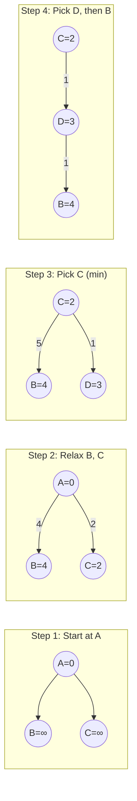

# Graph Algorithms

আগের chapter এ আমরা BFS আর DFS শিখলাম — সেগুলো ছিল graph এর উপরে হাঁটা। এবার আসবো আসল problem solving এ। Shortest path বের করা, dependency অনুযায়ী task arrange করা, সবচেয়ে কম খরচে সব node কে connect করা — এই সবের জন্য দরকার আলাদা আলাদা algorithm।

এই chapter এ আমরা শিখবো — Dijkstra, Bellman-Ford, Floyd-Warshall, Topological Sort, আর Minimum Spanning Tree। প্রতিটা algorithm এর নিজস্ব use case আছে — কোনটা কখন ব্যবহার করবে সেটাই আসল জ্ঞান।

## Shortest Path — কেন এতগুলো Algorithm?

একটা node থেকে অন্য node এ যাওয়ার সবচেয়ে ছোট path খুঁজছো — এটাই shortest path problem। কিন্তু একাধিক algorithm কেন? কারণ graph এর উপর নির্ভর করে আলাদা algorithm দরকার।

| Algorithm | Weight | Use Case | Time Complexity |
|-----------|--------|----------|-----------------|
| **BFS** | Unweighted | সব edge এর weight সমান | $O(V + E)$ |
| **Dijkstra** | Non-negative | সব weight positive বা zero | $O((V + E) \log V)$ |
| **Bellman-Ford** | Negative OK | Negative edge আছে | $O(V \cdot E)$ |
| **Floyd-Warshall** | Negative OK | সব pair এর shortest path | $O(V^3)$ |

> [!tip] কোনটা কখন
> Weight না থাকলে BFS। Weight আছে কিন্তু সব positive — Dijkstra। Negative weight আছে — Bellman-Ford। সব node থেকে সব node এর distance দরকার — Floyd-Warshall।

## Dijkstra's Algorithm

Dijkstra হলো single-source shortest path algorithm — একটা source থেকে বাকি সব node এর shortest distance বের করে। শর্ত হলো সব edge এর weight non-negative হতে হবে।

**Idea:** একটা priority queue (min-heap) রাখো। সবসময় সবচেয়ে কম distance এর node বের করো, process করো, তার neighbor দের distance update করো। যে node একবার process হয়ে গেলে, তার distance আর কখনো change হবে না।



Dijkstra একদম greedy — সবসময় current সবচেয়ে কম distance এর node pick করে। যেহেতু সব weight positive, একবার যে node এর distance final হয়ে গেছে, সেটা আর কমতে পারে না।

নিচের কোডে `heapq` দিয়ে min-heap বানানো হয়েছে। Heap এ `(distance, node)` tuple রাখা হয় — যাতে distance অনুযায়ী sort হয়। প্রতিবার সবচেয়ে কম distance এর node বের হয়, তার neighbor দের distance relax করা হয়। `dist` array তে সব node এর shortest distance জমা থাকে।

```python
import heapq

def dijkstra(graph, start, n):
    dist = [float('inf')] * n
    dist[start] = 0
    heap = [(0, start)]

    while heap:
        d, node = heapq.heappop(heap)

        if d > dist[node]:
            continue

        for neighbor, weight in graph[node]:
            new_dist = d + weight
            if new_dist < dist[neighbor]:
                dist[neighbor] = new_dist
                heapq.heappush(heap, (new_dist, neighbor))

    return dist

graph = {0: [(1, 4), (2, 2)], 1: [(3, 1)], 2: [(1, 5), (3, 1)], 3: []}
print(dijkstra(graph, 0, 4))
```

Output: `[0, 3, 2, 3]`। A থেকে A = 0, C এর shortest = 2, B এর shortest = 3 (A→C→...→B না, A→...→B path এ), D = 3। খেয়াল করো সরাসরি A→B = 4, কিন্তু A→C→D→... path এ কম হতে পারে।

> [!danger] Dijkstra আর negative weight
> Dijkstra তে negative edge দিলে ভুল উত্তর আসবে! কারণ Dijkstra ধরে নেয় একবার final হওয়া distance আর কমবে না। Negative edge থাকলে এই assumption ভেঙে যায়। Negative weight থাকলে Bellman-Ford ব্যবহার করো।

## Bellman-Ford Algorithm

Bellman-Ford Dijkstra এর বড় ভাই — সব কাজ করে, শুধু একটু ধীর। Negative weight handle করতে পারে, আর negative cycle detect করতে পারে।

**Idea:** সব edge কে $V - 1$ বার relax করো। কারণ shortest path এ সর্বোচ্চ $V - 1$ টা edge থাকতে পারে। তার বেশি বার relax করার পরও distance কমলে — negative cycle আছে।

নিচের কোডে প্রতিটা edge কে $V - 1$ বার check করা হয়েছে। যদি কোনো edge relax হয়, distance update হয়। $V - 1$ pass এর পর আরও একবার check করা হয় — কোনো edge এখনও relax হলে negative cycle আছে।

```python
def bellman_ford(edges, n, start):
    dist = [float('inf')] * n
    dist[start] = 0

    for _ in range(n - 1):
        updated = False
        for u, v, w in edges:
            if dist[u] != float('inf') and dist[u] + w < dist[v]:
                dist[v] = dist[u] + w
                updated = True
        if not updated:
            break

    for u, v, w in edges:
        if dist[u] != float('inf') and dist[u] + w < dist[v]:
            return None

    return dist

edges = [(0, 1, 4), (0, 2, 2), (2, 1, -1), (1, 3, 1), (2, 3, 5)]
print(bellman_ford(edges, 4, 0))
```

Output: `[0, 1, 2, 2]`। A=0, C=2, B=1 (A→C→B = 2 + (-1) = 1), D=2 (A→C→B→D = 1 + 1 = 2)। Negative weight (-1) থাকা সত্ত্বেও সঠিক উত্তর পেয়েছি।

> [!note] Early termination optimization
> কোডে `updated` flag ব্যবহার করা হয়েছে। কোনো pass এ কোনো update না হলে loop break করে — time বাঁচে। Best case এ কয়েক pass এই শেষ হয়ে যায়।

## Floyd-Warshall Algorithm

Floyd-Warshall হলো all-pairs shortest path — শুধু একটা source থেকে না, প্রতিটা node থেকে প্রতিটা node এর shortest distance বের করে।

**Idea:** প্রতিটা node কে intermediate হিসেবে ধরো। যদি $i \to k \to j$ পথটা $i \to j$ থেকে ছোট হয়, update করো।

নিচের কোডে তিনটা nested loop আছে। বাইরের loop $k$ — intermediate node। ভেতরের দুটা loop $i$ আর $j$ — source আর destination। `dist[i][j] = min(dist[i][j], dist[i][k] + dist[k][j])` — এই এক লাইনই algorithm এর মূল।

```python
def floyd_warshall(graph, n):
    dist = [[float('inf')] * n for _ in range(n)]

    for i in range(n):
        dist[i][i] = 0

    for u in range(n):
        for v, w in graph[u]:
            dist[u][v] = min(dist[u][v], w)

    for k in range(n):
        for i in range(n):
            for j in range(n):
                if dist[i][k] + dist[k][j] < dist[i][j]:
                    dist[i][j] = dist[i][k] + dist[k][j]

    return dist

graph = {0: [(1, 3), (2, 5)], 1: [(2, 1)], 2: [(0, 2)]}
result = floyd_warshall(graph, 3)
for row in result:
    print(row)
```

Output একটা 3×3 matrix যেখানে `[i][j]` মানে node $i$ থেকে node $j$ এর shortest distance। যেমন `result[0][2]` = 4 (0→1→2 = 3+1)। সরাসরি 0→2 ছিল 5, কিন্তু 1 দিয়ে গেলে 4।

> [!warning] $O(V^3)$ সবসময় চলবে না
> Floyd-Warshall এর complexity $O(V^3)$। $V = 500$ হলে $125 \times 10^6$ operation — TLE হতে পারে। শুধু তখনই ব্যবহার করো যখন সব pair এর distance দরকার আর $V$ ছোট (500 এর কম)।

## Topological Sort

DAG (Directed Acyclic Graph) এ node গুলোকে এমনভাবে সাজানো যায় যেন প্রতিটা edge $(u, v)$ এর জন্য $u$, $v$ এর আগে আসে। এটাই topological sort।

মনে করো course prerequisite — Course A করার আগে Course B করতে হবে। Topological sort বলে দেবে কোন order এ course নিতে হবে।

> [!danger] Cycle থাকলে topological sort সম্ভব না
> DAG তে cycle থাকলে topological sort অসম্ভব। কারণ যদি A এর আগে B দরকার, B এর আগে A দরকার — তাহলে কে আগে আসবে? তাই topological sort করার আগে cycle detection করো।

### Kahn's Algorithm (BFS approach)

Kahn's algorithm এ প্রতিটা node এর **in-degree** (কতগুলো edge এই node এ আসছে) গুনা হয়। In-degree = 0 হলে সেই node queue তে যায়। এক এক করে node বের করে neighbor এর in-degree কমানো হয়।

এখানে `in_degree` array তে প্রতিটা node এর incoming edge count রাখা হয়। যেগুলোর in-degree 0, সেগুলো queue তে যায়। তারপর এক এক করে node বের করে neighbor এর in-degree ১ কমে দেওয়া হয়। সব node process না হলে cycle আছে।

```python
from collections import deque

def topological_sort_kahn(graph, n):
    in_degree = [0] * n
    for u in range(n):
        for v in graph[u]:
            in_degree[v] += 1

    queue = deque([i for i in range(n) if in_degree[i] == 0])
    order = []

    while queue:
        node = queue.popleft()
        order.append(node)

        for neighbor in graph[node]:
            in_degree[neighbor] -= 1
            if in_degree[neighbor] == 0:
                queue.append(neighbor)

    if len(order) != n:
        return None

    return order

graph = {0: [1, 2], 1: [3], 2: [3], 3: []}
print(topological_sort_kahn(graph, 4))
```

Output: `[0, 1, 2, 3]` বা `[0, 2, 1, 3]`। দুটোই valid topological order। 0 সবার আগে, 3 সবার শেষে।

### DFS Approach

DFS দিয়ে topological sort করার উপায় ও আছে। সব neighbor visit করার পর node টাকে একটা stack এ push করো। Stack টা reverse করলেই topological order।

এই কোডে DFS চলার পর node টাকে `stack` এ রাখা হয়। যেহেতু DFS একদম deep পর্যন্ত যায়, সবচেয়ে deep node আগে stack এ যায়। Stack reverse করলে correct order পাওয়া যায়।

```python
def topological_sort_dfs(graph, n):
    visited = set()
    stack = []

    def dfs(node):
        visited.add(node)
        for neighbor in graph[node]:
            if neighbor not in visited:
                dfs(neighbor)
        stack.append(node)

    for node in range(n):
        if node not in visited:
            dfs(node)

    return stack[::-1]

graph = {0: [1, 2], 1: [3], 2: [3], 3: []}
print(topological_sort_dfs(graph, 4))
```

Output: `[0, 2, 1, 3]`। DFS পদ্ধতিতেও same result, শুধু অন্য order এ।

## Minimum Spanning Tree (MST)

MST হলো একটা connected graph এর এমন একটা subgraph যেখানে সব node connected, কোনো cycle নেই, আর total weight সবচেয়ে কম।

মনে করো একটা শহরে সব বাড়িতে ইন্টারনেট পৌঁছাতে হবে। সব রাস্তায় ক্যাবল না পাতিয়ে, সবচেয়ে কম খরচে সব বাড়িতে পৌঁছানোর উপায় — এটাই MST।

দুটো classic algorithm আছে — **Kruskal** আর **Prim**।

### Kruskal's Algorithm

Kruskal এ সব edge কে weight অনুযায়ী sort করো। তারপর এক এক করে edge নাও। যদি সেই edge দুটো আলাদা component কে connect করে, রেখে দাও। একই component এ থাকলে skip (cycle হবে)।

**Union-Find** (Disjoint Set Union) data structure দরকার — কোন কোন node একই component এ আছে সেটা দ্রুত check করার জন্য।

নিচের কোডে `parent` আর `rank` array দিয়ে Union-Find implement করা হয়েছে। `find` function দিয়ে কোনো node এর root parent বের করা হয়। `union` দিয়ে দুটো component merge করা হয়। Edge গুলো sort করে এক এক করে pick করা হয়।

```python
def kruskal(edges, n):
    parent = list(range(n))
    rank = [0] * n

    def find(x):
        if parent[x] != x:
            parent[x] = find(parent[x])
        return parent[x]

    def union(x, y):
        px, py = find(x), find(y)
        if px == py:
            return False
        if rank[px] < rank[py]:
            px, py = py, px
        parent[py] = px
        if rank[px] == rank[py]:
            rank[px] += 1
        return True

    edges.sort(key=lambda e: e[2])
    mst = []
    total = 0

    for u, v, w in edges:
        if union(u, v):
            mst.append((u, v, w))
            total += w

    return mst, total

edges = [(0, 1, 4), (0, 2, 2), (1, 2, 1), (1, 3, 3), (2, 3, 5)]
mst, cost = kruskal(edges, 4)
print(f"MST edges: {mst}")
print(f"Total cost: {cost}")
```

Output: MST edges = `[(1, 2, 1), (0, 2, 2), (1, 3, 3)]`, Total cost = `6`। সবচেয়ে কম weight এর edge গুলো pick হয়েছে, কোনো cycle নেই, সব node connected।

### Prim's Algorithm

Prim এ approach একটু আলাদা — একটা node থেকে শুরু করো, সবসময় minimum weight edge দিয়ে নতুন node add করো। Dijkstra এর মতো priority queue ব্যবহার করা হয়।

এখানে `visited` set দিয়ে track করা হয় কোন কোন node MST তে ঢুকেছে। Heap থেকে সবচেয়ে কম weight এর edge বের হয়। যদি সেই edge এর destination visited না হয়, সেটাকে MST তে যোগ করা হয়।

```python
import heapq

def prim(graph, start, n):
    visited = set()
    heap = [(0, start, -1)]
    mst = []
    total = 0

    while heap and len(visited) < n:
        weight, node, parent = heapq.heappop(heap)

        if node in visited:
            continue
        visited.add(node)
        total += weight

        if parent != -1:
            mst.append((parent, node, weight))

        for neighbor, w in graph[node]:
            if neighbor not in visited:
                heapq.heappush(heap, (w, neighbor, node))

    return mst, total

graph = {0: [(1, 4), (2, 2)], 1: [(0, 4), (2, 1), (3, 3)], 2: [(0, 2), (1, 1), (3, 5)], 3: [(1, 3), (2, 5)]}
mst, cost = prim(graph, 0, 4)
print(f"MST edges: {mst}")
print(f"Total cost: {cost}")
```

Output: Total cost = `6` — Kruskal এর মতোই। Prim আর Kruskal দুটোতেই same MST weight পাওয়া যায় (MST unique হতেও পারে, নাও পারে)।

| Property | Kruskal | Prim |
|----------|---------|------|
| Approach | Edge-based | Node-based |
| Data structure | Union-Find | Priority Queue |
| Best for | Sparse graph | Dense graph |
| Time | $O(E \log E)$ | $O(E \log V)$ |

> [!tip] Kruskal vs Prim
> Sparse graph এ (edge কম) Kruskal ভালো। Dense graph এ (edge বেশি) Prim ভালো। তবে competitive programming এ Kruskal বেশি ব্যবহার হয় কারণ implement করা সহজ।

## Union-Find Deep Dive

Union-Find বা Disjoint Set Union (DSU) শুধু MST তে না — অনেক problem এ দরকার হয়। Dynamic connectivity, finding connected components, cycle detection — সব জায়গায়।

মূল দুটো operation:
- **find(x)** — x এর root parent বের করো
- **union(x, y)** — x আর y এর component merge করো

দুটো optimization ছাড়া এটা ধীর হবে:
- **Path compression** — find করার সময় পথের সব node কে সরাসরি root এ যুক্ত করে দাও
- **Union by rank** — ছোট tree কে বড় tree এর নিচে যোগ করো

এই কোডে `find` function recursive — path compression করছে। `union` function rank অনুযায়ী merge করছে। এই optimization এর সাথে প্রতিটা operation $O(\alpha(V))$ হয় যেখানে $\alpha$ হলো inverse Ackermann function — practical purpose এ $O(1)$ এর মতো।

```python
class UnionFind:
    def __init__(self, n):
        self.parent = list(range(n))
        self.rank = [0] * n
        self.components = n

    def find(self, x):
        if self.parent[x] != x:
            self.parent[x] = self.find(self.parent[x])
        return self.parent[x]

    def union(self, x, y):
        px, py = self.find(x), self.find(y)
        if px == py:
            return False
        if self.rank[px] < self.rank[py]:
            px, py = py, px
        self.parent[py] = px
        if self.rank[px] == self.rank[py]:
            self.rank[px] += 1
        self.components -= 1
        return True

uf = UnionFind(5)
uf.union(0, 1)
uf.union(2, 3)
print(uf.find(0) == uf.find(1))
print(uf.components)
```

Output: `True`, `3`। 0 আর 1 একই component এ, 2 আর 3 একই component এ, 4 একা — মোট ৩টা component।

## Complexity Summary

| Algorithm | Time | Space | Notes |
|-----------|------|-------|-------|
| Dijkstra | $O((V + E) \log V)$ | $O(V)$ | Heap-based |
| Bellman-Ford | $O(V \cdot E)$ | $O(V)$ | Negative weight OK |
| Floyd-Warshall | $O(V^3)$ | $O(V^2)$ | All-pairs |
| Topological Sort | $O(V + E)$ | $O(V)$ | DAG only |
| Kruskal MST | $O(E \log E)$ | $O(V)$ | Sort + Union-Find |
| Prim MST | $O(E \log V)$ | $O(V)$ | Priority Queue |

## Practice Problems

| # | Problem | Difficulty | Concept |
|---|---------|-----------|---------|
| 1 | [LeetCode 743 — Network Delay Time](https://leetcode.com/problems/network-delay-time/) | Medium | Dijkstra |
| 2 | [LeetCode 787 — Cheapest Flights Within K Stops](https://leetcode.com/problems/cheapest-flights-within-k-stops/) | Medium | Bellman-Ford |
| 3 | [LeetCode 210 — Course Schedule II](https://leetcode.com/problems/course-schedule-ii/) | Medium | Topological Sort |
| 4 | [LeetCode 1584 — Min Cost to Connect All Points](https://leetcode.com/problems/min-cost-to-connect-all-points/) | Medium | MST (Prim/Kruskal) |
| 5 | [LeetCode 1631 — Path With Minimum Effort](https://leetcode.com/problems/path-with-minimum-effort/) | Medium | Dijkstra variant |

> [!tip] Practice strategy
> Network Delay Time দিয়ে Dijkstra master করো। Course Schedule II তে topological sort practice করো। Min Cost to Connect All Points এ MST apply করো। এই ৫টা problem solve করলে shortest path, topological sort, আর MST — তিনটাই cover হবে।