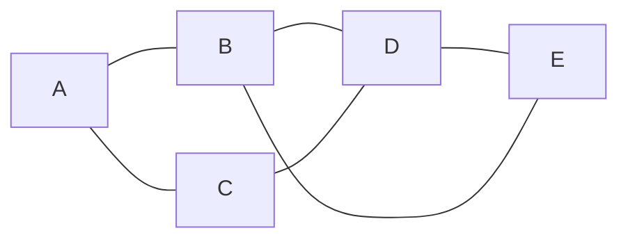
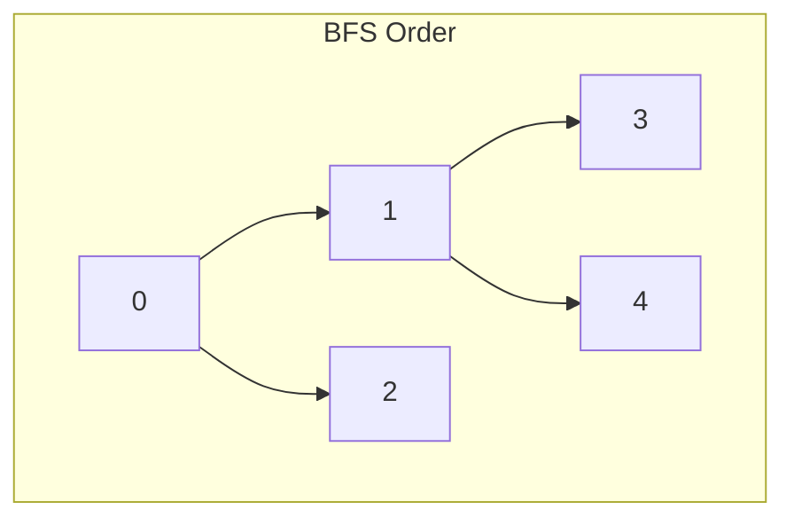
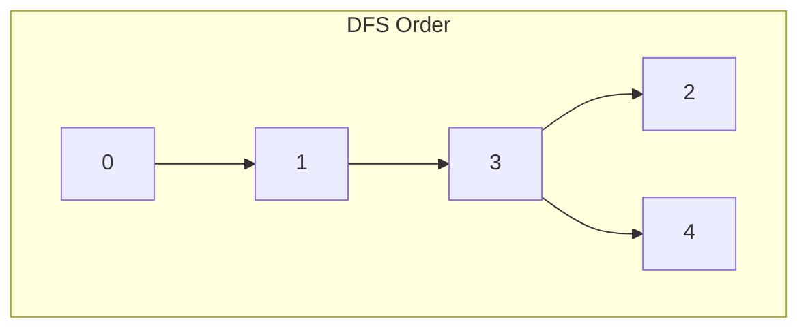

# Graphs — BFS & DFS

Graph হলো এমন একটা data structure যেখানে অনেকগুলো node (বা vertex) আছে, আর সেগুলোর মধ্যে connection (বা edge) আছে। মনে করো Facebook এর friend list — তুমি একজনের সাথে connected, সে আরেকজনের সাথে connected — এটাই একটা graph। Google Maps এর রাস্তার ম্যাপ, কম্পিউটার নেটওয়ার্ক — সবই আসলে graph।

এই chapter এ আমরা শিখবো graph কীভাবে represent করতে হয়, আর দুটো মোস্ট ইম্পর্ট্যান্ট traversal — **BFS** আর **DFS**।

## Graph কী

একটা graph হলো node আর edge এর সংগ্রহ। Node গুলো হলো entity (যেমন শহর, মানুষ, web page), আর edge হলো সেদের মধ্যে সম্পর্ক।



এখানে A, B, C, D, E হলো node। A থেকে B তে যাওয়া যায়, A থেকে C তে যাওয়া যায় — এগুলো হলো edge।

গ্রাফ দুই ধরনের হয়:

| Type | Description | উদাহরণ |
|------|-------------|--------|
| **Undirected** | edge এ দিক নেই — দুইদিকেই যাওয়া যায় | Facebook friendship |
| **Directed** | edge এ দিক আছে — শুধু একদিকে | Twitter follow, web link |

> [!note] Terminology
> Graph এ **V** = vertex (node) সংখ্যা, **E** = edge সংখ্যা। একটা graph এর প্রকার লেখা হয় `G = (V, E)` দিয়ে।

## Graph Represent করার উপায়

Graph কে কোডে দুইভাবে রাখা যায় — **Adjacency List** আর **Adjacency Matrix**। দুটোরই নিজস্ব সুবিধা অসুবিধা আছে।

### Adjacency List

প্রতিটা node এর জন্য একটা list রাখা হয় — সে কোন কোন node এর সাথে connected সেটা। এটাই সবচেয়ে common উপায়।

নিচের কোডে একটা adjacency list বানানো হয়েছে `defaultdict` দিয়ে। প্রতিটা key হলো একটা node, আর value হলো সেই node এর neighbor দের list। এটা memory efficient কারণ শুধু actual edge গুলো ই store হয়।

```python
from collections import defaultdict

graph = defaultdict(list)

edges = [(0, 1), (0, 2), (1, 3), (2, 3), (3, 4), (1, 4)]
for u, v in edges:
    graph[u].append(v)
    graph[v].append(u)

for node in sorted(graph):
    print(f"{node} -> {graph[node]}")
```

Output আসবে: `0 -> [1, 2]`, `1 -> [0, 3, 4]`, ইত্যাদি। প্রতিটা node তার neighbor list দেখাচ্ছে।

### Adjacency Matrix

একটা 2D array তে রাখা হয়। `matrix[i][j] = 1` মানে node `i` থেকে node `j` তে edge আছে। না থাকলে `0`।

এখানে `n` সাইজের একটা matrix বানাইসি, প্রতিটা edge এর জন্য দুই ঘরে `1` বসাইসি। `matrix[u][v] = 1` আর `matrix[v][u] = 1` — কারণ undirected graph।

```python
n = 5
matrix = [[0] * n for _ in range(n)]

edges = [(0, 1), (0, 2), (1, 3), (2, 3), (3, 4), (1, 4)]
for u, v in edges:
    matrix[u][v] = 1
    matrix[v][u] = 1

for row in matrix:
    print(row)
```

Matrix টা দেখতে এমন: `0` থেকে `1` আর `2` তে edge আছে, বাকিগুলোতে নেই। এই approach এ $O(V^2)$ space লাগে।

| Property | Adjacency List | Adjacency Matrix |
|----------|---------------|-----------------|
| Space | $O(V + E)$ | $O(V^2)$ |
| Edge check | $O(degree)$ | $O(1)$ |
| All neighbors | $O(degree)$ | $O(V)$ |
| Best for | Sparse graph | Dense graph |

> [!tip] কোনটা ব্যবহার করবে
> ৯৫% ক্ষেত্রে adjacency list ই best। Real world graph গুলো সাধারণত sparse হয় — মানে edge অনেক কম থাকে। List দিলে memory বাঁচে। Matrix শুধু dense graph এ দরকার হয় যেখানে edge check করতে হয়।

## BFS — Breadth First Search

BFS হলো level-by-level traversal। শুরু করো একটা node থেকে, তার সব neighbor কে visit করো, তারপর সেই neighbor দের neighbor কে — এভাবে এক দম depth বাড়াতে থাকো। মনে করো পানিতে পাথর ফেললে যেমন ripple গোলাকার ছড়ায় — BFS ও ঠিক তেমনি ছড়ায়।

BFS এর জন্য একটা **queue** লাগে। কারণ যে node আগে discover হয়, তাকে আগে process করতে হয় — এটাই FIFO (First In First Out)।

> [!important] BFS এর সবচেয়ে বড় property
> **Unweighted graph এ BFS সবসময় shortest path দেয়।** কারণ BFS level-by-level যায় — যে node সবার আগে reach করা যায়, সেটাই সবচেয়ে কাছের path। এই property টা অনেক problem এ কাজে লাগে।

নিচের কোডে BFS implement করা হয়েছে। `visited` set দিয়ে track করা হয় কোন কোন node visit হয়ে গেছে — যাতে একই node দুবার process না হয়। `queue` তে এক এক করে node ঢোকে আর বের হয়। যখন বের হয়, তার সব neighbor কে check করা হয় — যদি visited না হয়, queue তে push করা হয়।

```python
from collections import deque

def bfs(graph, start):
    visited = set()
    queue = deque([start])
    visited.add(start)
    order = []

    while queue:
        node = queue.popleft()
        order.append(node)

        for neighbor in graph[node]:
            if neighbor not in visited:
                visited.add(neighbor)
                queue.append(neighbor)

    return order

graph = {0: [1, 2], 1: [0, 3, 4], 2: [0, 3], 3: [1, 2, 4], 4: [1, 3]}
print(bfs(graph, 0))
```

Output: `[0, 1, 2, 3, 4]`। আগে 0, তারপর 0 এর neighbor 1 আর 2, তারপর তাদের neighbor 3 আর 4। এটাই level-by-level traversal।

### BFS এ Shortest Path

BFS দিয়ে unweighted graph এ shortest path বের করা যায়। একটা `distance` array রাখলেই হয় — parent node এর distance + 1।

এখানে `dist` dictionary তে প্রতিটা node এর shortest distance রাখা হয়। যখন একটা নতুন node discover হয়, তার distance হয় parent এর distance + 1। BFS শেষে `dist` এ সব node এর shortest distance থাকে।

```python
from collections import deque

def bfs_shortest_path(graph, start, end):
    visited = {start}
    queue = deque([(start, [start])]

    while queue:
        node, path = queue.popleft()

        if node == end:
            return path

        for neighbor in graph[node]:
            if neighbor not in visited:
                visited.add(neighbor)
                queue.append((neighbor, path + [neighbor]))

    return []

graph = {0: [1, 2], 1: [0, 3, 4], 2: [0, 3], 3: [1, 2, 4], 4: [1, 3]}
print(bfs_shortest_path(graph, 0, 4))
```

Output: `[0, 1, 4]` বা `[0, 2, 3, 4]` — যেটায় ২টা step লাগে সেটাই shortest path।

## DFS — Depth First Search

DFS হলো একদম deep পর্যন্ত যাওয়া। যতদূর যাওয়া যায় একটা path এ যাও, তারপর backtrack করে অন্য path এ যাও। মনে করো একটা maze এ ঢুকলে — একটা রাস্তা ধরে একদম শেষ পর্যন্ত যাও, dead end এ গিয়ে পড়লে ফিরে এসো অন্য রাস্তা ধরো।

DFS দুইভাবে করা যায় — **recursion** দিয়ে (সবচেয়ে সহজ), বা **stack** দিয়ে।

নিচের কোডে recursive DFS দেখানো হয়েছে। একটা node এ visit করে সেটাকে `visited` এ যোগ করা হয়, তারপর তার প্রতিটা neighbor এর জন্য আবার DFS call করা হয়। Base case implicit — সব neighbor visited থাকলে recursion আপনা আপনি ফিরে আসে।

```python
def dfs(graph, node, visited=None, order=None):
    if visited is None:
        visited = set()
    if order is None:
        order = []

    visited.add(node)
    order.append(node)

    for neighbor in graph[node]:
        if neighbor not in visited:
            dfs(graph, neighbor, visited, order)

    return order

graph = {0: [1, 2], 1: [0, 3, 4], 2: [0, 3], 3: [1, 2, 4], 4: [1, 3]}
print(dfs(graph, 0))
```

Output: `[0, 1, 3, 2, 4]`। খেয়াল করো — 0 থেকে 1, তারপর 1 থেকে 3, 3 থেকে 2, তারপর 4। একদম deep গিয়ে backtrack করে অন্য রাস্তা।

### Iterative DFS (Stack দিয়ে)

বড় graph এ recursion limit এ আটকে যেতে পারে। তখন stack দিয়ে iterative DFS করা যায়।

এখানে `deque` কে stack হিসেবে ব্যবহার করা হয়েছে (pop from end)। Logic BFS এর মতোই, শুধু queue এর জায়গায় stack।

```python
from collections import deque

def dfs_iterative(graph, start):
    visited = set()
    stack = [start]
    order = []

    while stack:
        node = stack.pop()
        if node in visited:
            continue
        visited.add(node)
        order.append(node)

        for neighbor in reversed(graph[node]):
            if neighbor not in visited:
                stack.append(neighbor)

    return order

graph = {0: [1, 2], 1: [0, 3, 4], 2: [0, 3], 3: [1, 2, 4], 4: [1, 3]}
print(dfs_iterative(graph, 0))
```

Stack থেকে last element pop হয়, তাই deep যাওয়া আগে সেই node টাই process হয়। `reversed()` ব্যবহার করা হয়েছে যাতে visit order recursive DFS এর মতো হয়।

## BFS vs DFS — কখন কোনটা





BFS চলে গোল গোল — level এ level। DFS চলে সোজা নিচে — একটা branch শেষ করে তারপর অন্যটা।

| Property | BFS | DFS |
|----------|-----|-----|
| Data structure | Queue | Stack / Recursion |
| Shortest path (unweighted) | হ্যাঁ | না |
| Memory | $O(w)$, w = max width | $O(h)$, h = max depth |
| Topological sort | না | হ্যাঁ |
| Connected components | হ্যাঁ | হ্যাঁ |
| Cycle detection | হ্যাঁ | হ্যাঁ |

> [!tip] কোনটা কখন
> Shortest path লাগলে BFS। Path খুঁজতে হবে কিন্তা shortest না — DFS। Topological sort লাগলে DFS। Maze বা puzzle solve করতে DFS। Connected components বা flood fill — দুটোই চলবে।

## Connected Components

Disconnected graph এ কিছু node আলাদা অংশে থাকতে পারে। কতগুলো connected component আছে সেটা BFS বা DFS দিয়ে বের করা যায়।

এই কোডে প্রতিটা unvisited node থেকে DFS চালানো হয়। যতবার DFS call করতে হলো, ততগুলো connected component।

```python
def count_components(graph, n):
    visited = set()
    count = 0

    for node in range(n):
        if node not in visited:
            dfs(graph, node, visited)
            count += 1

    return count

graph = {0: [1], 1: [0], 2: [3], 3: [2], 4: []}
print(count_components(graph, 5))
```

Output: `3`। Node 0-1 একটা component, 2-3 আরেকটা, 4 একা আরেকটা।

## Cycle Detection

Graph এ cycle আছে কিনা detect করা খুব important — বিশেষ করে deadlock detection বা dependency resolution এ।

Directed graph এ cycle detection এর জন্য **3-color method** ব্যবহার করা হয়। White = unvisited, Gray = visiting (stack এ আছে), Black = visited (done)। যদি DFS করতে গিয়ে কোনো Gray node এ পৌঁছাই — cycle আছে।

নিচের কোডে `color` array তে প্রতিটা node এর state রাখা হয়। DFS চলাকালীন যদি কোনো neighbor এর color `GRAY` থাকে — মানে সে node বর্তমান recursion path এ আছে — তাহলে cycle আছে।

```python
def has_cycle(graph, n):
    WHITE, GRAY, BLACK = 0, 1, 2
    color = [WHITE] * n

    def dfs(node):
        color[node] = GRAY
        for neighbor in graph[node]:
            if color[neighbor] == GRAY:
                return True
            if color[neighbor] == WHITE and dfs(neighbor):
                return True
        color[node] = BLACK
        return False

    for node in range(n):
        if color[node] == WHITE:
            if dfs(node):
                return True
    return False

graph = {0: [1], 1: [2], 2: [0]}
print(has_cycle(graph, 3))
```

Output: `True`। 0 → 1 → 2 → 0 — এটা একটা cycle।

> [!warning] Undirected graph এ cycle detection আলাদা
> Undirected graph এ cycle detect করতে parent track করতে হয়। যদি কোনো visited neighbor parent না হয়, তবে cycle আছে। Directed আর undirected এর approach আলাদা — গুলিয়ে ফেলবে না।

## Grid Graph — Number of Islands

Grid problem গুলো আসলে graph problem এর ছদ্মবেশ। একটা 2D grid এ প্রতিটা cell হলো একটা node, আর চারদিকের cell (up, down, left, right) হলো neighbor।

Number of Islands হলো classic problem — grid এ কতগুলো '1' এর দ্বীপ আছে গুনতে হবে। এটা মূলত connected components counting।

এই কোডে প্রতিটা cell check করা হয়। যদি '1' পাওয়া যায়, সেই cell থেকে DFS চালিয়ে সব connected '1' কে '0' দিয়ে replace করা হয় (visited হিসেবে)। যতবার DFS call হয়, ততটা island।

```python
def num_islands(grid):
    if not grid:
        return 0

    rows, cols = len(grid), len(grid[0])
    count = 0

    def dfs(r, c):
        if r < 0 or r >= rows or c < 0 or c >= cols or grid[r][c] == '0':
            return
        grid[r][c] = '0'
        dfs(r + 1, c)
        dfs(r - 1, c)
        dfs(r, c + 1)
        dfs(r, c - 1)

    for r in range(rows):
        for c in range(cols):
            if grid[r][c] == '1':
                count += 1
                dfs(r, c)

    return count

grid = [
    ['1', '1', '0', '0', '0'],
    ['1', '1', '0', '0', '0'],
    ['0', '0', '1', '0', '0'],
    ['0', '0', '0', '1', '1'],
]
print(num_islands(grid))
```

Output: `3`। প্রথম দুই row এ বাঁদিকে একটা বড় দ্বীপ, তিনতম row এ মাঝে একটা, শেষ row এ ডানদিকে আরেকটা।

> [!note] Grid এ direction
> Grid এ সাধারণত ৪টা direction থাকে — up, down, left, right। কখনো কখনো diagonal (৮ direction) ও থাকে। Problem statement ভালো করে পড়ে কয়টা direction দরকার সেটা confirm করবে।

## Complexity সারসংক্ষেপ

| Operation | Time | Space |
|-----------|------|-------|
| BFS | $O(V + E)$ | $O(V)$ |
| DFS | $O(V + E)$ | $O(V)$ |
| Connected components | $O(V + E)$ | $O(V)$ |
| Cycle detection | $O(V + E)$ | $O(V)$ |
| Adjacency list build | $O(E)$ | $O(V + E)$ |

> [!danger] Time limit এর কথা মাথায় রাখো
> বড় graph এ BFS/DFS এর complexity $O(V + E)$। যদি $V = 10^5$ আর $E = 10^5$ হয়, তাহলে কোড চলবে $O(10^5)$ — ঠিক আছে। কিন্তু adjacency matrix দিলে $O(V^2) = O(10^{10})$ — TLE! সবসময় adjacency list ব্যবহার করো।

## Practice Problems

| # | Problem | Difficulty | Concept |
|---|---------|-----------|---------|
| 1 | [LeetCode 200 — Number of Islands](https://leetcode.com/problems/number-of-islands/) | Medium | Grid BFS/DFS |
| 2 | [LeetCode 133 — Clone Graph](https://leetcode.com/problems/clone-graph/) | Medium | Graph traversal + HashMap |
| 3 | [LeetCode 207 — Course Schedule](https://leetcode.com/problems/course-schedule/) | Medium | Cycle detection (directed) |
| 4 | [LeetCode 787 — Cheapest Flights Within K Stops](https://leetcode.com/problems/cheapest-flights-within-k-stops/) | Medium | BFS + shortest path |
| 5 | [LeetCode 994 — Rotting Oranges](https://leetcode.com/problems/rotting-oranges/) | Medium | Multi-source BFS |
| 6 | [LeetCode 785 — Is Graph Bipartite](https://leetcode.com/problems/is-graph-bipartite/) | Medium | BFS + 2-coloring |

> [!tip] Practice strategy
> আগে Number of Islands আর Rotting Oranges করো — grid BFS এর জন্য best। তারপর Course Schedule — cycle detection practice এর জন্য। সবশেষে Bipartite। এই ৬টা problem solve করলে BFS/DFS এ ভয় থাকবে না।