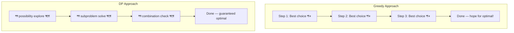
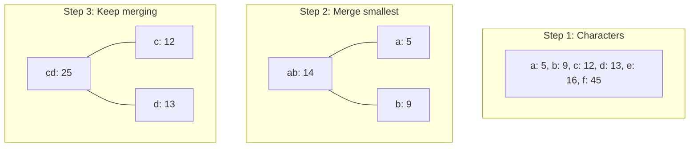

# Greedy Algorithms

Greedy হলো এমন একটা approach যেখানে তুমি প্রতিটা ধাপে সবচেয়ে ভালো choice টা নাও — locally সবচেয়ে optimal। ভবিষ্যতের কথা চিন্তা না করে, এই মুহূর্তে যা সেরা মনে হয় সেটাই করো। মনে করো তুমি একটা buffet এ আছো — যে খাবার টা সবচেয়ে ভালো লাগছে, সেটাই প্লেট এ নাও। পরের dish এর কথা ভাবছো না।

কখনো এই approach কাজ করে, কখনো করে না। মূল বুদ্ধি হলো বোঝা — কোন problem এ greedy চলবে, কোনটায় চলবে না।

## Greedy Choice Property

Greedy তখনই কাজ করে যখন দুটো শর্ত থাকে:

1. **Greedy Choice Property** — locally সেরা choice টা globally ও সেরা হয়। মানে এই মুহূর্তে যা best, সেটা পুরো problem এর জন্য ও best।

2. **Optimal Substructure** — বড় problem এর optimal solution ছোট subproblem এর optimal solution দিয়ে বানানো যায়। ঠিক DP এর মতো।



Greedy দ্রুত, সহজ — কিন্তু সব problem এ সঠিক উত্তর দেবে না। DP ধীর, জটিল — কিন্তু guaranteed optimal।

> [!important] Greedy vs DP
> দুটোতেই optimal substructure আছে। পার্থক্য হলো — greedy তে choice টা "safe" হতে হয় (locally optimal = globally optimal)। DP তে সব choice explore করা হয়। যদি locally best choice globally ও best হয় — greedy। নাহলে DP।

## কখন Greedy কাজ করে — কখন করে না

| Problem | Greedy চলে? | কেন |
|---------|-------------|-----|
| Fractional Knapsack | হ্যাঁ | ভাঙা যায়, best ratio নিলেই optimal |
| 0/1 Knapsack | না | ভাঙা যায় না, locally best globally নাও হতে পারে |
| Activity Selection | হ্যাঁ | Earliest finishing = বেশি activity |
| Coin Change (some) | না | Local best coin global best নয় |
| Huffman Coding | হ্যাঁ | Minimum frequency merge = optimal tree |
| Dijkstra | হ্যাঁ | Min distance node = correct shortest path |

> [!danger] Greedy প্রমাণ করা জরুরি
> শুধু "মনে হয় greedy চলবে" বলে greedy করলে হবে না। Mathematically prove করতে হয় যে greedy choice optimal। নাহলে ভুল উত্তর। যেমন Coin Change এ greedy অনেক সময় ভুল দেয়। নিচে দেখাইছি।

## Fractional Knapsack vs 0/1 Knapsack

এই দুটো problem এর পার্থক্য দিয়ে greedy আর DP এর পার্থক্য একদম clear হয়ে যায়।

**Fractional Knapsack:** ব্যাগের capacity $W$। কিছু item এর weight আর value। Item ভাঙা যায় — অর্ধেক বা এক চতুর্থাংশ নেওয়া যায়। Greedy চলবে — value/weight ratio সবচেয়ে বেশি item আগে নাও।

**0/1 Knapsack:** একই problem, কিন্তু item ভাঙা যায় না — পুরো নেবে বা একদম নেবে না। Greedy চলবে না। DP করতে হবে।

নিচের কোডে item গুলোকে `value/weight` ratio অনুযায়ী sort করা হয়েছে। তারপর এক এক করে capacity পর্যন্ত নেওয়া হয়। শেষের item টা পুরো না হলে ভেঙে যতটুকু যায় নেওয়া হয় — সেটাই "fractional" অংশ।

```python
def fractional_knapsack(items, W):
    items.sort(key=lambda x: x[1] / x[0], reverse=True)

    total_value = 0.0
    remaining = W

    for weight, value in items:
        if remaining <= 0:
            break
        if weight <= remaining:
            total_value += value
            remaining -= weight
        else:
            fraction = remaining / weight
            total_value += value * fraction
            remaining = 0

    return total_value

items = [(10, 60), (20, 100), (30, 120)]
print(fractional_knapsack(items, 50))
```

Output: `240.0`। Item 1 (ratio 6.0), item 2 (ratio 5.0), item 3 এর অর্ধেক (ratio 4.0)। capacity 50 — 10+20+30 এর মধ্যে প্রথম দুটো পুরো, তৃতীয়টার অর্ধেক।

> [!note] কেন greedy এখানে কাজ করে
> Fractional হওয়ায় ভাঙা যায়। যদি ratio সবচেয়ে বেশি item না নিই, পরে অন্য item দিয়ে সেই value পূরণ করতে গেলে বেশি capacity লাগবে। তাই ratio বেশি = সবসময় ভালো। এই যুক্তি টা 0/1 এ চলে না কারণ সেখানে ভাঙা যায় না।

## Activity Selection Problem

$N$ টা activity আছে, প্রতিটার start আর finish time। একটা সময়ে একটাই করা যায়। সর্বোচ্চ কতগুলো activity complete করা যায়?

Greedy choice: যে activity সবার আগে finish হয়, সেটা আগে করো। কারণ যত তাড়াতাড়ি finish করবে, তত বেশি time বাকি থাকবে অন্য activity এর জন্য।

নিচের কোডে activity গুলোকে finish time অনুযায়ী sort করা হয়েছে। প্রথম activity select করা হয়। তারপর প্রতিটা activity check করা হয় — যদি আগের selected activity এর finish time এর পরে start হয়, select করা হয়।

```python
def activity_selection(activities):
    activities.sort(key=lambda x: x[1])

    selected = [activities[0]]
    last_finish = activities[0][1]

    for i in range(1, len(activities)):
        if activities[i][0] >= last_finish:
            selected.append(activities[i])
            last_finish = activities[i][1]

    return selected

activities = [(1, 3), (2, 5), (3, 9), (0, 6), (5, 7), (8, 9), (5, 9)]
result = activity_selection(activities)
print(f"Selected {len(result)} activities: {result}")
```

Output: Selected 3 activities: `[(1, 3), (5, 7), (8, 9)]`। প্রথম activity ৩ এ শেষ, তারপর ৫ থেকে ৭, তারপর ৮ থেকে ৯। কোনো overlap নেই, সর্বোচ্চ ৩টা।

| Greedy Choice | Result |
|---------------|--------|
| Earliest finish time | ✅ Optimal |
| Earliest start time | ❌ ভুল হতে পারে |
| Shortest duration | ❌ ভুল হতে পারে |

> [!tip] কেন earliest finish সঠিক
> Earliest finish time বাছলে বাকি time সবচেয়ে বেশি থাকে — তাই পরের activity select করার সুযোগ সবচেয়ে বেশি। Earliest start বা shortest duration এই guarantee দেয় না।

## Interval Scheduling — Meeting Rooms

Activity selection এর variation। কিছু meeting এর interval দেওয়া আছে। সর্বনিম্ন কতগুলো room দরকার যাতে সব meeting hold করা যায়?

Approach: সব start আর end time কে একসাথে sort করো। Start = +1 room, End = -1 room। Running sum এর maximum ই উত্তর।

এই কোডে সব event কে একটা list এ রাখা হয় — start হলে `(time, 1)`, end হলে `(time, -1)`। Sort করার সময় একই time এ আগে end টা আসবে (কারণ `-1 < 1`)। এরপর running sum করে maximum বের করা হয়।

```python
def min_meeting_rooms(intervals):
    events = []
    for start, end in intervals:
        events.append((start, 1))
        events.append((end, -1))

    events.sort(key=lambda x: (x[0], x[1]))

    current = 0
    max_rooms = 0

    for time, delta in events:
        current += delta
        max_rooms = max(max_rooms, current)

    return max_rooms

intervals = [(0, 30), (5, 10), (15, 20)]
print(min_meeting_rooms(intervals))
```

Output: `2`। প্রথম meeting ০-৩০, দ্বিতীয় ৫-১০ (overlap → ২ room), তৃতীয় ১৫-২০ (overlap → ২ room)। সর্বোচ্চ ২টা room একসাথে দরকার।

## Huffman Coding Concept

Huffman coding হলো lossless data compression — সবচেয়ে কম bit দিয়া ডেটা encode করা। Frequent character কে ছোট code, rare character কে বড় code।

Idea: দুটো minimum frequency character কে merge করো একটা নতুন node এ। এটা বারবার করো যতক্ষণ না একটাই tree বাকি থাকে।



নিচের কোডে `heapq` দিয়ে min-heap বানানো হয়েছে। প্রতিবার দুটো minimum frequency node pop করা হয়, merge করা হয়, আবার heap এ push করা হয়। Heap এ একটাই node বাকি থাকলে শেষ।

```python
import heapq

def huffman_codes(freq):
    heap = [[f, [ch, ""]] for ch, f in freq.items()]
    heapq.heapify(heap)

    while len(heap) > 1:
        lo = heapq.heappop(heap)
        hi = heapq.heappop(heap)

        for pair in lo[1:]:
            pair[1] = '0' + pair[1]
        for pair in hi[1:]:
            pair[1] = '1' + pair[1]

        merged = [lo[0] + hi[0]] + lo[1:] + hi[1:]
        heapq.heappush(heap, merged)

    result = heap[0][1:]
    return {ch: code for ch, code in result}

freq = {'a': 5, 'b': 9, 'c': 12, 'd': 13, 'e': 16, 'f': 45}
print(huffman_codes(freq))
```

Output: প্রতিটা character এর জন্য একটা binary code। `f` (সবচেয়ে frequent) পাবে ছোট code (যেমন "0"), rare character গুলো পাবে বড় code।

> [!note] Huffman coding কেন greedy
> প্রতিটা ধাপে দুটো minimum frequency merge করা হয় — এটাই greedy choice। আর এটা proven যে এভাবে করলে tree টা optimal (সবচেয়ে ছোট total encoding length)।

## Gas Station Problem

একটা circular route এ কিছু gas station আছে। প্রতিটায় কিছু gas পাওয়া যায়, পরের station এ যেতে কিছু খরচ হয়। কোন station থেকে শুরু করলে পুরো circle পূরণ করা যায়?

Greedy insight: যদি total gas ≥ total cost হয়, তবে definitely একটা starting point আছে। একদম শুরু থেকে tank track করো — tank negative হলে সেই পর্যন্ত কোনো station ই valid starting point না। পরের station থেকে আবার শুরু।

এই কোডে দুটা variable track করা হয় — `total` (সব gas আর cost এর difference) আর `tank` (current running balance)। `tank` negative হলে সেই index পর্যন্ত কেউ valid starting point না — পরের index থেকে restart। `total >= 0` হলে উত্তর exists।

```python
def can_complete_circuit(gas, cost):
    total = 0
    tank = 0
    start = 0

    for i in range(len(gas)):
        diff = gas[i] - cost[i]
        total += diff
        tank += diff

        if tank < 0:
            start = i + 1
            tank = 0

    return start if total >= 0 else -1

gas = [1, 2, 3, 4, 5]
cost = [3, 4, 5, 1, 2]
print(can_complete_circuit(gas, cost))
```

Output: `3`। Station 3 থেকে শুরু করলে পুরো circle হয়। tank: 4-3=1, 1+5-4=2, 2+1-5=-2 (নেতিবাচক! restart), আবার শুরু station 3 থেকে যায়।

> [!warning] Gas station proof
> এই greedy এর পেছনে একটা subtle proof আছে। যদি A থেকে B যেতে না পারো (tank < 0), তবে A আর B এর মধ্যে কোনো station থেকে ও B পর্যন্ত যাওয়া যাবে না। কারণ A থেকে যদি tank পজিটিভ থাকত, তবু B পর্যন্ত পৌঁছানো গেল না — মাঝখান থেকে তো আরও কম gas সহ যাওয়া কঠিন।

## Greedy Pattern Summary

| Pattern | Greedy Choice | Problem Example |
|---------|---------------|-----------------|
| **Sorting + pick** | Best ratio / earliest finish | Fractional Knapsack, Activity Selection |
| **Interval merge** | Sort + merge overlapping | Merge Intervals, Meeting Rooms |
| **Two pointers** | Greedy direction | Container With Most Water |
| **Priority Queue** | Always pick min/max | Huffman, Task Scheduler |
| **Event sweep** | Process events in order | Skyline, Meeting Rooms II |

> [!tip] Greedy checklist
> Problem দেখলে আগে জিজ্ঞাস করো: "এই মুহূর্তে সেরা choice টা করলে কি পরের জন্য ও সেরা থাকবে?" যদি উত্তর হ্যাঁ হয় — greedy। যদি "মনে হয় হ্যাঁ কিন্তু নিশ্চিত না" — DP দিয়ে verify করো।

## Practice Problems

| # | Problem | Difficulty | Concept |
|---|---------|-----------|---------|
| 1 | [LeetCode 55 — Jump Game](https://leetcode.com/problems/jump-game/) | Medium | Greedy reach |
| 2 | [LeetCode 134 — Gas Station](https://leetcode.com/problems/gas-station/) | Medium | Greedy circuit |
| 3 | [LeetCode 435 — Non-overlapping Intervals](https://leetcode.com/problems/non-overlapping-intervals/) | Medium | Activity selection |
| 4 | [LeetCode 45 — Jump Game II](https://leetcode.com/problems/jump-game-ii/) | Medium | Greedy BFS-style |

> [!tip] Practice strategy
> Jump Game দিয়ে শুরু করো — greedy এর classic example। Gas Station একটু tricky কিন্তু concept clear হবে। Non-overlapping Intervals তে activity selection apply করো। এই ৪টা problem greedy এর foundation গড়ে তুলবে।