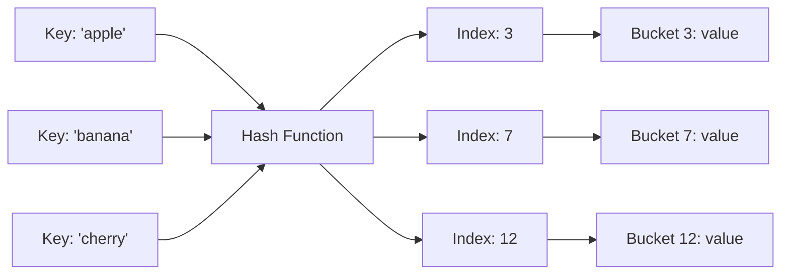

# Hash Tables

তুমি একটা ডিকশনারি খুললে "Apple" লিখে search করো — সরাসরি সেই পৃষ্ঠায় চলে যাও। প্রতিটা পৃষ্ঠা ঘাঁটতে হয় না। Hash table ঠিক এভাবেই কাজ করে — key দিয়ে value $O(1)$ সময়ে খুঁজে পাওয়া যায়।

## Hash Function কী?

Hash function হলো একটা ফাংশন যেটা যেকোনো input কে একটা fixed-size number এ রূপান্তর করে। এই number টাকে hash বা index হিসেবে ব্যবহার করা হয়।

ভাবো এভাবে — তোমার কাছে একটা ম্যাজিক বাক্স আছে। তুমি যেকোনো নাম বললে সে একটা নম্বর দিবে। সেই নম্বর দিয়েই জিনিসটা খুঁজে পাওয়া যায়।

> [!note]
> একটা ভালো hash function এর দুটো বৈশিষ্ট্য: (১) **Deterministic** — একই input সবসময় একই output দেবে, (২) **Uniform distribution** — আলাদা input গুলো ছড়িয়ে ছিটিয়ে থাকবে।



উপরের ডায়াগ্রামে দেখা যাচ্ছে — key গুলো hash function এ গিয়ে index হয়, সেই index এ value store করা থাকে। খোঁজার সময় ও একই hash function ব্যবহার করে index বের করে সরাসরি যাওয়া যায়।

## Hash Map আর Hash Set

| Structure | কী করে | Python Equivalent |
|----------|---------|-------------------|
| **Hash Map** | Key → Value mapping | `dict` |
| **Hash Set** | শুধু unique value store | `set` |

নিচের কোডে দেখা যাচ্ছে কীভাবে Python dict আর set কাজ করে — দুটোই internally hash table ব্যবহার করে:

```python
word_count = {}
for word in ["apple", "banana", "apple", "cherry"]:
    word_count[word] = word_count.get(word, 0) + 1

unique_words = set(["apple", "banana", "apple", "cherry"])
```

উপরের কোডে `word_count` dict প্রতিটা word এর frequency রাখে। `get(word, 0)` মানে — যদি word টা আগে থাকে তার count দাও, নাহলে 0। `unique_words` set এ duplicate স্বয়ংক্রিয়ভাবে বাদ যায়। দুটো অপারেশনই $O(1)$ average।

## Collision — যখন দুটো Key একই Index চায়

Hash function যত ভালোই হোক, দুটো আলাদা key একই index দিতে পারে। একে **collision** বলে। এটা স্বাভাবিক — কারণ keys এর সংখ্যা অসীম, কিন্তু buckets সীমিত।

> [!warning]
> Collision এড়ানো যায় না — কমানো যায়। ভালো hash function + পর্যাপ্ত bucket size = কম collision। কিন্তু collision handle করার জন্য আলাদা strategy লাগে।

### Chaining

প্রতিটা bucket এ একটা linked list রাখা হয়। Collision হলে নতুন element সেই list এ যোগ হয়।

নিচের কোড একটা simple hash map বানায় chaining দিয়ে। প্রতিটা bucket এ একটা list আছে, collision হলে সেই list এ append করা হয়:

```python
class HashMap:
    def __init__(self, size=10):
        self.size = size
        self.table = [[] for _ in range(size)]

    def _hash(self, key):
        return hash(key) % self.size

    def put(self, key, value):
        idx = self._hash(key)
        for pair in self.table[idx]:
            if pair[0] == key:
                pair[1] = value
                return
        self.table[idx].append([key, value])

    def get(self, key):
        idx = self._hash(key)
        for pair in self.table[idx]:
            if pair[0] == key:
                return pair[1]
        return None
```

উপরের কোডে `_hash` method যেকোনো key কে একটা index এ রূপান্তর করে। `put` করার সময় যদি সেই bucket এ আগে থেকেই key থাকে, value update হয়। নাহলে নতুন pair append হয়। `get` করার সময় সেই bucket এর list এ খুঁজে বের করা হয়।

### Open Addressing

Chaining এর বদলে একই array এ খালি জায়গা খুঁজে রাখা হয়। Collision হলে পরের bucket চেক করা হয় (linear probing)।

> [!tip]
> Open addressing এ সব ডেটা একই array তে থাকে — cache-friendly, তাই বাস্তবে অনেক fast। Python dict একটা open addressing variant ব্যবহার করে।

## Load Factor

Load factor হলো — কতটা bucket ভর্তি হয়ে গেছে তার অনুপাত।

$$\text{Load Factor} = \frac{\text{element সংখ্যা}}{\text{bucket সংখ্যা}}$$

যখন load factor একটা threshold (সাধারণত $0.75$) ছাড়িয়ে যায়, hash table তখন নিজেকে resize করে — বড় array বানায় আর সব element পুনরায় hash করে (rehash)।

> [!note]
> Load factor বেশি হলে collision বাড়ে, performance কমে। কম হলে মেমোরি নষ্ট হয়। $0.75$ একটা ভারসাম্য — Python, Java সবাই এটাই ব্যবহার করে।

## Python dict এর ভেতরে

Python 3.7+ এ dict insertion order maintain করে। ভেতরে দুটো array থাকে:

1. **Indices array** — hash থেকে index mapping
2. **Entries array** — actual key-value pair

এটাকে **compact dict** implementation বলে। আগে প্রতিটা entry তে hash, key, value সব থাকতো। এখন শুধু filled entries পাশাপাশি থাকে — cache miss কমে, গতি বাড়ে।

> [!tip]
> Python set ও একই technique ব্যবহার করে — পার্থক্য হলো set এ value থাকে না, শুধু key।

## কখন Hash Table ব্যবহার করবে?

| Use Case | কেন Hash Table |
|----------|----------------|
| **Frequency counting** | Element কতবার আছে — $O(1)$ update |
| **Lookup / membership** | "এই item আছে কিনা" — $O(1)$ check |
| **Two Sum pattern** | Complement খুঁজে বের করা |
| **Deduplication** | Duplicate বাদ দেওয়া |
| **Caching** | Key → result store করে রাখা |

> [!warning]
> Hash table এ element গুলো sorted থাকে না। যদি sorted order লাগে, hash table এর বদলে tree বা sorted array বিবেচনা করো।

## Common Pattern: Frequency Counting

নিচের কোড একটা array তে প্রতিটা element কতবার আছে তা count করে। এটা hash table এর সবচেয়ে common use case:

```python
def count_frequency(arr):
    freq = {}
    for num in arr:
        freq[num] = freq.get(num, 0) + 1
    return freq
```

উপরের কোড পুরো array একবার চষে — $O(n)$ time আর $O(n)$ space। প্রতিটা element এর count $O(1)$ এ update হয় কারণ hash map lookup average $O(1)$।

## Common Pattern: Two Sum

নিচের কোড একটা array থেকে দুটো সংখ্যা খুঁজে বের করে যাদের যোগফল `target`। Hash map দিয়ে complement খোঁজা হয়:

```python
def two_sum(nums, target):
    seen = {}
    for i, num in enumerate(nums):
        complement = target - num
        if complement in seen:
            return [seen[complement], i]
        seen[num] = i
    return []
```

উপরের কোডে প্রতিটা number এর জন্য তার complement (`target - num`) খোঁজা হয়। যদি complement আগে দেখা থাকে, দুটো index ফেরত দেওয়া হয়। নাহলে current number টা `seen` map এ রাখা হয়। পুরোটা $O(n)$ — brute force এর $O(n^2)$ এর চেয়ে অনেক ভালো।

> [!tip]
> Two Sum pattern টা খুব important। এর অনেক variation আছে — Three Sum, Four Sum, Subarray Sum Equals K — সবার মূলে একই idea: hash map দিয়ে complement খোঁজা।

## Open Addressing এর Variants

Open addressing এ collision handle করার কয়েকটা উপায় আছে। মূল পার্থক্য হলো — collision হলে পরবর্তী খালি জায়গা কীভাবে খুঁজবে।

নিচের কোড linear probing দেখায় — collision হলে পরের bucket, তার পরের bucket — এভাবে একটাএকটা করে চেক করা হয়:

```python
class LinearProbingHashMap:
    def __init__(self, capacity=8):
        self.capacity = capacity
        self.keys = [None] * capacity
        self.values = [None] * capacity
        self.size = 0

    def _find_slot(self, key):
        idx = hash(key) % self.capacity
        while self.keys[idx] is not None and self.keys[idx] != key:
            idx = (idx + 1) % self.capacity
        return idx

    def put(self, key, value):
        idx = self._find_slot(key)
        if self.keys[idx] is None:
            self.size += 1
        self.keys[idx] = key
        self.values[idx] = value

    def get(self, key):
        idx = self._find_slot(key)
        if self.keys[idx] is None:
            return None
        return self.values[idx]
```

উপরের কোডে `_find_slot` method একটা key এর জন্য সঠিক bucket খোঁজে। যদি সেই bucket এ অন্য key থাকে (collision!), তাহলে পরের bucket চেক করে — এভাবে একটা একটা করে এগোয়। খালি bucket পেলে সেটাতে রাখা হয় বা দেখা হয় key আছে কিনা।

> [!note]
> Linear probing ছাড়াও আরও আছে — **quadratic probing** ($1^2, 2^2, 3^2$ step এ jump) আর **double hashing** (দ্বিতীয় একটা hash function দিয়ে step size নির্ধারণ)। Python dict বিশেষ একটা open addressing variant ব্যবহার করে।

## Hash Table এর Time Complexity Summary

| Operation | Average Case | Worst Case |
|-----------|-------------|------------|
| **Insert** | $O(1)$ | $O(n)$ |
| **Search** | $O(1)$ | $O(n)$ |
| **Delete** | $O(1)$ | $O(n)$ |

> [!danger]
> Worst case $O(n)$ হয় যখন সব key একই bucket এ চলে যায় (সব collision)। এটা ঘটে খারাপ hash function বা adversarial input এর কারণে। তাই ভালো hash function জরুরি।

## Practice Problems

| Problem | Difficulty | Platform | Approach Hint |
|---------|-----------|----------|---------------|
| **Two Sum** | Easy | LeetCode #1 | Hash map দিয়ে complement খোঁজো |
| **Group Anagrams** | Medium | LeetCode #49 | Sorted string বা character count কে key বানাও |
| **Longest Consecutive Sequence** | Medium | LeetCode #128 | Set বানাও, শুধু sequence এর শুরু থেকে count করো |
| **Valid Anagram** | Easy | LeetCode #242 | দুটো string এর character frequency compare করো |

## Summary

Hash table হলো $O(1)$ lookup এর জাদু। Frequency counting, complement search, deduplication — এসব কাজে hash table অপ্রতিদ্বন্দ্বী। Collision handle করার দুটো উপায় — chaining আর open addressing। Python dict আর set দুটোই production-grade hash table। পরের chapter এ Linked Lists শিখবো — pointer আর node এর জগত।