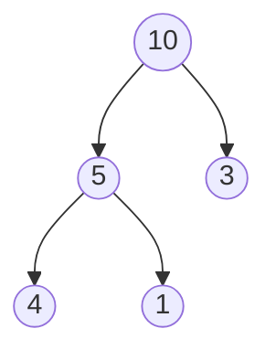
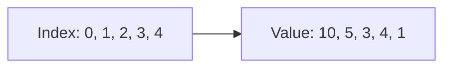

Heap হলো এমন একটা data structure যেটা দেখতে tree এর মতো কিন্তু কাজ করে array এর মতো। ভাবো তুমি একটা priority queue বানাতে চাও — সবসময় সবচেয়ে গুরুত্বপূর্ণ জিনিস টা আগে বের করতে চাও। Heap ঠিক এই কাজটাই করে, আর সেটা $O(\log n)$ সময়ে।

## Binary Heap — Tree নাকি Array?

Binary Heap দেখতে complete binary tree এর মতো, কিন্তু ভেতরে সব কিছু array তে থাকে। আর tree এর একটা special property থাকে।

- **Max-Heap** — parent সবসময় children এর চেয়ে বড় বা সমান
- **Min-Heap** — parent সবসময় children এর চেয়ে ছোট বা সমান



ওপরের ছবিতে একটা max-heap দেখা যাচ্ছে। Root `10` সবচেয়ে বড়, প্রতিটা parent child এর চেয়ে বড়।

কিন্তু মজার ব্যাপার হলো — এই tree টা আসলে array তে থাকে।



Array তে parent-child relationship হলো:
- Parent of index $i$ হলো index $\lfloor \frac{i-1}{2} \rfloor$
- Left child of index $i$ হলো index $2i + 1$
- Right child of index $i$ হলো index $2i + 2$

> [!note]
> Heap তে sibling গুলোর মধ্যে কোনো order নেই। শুধু parent-child relationship টা maintain হতে হবে। এটা BST এর চেয়ে কম strict, তাই operations দ্রুত।

## Heap এর Core Operations

### Insert — উপরে যোগ করো, নিচে থেকে ঠেলে উঠাও

নতুন element কে array এর শেষে যোগ করো। তারপর parent এর সাথে compare করে ঠিক জায়গায় ঠেলে তুলো — একে **sift-up** বা **heapify-up** বলে।

```python
def heap_insert(heap, val):
    heap.append(val)
    i = len(heap) - 1
    while i > 0:
        parent = (i - 1) // 2
        if heap[parent] < heap[i]:
            heap[parent], heap[i] = heap[i], heap[parent]
            i = parent
        else:
            break

heap = []
for v in [10, 5, 3, 4, 1]:
    heap_insert(heap, v)
print(heap)
```

প্রতিটা element append করার পর parent এর সাথে compare করে বড় হলে swap করে। যতক্ষণ না parent বড় হয় বা root এ পৌঁছায়। Time complexity $O(\log n)$।

### Extract Max — Root বের করো, শেষ element কে root বানাও

Max-heap এ root সবসময় সবচেয়ে বড়। সেটা বের করো, তারপর শেষ element কে root এ বসাও, আর children এর সাথে compare করে নিচে নামাও — একে **sift-down** বা **heapify-down** বলে।

```python
def heap_extract_max(heap):
    if not heap:
        return None
    max_val = heap[0]
    heap[0] = heap[-1]
    heap.pop()
    i = 0
    n = len(heap)
    while True:
        largest = i
        left = 2 * i + 1
        right = 2 * i + 2
        if left < n and heap[left] > heap[largest]:
            largest = left
        if right < n and heap[right] > heap[largest]:
            largest = right
        if largest != i:
            heap[i], heap[largest] = heap[largest], heap[i]
            i = largest
        else:
            break
    return max_val

print(heap_extract_max(heap))
print(heap)
```

Root সরিয়ে শেষ element কে root এ বসায়। তারপর children এর বড়টার সাথে swap করে নিচে নামে। যতক্ষণ না children ছোট হয় বা leaf এ পৌঁছায়।

> [!tip]
> Extract এ সবচেয়ে বড় (বা ছোট) element $O(\log n)$ এ পাওয়া যায়। এটাই priority queue এর মূল শক্তি।

## Heapify — পুরো Array কে Heap বানাও

একটা random array কে $O(n)$ সময়ে heap বানানো যায়। শেষের non-leaf node থেকে শুরু করে একে একে sift-down করো।

```python
def build_heap(arr):
    n = len(arr)
    for i in range(n // 2 - 1, -1, -1):
        heapify_down(arr, n, i)

def heapify_down(arr, n, i):
    largest = i
    left = 2 * i + 1
    right = 2 * i + 2
    if left < n and arr[left] > arr[largest]:
        largest = left
    if right < n and arr[right] > arr[largest]:
        largest = right
    if largest != i:
        arr[i], arr[largest] = arr[largest], arr[i]
        heapify_down(arr, n, largest)

arr = [1, 3, 5, 7, 2, 8, 4]
build_heap(arr)
print(arr)
```

Non-leaf node গুলো ($\lfloor \frac{n}{2} \rfloor - 1$ থেকে 0 পর্যন্ত) একে একে heapify করে। Leaf node গুলো আগে থেকেই heap property maintain করে।

> [!note]
> খেয়াল করো — এক এক করে insert করলে $O(n \log n)$ লাগবে। কিন্তু এইভাবে build_heap করলে শুধু $O(n)$ লাগে। এই optimization টা math দিয়ে প্রমাণ করা যায়।

## Python এর heapq Module

Python এ heap ব্যবহার করা খুব সহজ — `heapq` module দিয়ে। তবে মনে রাখবে, Python এর `heapq` min-heap implement করে।

```python
import heapq

heap = []
nums = [5, 3, 8, 1, 9, 2]

for num in nums:
    heapq.heappush(heap, num)

print(heap)

while heap:
    print(heapq.heappop(heap))
```

`heappush` দিয়ে insert, `heappop` দিয়ে সবচেয়ে ছোট টা বের করো। সব কিছু automatically heap property maintain করে।

### Max-Heap বানাতে চাও?

Python এ max-heap direct নেই। Trick হলো — value গুলোকে negative করে দাও।

```python
import heapq

nums = [5, 3, 8, 1, 9, 2]
max_heap = [-n for n in nums]
heapq.heapify(max_heap)

print(-heapq.heappop(max_heap))
print(-heapq.heappop(max_heap))
```

সব value negative করে min-heap বানাও — তাহলে সবচেয়ে বড় negative টা (মানে সবচেয়ে বড় original value) পপ হবে। বের করার সময় আবার `-` দিয়ে positive করে নাও।

> [!tip]
> Interview এ max-heap দরকার হলে negative trick টা ব্যবহাহ করো। অথবা wrapper class লিখে `__lt__` override করো।

## Priority Queue — Heap এর Real World Use

Priority Queue হলো queue এর special version যেখানে সবচেয়ে high priority এর item আগে বের হয়। Heap দিয়ে এটা implement করা হয়।

```python
import heapq

tasks = []
heapq.heappush(tasks, (2, "write code"))
heapq.heappush(tasks, (1, "fix bug"))
heapq.heappush(tasks, (3, "drink coffee"))

while tasks:
    priority, task = heapq.heappop(tasks)
    print(f"Priority {priority}: {task}")
```

Tuple `(priority, task)` push করো। Heap priority অনুযায়ী sort করবে। সবচেয়ে ছোট priority number আগে pop হবে।

> [!warning]
> Priority queue তে tuple push করলে first element দিয়ে compare হয়। যদি first element same হয়, তখন second element compare হবে — যদি second element comparable না হয় (যেমন dict), error আসবে। সেক্ষেত্রে unique counter যোগ করো।

## Top-K Problems — Heap এর Best Use Case

"K টা সবচেয়ে বড়/ছোট element খুঁজে দাও" — এই ধরনের problem এ heap সবচেয়ে ভালো।

```python
import heapq

def top_k_largest(nums, k):
    return heapq.nlargest(k, nums)

def top_k_smallest(nums, k):
    return heapq.nsmallest(k, nums)

nums = [3, 1, 4, 1, 5, 9, 2, 6, 5, 3, 5]
print(top_k_largest(nums, 3))
print(top_k_smallest(nums, 3))
```

`nlargest` আর `nsmallest` directly K টা element দিয়ে দেয়। ভেতরে এটা heap ব্যবহার করে — $O(n \log k)$ time।

### Manual Implementation — কীভাবে কাজ করে

```python
import heapq

def top_k_manual(nums, k):
    min_heap = []
    for num in nums:
        heapq.heappush(min_heap, num)
        if len(min_heap) > k:
            heapq.heappop(min_heap)
    return min_heap

print(top_k_manual([3, 1, 4, 1, 5, 9, 2, 6], 3))
```

K size এর min-heap রাখো। প্রতিটা element push করো, যদি heap এর size K এর বেশি হয়ে যায়, সবচেয়ে ছোট টা pop করো। শেষে heap এ থাকবে সবচেয়ে বড় K টা। এই technique টা খুব important।

> [!danger]
> Top-K এর জন্য পুরো array sort করলে $O(n \log n)$ লাগবে। কিন্তু heap দিয়ে $O(n \log k)$ এ হয়ে যায়। যখন $k \ll n$, তখন এটা বিশাল difference।

## Heap Sort — Heap দিয়ে Sort

Heap Sort হলো Heap এর extension। প্রথমে max-heap বানাও, তারপর বারবার root বের করে শেষে রাখো।

```python
import heapq

def heap_sort(nums):
    heap = nums[:]
    heapq.heapify(heap)
    result = []
    while heap:
        result.append(heapq.heappop(heap))
    return result

print(heap_sort([4, 10, 3, 5, 1]))
```

Min-heap থেকে এক এক করে pop করলে sorted অর্ডারে আসে। Time $O(n \log n)$, space $O(n)$। In-place version এ বেশি efficient কিন্তু Python এ এটাই সহজ।

## Min-Heap vs Max-Heap Comparison

| Feature | Min-Heap | Max-Heap |
|---------|----------|----------|
| Root | সবচেয়ে ছোট | সবচেয়ে বড় |
| Top-K ছোট | সহজ | Trick লাগে |
| Top-K বড় | Trick লাগে | সহজ |
| Python heapq | Direct | Negative trick |
| Priority Queue | Low number = high priority | High number = high priority |

> [!note]
> Top-K smallest খুঁজতে চাইলে max-heap দরকার (K টা রেখে বড় গুলো বাদ দাও)। Top-K largest খুঁজতে চাইলে min-heap দরকার (K টা রেখে ছোট গুলো বাদ দাও)। এটা প্রথমে counter-intuitive মনে হয় কিন্তু ভাবলে ঠিক আছে।

## Practice Problems

| Problem | Difficulty | Platform | Approach Hint |
|---------|-----------|----------|---------------|
| Kth Largest Element | Medium | LeetCode #215 | Min-heap size K |
| Top K Frequent Elements | Medium | LeetCode #347 | Frequency count + heap |
| Find Median from Data Stream | Hard | LeetCode #295 | Two heaps — min + max |
| Merge K Sorted Lists | Hard | LeetCode #23 | Min-heap দিয়ে merge |
| Last Stone Weight | Easy | LeetCode #1046 | Max-heap simulation |

> [!tip]
> "Find median from data stream" খুব সুন্দর problem — দুটা heap ব্যবহার করো। বাম অর্ধেক max-heap এ, ডান অর্ধেক min-heap এ। তাহলে median সবসময় দুই root এর average বা middle root।