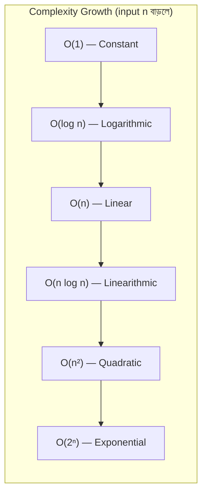
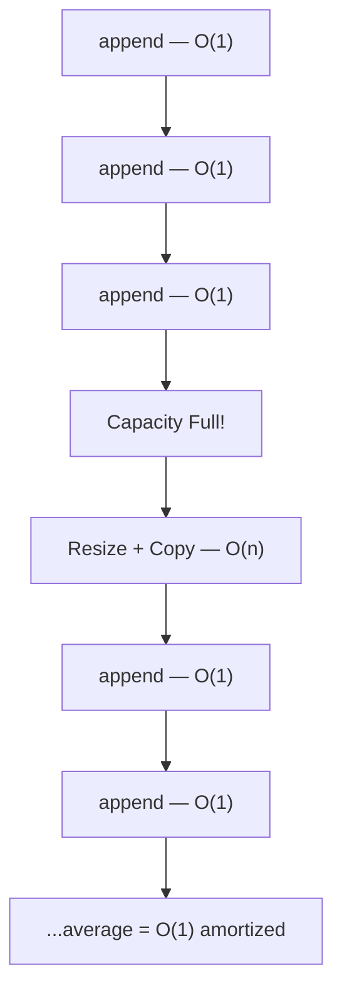

# DSA পরিচিতি ও Big O Notation

তুমি একটা dictionary তে "Apple" শব্দটা খুঁজছো। কী করবে? প্রতিটা পৃষ্ঠা একটা একটা করে উল্টাবে? নাকি A সেকশনে সরাসরি যাবে? এই "কীভাবে দ্রুত কাজ করবো" সেটাই হলো DSA এর মূল কথা।

## DSA আসলে কী?

DSA মানে হলো **Data Structures and Algorithms**। ভেঙে দেখি:

- **Data Structure** — ডেটা কীভাবে সাজিয়ে রাখবে (যেমন array, list, tree, graph)
- **Algorithm** — সেই ডেটা দিয়ে কীভাবে সঠিকভাবে কাজ করবে (যেমন search, sort)

ধরো তোমার কাছে ১০ লাখটা phone number আছে। একটা নির্দিষ্ট number খুঁজতে চাও। যদি এলোমেলো ভাবে রাখা থাকে — তাহলে একটা একটা করে চেক করতে হবে। কিন্তু sorted করে রাখলে binary search করে মাত্র ২০ ধাপেই পেয়ে যাবে। এটাই algorithm এর জাদু।

> [!tip]
> DSA মানে শুধু interview পাস করা না — এটা হলো সোচার ক্ষমতা বাড়ানো। যেকোনো সমস্যা দেখলে মাথায় আসবে: "এটার সবচেয়ে ভালো সমাধান কী?"

## কেন DSA শিখবে?

| কারণ | ব্যাখ্যা |
|------|----------|
| **Interview** | Google, Amazon, Meta — সব বড় company interview এ DSA জিজ্ঞেস করে |
| **Performance** | সঠিক data structure বেছে নিলে প্রোগ্রাম ১০০০x দ্রুত চলতে পারে |
| **Problem Solving** | যেকোনো জটিল সমস্যাকে ভাঙতে শেখায় |
| **Foundation** | AI, ML, Web Dev — সব কিছুর ভিত্তিতে DSA আছে |

> [!note]
> একটা সাধারণ ভুল ধারণা হলো — "আমি তো web developer হবো, DSA দরকার না।" কিন্তু database query optimize করা, API response দ্রুত করা — এসবের পেছনেই DSA কনসেপ্ট কাজ করে।

## Big O Notation কী?

Big O হলো একটা পদ্ধতি যেটা দিয়ে বলা হয় — ইনপুট বড় হলে তোমার অ্যালগরিদম কতটা সময় বা জায়গা নেবে।

সহজ কথায়: ইনপুট $n$ হলে, তোমার কোড $n$ এর সাথে কীভাবে behave করে — সেটাই Big O দিয়ে বোঝায়।

> [!warning]
> Big O বলে worst case। মানে সবচেয়ে খারাপ পরিস্থিতিতে কোড কত সময় নেবে। Average বা best case নয়।



যেমন — $n = 1000$ ধরো। তাহলে:

- $O(1)$ → $1$ step
- $O(\log n)$ → $\approx 10$ steps
- $O(n)$ → $1000$ steps
- $O(n \log n)$ → $\approx 10000$ steps
- $O(n^2)$ → $1000000$ steps
- $O(2^n)$ → সংখ্যাটা এত বড় যে এই পৃথিবীতে হিসাব করা অসম্ভব

> [!tip]
> $O(\log n)$ এত দ্রুত কেন? কারণ প্রতি ধাপে অর্ধেক বাদ দিয়ে দেওয়া হয়। ১০০০ থেকে ৫০০ → ২৫০ → ১২৫ → ... মাত্র ১০ ধাপে শেষ।

## বড় বড় Time Complexity গুলো

### $O(1)$ — Constant Time

ইনপুট যত বড়ই হোক, সময় একই। যেমন array থেকে একটা element পড়া।

নিচের কোডটা দেখি — এটা $O(1)$ এ কাজ করে কারণ array index দিয়ে একসেস করা হয়, $n$ এর উপর নির্ভর করে না:

```python
def get_first(arr):
    return arr[0]
```

উপরের ফাংশনটা array এর সাইজ যাই হোক না কেন — ১০ হোক বা ১০ লাখ — একই সময়ে কাজ করবে। কারণ সে শুধু প্রথম element টা পড়ে ফেরত দেয়।

### $O(n)$ — Linear Time

ইনপুট $n$ হলে $n$ ধাপ লাগবে। যেমন পুরো array একবার চষা।

নিচের কোড একটা array থেকে সবচেয়ে বড় সংখ্যা খুঁজছে। প্রতিটা element চেক করতে হয় বলে $O(n)$ সময় লাগে:

```python
def find_max(arr):
    max_val = arr[0]
    for num in arr:
        if num > max_val:
            max_val = num
    return max_val
```

উপরের ফাংশনে যদি array তে ১০০০টা element থাকে, লুপ ১০০০ বার ঘুরবে। ১০ লাখ থাকলে ১০ লাখ বার। ইনপুট আর সময় সরাসরি proportional।

### $O(n^2)$ — Quadratic Time

দুটো nested loop থাকলে সাধারণত $O(n^2)$ হয়। যেমন bubble sort।

নিচের কোডে দেখা যাচ্ছে — বাইরের লুপ $n$ বার ঘুরে, ভেতরের লুপও প্রতিবার $n$ বার ঘুরে। তাই মোট $n \times n = n^2$ ধাপ:

```python
def has_duplicate(arr):
    for i in range(len(arr)):
        for j in range(i + 1, len(arr)):
            if arr[i] == arr[j]:
                return True
    return False
```

এই কোডে যদি $n = 1000$ হয়, তাহলে comparison হবে $\approx 500000$ বার। $n = 10000$ হলে $50000000$ — দশগুণ বাড়লে কাজ বোঝাই যায়।

### $O(\log n)$ — Logarithmic Time

প্রতি ধাপে অর্ধেক বাদ দিলে $O(\log n)$ হয়। সবচেয়ে ক্লাসিক উদাহরণ — binary search।

এখানে একটা sorted array তে একটা value খোঁজা হচ্ছে। প্রতি ধাপে search space অর্ধেক হয়ে যায়:

```python
def binary_search(arr, target):
    left, right = 0, len(arr) - 1
    while left <= right:
        mid = (left + right) // 2
        if arr[mid] == target:
            return mid
        elif arr[mid] < target:
            left = mid + 1
        else:
            right = mid - 1
    return -1
```

উপরের কোডে যদি array তে ১০ লাখ element থাকে, binary search মাত্র $\approx 20$ ধাপে উত্তর পেয়ে যাবে। কিন্তু linear search করলে লাগতো ১০ লাখ ধাপ। পার্থক্যটা চোখে দেখার মতো।

## Time Complexity Comparison Table

| Complexity | নাম | $n=10$ | $n=100$ | $n=1000$ | উদাহরণ |
|------------|------|--------|---------|----------|---------|
| $O(1)$ | Constant | 1 | 1 | 1 | Array access |
| $O(\log n)$ | Logarithmic | 3 | 7 | 10 | Binary search |
| $O(n)$ | Linear | 10 | 100 | 1000 | Linear search |
| $O(n \log n)$ | Linearithmic | 33 | 664 | 9966 | Merge sort |
| $O(n^2)$ | Quadratic | 100 | 10000 | 1000000 | Bubble sort |
| $O(2^n)$ | Exponential | 1024 | বিশাল | অকল্পনীয় | Fibonacci recursion |

> [!danger]
> Interview এ $O(2^n)$ solution দিলে সরাসরি reject হতে পারো। সবসময় চেষ্টা করবে $O(n^2)$ বা তার নিচে নামানোর।

## Space Complexity

Time complexity যেমন সময় নিয়ে কথা বলে, space complexity ঠিক তেমনি মেমোরি নিয়ে কথা বলে।

একটা অ্যালগরিদম চলার সময় কত extra মেমোরি লাগে — সেটাই space complexity।

নিচের কোড একটা array এর সব element কে একটা নতুন list এ copy করে। তাই extra $O(n)$ জায়গা লাগে:

```python
def copy_arr(arr):
    result = []
    for num in arr:
        result.append(num * 2)
    return result
```

উপরের ফাংশনে একটা নতুন list বানানো হয়েছে যেটার সাইজ $n$। তাই space complexity হলো $O(n)$।

আবার দেখো নিচের কোড — এটা কোনো extra list বানায় না, শুধু দুটো variable ব্যবহার করে। তাই space complexity $O(1)$:

```python
def sum_arr(arr):
    total = 0
    for num in arr:
        total += num
    return total
```

এখানে `total` আর `num` — এই দুটো variable ছাড়া আর কোনো extra মেমোরি লাগে না। ইনপুট যত বড়ই হোক, মেমোরি ব্যবহার fixed।

> [!note]
> অনেক সময় time আর space এর মধ্যে tradeoff করতে হয়। বেশি মেমোরি খরচ করলে কোড দ্রুত চলবে, কম মেমোরি দিলে ধীর হবে। এটাকে **time-space tradeoff** বলে।

## Amortized Analysis কী?

একটা উদাহরণ দিই। Python list এ `append()` করলে সাধারণত $O(1)$ সময় লাগে। কিন্তু যখন list এর capacity ফুলে যায়, তখন নতুন মেমোরি allocate করে পুরো list copy করতে হয় — সেটা $O(n)$।

কিন্তু এই $O(n)$ copy খুব কম হয় (geometric growth এর কারণে)। তাই অনেকগুলো `append()` এর average cost হলো $O(1)$। এটাই **amortized** analysis।



> [!tip]
> Amortized analysis মানে হলো — একটা কাজ বারবার করলে average এ কত খরচ হয়। একটা একটা করে খরচ না দেখে পুরো sequence এর average দেখা।

## কোন Complexity টারগেট করবে?

| Problem Size | Target Complexity | মন্তব্য |
|--------------|-------------------|---------|
| $n \leq 10$ | $O(n!)$, $O(2^n)$ | Brute force চলবে |
| $n \leq 100$ | $O(n^3)$ | Triple loop OK |
| $n \leq 1000$ | $O(n^2)$ | Double loop চলবে |
| $n \leq 10^5$ | $O(n \log n)$ | Sort + scan |
| $n \leq 10^6$ | $O(n)$, $O(\log n)$ | Linear বা binary |
| $n \leq 10^9$ | $O(\log n)$, $O(1)$ | Math বা formula |

> [!tip]
> LeetCode বা Codeforces এ problem দেখলে প্রথমে $n$ এর constraint দেখো। তার থেকে অনুমান করা যায় কোন complexity লাগবে। এটাকে **complexity guessing** বলে।

## Practice Problems

| Problem | Difficulty | Platform | Approach Hint |
|---------|-----------|----------|---------------|
| **Two Sum** | Easy | LeetCode #1 | Hash map দিয়ে complement খোঁজো |
| **Find the Duplicate Number** | Medium | LeetCode #287 | Floyd's cycle detection বা binary search on value range |
| **Counting Bits** | Easy | LeetCode #338 | $O(n)$ — প্রতিটা number এর bit count DP দিয়ে |
| **Kth Largest Element** | Medium | LeetCode #215 | Quickselect $O(n)$ average বা heap $O(n \log k)$ |
| **Find First and Last Position** | Medium | LeetCode #34 | Binary search দুইবার — leftmost আর rightmost |

## Summary

DSA হলো সঠিক data structure আর দ্রুত algorithm বেছে নেওয়ার বিদ্যা। Big O notation আমাদের বলে কোড কতটা দ্রুত বা কত মেমোরি লাগবে। সবসময় লক্ষ্য রাখবে — complexity যত কম, তত ভালো। পরের chapter এ Arrays & Strings নিয়ে ডিটেইলস শিখবো।