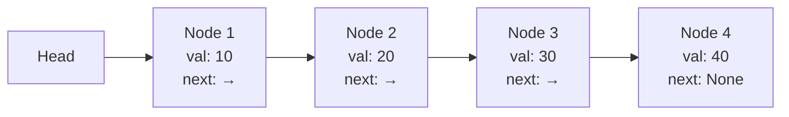
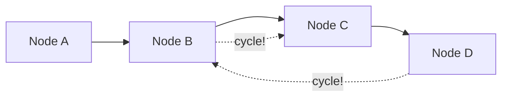

# Linked Lists

ধরো তুমি একটা ট্রেজার হান্ট খেলছো। প্রতিটা ক্লু তে লেখা আছে "পরবর্তী ক্লু কোথায়"। তুমি একটা থেকে শুরু করে পরেরটায় যাচ্ছো, তারপর তার পরেরটায়। এটাই Linked List — প্রতিটা node তে ডেটা আছে আর পরের node এর address আছে।

## Linked List কী?

Linked list হলো এমন একটা data structure যেখানে প্রতিটা element (যাকে **node** বলে) দুটি জিনিস ধরে রাখে: একটা value আর পরের node এর reference (pointer)।

Array আর linked list এর মূল পার্থক্য — array তে element গুলো পাশাপাশি মেমোরিতে থাকে, কিন্তু linked list এ node গুলো যেকোনো জায়গায় ছড়িয়ে থাকতে পারে। পরের node খুঁজতে হলে current node এর pointer follow করতে হয়।



> [!note]
> Linked list এর সবচেয়ে বড় সুবিধা — insertion আর deletion $O(1)$ (যদি node এর position জানা থাকে)। কারণ কোনো element shift করতে হয় না, শুধু pointer change করলেই হয়।

## Array vs Linked List

| Feature | Array | Linked List |
|---------|-------|-------------|
| Access | $O(1)$ — index দিয়ে | $O(n)$ — শুরু থেকে traverse |
| Insertion (end) | Amortized $O(1)$ | $O(1)$ — যদি tail pointer থাকে |
| Insertion (middle) | $O(n)$ — shift করতে হয় | $O(1)$ — pointer change |
| Deletion (middle) | $O(n)$ | $O(1)$ |
| Memory | Contiguous | Scattered, extra pointer overhead |
| Cache friendly | হ্যাঁ | না |

> [!tip]
> Random access দরকার হলে array, কিন্তু বারবার insertion/deletion মাঝখানে হলে linked list ভালো।

## Singly Linked List

Singly linked list এ প্রতিটা node শুধু পরের node এর pointer রাখে। পেছনে যাওয়া যায় না।

নিচের কোড একটা singly linked list node আর বেসিক operations দেখায় — traversal, insertion, deletion সব এক জায়গায়:

```python
class ListNode:
    def __init__(self, val=0, next=None):
        self.val = val
        self.next = next

def traverse(head):
    curr = head
    while curr:
        print(curr.val)
        curr = curr.next

def insert_at_head(head, val):
    new_node = ListNode(val)
    new_node.next = head
    return new_node

def delete_by_value(head, target):
    dummy = ListNode(0, head)
    curr = dummy
    while curr.next:
        if curr.next.val == target:
            curr.next = curr.next.next
            break
        curr = curr.next
    return dummy.next
```

উপরের কোডে `ListNode` class একটা node কে represent করে — `val` আর `next`। `traverse` শুরু থেকে শেষ পর্যন্ত সব node এর value print করে। `insert_at_head` নতুন node বানিয়ে তাকে head বানায়। `delete_by_value` একটা dummy node ব্যবহার করে deletion handle করে — এটা একটা important pattern যা নিচে আলোচনা করা হয়েছে।

## Doubly Linked List

Doubly linked list এ প্রতিটা node দুটো pointer রাখে — `prev` আর `next`। দুই দিকেই traverse করা যায়।

নিচের কোড একটা doubly linked list node দেখায়। প্রতিটা node এ আগের আর পরের দুটোরই pointer থাকে:

```python
class DoublyListNode:
    def __init__(self, val=0, prev=None, next=None):
        self.val = val
        self.prev = prev
        self.next = next
```

উপরের node এ `prev` pointer থাকায় পেছনে যাওয়া যায়। Deletion সহজ — কারণ মাঝখানের একটা node ডিলিট করতে হলে শুধু তার আগের আর পরের node এর pointer update করলেই হয়। singly list এ এটা করতে গেলে আগের node খুঁজে বের করতে হতো।

> [!note]
> Doubly linked list এ extra pointer থাকে বলে প্রতিটা node এ সামান্য বেশি মেমোরি লাগে। কিন্তু bidirectional traversal আর সহজ deletion এর সুবিধা পাওয়া যায়।

## Fast & Slow Pointer (Tortoise-Hare)

এটা linked list এর সবচেয়ে famous technique। দুটো pointer — একটা ধীরে (1 step), একটা দ্রুত (2 step) চলে। Cycle detect করা, middle find করা — এসবে দারুণ কাজে লাগে।



নিচের কোড cycle detection করে। Slow pointer 1 step, fast pointer 2 step চলে। যদি cycle থাকে, fast pointer একসময় slow pointer কে ধরে ফেলবে:

```python
def has_cycle(head):
    slow = fast = head
    while fast and fast.next:
        slow = slow.next
        fast = fast.next.next
        if slow == fast:
            return True
    return False
```

উপরের কোডে slow আর fast দুজন শুরু করে। slow এক ধাপ, fast দুই ধাপ এগোয়। যদি linked list এ cycle থাকে, তাহলে fast একসময় slow কে ধরবে (কারণ প্রতি ধাপে তাদের দূরত্ব 1 করে কমছে)। cycle না থাকলে fast `None` এ পৌঁছে loop শেষ হবে।

> [!tip]
> একই technique দিয়ে linked list এর middle find করা যায় — fast শেষে পৌঁছালে slow মাঝখানে থাকবে। Cycle এর শুরুর node খুঁজতেও এটাই ব্যবহার হয়।

## Linked List Reverse

Linked list কে reverse করা একটা classic interview problem। মূল idea — প্রতিটা node এর `next` pointer কে উল্টো দিকে ঘোরানো।

নিচের কোড একটা singly linked list কে iterative ভাবে reverse করে। তিনটা pointer ব্যবহার করা হয় — `prev`, `curr`, `nxt`:

```python
def reverse_list(head):
    prev = None
    curr = head
    while curr:
        nxt = curr.next
        curr.next = prev
        prev = curr
        curr = nxt
    return prev
```

উপরের কোডে প্রতি ধাপে তিনটা কাজ হয়: (১) `nxt` এ পরের node save করা, (২) current node এর pointer পেছনের দিকে ঘোরানো, (৩) `prev` আর `curr` এক ধাপ সামনে নেওয়া। শেষে `prev` হয়ে যায় নতুন head। পুরোটা $O(n)$ time আর $O(1)$ space।

## Dummy Node Technique

Linked list problem এ একটা common সমস্যা হলো — head node নিজেই change হতে পারে (যেমন deletion, merge)। এটা handle করা কঠিন। সমাধান হলো একটা **dummy node** বানিয়ে সেটার `next` কে head এ set করা। শেষে `dummy.next` return করা।

নিচের কোড দুটো sorted linked list কে merge করে। dummy node ব্যবহার করে merge করা অনেক সহজ হয়ে যায়:

```python
def merge_two_lists(l1, l2):
    dummy = ListNode()
    tail = dummy
    while l1 and l2:
        if l1.val <= l2.val:
            tail.next = l1
            l1 = l1.next
        else:
            tail.next = l2
            l2 = l2.next
        tail = tail.next
    tail.next = l1 if l1 else l2
    return dummy.next
```

উপরের কোডে `dummy` node বানানো হয়েছে যার `next` শুরুতে `None`। দুটো list এর head compare করে ছোট টা `tail.next` এ যোগ হয়। সব শেষে যে list এর element বাকি থাকে সেটা directly যুক্ত হয়। `dummy.next` ই হলো merged list এর head।

> [!warning]
> Dummy node ব্যবহার না করলে head এর edge case আলাদাভাবে handle করতে হতো — কোড জটিল হয়ে যেত। Dummy দিলে সব node এর জন্য একই logic চলে।

## Recursive Reverse (Bonus)

Linked list reverse recursively ও করা যায়। আইডিয়া হলো — প্রথম node ছাড়া বাকিটা reverse করো, তারপর প্রথম node টা শেষে যোগ করো।

নিচের কোড recursively linked list reverse করে। base case হলো — empty বা single node list তে কিছু করতে হয় না:

```python
def reverse_recursive(head):
    if not head or not head.next:
        return head
    reversed_tail = reverse_recursive(head.next)
    head.next.next = head
    head.next = None
    return reversed_tail
```

উপরের কোডে recursion list এর শেষ পর্যন্ত যায়। শেষ node থেকে ফিরে আসার সময় প্রতিটা node এর pointer উল্টো করা হয়। `head.next.next = head` মানে — পরের node এর pointer কে বর্তমান node এ ঘোরানো। সুন্দর, কিন্তু $O(n)$ recursion stack লাগে।

> [!danger]
> Recursive approach এ $O(n)$ extra space লাগে (call stack)। Interview এ সাধারণত iterative চাওয়া হয় কারণ সেটা $O(1)$ space।

## Practice Problems

| Problem | Difficulty | Platform | Approach Hint |
|---------|-----------|----------|---------------|
| **Reverse Linked List** | Easy | LeetCode #206 | Iterative বা recursive — pointer ঘোরাও |
| **Linked List Cycle** | Easy | LeetCode #141 | Fast-slow pointer (tortoise-hare) |
| **Merge Two Sorted Lists** | Easy | LeetCode #21 | Dummy node + two pointer merge |
| **Remove Nth Node From End** | Medium | LeetCode #19 | Fast pointer N ধাপ আগে পাঠাও, তারপর slow শুরু |
| **Palindrome Linked List** | Medium | LeetCode #234 | Middle খুঁজে দ্বিতীয়ার্ধ reverse, compare করো |

## Summary

Linked list হলো node আর pointer এর শৃঙ্খল। Array থেকে insertion/deletion সহজ, কিন্তু random access ধীর। Fast-slow pointer, dummy node, reverse — এই তিনটা technique দিয়ে interview এর বেশিরভাগ linked list problem সমাধান হয়ে যায়। পরের chapter এ Stacks আর Queues শিখবো — LIFO আর FIFO এর জগত।