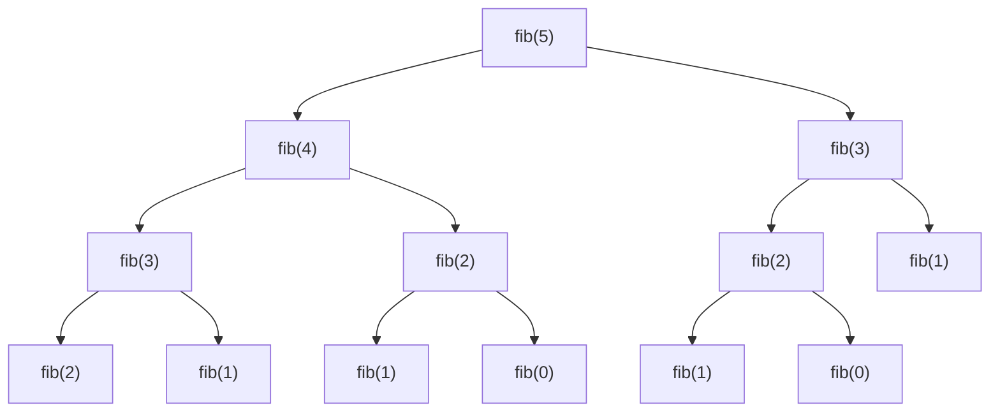

Recursion হলো এমন একটা জিনিস যেটা প্রথমবার শুনলে মাথা ঘুরে যায়, কিন্তু একবার click করলে আর কখনো ভুলবে না। সহজ কথায় — একটা function নিজেকেই call করে। মনে করো তুমি একটা আয়নার সামনে আয়না ধরে আছো, সেই আয়নায় আরেকটা আয়না... এভাবেই recursion চলে।

## Recursion কী?

ভাবো তুমি একটা বড় সমস্যা সমাধান করতে চাও। কিন্তু সমস্যাটা এত বড় যে একবারে করতে পারছো না। কী করবে? সমস্যাটাকে ভাগ করে ছোট ছোট টুকরো করবে, প্রতিটা টুকরো আবার একই ভাবে solve করবে। এটাই recursion।

```python
def countdown(n):
    if n == 0:
        print("Done!")
        return
    print(n)
    countdown(n - 1)

countdown(5)
```

`countdown(5)` call করলে সে `countdown(4)` call করে, সে `countdown(3)`... এভাবে যতক্ষণ না `n == 0` হয়। তখন `return` করে function থেমে যায়।

## Base Case আর Recursive Case — দুটোই দরকার

হারেক recursion এ দুটো জিনিস থাকতেই হবে।

- **Base Case** — কখন থামবে সেটা। এটা না থাকলে infinite loop হবে।
- **Recursive Case** — নিজেকে call করা, কিন্তু ছোট version এ।

> [!danger]
> Base Case ভুলে গেলে — বা ভুল লিখলে — program কখনো থামবে না। Stack overflow হবে আর Python এ `RecursionError: maximum recursion depth exceeded` দেখাবে।

## Factorial — সবচেয়ে ক্লাসিক উদাহরণ

$n! = n \times (n-1) \times (n-2) \times \ldots \times 1$

অর্থাৎ $n! = n \times (n-1)!$। খেয়াল করো — বড় সমস্যা ($n!$) ছোট সমস্যায় ($n-1!$) ভেঙে গেল।

```python
def factorial(n):
    if n <= 1:
        return 1
    return n * factorial(n - 1)

print(factorial(5))
```

`factorial(5)` প্রথমে `factorial(4)` এর উত্তর চায়, সে `factorial(3)` এর... এভাবে `factorial(1)` এ গিয়ে `1` return করে। তারপর সেই উত্তর বাপ বাপ করে উপরে উঠে যায়। Base case হলো `n <= 1` যেখানে আর নিচে নামার দরকার নেই।

## Fibonacci — Recursion এর সৌন্দর্য আর কষ্ট

Fibonacci sequence: $0, 1, 1, 2, 3, 5, 8, 13, 21, \ldots$

প্রতিটা number আগের দুটোর যোগফল: $F(n) = F(n-1) + F(n-2)$

```python
def fibonacci(n):
    if n <= 1:
        return n
    return fibonacci(n - 1) + fibonacci(n - 2)

print(fibonacci(10))
```

কোড টা এত সুন্দর দেখায়! কিন্তু ভেতরে ভেতরে এটা ভয়ংকর slow — $O(2^n)$ time complexity। কারণ একই value বারবার calculate হয়।



ওপরের ছবিতে দেখো — `fib(3)`, `fib(2)`, `fib(1)` কতবার calculate হচ্ছে। একই কাজ বারবার। এই সমস্যা সমাধানের জন্য memoization লাগে।

```python
def fibonacci_memo(n, memo=None):
    if memo is None:
        memo = {}
    if n in memo:
        return memo[n]
    if n <= 1:
        return n
    memo[n] = fibonacci_memo(n - 1, memo) + fibonacci_memo(n - 2, memo)
    return memo[n]

print(fibonacci_memo(50))
```

Memoization এ আগে calculate করা value গুলো `memo` dictionary তে রাখা হয়। পরেরবার একই value চাইলে সরাসরি দিয়ে দেয়। Time complexity নেমে আসে $O(n)$ এ।

> [!tip]
> `fibonacci(50)` without memoization তে তোমার জীবনের শেষ পর্যন্তও calculate হবে না। কিন্তু memoization দিয়ে চোখের পলকে হয়ে যায়।

## Tower of Hanoi — Classic Puzzle

৩ টা rod আর $n$ টা disk। বড় disk কখনো ছোট disk এর উপর বসবে না। সব disk এক রড থেকে আরেক রডে সরাও।

```python
def tower_of_hanoi(n, source, auxiliary, target):
    if n == 1:
        print(f"Move disk 1 from {source} to {target}")
        return
    tower_of_hanoi(n - 1, source, target, auxiliary)
    print(f"Move disk {n} from {source} to {target}")
    tower_of_hanoi(n - 1, auxiliary, source, target)

tower_of_hanoi(3, 'A', 'B', 'C')
```

$n-1$ টা disk কে auxiliary rod এ নাও, তারপর সবচেয়ে বড় disk কে target এ নাও, তারপর $n-1$ টা কে auxiliary থেকে target এ আনো। এত সহজ! Moves লাগে $2^n - 1$ টা।

## Recursion vs Iteration

প্রতিটা recursion কে loop দিয়েও লেখা যায়। কিন্তু কোনটা ভালো?

| বিষয় | Recursion | Iteration |
|-------|-----------|-----------|
| Readability | বেশি (অনেক ক্ষেত্রে) | কম |
| Speed | Slow (function call overhead) | Fast |
| Memory | Stack use করে | Constant |
| Best for | Tree, graph, divide-conquer | Simple loops |

> [!note]
> Recursion সবসময় "better" না। Simple counting বা sum এর জন্য loop লেখাই ভালো। কিন্তু tree traversal বা backtracking এ recursion ছাড়া উপায় নেই।

## কখন Recursion Shine করে

Recursion সবচেয়ে ভালো কাজ করে যখন সমস্যাটা নিজেই recursive structure এ আছে।

- **Tree Traversal** — প্রতিটা subtree নিজেই একটা tree
- **Graph DFS** — প্রতিটা neighbor থেকে আবার DFS
- **Divide and Conquer** — Merge Sort, Quick Sort
- **Backtracking** — Sudoku solver, N-Queens

```python
def sum_list(arr):
    if not arr:
        return 0
    return arr[0] + sum_list(arr[1:])

print(sum_list([1, 2, 3, 4, 5]))
```

List এর প্রথম element বাদে বাকিটা recursively sum করো। Base case হলো empty list যেখানে sum `0`। সুন্দর তাই না? কিন্তু বাস্তবে এখানে `sum(arr)` ব্যবহার করাই ভালো।

## Tail Recursion — Optimization এর জন্য

কিছু language এ Tail Call Optimization (TCO) থাকে — যেখানে recursive call টা function এর শেষ কাজ হলে stack না বাড়িয়ে optimize করা যায়।

```python
def factorial_tail(n, acc=1):
    if n <= 1:
        return acc
    return factorial_tail(n - 1, n * acc)

print(factorial_tail(5))
```

খেয়াল করো — recursive call এর পরে আর কোনো calculation নেই। উত্তর `acc` এ accumulate হয়ে যাচ্ছে। এটাই tail recursion।

> [!warning]
> Python এ TCO নেই। তাই Python এ tail recursion দিয়ে কোনো সুবিধা নেই — stack একই ভাবে বাড়বে। C/C++ বা Scala তে এটা দারুণ optimization।

## Memoization — ভুলে যাওয়া বন্ধ করো

আমরা Fibonacci এ দেখলাম — একই value বারবার calculate হওয়া খুব খারাপ। Memoization এর আইডিয়া সহজ — calculate করা value মনে রাখো।

```python
from functools import lru_cache

@lru_cache(maxsize=None)
def fibonacci_cached(n):
    if n <= 1:
        return n
    return fibonacci_cached(n - 1) + fibonacci_cached(n - 2)

print(fibonacci_cached(100))
```

Python এর `functools.lru_cache` decorator দিয়ে এক লাইনেই memoization হয়ে যায়। `fibonacci_cached(100)` চোখের পলকে calculate হবে।

> [!tip]
> Interview এ recursion problem দিলে প্রথমে simple recursion লেখো, তারপর memoization add করো। এই approach দেখলে interviewer খুশি হবে।

## Call Stack বুঝতে হবে

প্রতি recursive call stack এ একটা frame যোগ করে। যখন base case পৌঁছায়, তখন উপর থেকে frame গুলো pop হয়ে উত্তর ফিরে আসে।

```python
def recursive_sum(n):
    if n == 0:
        return 0
    return n + recursive_sum(n - 1)

print(recursive_sum(5))
```

`recursive_sum(5)` call হলে stack এ পড়বে: `sum(5) → sum(4) → sum(3) → sum(2) → sum(1) → sum(0)`। তারপর `sum(0)` থেকে `0` ফিরবে, তারপর `sum(1)` এ `1 + 0 = 1`, এভাবে উপরে উঠবে।

> [!danger]
> Python এ default recursion limit ১০০০। `sys.setrecursionlimit()` দিয়ে বাড়ানো যায় কিন্তু সাবধান — অনেক বাড়ালে segfault হতে পারে।

## Practice Problems

| Problem | Difficulty | Platform | Approach Hint |
|---------|-----------|----------|---------------|
| Climbing Stairs | Easy | LeetCode #70 | fib(n+1) বা DP |
| Pow(x, n) | Medium | LeetCode #50 | Fast exponentiation — $x^n = x^{n/2} \times x^{n/2}$ |
| Generate Parentheses | Medium | LeetCode #22 | Backtracking with recursion |
| Permutations | Medium | LeetCode #46 | Recursively swap আর build |

> [!note]
> Recursion শেখার সবচেয়ে ভালো উপায় হলো — tree আর backtracking problem solve করা। সেগুলো recursion ছাড়া করা প্রায় অসম্ভব, তাই বাধ্য হয়ে শিখবে।