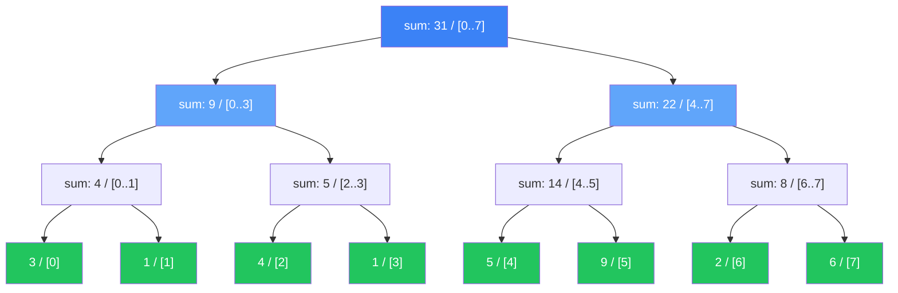

# Segment Tree & BIT

ধরো তোমার কাছে একটা array আছে। বারবার দুই ধরনের query আসে — একটা range এর sum বা min বের করো, আবার একটা value update করো। Naive approach এ sum বের করতে $O(n)$, update করতে $O(1)$। কিন্তু যদি query আর update দুটোই অনেক বেশি হয়, তাহলে $O(n)$ per query অনেক ধীর। Segment Tree আর Fenwick Tree (BIT) এই দুটো operation ই $O(\log n)$ এ করে দেয়।

## কেন Range Query Data Structure

একটা concrete example দিই। Array: $[3, 1, 4, 1, 5, 9, 2, 6]$। Query: "index 2 থেকে 5 পর্যন্ত sum কত?" আরামে বলতে পারবে — $4 + 1 + 5 + 9 = 19$। কিন্তু যদি array তে ১০ লক্ষ element থাকে, আর query আসে ১ লক্ষ বার? প্রতিবার $O(n)$ হলে মোট $10^{11}$ operation — TLE (Time Limit Exceeded)।

| Approach | Build | Query | Update | Space |
|----------|-------|-------|--------|-------|
| Naive array | $O(1)$ | $O(n)$ | $O(1)$ | $O(n)$ |
| Prefix sum | $O(n)$ | $O(1)$ | $O(n)$ | $O(n)$ |
| Segment Tree | $O(n)$ | $O(\log n)$ | $O(\log n)$ | $O(4n)$ |
| Fenwick (BIT) | $O(n)$ | $O(\log n)$ | $O(\log n)$ | $O(n)$ |

> [!note] Prefix sum এর সীমাবদ্ধতা
> Prefix sum query $O(1)$ এ করে, কিন্তু update $O(n)$। যদি update এর পরের query গুলো prefix sum কে আবার rebuild করতে হয়, তাহলে benefit উবে যায়। Segment Tree আর BIT দুটোই dynamically update আর query handle করে $O(\log n)$ এ।

## Segment Tree Structure

Segment Tree হলো একটা binary tree যেখানে প্রতিটা node একটা segment (range) এর information ধরে রাখে। Root পুরো array কে represent করে। প্রতিটা node তার range কে দুইভাগে ভাগ করে — left child আর right child। Leaf node গুলো হলো একটা করে element।



উপরের diagram এ array $[3, 1, 4, 1, 5, 9, 2, 6]$ এর segment tree দেখানো হয়েছে। Root node এ পুরো array এর sum (31) আর range $[0..7]$। সবুজ গুলো leaf node — প্রতিটা একটা element। যেকোনো range query হলে tree এর relevant branch গুলো combine করে answer বের করা যায়।

> [!tip] $4n$ size array
> Segment tree সাধারণত একটা $4n$ size array তে store করা হয়, index 1 থেকে শুরু করে। যেকোনো node $i$ এর left child $2i$, right child $2i + 1$। এতে pointer এর ঝামেলা নেই, array indexing দ্রুত।

## Build, Query, Update

নিচের কোডে segment tree কে array তে store করা হয়েছে। `build` function recursively tree তৈরি করে — leaf এ গিয়ে value রাখে, ফিরে আসার সময় child দুটোর sum parent এ রাখে।

```python
class SegmentTree:
    def __init__(self, data):
        self.n = len(data)
        self.tree = [0] * (4 * self.n)
        self.build(data, 0, 0, self.n - 1)

    def build(self, data, node, left, right):
        if left == right:
            self.tree[node] = data[left]
            return
        mid = (left + right) // 2
        self.build(data, 2 * node + 1, left, mid)
        self.build(data, 2 * node + 2, mid + 1, right)
        self.tree[node] = self.tree[2 * node + 1] + self.tree[2 * node + 2]

    def query(self, node, left, right, ql, qr):
        if qr < left or right < ql:
            return 0
        if ql <= left and right <= qr:
            return self.tree[node]
        mid = (left + right) // 2
        return (self.query(2 * node + 1, left, mid, ql, qr) +
                self.query(2 * node + 2, mid + 1, right, ql, qr))

    def update(self, node, left, right, idx, value):
        if left == right:
            self.tree[node] = value
            return
        mid = (left + right) // 2
        if idx <= mid:
            self.update(2 * node + 1, left, mid, idx, value)
        else:
            self.update(2 * node + 2, mid + 1, right, idx, value)
        self.tree[node] = self.tree[2 * node + 1] + self.tree[2 * node + 2]
```

`query` function এ তিনটা case আছে। প্রথমত — যদি query range আর node range একদম overlap না করে, return 0। দ্বিতীয়ত — যদি node range পুরোপুরি query range এর ভেতরে থাকে, সেই node এর value return করো। তৃতীয়ত — আংশিক overlap হলে দুই child এ query করো আর result combine করো। `update` function leaf পর্যন্ত নেমে value বদলায়, ফিরে আসার সময় path এর সব node update করে।

> [!warning] Recursion depth
> Python এ default recursion limit 1000। যদি array অনেক বড় হয় (যেমন $10^5$ এর বেশি), তাহলে recursion depth exceeded error আসতে পারে। তখন `sys.setrecursionlimit` দিয়ে limit বাড়াতে হবে, বা iterative version ব্যবহার করতে হবে।

## Lazy Propagation Concept

পর্যন্ত যা দেখলাম সেটা point update — একটা index এর value বদলানো। কিন্তু যদি query হয় "index 2 থেকে 6 পর্যন্ত সব value তে 5 যোগ করো" — সেটা range update। Naive ভাবে প্রতিটা index এ update call করলে $O(n \log n)$ হয়ে যায়। Lazy Propagation এই range update কে $O(\log n)$ এ নামিয়ে আনে।

Idea টা হলো — যখন একটা node এর পুরো range update হয়, তখন সেই node এর value আপডেট করা হয় ঠিকই, কিন্তু children গুলোতে update টা defer করে রাখা হয় একটা "lazy" array তে। যখন কোনো child এ actual ভাবে প্রয়োজন হবে, তখন সেই lazy value push down করা হয়।

```python
class LazySegmentTree:
    def __init__(self, data):
        self.n = len(data)
        self.tree = [0] * (4 * self.n)
        self.lazy = [0] * (4 * self.n)
        self.build(data, 0, 0, self.n - 1)

    def push(self, node, left, right):
        if self.lazy[node] != 0:
            self.tree[node] += self.lazy[node] * (right - left + 1)
            if left != right:
                self.lazy[2 * node + 1] += self.lazy[node]
                self.lazy[2 * node + 2] += self.lazy[node]
            self.lazy[node] = 0

    def range_update(self, node, left, right, ul, ur, val):
        self.push(node, left, right)
        if ur < left or right < ul:
            return
        if ul <= left and right <= ur:
            self.lazy[node] += val
            self.push(node, left, right)
            return
        mid = (left + right) // 2
        self.range_update(2 * node + 1, left, mid, ul, ur, val)
        self.range_update(2 * node + 2, mid + 1, right, ul, ur, val)
        self.tree[node] = self.tree[2 * node + 1] + self.tree[2 * node + 2]
```

`push` function টা মূল চাবিকাঠি। এটা lazy value কে current node এ apply করে আর children এ propagate করে। `range_update` প্রতিটা relevant node এ lazy value যোগ করে — পুরো node এর range update এর ভেতরে থাকলে lazy রেখে দেয়, আংশিক overlap হলে children এ নামে।

> [!danger] Lazy Propagation এ ভুল হওয়ার জায়গা
> সবচেয়ে common bug হলো `push` call করতে ভুলে যাওয়া। যেকোনো node access করার আগে `push` call করা বাধ্যতামূলক — নাহলে stale value পাওয়া যাবে। Query আর update দুটোতেই প্রথম step হিসেবে `push` call করতে হয়।

## Fenwick Tree (Binary Indexed Tree)

Fenwick Tree বা BIT হলো Segment Tree এর ছোট, সহজ ভাই। এটা শুধু **prefix sum** operation এর জন্য। কম code, কম memory, constant factor ছোট। আর idea টা খুব elegant — index এর binary representation এর last set bit ব্যবহার করে।

প্রতিটা index $i$ তে responsibility থাকে $i - \text{LSB}(i) + 1$ থেকে $i$ পর্যন্ত element গুলোর। যেখানে $\text{LSB}(i) = i \ \& \ (-i)$। এই LSB operation টাই BIT এর জাদু।

নিচের কোডে `update` function একটা index এ value যোগ করে, আর responsible index গুলোতে propagate করে। `query` function prefix sum বের করে — index থেকে শুরু করে LSB বিয়োগ করতে করতে 0 পর্যন্ত যায়।

```python
class FenwickTree:
    def __init__(self, n):
        self.n = n
        self.bit = [0] * (n + 1)

    def update(self, idx, delta):
        i = idx + 1
        while i <= self.n:
            self.bit[i] += delta
            i += i & (-i)

    def query(self, idx):
        result = 0
        i = idx + 1
        while i > 0:
            result += self.bit[i]
            i -= i & (-i)
        return result

    def range_query(self, left, right):
        return self.query(right) - self.query(left - 1)
```

`i & (-i)` টা last set bit বের করে। `update` এ এটা যোগ হয় — মানে উপরের দিকে responsible index গুলোতে যাওয়া। `query` তে এটা বিয়োগ হয় — মানে নিচের দিকে segment গুলো জোড়া লাগানো। `range_query` হলে দুটো prefix sum এর পার্থক্য — $[l, r]$ এর sum।

> [!tip] BIT এর সৌন্দর্য
> পুরো implementation মাত্র ১০ লাইনের বেশি না। কোনো recursion নেই, কোনো tree structure নেই — শুধু একটা array আর একটা bitwise trick। কিন্তু এটা শুধু commutative operation এর জন্য কাজ করে (sum, XOR, min, max)। যেগুলো commutative না, সেগুলোর জন্য Segment Tree দরকার।

## কখন কোনটা ব্যবহার করবে

| প্রয়োজন | Segment Tree | BIT | মন্তব্য |
|-----------|-------------|-----|---------|
| Range sum + point update | $O(\log n)$ | $O(\log n)$ | BIT সহজ, কম code |
| Range sum + range update | lazy দিয়ে | সম্ভব কিন্তু কঠিন | Segment Tree (lazy) |
| Range min/max | $O(\log n)$ | $O(\log n)$ | BIT এ একটু tricky |
| Arbitrary operation | flexible | commutative ই | Segment Tree |
| Code simplicity | বেশি code | কম code | BIT win |
| Memory | $4n$ | $n$ | BIT অর্ধেক |

> [!note] BIT এ range update
> BIT দিয়ে range update আর range query ও করা যায় — দুটো BIT ব্যবহার করে (difference array concept)। কিন্তু এটা একটু advanced আর less intuitive। যদি range update প্রয়োজন হয়, Segment Tree with lazy বেশি clean।

## Practice Problems

নিচের problem গুলো solve করলে Segment Tree আর BIT দুটোর কনসেপ্ট ই clear হয়ে যাবে:

1. **LeetCode 307 — Range Sum Query - Mutable** — Segment Tree বা BIT দুটোরই basic application
2. **LeetCode 315 — Count of Smaller Numbers After Self** — BIT দিয়ে inversion count variant
3. **Codeforces 52C — Circular RMQ** — range min query + range update, lazy propagation
4. **LeetCode 308 — Range Sum Query 2D - Mutable** — 2D segment tree বা 2D BIT

প্রথমে 307 দিয়ে শুরু করো — সেটা Segment Tree আর BIT দুটোই implement করার সুযোগ দেয়। তারপর 315 তে BIT এর advanced pattern (coordinate compression সহ) শিখবে। 52C তে lazy propagation পাকাপোক্ত করো। শেষে 308 দিয়ে 2D extension concept টা দেখো।