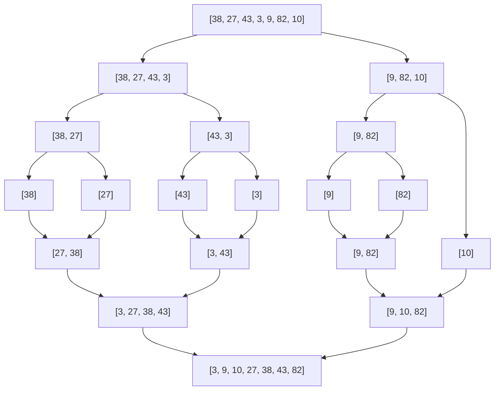
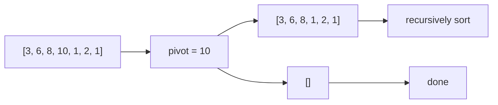

Sorting হলো এমন একটা জিনিস যেটা তুমি প্রায় প্রতিটা প্রোগ্রামে কোনো না কোনো ভাবে ব্যবহার করবে। ভাবো তোমার সামনে এক গাদা এলোমেলো কার্ড — তুমি সেগুলো সাজাতে চাও। কীভাবে সাজাবে? এই প্রশ্নের উত্তরেই জন্ম নিয়েছে দশকের সেরা সেরা algorithms। চলো সব একটা একটা করে দেখি।

## Bubble Sort — সবচেয়ে সহজ, সবচেয়ে খারাপ

ভাবো তুমি পাশাপাশি দুটো bubble দেখছো। বড়টা উপরে উঠে যায় — ঠিক তেমনই প্রতি pass এ সবচেয়ে বড় element টা শেষে চলে যায়।

```python
def bubble_sort(arr):
    n = len(arr)
    for i in range(n):
        for j in range(n - i - 1):
            if arr[j] > arr[j + 1]:
                arr[j], arr[j + 1] = arr[j + 1], arr[j]
    return arr

print(bubble_sort([5, 2, 9, 1, 5, 6]))
```

প্রতি loop এ adjacent pair compare করে swap করে। বড় ভাই ডান দিকে ঠেলে ঠেলে শেষে গিয়ে বসে। এত সহজ হওয়ার কারণেই এটা এত খারাপ — $O(n^2)$ time complexity।

> [!warning]
> Bubble Sort কখনো production এ ব্যবহার করো না। এটা শুধু learning এর জন্য। Real life এ Python এর `sorted()` function ব্যবহার করো — সেটা Timsort ব্যবহার করে যেটা $O(n \log n)$।

## Selection Sort — সবচেয়ে ছোটটা খুঁজে সামনে রাখো

এবার ভাবো তুমি একটা দোকানে আছো। সবচেয়ে সস্তা জিনিস টা খুঁজে বের করো, সামনে রাখো। তারপর বাকিগুলো থেকে আবার সবচেয়ে সস্তা খুঁজে আবার সামনে।

```python
def selection_sort(arr):
    n = len(arr)
    for i in range(n):
        min_idx = i
        for j in range(i + 1, n):
            if arr[j] < arr[min_idx]:
                min_idx = j
        arr[i], arr[min_idx] = arr[min_idx], arr[i]
    return arr

print(selection_sort([64, 25, 12, 22, 11]))
```

প্রতি iteration এ বাকি array থেকে minimum খুঁজে সামনে বসায়। Swap কম হয় ঠিকই কিন্তু compare এর সংখ্যা এখনো $O(n^2)$।

## Insertion Sort — কার্ড সাজানোর মতো

তাসের হাতে যেভাবে কার্ড সাজাও — নতুন কার্ড টা হাতের সাজানো অংশে সঠিক জায়গায় ঢুকিয়ে দাও।

```python
def insertion_sort(arr):
    for i in range(1, len(arr)):
        key = arr[i]
        j = i - 1
        while j >= 0 and arr[j] > key:
            arr[j + 1] = arr[j]
            j -= 1
        arr[j + 1] = key
    return arr

print(insertion_sort([12, 11, 13, 5, 6]))
```

প্রতিটা element কে তার আগের sorted অংশের সঠিক জায়গায় insert করে। Best case এ — মানে array আগে থেকেই sorted — তখন $O(n)$ হয়ে যায়।

> [!tip]
> Small array এর জন্য Insertion Sort দারুণ কাজ করে। Timsort এর মতো hybrid algorithm গুলো ছোট partition এ Insertion Sort ব্যবহার করে।

## Merge Sort — Divide and Conquer এর রাজা

এখানে আসল খেলা শুরু। ভাবো একটা বড় সমস্যা কে অর্ধেক ভাগ করলে, আবার অর্ধেক, আবার অর্ধেক... যতক্ষণ না সমস্যা টা একদম ছোট হয়। তারপর ছোট ছোট সমাধান গুলো জোড়া লাগাও।



ওপরের ছবিতে দেখো কীভাবে array টা ভাগ হয়ে গিয়ে আবার জোড়া লেগে sorted হয়। এখন কোড দেখি।

```python
def merge_sort(arr):
    if len(arr) <= 1:
        return arr

    mid = len(arr) // 2
    left = merge_sort(arr[:mid])
    right = merge_sort(arr[mid:])

    return merge(left, right)

def merge(left, right):
    result = []
    i = j = 0
    while i < len(left) and j < len(right):
        if left[i] <= right[j]:
            result.append(left[i])
            i += 1
        else:
            result.append(right[j])
            j += 1
    result.extend(left[i:])
    result.extend(right[j:])
    return result

print(merge_sort([38, 27, 43, 3, 9, 82, 10]))
```

প্রথমে array কে অর্ধেক করে ভাগ করে। তারপর দুটো sorted half কে merge করে। Merge করার সময় দুটো pointer দিয়ে ছোট টা আগে রাখে। Time complexity $O(n \log n)$ — worst case এও।

> [!note]
> Merge Sort stable — মানে সমান value গুলোর relative order নষ্ট হয় না। তাই linked list sort করার জন্য দারুণ। কিন্তু extra $O(n)$ space লাগে।

## Quick Sort — Pivot এর জাদু

Quick Sort এর আইডিয়া সহজ — একটা pivot বেছে নাও, pivot এর চেয়ে ছোট গুলো বামে, বড় গুলো ডানে রাখো। তারপর দুই পাশ recursively sort করো।



Pivot এর চেয়ে ছোট গুলো বামে গেছে, বড় গুলো ডানে। এবার কোড দেখি।

```python
def quick_sort(arr):
    if len(arr) <= 1:
        return arr

    pivot = arr[len(arr) // 2]
    left = [x for x in arr if x < pivot]
    middle = [x for x in arr if x == pivot]
    right = [x for x in arr if x > pivot]

    return quick_sort(left) + middle + quick_sort(right)

print(quick_sort([3, 6, 8, 10, 1, 2, 1]))
```

Middle element কে pivot ধরে বাকিদের তিন ভাগে ভাগ করে। তারপর left আর right কে recursively sort করে। Average $O(n \log n)$ কিন্তু worst case $O(n^2)$।

> [!danger]
> Worst case এলে যদি pivot সবসময় সবচেয়ে বড় বা ছোট হয় — যেমন already sorted array তে last element pivot ধরলে। Randomized pivot selection এই সমস্যা কমায়।

## Heap Sort — Heap এর শক্তি দেখো

Heap Sort এ প্রথমে array কে max-heap বানায়, তারপর বারবার root থেকে সবচেয়ে বড় টা বের করে শেষে রাখে।

```python
def heapify(arr, n, i):
    largest = i
    left = 2 * i + 1
    right = 2 * i + 2

    if left < n and arr[left] > arr[largest]:
        largest = left
    if right < n and arr[right] > arr[largest]:
        largest = right
    if largest != i:
        arr[i], arr[largest] = arr[largest], arr[i]
        heapify(arr, n, largest)

def heap_sort(arr):
    n = len(arr)
    for i in range(n // 2 - 1, -1, -1):
        heapify(arr, n, i)
    for i in range(n - 1, 0, -1):
        arr[0], arr[i] = arr[i], arr[0]
        heapify(arr, i, 0)
    return arr

print(heap_sort([12, 11, 13, 5, 6, 7]))
```

প্রথমে পুরো array কে max-heap বানায়। তারপর root এর সাথে শেষ element swap করে আবার heapify করে। এভাবে সবচেয়ে বড় গুলো পেছন থেকে সাজে। $O(n \log n)$ সব ক্ষেত্রে, আর $O(1)$ extra space।

## Counting Sort — সংখ্যা গুনো

যখন value গুলোর range ছোট হয়, তখন Counting Sort জাদুর মতো কাজ করে। প্রতিটা value কতবার আছে গুনে রাখো।

```python
def counting_sort(arr):
    if not arr:
        return arr
    max_val = max(arr)
    count = [0] * (max_val + 1)
    for num in arr:
        count[num] += 1
    result = []
    for i, c in enumerate(count):
        result.extend([i] * c)
    return result

print(counting_sort([4, 2, 2, 8, 3, 3, 1]))
```

প্রতিটা number কতবার আছে সেটা count array তে রাখে। তারপর count অনুযায়ী output বানায়। $O(n + k)$ যেখানে $k$ হলো max value।

> [!note]
> Counting Sort তখনই ভালো যখন $k$ বড় না। যেমন 0 থেকে 100 এর মধ্যে numbers হলে দারুণ। কিন্তু value গুলো যদি লাখ লাখ হয় তাহলে memory তে উড়ে যাবে।

## Radix Sort — Digit ধরে ধরে

Radix Sort প্রতিটা digit ধরে ধরে sort করে — প্রথমে units place, তারপর tens, তারপর hundreds...

```python
def radix_sort(arr):
    if not arr:
        return arr
    max_val = max(arr)
    exp = 1
    while max_val // exp > 0:
        arr = counting_sort_by_digit(arr, exp)
        exp *= 10
    return arr

def counting_sort_by_digit(arr, exp):
    n = len(arr)
    output = [0] * n
    count = [0] * 10
    for num in arr:
        digit = (num // exp) % 10
        count[digit] += 1
    for i in range(1, 10):
        count[i] += count[i - 1]
    for i in range(n - 1, -1, -1):
        digit = (arr[i] // exp) % 10
        output[count[digit] - 1] = arr[i]
        count[digit] -= 1
    return output

print(radix_sort([170, 45, 75, 90, 802, 24, 2, 66]))
```

প্রতিটা digit position এর জন্য Counting Sort চালায়। সবচেয়ে ছোট digit থেকে শুরু করে। $O(d \cdot (n + k))$ যেখানে $d$ হলো digit count।

## Comparison Table — কোনটা কখন ব্যবহার করবে

| Algorithm | Time (Avg) | Time (Worst) | Space | Stable | কখন ব্যবহার করবে |
|-----------|-----------|-------------|-------|--------|------------------|
| Bubble Sort | $O(n^2)$ | $O(n^2)$ | $O(1)$ | Yes | শেখার জন্য শুধু |
| Selection Sort | $O(n^2)$ | $O(n^2)$ | $O(1)$ | No | Swap কম করতে হলে |
| Insertion Sort | $O(n^2)$ | $O(n^2)$ | $O(1)$ | Yes | Small বা nearly sorted |
| Merge Sort | $O(n \log n)$ | $O(n \log n)$ | $O(n)$ | Yes | Stable sort দরকার হলে |
| Quick Sort | $O(n \log n)$ | $O(n^2)$ | $O(\log n)$ | No | General purpose, fast |
| Heap Sort | $O(n \log n)$ | $O(n \log n)$ | $O(1)$ | No | Memory tight |
| Counting Sort | $O(n + k)$ | $O(n + k)$ | $O(k)$ | Yes | Small range integers |
| Radix Sort | $O(d(n + k))$ | $O(d(n + k))$ | $O(n + k)$ | Yes | Fixed digit numbers |

> [!tip]
> Interview তে জিজ্ঞেস করলে কোন sorting ব্যবহার করবে — উত্তর হলো "depends"। প্রতিটা algorithm এর নিজস্ব strength আছে। Data type, size, stability requirement দেখে বেছে নাও।

## Python এর Built-in Sort

```python
arr = [5, 2, 8, 1, 9]
arr.sort()
print(arr)

arr.sort(reverse=True)
print(arr)

students = [("Karim", 85), ("Rahim", 92), ("Sadia", 78)]
students.sort(key=lambda x: x[1], reverse=True)
print(students)
```

Python এর `sort()` আর `sorted()` function দুটোই Timsort ব্যবহার করে — যেটা Merge Sort আর Insertion Sort এর hybrid। Real life এ বেশিরভাগ ক্ষেত্রে এটাই ব্যবহার করবে।

`key` parameter দিয়ে custom sorting করতে পারো। Lambda function দিয়ে যেকোনো ভিত্তিতে sort করানো যায়।

## Practice Problems

| Problem | Difficulty | Platform | Approach Hint |
|---------|-----------|----------|---------------|
| Sort an Array | Medium | LeetCode #912 | Merge Sort বা Quick Sort implement করো |
| Sort Colors (Dutch National Flag) | Medium | LeetCode #75 | Three pointers — 0, 1, 2 partition |
| Top K Frequent Elements | Medium | LeetCode #347 | Frequency count + heap বা bucket sort |
| Merge Intervals | Medium | LeetCode #56 | Sort by start, overlapping merge করো |
| Kth Largest Element | Medium | LeetCode #215 | Quickselect বা heap |
| Largest Number | Medium | LeetCode #179 | Custom comparator দিয়ে sort |

> [!note]
> Sorting এর সাথে comparator, partition, আর frequency counting এই তিনটা concept একদম ভালো করে শিখে নাও। Interview এ বারবার আসবে।