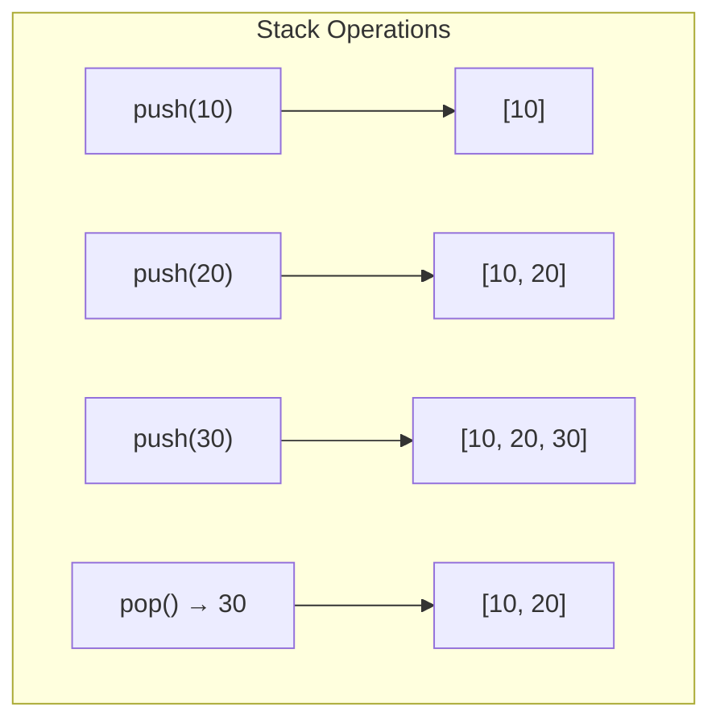
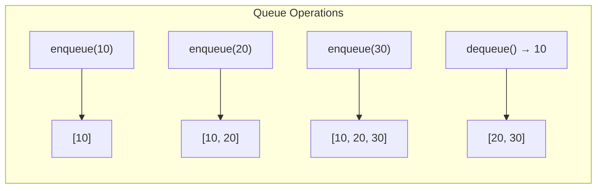
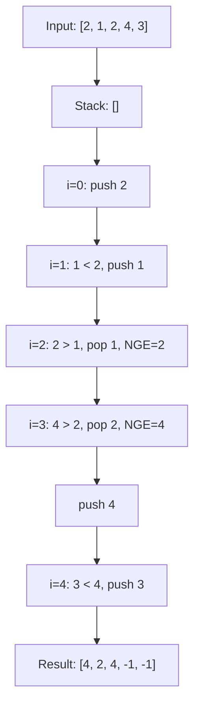

# Stacks & Queues

ধরো তুমি প্লেট একটার উপর আরেকটা করে সাজাচ্ছো। প্লেট তুলতে হলে সবার উপরের টা আগে তুলতে হবে। এটাই Stack — শেষে যা রাখো, প্রথমে সেটাই পাবে। আবার টিকিট এর লাইনে দাঁড়ালে যে আগে দাঁড়ায় সে আগে টিকিট পায় — এটাই Queue।

## Stack — LIFO

Stack হলো **Last In, First Out (LIFO)** structure। শেষে যা রাখা হয়, প্রথমে সেটাই বের হয়।

দুটো প্রধান operation: **push** (উপরে রাখা) আর **pop** (উপর থেকে তোলা)। দুটোই $O(1)$।



> [!note]
> Stack এর real-world analogy — browser এর back button! প্রতিটা page stack এ push হয়, back করলে pop হয়। Undo/redo ও একই ভাবে কাজ করে।

নিচের কোড দেখায় কীভাবে Python list দিয়ে stack implement করা যায়। `append()` হলো push, `pop()` হলো pop — দুটোই $O(1)$:

```python
stack = []
stack.append(10)
stack.append(20)
stack.append(30)
top = stack.pop()
print(top)
print(stack[-1])
```

উপরের কোডে প্রথমে তিনটা value push হয়। `pop()` করলে সবার শেষে রাখা `30` বের হয় — কারণ LIFO। `stack[-1]` দিয়ে top element দেখা যায় without removing (peek operation)।

```dsa-viz
stack
```

## Queue — FIFO

Queue হলো **First In, First Out (FIFO)** structure। যে আগে ঢোকে সে আগে বের হয়।

দুটো প্রধান operation: **enqueue** (পেছনে যোগ) আর **dequeue** (সামনে থেকে বের)।



> [!tip]
> Queue এর real-world analogy — printer queue! যে document আগে পাঠায় সে আগে print হয়। বা restaurant এর order line।

নিচের কোড Python এর `collections.deque` দিয়ে queue implement করে। `deque` list এর চেয়ে fast কারণ সামনে insertion/deletion $O(1)$:

```python
from collections import deque

queue = deque()
queue.append(10)
queue.append(20)
queue.append(30)
front = queue.popleft()
print(front)
```

উপরের কোডে `append()` দিয়ে পেছনে element যোগ হয় (enqueue)। `popleft()` দিয়ে সামনের element বের করা হয় (dequeue) — সব $O(1)$। যদি list ব্যবহার করতে আর `pop(0)` করতে, সেটা $O(n)$ হতো কারণ সব element shift করতে হতো।

> [!warning]
> Python list দিয়ে queue বানাবে না! `pop(0)` হলো $O(n)$ — কারণ বাকি সব element এক ঘর সামনে সরতে হয়। সবসময় `collections.deque` ব্যবহার করো।

```dsa-viz
queue
```

## Deque — দুই দিকেই খোলা

Deque (double-ended queue) হলো এমন queue যেখান থেকে দুই দিক থেকেই insert আর delete করা যায়। Python এর `collections.deque` এটাই করে।

নিচের কোড দেখায় deque এর সব operation — সামনে আর পেছনে দুই দিক থেকেই add আর remove করা যায়:

```python
from collections import deque

dq = deque([1, 2, 3])
dq.appendleft(0)
dq.append(4)
dq.pop()
dq.popleft()
```

উপরের কোডে `appendleft(0)` সামনে যোগ করে, `append(4)` পেছনে যোগ করে। `pop()` পেছন থেকে সরায়, `popleft()` সামনে থেকে সরায়। চারটো operation ই $O(1)$।

| Operation | List | deque |
|-----------|------|-------|
| `append()` (end) | $O(1)$ | $O(1)$ |
| `pop()` (end) | $O(1)$ | $O(1)$ |
| `insert(0, x)` (start) | $O(n)$ | $O(1)$ — `appendleft()` |
| `pop(0)` (start) | $O(n)$ | $O(1)$ — `popleft()` |

## Monotonic Stack — সবচেয়ে Important

Monotonic stack হলো এমন stack যেখানে element গুলো ক্রমানুসারে (increasing বা decreasing) সাজানো থাকে। এটা **Next Greater Element** টাইপের problem এ জাদুর মতো কাজ করে।

ধরো একটা array দেওয়া আছে। প্রতিটা element এর জন্য তার ডান দিকে প্রথম যে element তার চেয়ে বড় — সেটা বের করতে হবে। Brute force এ $O(n^2)$। কিন্তু monotonic stack দিয়ে $O(n)$!



নিচের কোড next greater element বের করে। Stack এ element এর index রাখা হয়। বর্তমান element যদি stack এর top এর চেয়ে বড় হয়, stack থেকে pop করে answer record করা হয়:

```python
def next_greater_elements(nums):
    n = len(nums)
    result = [-1] * n
    stack = []
    for i in range(n):
        while stack and nums[i] > nums[stack[-1]]:
            idx = stack.pop()
            result[idx] = nums[i]
        stack.append(i)
    return result
```

উপরের কোডে stack এ decreasing order এ index থাকে। যখন একটা বড় element আসে, তার চেয়ে ছোট সব element pop হয়ে যায় আর তাদের NGE set হয়। প্রতিটা element সর্বোচ্চ একবার push আর একবার pop হয় — তাই মোট $O(n)$।

> [!tip]
> Monotonic stack এর pattern মনে রাখো: stack সবসময় monotonic (increasing বা decreasing) থাকে। যখনই কোনো element সেই order ভাঙে, pop করে answer record করো।

### Monotonic Stack Variants

| Problem Type | Stack Order | উদাহরণ |
|-------------|-------------|---------|
| Next Greater | Decreasing | NGE, Stock span |
| Next Smaller | Increasing | Sum of subarray minimums |
| Previous Greater | Decreasing (reverse) | Largest rectangle |
| Previous Smaller | Increasing (reverse) | Subarray sum range |

## Stack দিয়ে Valid Parentheses

এটা stack এর আরেকটা classic use case। প্রতিটা opening bracket stack এ push করো, closing bracket এ stack এর top compare করো।

নিচের কোড একটা string এর parentheses valid কিনা চেক করে — stack দিয়ে matching করা হয়:

```python
def is_valid(s):
    stack = []
    pairs = {')': '(', ']': '[', '}': '{'}
    for char in s:
        if char in '([{':
            stack.append(char)
        elif char in pairs:
            if not stack or stack.pop() != pairs[char]:
                return False
    return len(stack) == 0
```

উপরের কোডে opening bracket গুলো stack এ জমা হয়। Closing bracket এ সবচেয়ে সাম্প্রতিক opening বের করে match করা হয়। শেষে stack empty হলে valid। এটা LIFO এর perfect উদাহরণ — সবচেয়ে ভেতরের bracket আগে close হতে হয়।

## Stack দিয়ে DFS (Bonus)

Tree বা graph traverse করার সময় recursion এর বদলে explicit stack ব্যবহার করা যায়। এটাকে iterative DFS বলে।

নিচের কোড একটা binary tree কে iterative DFS দিয়ে traverse করে — stack ব্যবহার করে:

```python
def iterative_dfs(root):
    if not root:
        return []
    result = []
    stack = [root]
    while stack:
        node = stack.pop()
        result.append(node.val)
        if node.right:
            stack.append(node.right)
        if node.left:
            stack.append(node.left)
    return result
```

উপরের কোডে `right` আগে push করা হয় কারণ stack LIFO — তাই `left` পরে push হলে সে আগে pop হবে। এভাবে pre-order traversal পাওয়া যায়। Recursion এর চেয়ে এটা stack overflow এড়ায়।

## Practice Problems

| Problem | Difficulty | Platform | Approach Hint |
|---------|-----------|----------|---------------|
| **Valid Parentheses** | Easy | LeetCode #20 | Stack দিয়ে bracket matching |
| **Daily Temperatures** | Medium | LeetCode #739 | Monotonic decreasing stack — NGE pattern |
| **Min Stack** | Medium | LeetCode #155 | দুটো stack বা এক stack এ min track |
| **Largest Rectangle in Histogram** | Hard | LeetCode #84 | Monotonic stack — width calculate করো |
| **Sliding Window Maximum** | Hard | LeetCode #239 | Monotonic deque — decreasing order |

## Summary

Stack হলো LIFO — শেষে রাখো, প্রথমে তুলো। Queue হলো FIFO — আগে রাখো, আগে তুলো। Python এ `collections.deque` দিয়ে দুটোই efficient ভাবে করা যায়। Monotonic stack হলো সবচেয়ে powerful technique — next greater/smaller element, histogram area সব একটাই pattern দিয়ে সমাধান হয়। পরের chapter এ Sorting Algorithms শিখবো — merge sort, quick sort এর ভেতরের গল্প।