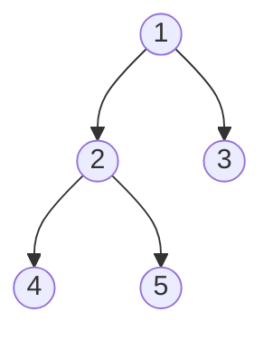
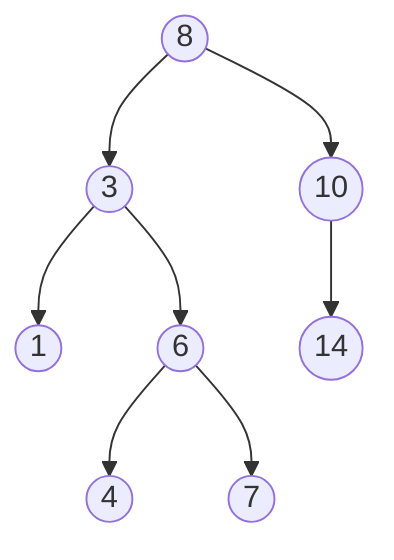

Tree হলো এমন একটা data structure যেটা সারা জীবন দেখবে। File system, DOM tree, database index — সব জায়গায় tree। ভাবো একটা পরিবারের বংশলতিকা — একজন দাদার নিচে বাবা, বাবার নিচে ছেলেমেয়ে। ঠিক তেমনই tree তে একটা root এর নিচে children, তাদের নিচে আরও children।

## Binary Tree — দুই সন্তানের পরিবার

Binary Tree তে প্রতিটা node এর সর্বোচ্চ দুটো child থাকে — `left` আর `right`।

```python
class TreeNode:
    def __init__(self, val=0, left=None, right=None):
        self.val = val
        self.left = left
        self.right = right

root = TreeNode(1)
root.left = TreeNode(2)
root.right = TreeNode(3)
root.left.left = TreeNode(4)
root.left.right = TreeNode(5)
```

প্রতিটা node এ value, left pointer, আর right pointer থাকে। ওপরের কোড এই tree টা বানায়।



ওপরের ছবিতে দেখো — `1` হলো root, তার children `2` আর `3`, আর `2` এর children `4` আর `5`।

> [!note]
> Leaf node হলো যাদের কোনো child নেই। এই tree এ leaf হলো `4`, `5`, আর `3`।

## BST — Binary Search Tree এর নিয়ম

BST হলো Binary Tree এর একটা special version যেখানে একটা নিয়ম থাকে — প্রতিটা node এর জন্য:

- Left subtree এর সব value গুলো node এর value থেকে ছোট
- Right subtree এর সব value গুলো node এর value থেকে বড়



ওপরের tree টা BST — কারণ প্রতিটা node এর left সব ছোট, right সব বড়। যেমন root `8` এর left এ সব `8` এর চেয়ে ছোট, right এ বড়।

> [!tip]
> BST এ inorder traversal করলে value গুলো sorted অর্ডারে আসে। এটাই BST এর সবচেয়ে বড় সৌন্দর্য।

## BST Operations

### Search — খুঁজে বের করো

```python
def bst_search(root, target):
    if root is None:
        return None
    if root.val == target:
        return root
    if target < root.val:
        return bst_search(root.left, target)
    return bst_search(root.right, target)
```

Target ছোট হলে left এ যাও, বড় হলে right এ। এটাই Binary Search এর মতো — প্রতি ধাপে অর্ধেক tree বাদ যায়। Average time $O(\log n)$, worst case $O(n)$।

### Insert — নতুন node যোগ করো

```python
def bst_insert(root, val):
    if root is None:
        return TreeNode(val)
    if val < root.val:
        root.left = bst_insert(root.left, val)
    elif val > root.val:
        root.right = bst_insert(root.right, val)
    return root
```

Value ছোট হলে left subtree তে insert করো, বড় হলে right subtree তে। Empty spot পেলে সেখানে নতুন node বসাও।

### Delete — একটু Tricky

Delete এ তিনটা case থাকে।

```python
def bst_delete(root, val):
    if root is None:
        return None
    if val < root.val:
        root.left = bst_delete(root.left, val)
    elif val > root.val:
        root.right = bst_delete(root.right, val)
    else:
        if root.left is None:
            return root.right
        if root.right is None:
            return root.left
        successor = find_min(root.right)
        root.val = successor.val
        root.right = bst_delete(root.right, successor.val)
    return root

def find_min(node):
    while node.left:
        node = node.left
    return node
```

Node টার children না থাকলে সরাসরি delete। একটা child থাকলে সেটাকে উপরে তুলে নাও। দুটো child থাকলে — inorder successor (right subtree এর সবচেয়ে ছোট) কে এনে replace করো, তারপর successor কে delete করো।

> [!warning]
> Delete সবচেয়ে কঠিন operation। Inorder successor বনাম inorder predecessor — দুটোই কাজ করবে, কিন্তু successor বেশি common।

## Tree Traversals — Tree ঘুরে বেড়াও

Tree তে চারভাবে ঘোরা যায়। প্রতিটার নিজস্ব use case আছে।


### Inorder — Left, Root, Right

```python
def inorder(node):
    if node is None:
        return []
    return inorder(node.left) + [node.val] + inorder(node.right)

print(inorder(root))
```

প্রথমে left subtree পুরো, তারপর root, তারপর right subtree। BST এ এটা sorted output দেয়।

### Preorder — Root, Left, Right

```python
def preorder(node):
    if node is None:
        return []
    return [node.val] + preorder(node.left) + preorder(node.right)

print(preorder(root))
```

Root আগে, তারপর left, তারপর right। Tree copy করতে বা serialize করতে দারুণ কাজে দেয়।

### Postorder — Left, Right, Root

```python
def postorder(node):
    if node is None:
        return []
    return postorder(node.left) + postorder(node.right) + [node.val]

print(postorder(root))
```

Root সবার শেষে। Tree delete করার সময় এটা দরকার — কারণ parent কে delete করার আগে children delete করতে হয়।

### Level Order (BFS) — Level ধরে ধরে

```python
from collections import deque

def level_order(root):
    if root is None:
        return []
    result = []
    queue = deque([root])
    while queue:
        level = []
        for _ in range(len(queue)):
            node = queue.popleft()
            level.append(node.val)
            if node.left:
                queue.append(node.left)
            if node.right:
                queue.append(node.right)
        result.append(level)
    return result

print(level_order(root))
```

Queue ব্যবহার করে level ধরে ধরে traverse করে। প্রতিটা level এর সব node আগে, তারপর নিচের level। Shortest path বা BFS এর জন্য দরকার।

> [!tip]
> DFS (inorder/preorder/postorder) তে stack বা recursion লাগে। BFS (level order) তে queue লাগে। এই পার্থক্য টা মনে রাখো।

## Height আর Depth

```python
def max_depth(root):
    if root is None:
        return 0
    return 1 + max(max_depth(root.left), max_depth(root.right))

print(max_depth(root))
```

Height হলো root থেকে সবচেয়ে দূরের leaf পর্যন্ত edge সংখ্যা। প্রতিটা node এর জন্য left আর right এর max নাও, তাতে 1 যোগ করো।

## Balanced Tree

Balanced tree তে left আর right subtree এর height পার্থক্য সর্বোচ্চ ১। যদি বেশি হয়, tree unbalanced — তখন search $O(n)$ হয়ে যায়।

```python
def is_balanced(root):
    def check(node):
        if node is None:
            return 0
        left = check(node.left)
        if left == -1:
            return -1
        right = check(node.right)
        if right == -1:
            return -1
        if abs(left - right) > 1:
            return -1
        return 1 + max(left, right)
    return check(root) != -1

print(is_balanced(root))
```

`-1` return করা মানে "unbalanced"। যেকোনো node এ height difference ১ এর বেশি হলে সাথে সাথে `-1` ফিরে আসবে।

> [!danger]
> BST যদি sorted data insert করো, তাহলে tree টা linked list এর মতো হয়ে যাবে — সব node এক দিকে। তখন $O(n)$ search লাগবে। এই জন্য self-balancing tree (AVL, Red-Black) দরকার।

## LCA — Lowest Common Ancestor

দুটো node এর সবচেয়ে কাছের সাধারণ ancestor খুঁজে বের করা।

```python
def lca(root, p, q):
    if root is None or root == p or root == q:
        return root
    left = lca(root.left, p, q)
    right = lca(root.right, p, q)
    if left and right:
        return root
    return left if left else right

print(lca(root, root.left.left, root.left.right).val)
```

যদি এক node left এ আর আরেকটা right এ পাওয়া যায় — তাহলে current node ই LCA। দুটোই এক দিকে হলে সেই দিকে আরও নামো।

> [!note]
> LCA BST এ আরও সহজ — দুটো value যদি root এর এক দিকে হয়, সেই দিকে যাও। দুদিকে হলে root ই LCA।

## Traversal তুলনা

| Traversal | Order | Use Case |
|-----------|-------|----------|
| Inorder | Left → Root → Right | BST sorted output |
| Preorder | Root → Left → Right | Tree copy, serialize |
| Postorder | Left → Right → Root | Tree delete |
| Level Order | Level by level | BFS, shortest path |

## Practice Problems

| Problem | Difficulty | Platform | Approach Hint |
|---------|-----------|----------|---------------|
| Maximum Depth of Binary Tree | Easy | LeetCode #104 | Recursive height |
| Validate BST | Medium | LeetCode #98 | Inorder check sorted কি না |
| Binary Tree Level Order Traversal | Medium | LeetCode #102 | BFS with queue |
| Lowest Common Ancestor | Medium | LeetCode #236 | Recursion — দুই দিকে check |
| Construct Binary Tree from Preorder and Inorder | Medium | LeetCode #105 | Preorder এ root খোঁজো, inorder এ partition |
| Serialize and Deserialize Binary Tree | Hard | LeetCode #297 | Preorder traversal with markers |

> [!tip]
> Tree problem গুলোর বেশিরভাগেই recursion ই উত্তর। প্রথমে base case ভাবো — `if node is None: return ...`। তারপর left আর right recursive call দাও। সবচেয়ে গুরুত্বপূর্ণ — current node এ কী return করবে সেটা ভাবো।