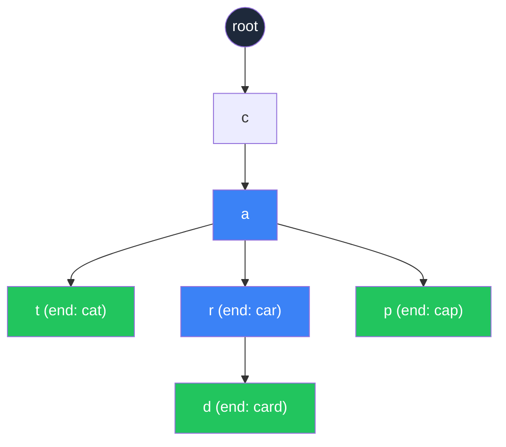

# Trie (Prefix Tree)

আগের chapters এ আমরা tree, BST দেখলাম। এবার একটু অন্যরকম গাছ দেখবো — যার নাম **Trie** (উচ্চারণ "try")। এটাকে **Prefix Tree** বা **Digital Tree** ও বলা হয়। মূল কাজ — শব্দ বা string গুলো এমনভাবে store করা, যাতে prefix দিয়ে খোঁজা দ্রুত হয়। Autocomplete, spell-checker, IP routing — সবখানে এর ব্যবহার।

## Trie কী আর কেন দরকার

Trie হলো একটা গাছ (tree), কিন্তু সাধারণ গাছের মতো না। এখানে প্রতিটা node একটা অক্ষর ধরে রাখে। শব্দটা character by character গাছের ডাল বরাবর নিচে নামে। যদি দুটো শব্দের শুরু একই — যেমন "cat" আর "car" — তাহলে তারা একই ডাল পর্যন্ত যাবে, তারপর আলাদা হবে।

একটা hash table এ যদি শব্দ store করো, search করতে $O(1)$। কিন্তু যদি প্রশ্ন হয় — "ca" দিয়ে শুরু হওয়া কোনো শব্দ আছে কি না?" — তাহলে hash table এ answer নেই। সব key আলাদা করে check করতে হবে। Trie এই prefix খোঁজার কাজ $O(m)$ এ করে দেয়, যেখানে $m$ হলো prefix এর দৈর্ঘ্য — dictionary এর সাইজ যাই হোক না কেন।



উপরের diagram এ "cat", "car", "card", "cap" — এই চারটা শব্দ store করা আছে। খেয়াল করো — সবাই "c" → "a" পর্যন্ত একসাথে গেছে, তারপর আলাদা ডালে ভাগ হয়েছে। সবুজ node গুলো বোঝায় এখানে একটা পূর্ণ শব্দ শেষ হয়েছে।

> [!tip] Memory বনাম Speed
> Trie এ একই prefix গুলো share হয় বলে কিছু memory বাঁচে, কিন্তু প্রতিটা node এ একটা children dictionary/array রাখতে হয় বলে overall memory hash table এর চেয়ে বেশি হতে পারে। Speed এর বিনিময়ে memory — classic tradeoff।

## Trie Node Structure

প্রতিটা node এ দুটো জিনিস থাকে:

1. **children** — পরের character গুলো কোন node এ আছে, সেটার mapping
2. **is_end** — এই node এ কি কোনো পূর্ণ শব্দ শেষ হয়েছে?

নিচের কোডে `defaultdict` ব্যবহার করা হয়েছে যাতে নতুন character insert করার সময় automatically empty node তৈরি হয়ে যায়। `is_end` flag টা `False` দিয়ে শুরু, কারণ root বা intermediate node নিজে কোনো শব্দ না।

```python
from collections import defaultdict

class TrieNode:
    def __init__(self):
        self.children = defaultdict(TrieNode)
        self.is_end = False

class Trie:
    def __init__(self):
        self.root = TrieNode()
```

`defaultdict(TrieNode)` মানে — যেকোনো key যদি exist না করে, automatically একটা নতুন `TrieNode` বানিয়ে দেবে। এতে insert করার সময় `if key not in dict` এর মতো check করতে হয় না, কোড পরিষ্কার থাকে।

## Insert, Search, StartsWith

এই তিনটাই Trie এর মূল operation। তিনটোর complexity ই $O(m)$, যেখানে $m$ হলো শব্দের দৈর্ঘ্য।

নিচের কোডে insert করার সময় root থেকে শুরু করে প্রতিটা character এর জন্য নিচে নামা হয়। character এর node না থাকলে `defaultdict` বানিয়ে দেয়। শেষে `is_end = True` দিয়ে শব্দ শেষ চিহ্নিত করা হয়।

```python
def insert(self, word: str) -> None:
    node = self.root
    for ch in word:
        node = node.children[ch]
    node.is_end = True

def search(self, word: str) -> bool:
    node = self.root
    for ch in word:
        if ch not in node.children:
            return False
        node = node.children[ch]
    return node.is_end

def starts_with(self, prefix: str) -> bool:
    node = self.root
    for ch in prefix:
        if ch not in node.children:
            return False
        node = node.children[ch]
    return True
```

`search` আর `starts_with` এর মধ্যে পার্থক্য শুধু একটা জায়গায় — `search` শেষে `is_end` check করে (পূর্ণ শব্দ কি না), আর `starts_with` শুধু এই পর্যন্ত path আছে কি না দেখে।

> [!note] "car" insert করলে "ca" search করলে কী হবে?
> `starts_with("ca")` return করবে `True` কারণ path আছে। কিন্তু `search("ca")` return করবে `False` — কারণ "ca" এর node এ `is_end` False, মানে কেউ "ca" পূর্ণ শব্দ হিসেবে insert করেনি।

## Autocomplete Application

Autocomplete হলো Trie এর সবচেয়ে পরিচিত use case। একটা prefix দিলে সেই prefix দিয়ে শুরু হওয়া সব শব্দ বের করতে হবে।

প্রথমে prefix এর শেষ node এ যেতে হয়। তারপর সেই node থেকে DFS করে সব path বের করতে হয় যেগুলো `is_end = True` এ গিয়ে শেষ হয়।

```python
def _collect(self, node: TrieNode, prefix: str, results: list) -> None:
    if node.is_end:
        results.append(prefix)
    for ch, child in node.children.items():
        self._collect(child, prefix + ch, results)

def autocomplete(self, prefix: str) -> list:
    node = self.root
    for ch in prefix:
        if ch not in node.children:
            return []
        node = node.children[ch]
    results = []
    self._collect(node, prefix, results)
    return results
```

`_collect` একটা recursive helper — মূলত DFS। যখনই `is_end` True পায়, তখনই current prefix কে results এ যোগ করে। এভাবে prefix থেকে শুরু হওয়া সব পূর্ণ শব্দ পাওয়া যায়।

> [!warning] Autocomplete এর complexity
> যদি prefix দিয়ে শুরু হওয়া শব্দ অনেক বেশি থাকে, তাহলে সব বের করা $O(\text{total chars in all matches})$। Real system এ সাধারণত top-k শব্দ frequency অনুযায়ী দেখানো হয়, সব নয়।

## Word Search in Grid

Classic problem — একটা grid দেওয়া আছে, আর কিছু শব্দ। বলতে হবে কোন শব্দ গুলো grid এ পাওয়া যায় (adjacent cell এ ঘুরে)। নিজে নিজে করলে প্রতিটা cell থেকে DFS চালাতে হয়। কিন্তু যদি শব্দ অনেক বেশি হয়, তাহলে সব শব্দ একসাথে Trie এ রেখে একবারেই search করা যায়।

```python
def find_words(board, words):
    trie = Trie()
    for w in words:
        trie.insert(w)
    rows, cols = len(board), len(board[0])
    result = set()
    visited = set()

    def dfs(r, c, node, path):
        if (r < 0 or r >= rows or c < 0 or c >= cols or
                (r, c) in visited or board[r][c] not in node.children):
            return
        ch = board[r][c]
        visited.add((r, c))
        next_node = node.children[ch]
        if next_node.is_end:
            result.add(path + ch)
        for dr, dc in [(-1, 0), (1, 0), (0, -1), (0, 1)]:
            dfs(r + dr, c + dc, next_node, path + ch)
        visited.remove((r, c))

    for i in range(rows):
        for j in range(cols):
            dfs(i, j, trie.root, "")
    return result
```

এখানে key insight হলো — প্রতিটা cell থেকে DFS করার সময় current Trie node ট্র্যাক করা হয়। যে দিকে গেলে character match না করে, সেদিকে আর যাওয়া হয় না। `visited` ব্যবহার করা হয় যাতে একই cell দুবার ব্যবহার না হয়। শেষে `visited.remove` দিয়ে backtracking করা হয়।

> [!danger] Time complexity হিসাব
> সব cell থেকে DFS চলে, প্রতিটা cell এ সর্বোচ্চ Trie এর depth পর্যন্ত যেতে পারে। Worst case $O(N \cdot M \cdot 4^L)$, যেখানে $L$ সবচেয়ে লম্বা শব্দের দৈর্ঘ্য। Trie ছাড়া প্রতিটা শব্দ আলাদা search করলে আরও খারাপ হতো।

## XOR Trie — Maximum XOR Pair

এটা একটু advanced কিন্তু খুব interesting। একটা array দেওয়া আছে, দুটো number বের করতে হবে যাদের XOR সবচেয়ে বড়।

Idea টা হলো — প্রতিটা number কে binary (0/1) এ represent করে Trie এ store করা। তারপর প্রতিটা number এর জন্য, opposite bit খোঁজা — কারণ $0 \oplus 1 = 1$ আর $1 \oplus 1 = 0$। যত বেশি MSB তে 1 পাওয়া যাবে, XOR তত বড়।

```python
def find_maximum_xor(nums):
    max_len = max(nums).bit_length()
    root = {}

    for num in nums:
        node = root
        for i in range(max_len - 1, -1, -1):
            bit = (num >> i) & 1
            if bit not in node:
                node[bit] = {}
            node = node[bit]

    max_xor = 0
    for num in nums:
        node = root
        cur_xor = 0
        for i in range(max_len - 1, -1, -1):
            bit = (num >> i) & 1
            opp = 1 - bit
            if opp in node:
                cur_xor |= (1 << i)
                node = node[opp]
            else:
                node = node[bit]
        max_xor = max(max_xor, cur_xor)
    return max_xor
```

MSB থেকে LSB পর্যন্ত bit by bit নামা হয়। প্রতিটা number এর জন্য opposite bit খোঁজা হয় — যদি থাকে তাহলে সেদিকে যাওয়া হয় আর XOR এ সেই bit 1 হয়ে যায়। opposite না থাকলে যেটা আছে সেদিকে যেতে হয়। এভাবে সব number এর জন্য best match বের করে maximum নেওয়া হয়। Complexity $O(n \cdot L)$ যেখানে $L$ হলো bit count।

| Approach | Time | Space | মন্তব্য |
|----------|------|-------|---------|
| Brute force pairs | $O(n^2)$ | $O(1)$ | সহজ কিন্তু ধীর |
| XOR Trie | $O(n \cdot L)$ | $O(n \cdot L)$ | fast, real দুনিয়ায় ব্যবহৃত |

## Trie vs Alternatives

| Feature | Trie | Hash Set | Sorted Array |
|---------|------|----------|--------------|
| Insert | $O(m)$ | $O(m)$ avg | $O(m \log n)$ |
| Exact search | $O(m)$ | $O(m)$ avg | $O(m \log n)$ |
| Prefix search | $O(m)$ | $O(n \cdot m)$ | binary search |
| Memory | higher | lower | lowest |
| Autocomplete | natural | hard | possible |

## কখন Trie ব্যবহার করবে

- Autocomplete বা suggestion feature
- Spell checker
- Dictionary implementation
- Longest prefix matching (IP routing)
- Multiple string একসাথে pattern matching
- Maximum XOR এর মতো bitwise problem

> [!tip] Trie ছাড়াও prefix search
> অনেক সময় sorted array + binary search দিয়েও prefix search করা যায় — `bisect` module দিয়ে। শব্দ সংখ্যা কম হলে সেটা সহজ, memory ও কম। Trie তখনই দরকার যখন prefix দিয়ে recursive search বা শব্দ suggest করতে হয়।

## Practice Problems

নিচের problem গুলো solve করলে Trie এর কনসেপ্ট একদম clear হয়ে যাবে:

1. **LeetCode 208 — Implement Trie (Prefix Tree)** — সবার জন্য শুরুর problem
2. **LeetCode 212 — Word Search II** — grid এ Trie দিয়ে multiple word search
3. **LeetCode 648 — Replace Words** — prefix দিয়ে word replace
4. **LeetCode 421 — Maximum XOR of Two Numbers in an Array** — XOR Trie এর classic problem

প্রথমে 208 দিয়ে শুরু করো, এটা Trie এর বেসিক structure শিখিয়ে দেবে। তারপর 212 তে যাও, সেটা Trie কে DFS এর সাথে combine করতে শেখায়। শেষে 421 দিয়ে XOR Trie concept টা আয়ত্ত করো।