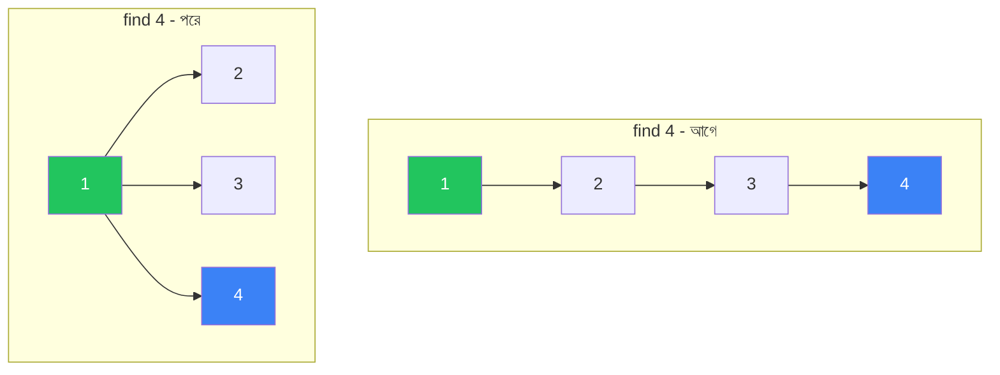

# Union-Find (DSU)

Union-Find, যাকে **Disjoint Set Union (DSU)** ও বলা হয়, সেটা এমন একটা data structure যা দিয়ে দ্রুত বলা যায় — দুটো element কি একই group এ আছে নাকি আলাদা? আর দুটো group কে জোড়া লাগানো যায় প্রায় constant time এ। Graph এ connected components, cycle detection, MST (Minimum Spanning Tree) — সবখানে এর ব্যবহার।

## Disjoint Set Union Concept

ধরো তোমার কাছে কিছু element আছে, প্রতিটাকে আলাদা group এ রাখা। প্রতিটা group এর একজন "representative" বা leader থাকে। দুটো operation থাকে:

- **find(x)** — `x` এর group এর representative কে?
- **union(x, y)** — `x` আর `y` এর group কে জোড়া লাগাও

যদি `find(x) == find(y)` হয়, তার মানে তারা একই group এ আছে। নাহলে আলাদা। এই সহজ আইডিয়া দিয়েই অনেক জটিল problem solve হয়।

> [!note] কেন এটা দরকার?
> Graph traversal (BFS/DFS) দিয়েও connected components বের করা যায়। কিন্তু যদি edge গুলো dynamically যোগ হতে থাকে, আর প্রতিবার query করতে হয় "এই দুটো node কি connected?" — তখন BFS/DFS প্রতিবার $O(V + E)$ লাগে। Union-Find প্রতিটা operation প্রায় $O(1)$ এ করে দেয়।

## Naive Approach আর তার সমস্যা

সহজ ভাবে — প্রতিটা element এর জন্য parent রাখা। শুরুতে প্রত্যেকে নিজের parent। `find` করতে parent এর parent এর parent... এভাবে root পর্যন্ত যেতে হয়। `union` করতে একজনের root কে অন্যজনের root এর parent বানিয়ে দেওয়া।

কিন্তু সমস্যা হলো — যদি গাছটা লম্বা হয়ে যায় (একটার নিচে আরেকটা, তার নিচে আরেকটা...), তাহলে `find` এ $O(n)$ পর্যন্ত লেগে যেতে পারে। এই সমস্যা সমাধানের জন্য দুটো optimization আছে — **Union by Rank** আর **Path Compression**।

## Union by Rank

Union করার সময় দেখা হয় — কোন গাছটা বড় (deep)? ছোট গাছটাকে বড় গাছের নিচে যোগ করা হয়। এতে গাছের depth বাড়ে না। প্রতিটা root এর জন্য একটা `rank` রাখা হয় — সেটা roughly গাছের height।

> [!tip] Union by Size vs Rank
> Union by rank height track করে, union by size node count track করে। দুটোই same complexity দেয়। Size কিছুটা intuitive কারণ এটা সরাসরি দেখায় কোন group বড়।

## Path Compression — মূল Optimization

এটাই সবচেয়ে গুরুত্বপূর্ণ optimization। `find` করার সময় root পর্যন্ত যাওয়া হয়। কিন্তু ফিরে আসার সময় path এর সব node কে সরাসরি root এর child বানিয়ে দেওয়া হয়। এতে পরের বার এই node গুলো থেকে `find` করলে এক ধাপেই root পাওয়া যায়।



উপরের diagram এ — `find(4)` করার আগে 4 → 3 → 2 → 1 path ছিল। কিন্তু `find(4)` করার পর 2, 3, 4 — সবাই সরাসরি root (1) এর child হয়ে গেছে। এতে path ছোট হয়ে গেছে।

> [!warning] Path Compression আর Union by Rank একসাথে
> এই দুটো optimization একসাথে ব্যবহার করলে amortized complexity হয় $O(\alpha(n))$, যেখানে $\alpha$ হলো inverse Ackermann function। এটা practical দুনিয়ায় $n < 10^{80}$ এর জন্য ৫-এর কম। মানে প্রায় constant time।

## Python Implementation

নিচের কোডে `parent` array তে প্রতিটা element এর parent রাখা হয়েছে। `rank` array তে প্রতিটা root এর rank। `find` function recursive — root না পাওয়া পর্যন্ত উপরে ওঠে, আর ফিরে আসার সময় path compress করে।

```python
class DSU:
    def __init__(self, n):
        self.parent = list(range(n))
        self.rank = [0] * n

    def find(self, x):
        if self.parent[x] != x:
            self.parent[x] = self.find(self.parent[x])
        return self.parent[x]

    def union(self, x, y):
        px, py = self.find(x), self.find(y)
        if px == py:
            return False
        if self.rank[px] < self.rank[py]:
            px, py = py, px
        self.parent[py] = px
        if self.rank[px] == self.rank[py]:
            self.rank[px] += 1
        return True
```

`find` এর key লাইন হলো `self.parent[x] = self.find(self.parent[x])` — এটাই path compression। recursive call root খোঁজে, আর assignment টা current node কে সরাসরি root এর child বানিয়ে দেয়। `union` এ rank compare করে ছোট গাছ কে বড় গাছের নিচে রাখা হয়।

> [!note] `union` কখন False return করে?
> যদি `x` আর `y` এর root একই হয়, মানে তারা আগে থেকেই একই group এ। তখন union করার দরকার নেই, `False` return করা হয়। এটা cycle detection এ খুব কাজে লাগে।

## Connected Components

একটা undirected graph এ কতগুলো connected component আছে — এটা Union-Find দিয়ে খুব সহজে বের করা যায়। প্রতিটা edge এর দুটো endpoint কে union করো। শেষে যতগুলো unique root আছে, ততগুলো component।

নিচের কোডে প্রতিটা edge এর জন্য union করা হয়। এরপর প্রতিটা node এর root বের করে unique root গুলো count করা হয়।

```python
def count_components(n, edges):
    dsu = DSU(n)
    for u, v in edges:
        dsu.union(u, v)
    roots = {dsu.find(i) for i in range(n)}
    return len(roots)
```

প্রতিটা edge process করে union করার পর, একই component এর সব node এর root একই হবে। `set` দিয়ে unique root গুলো count করা হয় — সেটাই component সংখ্যা। Complexity $O(E \cdot \alpha(n) + n)$, যা প্রায় linear।

## Cycle Detection

Undirected graph এ cycle আছে কি না — এটাও Union-Find দিয়ে সহজে বের করা যায়। প্রতিটা edge এর দুটো endpoint যদি একই group এ থাকে, তাহলে সেই edge টা cycle create করবে।

```python
def has_cycle(n, edges):
    dsu = DSU(n)
    for u, v in edges:
        if not dsu.union(u, v):
            return True
    return False
```

খেয়াল করো — `union` False return করলে cycle আছে। কারণ দুটো node এর root একই, মানে তারা আগে থেকেই connected। এই edge যোগ করলে দুটো alternative path তৈরি হবে — সেটাই cycle। এই technique শুধু undirected graph এ কাজ করে, directed graph এ না।

> [!danger] Directed Graph এ Cycle
> Directed graph এ cycle detection এর জন্য Union-Find কাজ করে না। সেখানে DFS দিয়ে recursion stack track করতে হয়, বা Kahn এর algorithm (topo sort) ব্যবহার করতে হয়। Union-Find শুধু undirected graph এর জন্য।

## Kruskal's MST

Minimum Spanning Tree (MST) বানানোর সবচেয়ে intuitive algorithm হলো Kruskal's। Idea — সব edge কে weight অনুযায়ী ছোট থেকে বড় sort করো। তারপর একটা একটা করে edge নাও। যদি সেই edge cycle create না করে, MST তে যোগ করো। Cycle check করার জন্যই Union-Find ব্যবহার করা হয়।

```python
def kruskal(n, edges):
    edges.sort(key=lambda e: e[2])
    dsu = DSU(n)
    mst = []
    total = 0
    for u, v, w in edges:
        if dsu.union(u, v):
            mst.append((u, v, w))
            total += w
            if len(mst) == n - 1:
                break
    return mst, total
```

Edge গুলো weight অনুযায়ী sorted। প্রতিটা edge এর জন্য union call করা হয় — `True` return করলে মানে cycle নেই, তাই MST তে যোগ। $n - 1$ টা edge হয়ে গেলে MST complete, তাই break। Complexity $O(E \log E)$, যেখানে sorting dominate করে।

| Algorithm | Approach | Complexity | কখন ব্যবহার |
|-----------|----------|------------|-------------|
| **Kruskal** | sort edges + DSU | $O(E \log E)$ | edge list format, sparse graph |
| **Prim** | priority queue | $O(E \log V)$ | adjacency list, dense graph |

## Accounts Merge Problem

এটা একটা জনপ্রিয় problem। কিছু account দেওয়া আছে, প্রতিটায় একজনের নাম আর কিছু email। যদি দুটো account এ কোনো common email থাকে, তাহলে তারা একই person এর — merge করতে হবে।

Key insight — প্রতিটা email কে একটা node ভাবো। একই account এর সব email কে একসাথে union করো (প্রথম email এর সাথে বাকি গুলো)। শেষে একই root এর অধীন email গুলো একই person এর।

```python
def accounts_merge(accounts):
    dsu = DSU(10000)
    email_to_id = {}
    email_to_name = {}
    idx = 0

    for account in accounts:
        name = account[0]
        first_email = account[1]
        for email in account[1:]:
            if email not in email_to_id:
                email_to_id[email] = idx
                email_to_name[email] = name
                idx += 1
            dsu.union(email_to_id[first_email], email_to_id[email])

    root_to_emails = {}
    for email, i in email_to_id.items():
        root = dsu.find(i)
        root_to_emails.setdefault(root, []).append(email)

    result = []
    for emails in root_to_emails.values():
        name = email_to_name[emails[0]]
        result.append([name] + sorted(emails))
    return result
```

প্রতিটা account এর প্রথম email কে anchor ধরে বাকি গুলোর সাথে union করা হয়। সব email কে unique id দেওয়া হয়। শেষে root অনুযায়ী email গুলো group করা হয়। একই root মানে একই person — তাই তাদের merge করা হয়।

> [!tip] Generic pattern
> Accounts merge এর মতো "দুটো object কি সম্পর্কিত?" type problem গুলোতে Union-Find প্রায় সবসময় কাজ করে। Key হলো — সম্পর্ক বা common attribute খুঁজে বের করে union করা।

## Practice Problems

নিচের problem গুলো solve করলে Union-Find এর পুরো ধারণা clear হয়ে যাবে:

1. **LeetCode 547 — Number of Provinces** — connected components এর classic problem
2. **LeetCode 684 — Redundant Connection** — cycle detection, কোন edge cycle বানায়
3. **LeetCode 721 — Accounts Merge** — email based merge, real world style
4. **LeetCode 1135 — Connecting Cities With Minimum Cost** — Kruskal's MST direct application

প্রথমে 547 দিয়ে শুরু করো — সেটা DSU এর বেসিক union/find শেখাবে। তারপর 684 তে cycle detection concept টা পাকাপোক্ত করো। 721 একটু complex কিন্তু real world pattern শেখায়। শেষে 1135 দিয়ে Kruskal's MST apply করো।