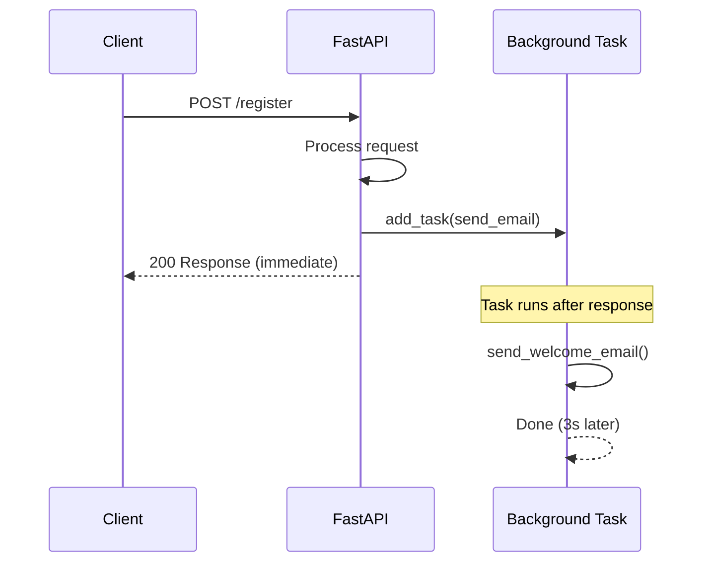

## Background Tasks ও Webhooks

তুমি একটা user register করলো — তোমার একটা welcome email পাঠাতে হবে। কিন্তু email পাঠাতে ৩-৫ সেকেন্ড লাগে। যদি user কে সেই ৩-৫ সেকেন্ড অপেক্ষা করাও, তাহলে experience খারাপ হবে। এই সমস্যার সমাধান হলো background task — response দিয়ে দাও, আর email পাঠানো পেছনে চলতে থাক।

এই chapter এ আমরা শিখবো `BackgroundTasks` কীভাবে use করতে হয়, কখন Celery ব্যবহার করতে হয়, আর webhook কীভাবে implement করতে হয়।

## BackgroundTasks — Simple In-Process Tasks

FastAPI তে `BackgroundTasks` নামে একটা built-in feature আছে। এটা দিয়ে তুমি response দেওয়ার পর কিছু কাজ চালাতে পারো — সব একই process এর ভেতরে।

নিচের কোডে একটা simple background task দেখানো হলো।

```python
# Simple background task
from fastapi import BackgroundTasks, FastAPI

app = FastAPI()

def send_welcome_email(email: str, name: str):
    # Simulate sending email (takes 3 seconds)
    import time
    time.sleep(3)
    print(f"Email sent to {name} <{email}>")

@app.post("/register")
async def register_user(
    email: str,
    name: str,
    background_tasks: BackgroundTasks
):
    # Add task to run after response is sent
    background_tasks.add_task(send_welcome_email, email, name)

    # Response is sent immediately, email sends in background
    return {"message": f"Welcome {name}! Check your email."}
```

এই কোডে `BackgroundTasks` কে একটা parameter হিসেবে inject করা হয়েছে। `background_tasks.add_task(send_welcome_email, email, name)` দিয়ে একটা task যোগ করা হয়েছে — function আর তার arguments।

খেয়াল করো — `send_welcome_email` function টা sync (`time.sleep` ব্যবহার করছে)। কিন্তু এটা background এ চলবে, তাই main response block হবে না। User তৎক্ষণাৎ response পাবে, আর email পাঠানো পেছনে চলবে।

### কীভাবে কাজ করে?



Response পাঠানোর পর background task গুলো চলে। যদি multiple task add করা হয়, সেগুলো add করার ক্রমেই চলবে।

## BackgroundTasks বনাম Task Queues

`BackgroundTasks` সব সময় সব সমস্যার সমাধান না। কখন কোনটা use করবে, সেটা বোঝা দরকার।

| Feature | BackgroundTasks | Celery | ARQ | RQ |
|---|---|---|---|---|
| Setup complexity | Zero | High | Medium | Low |
| External dependency | None | Redis/RabbitMQ | Redis | Redis |
| Persistence | ❌ Lost on restart | ✅ Survives restart | ✅ Survives restart | ✅ Survives restart |
| Distributed | ❌ Single process | ✅ Multiple workers | ✅ Multiple workers | ✅ Multiple workers |
| Scheduled tasks | ❌ | ✅ Celery Beat | ✅ cron jobs | ❌ |
| Task monitoring | ❌ | ✅ Flower | ✅ Built-in | ✅ rq-dashboard |
| Retry mechanism | ❌ Manual | ✅ Built-in | ✅ Built-in | ✅ Built-in |
| Best for | Quick, light tasks | Heavy, complex workflows | Async-first projects | Simple Redis-based |

> [!note] BackgroundTasks single process-এ চলে
> `BackgroundTasks` single process এ চলে — যদি heavy কাজ হয় (video processing, large report generation, bulk email) Celery ব্যবহার করুন। BackgroundTasks শুধু ছোট কাজের জন্য — যেমন email পাঠানো, notification trigger করা, log লেখা, cache update করা।

### কখন কোনটা use করবে?

- **BackgroundTasks** — email পাঠানো, notification, cache update, analytics log
- **Celery** — video processing, heavy report generation, scheduled tasks, distributed
- **ARQ** — async-first project, Redis-based, lightweight
- **RQ** — simple task queue, Redis-based, Pythonic

## Adding Multiple Tasks

একটা response এ একাধিক background task add করা যায়। সেগুলো add করার ক্রমেই চলবে।

```python
# Multiple background tasks
def send_welcome_email(email: str):
    print(f"Welcome email sent to {email}")

def update_analytics(user_id: int):
    print(f"Analytics updated for user {user_id}")

def sync_to_crm(email: str, name: str):
    print(f"User {name} synced to CRM")

@app.post("/register")
async def register_user(
    user_data: UserRegister,
    background_tasks: BackgroundTasks
):
    user_id = create_user_in_db(user_data)

    # Tasks run in order: email -> analytics -> crm
    background_tasks.add_task(send_welcome_email, user_data.email)
    background_tasks.add_task(update_analytics, user_id)
    background_tasks.add_task(sync_to_crm, user_data.email, user_data.name)

    return {"user_id": user_id, "message": "Registration successful"}
```

এই কোডে তিনটা background task add করা হয়েছে। এগুলো add করার ক্রমে চলবে — প্রথমে welcome email, তারপর analytics update, তারপর CRM sync। প্রতিটা আগেরটা শেষ হওয়ার পর পরেরটা শুরু হবে।

## Async Background Tasks

Background task গুলো async ও হতে পারে। এটা আরও ভালো — কারণ async task গুলো একসাথে চলতে পারে।

```python
# Async background task
import httpx

async def fetch_weather_data(city: str):
    async with httpx.AsyncClient() as client:
        response = await client.get(
            f"https://api.weather.com/v1/current?city={city}"
        )
        data = response.json()
        print(f"Weather in {city}: {data['temperature']}°C")

@app.post("/weather/subscribe")
async def subscribe_weather(
    city: str,
    background_tasks: BackgroundTasks
):
    # Async task runs in background
    background_tasks.add_task(fetch_weather_data, city)
    return {"message": f"Fetching weather for {city}"}
```

এই কোডে `fetch_weather_data` একটা async function। এটা background এ চলবে, কিন্তু যেহেতু async, তাই event loop কে block করবে না।

## Webhook Implementation

Webhook হলো এমন একটা mechanism — যেখানে একটা event ঘটলে স্বয়ংক্রিয়ভাবে একটা HTTP request পাঠানো হয় অন্য একটা server এ। যেমন — payment successful হলে একটা webhook পাঠাতে হবে merchant কে।

### Webhook Receive করা

প্রথমে দেখি কীভাবে webhook receive করতে হয়।

```python
# Receiving a webhook
from fastapi import Request, HTTPException

@app.post("/webhooks/payment")
async def payment_webhook(request: Request):
    # Get the raw body for signature verification
    body = await request.body()
    signature = request.headers.get("X-Webhook-Signature")

    # Verify signature (see next section)
    if not verify_signature(body, signature):
        raise HTTPException(status_code=401, detail="Invalid signature")

    # Process the webhook payload
    payload = await request.json()

    if payload["event"] == "payment.success":
        order_id = payload["order_id"]
        amount = payload["amount"]
        update_order_status(order_id, "paid", amount)

    return {"status": "received"}
```

এই endpoint টা একটা payment webhook receive করে। প্রথমে signature verify করা হয় (নিচে আলোচনা করা হবে), তারপর payload process করা হয়।

গুরুত্বপূর্ণ বিষয় — webhook endpoint দ্রুত response দেওয়া উচিত। যদি processing বেশি সময় নেয়, sender timeout হয়ে retry করতে পারে। তাই heavy processing background task এ পাঠানো উচিত।

```python
# Webhook with background processing
@app.post("/webhooks/payment")
async def payment_webhook(
    request: Request,
    background_tasks: BackgroundTasks
):
    body = await request.body()
    signature = request.headers.get("X-Webhook-Signature")

    if not verify_signature(body, signature):
        raise HTTPException(status_code=401, detail="Invalid signature")

    payload = await request.json()

    # Process in background, respond immediately
    background_tasks.add_task(process_payment_event, payload)

    return {"status": "received"}
```

এই কোডে webhook receive করে তৎক্ষণাৎ response দেওয়া হয়, আর actual processing background এ চলে। এটা webhook best practice।

### Webhook পাঠানো

এখন দেখি কীভাবে নিজে থেকে webhook পাঠাতে হয়।

```python
# Sending a webhook to an external API
import httpx
import hashlib
import hmac
import json

WEBHOOK_SECRET = "your-webhook-secret"

def sign_payload(payload: dict) -> str:
    body = json.dumps(payload, sort_keys=True).encode()
    signature = hmac.new(
        WEBHOOK_SECRET.encode(),
        body,
        hashlib.sha256
    ).hexdigest()
    return signature

async def send_webhook(url: str, event: str, data: dict):
    payload = {
        "event": event,
        "timestamp": int(time.time()),
        "data": data,
    }
    signature = sign_payload(payload)

    async with httpx.AsyncClient() as client:
        response = await client.post(
            url,
            json=payload,
            headers={
                "X-Webhook-Signature": signature,
                "Content-Type": "application/json",
            },
            timeout=10.0,
        )
        return response.status_code

@app.post("/orders/{order_id}/complete")
async def complete_order(
    order_id: str,
    background_tasks: BackgroundTasks
):
    # Complete the order
    order = mark_order_complete(order_id)

    # Send webhook to external system in background
    background_tasks.add_task(
        send_webhook,
        "https://merchant.example.com/webhooks",
        "order.completed",
        {"order_id": order_id, "total": order.total},
    )

    return {"order_id": order_id, "status": "completed"}
```

এই কোডে দুটা জিনিস হচ্ছে:

1. **`sign_payload`** — payload টা HMAC-SHA256 দিয়ে sign করে। যার কাছে secret আছে, সে-ই verify করতে পারবে যে webhook টা authentic।
2. **`send_webhook`** — external URL এ POST request পাঠায়, signature header সহ।

`complete_order` endpoint এ order complete হওয়ার পর একটা webhook পাঠানো হয় — background এ। তাই user কে অপেক্ষা করতে হয় না।

## Webhook Signature Verification (HMAC)

Webhook receive করার সময় যে এটা সত্যিকারের source থেকে এসেছে, সেটা verify করতে হবে। নাহলে যে কেউ fake webhook পাঠিয়ে তোমার system এ ঢুকতে পারবে। এর জন্য HMAC signature verification ব্যবহার করা হয়।

```python
# HMAC signature verification
import hashlib
import hmac

WEBHOOK_SECRET = "your-webhook-secret"

def verify_signature(body: bytes, signature: str | None) -> bool:
    if signature is None:
        return False

    expected = hmac.new(
        WEBHOOK_SECRET.encode(),
        body,
        hashlib.sha256
    ).hexdigest()

    # Use compare_digest to prevent timing attacks
    return hmac.compare_digest(expected, signature)
```

এই কোডে:

- `hmac.new()` দিয়ে secret key আর raw body থেকে expected signature বানানো হয়
- `hmac.compare_digest()` দিয়ে expected আর received signature compare করা হয় — এটা timing attack prevent করে (সাধারণ `==` comparison timing attack এ vulnerable)

গুরুত্বপূর্ণ — signature verify করার সময় raw body use করতে হবে, parsed JSON নয়। কারণ JSON parse করলে formatting পরিবর্তন হতে পারে, আর signature match করবে না।

## Error Handling in Background Tasks

Background task এ error হলে কী হবে? Default ভাবে error টা log হবে, কিন্তু user কিছু জানবে না। তাই error handling করা গুরুত্বপূর্ণ।

```python
# Error handling in background tasks
import logging

logger = logging.getLogger(__name__)

async def send_email_safely(email: str, subject: str, body: str):
    try:
        # Try to send email
        async with httpx.AsyncClient() as client:
            response = await client.post(
                "https://api.emailservice.com/send",
                json={"to": email, "subject": subject, "body": body},
                timeout=30.0,
            )
            response.raise_for_status()
            logger.info(f"Email sent to {email}")

    except httpx.TimeoutException:
        logger.error(f"Email timeout for {email}")
        # Could store in DB for retry later

    except httpx.HTTPStatusError as e:
        logger.error(f"Email API error for {email}: {e.response.status_code}")

    except Exception as e:
        logger.error(f"Unexpected error sending email to {email}: {e}")

@app.post("/notifications")
async def send_notification(
    email: str,
    message: str,
    background_tasks: BackgroundTasks
):
    background_tasks.add_task(
        send_email_safely,
        email,
        "New Notification",
        message
    )
    return {"status": "queued"}
```

এই কোডে `send_email_safely` function টা বিভিন্ন type এর error handle করে:

- **Timeout** — email service slow হলে, log করে আর DB তে store করে পরে retry করা যায়
- **HTTP error** — email API error return করলে, status code সহ log করে
- **Unexpected error** — অন্য কোনো error হলে, সেটাও log করে

যেহেতু BackgroundTasks এ built-in retry নেই, তাই retry logic নিজে লিখতে হয়। যদি retry দরকার হয়, Celery বা ARQ ব্যবহার করা ভালো।

## Real Example — Email + Webhook

এখন চলো একটা সম্পূর্ণ example দেখি — user registration এর পর welcome email পাঠানো আর external system এ webhook পাঠানো।

```python
# Complete example: registration with email + webhook
import httpx
import hmac
import hashlib
import json
import logging
from fastapi import FastAPI, BackgroundTasks, HTTPException
from pydantic import BaseModel, EmailStr

app = FastAPI()
logger = logging.getLogger(__name__)

WEBHOOK_SECRET = "webhook-secret-key"
EMAIL_API_KEY = "email-api-key"

# Pydantic model
class UserRegister(BaseModel):
    email: EmailStr
    name: str
    phone: str | None = None

# In-memory store (use DB in production)
users: dict[str, dict] = {}

# Background task: send welcome email
async def send_welcome_email(email: str, name: str):
    try:
        async with httpx.AsyncClient() as client:
            response = await client.post(
                "https://api.mailgun.net/v3/mysite.com/messages",
                auth=("api", EMAIL_API_KEY),
                data={
                    "from": "welcome@mysite.com",
                    "to": email,
                    "subject": f"Welcome, {name}!",
                    "text": f"Hi {name},\n\nWelcome to our platform!"
                },
                timeout=30.0,
            )
            response.raise_for_status()
            logger.info(f"Welcome email sent to {email}")

    except httpx.HTTPError as e:
        logger.error(f"Failed to send email to {email}: {e}")

# Background task: send webhook to CRM
async def send_crm_webhook(user_data: dict):
    payload = {
        "event": "user.registered",
        "data": {
            "email": user_data["email"],
            "name": user_data["name"],
            "registered_at": user_data["registered_at"],
        }
    }

    body = json.dumps(payload, sort_keys=True).encode()
    signature = hmac.new(
        WEBHOOK_SECRET.encode(),
        body,
        hashlib.sha256
    ).hexdigest()

    try:
        async with httpx.AsyncClient() as client:
            response = await client.post(
                "https://crm.example.com/webhooks/users",
                json=payload,
                headers={
                    "X-Webhook-Signature": signature,
                    "Content-Type": "application/json",
                },
                timeout=10.0,
            )
            response.raise_for_status()
            logger.info(f"CRM webhook sent for {user_data['email']}")

    except httpx.HTTPError as e:
        logger.error(f"CRM webhook failed: {e}")

# Registration endpoint
@app.post("/register", status_code=201)
async def register_user(
    user: UserRegister,
    background_tasks: BackgroundTasks
):
    # Check if already registered
    if user.email in users:
        raise HTTPException(status_code=400, detail="Already registered")

    # Save user
    import datetime
    user_data = {
        "email": user.email,
        "name": user.name,
        "phone": user.phone,
        "registered_at": datetime.datetime.now(datetime.timezone.utc).isoformat(),
    }
    users[user.email] = user_data

    # Schedule background tasks
    background_tasks.add_task(send_welcome_email, user.email, user.name)
    background_tasks.add_task(send_crm_webhook, user_data)

    return {
        "email": user.email,
        "name": user.name,
        "message": "Registration successful. Check your email."
    }
```

এই সম্পূর্ণ example এ:

1. User register করে — email, name, phone দিয়ে
2. User data store হয় (এখানে in-memory, বাস্তবে database)
3. দুটো background task schedule হয়:
   - **send_welcome_email** — Mailgun API দিয়ে welcome email পাঠায়
   - **send_crm_webhook** — CRM system এ webhook পাঠায়, HMAC signature সহ
4. User তৎক্ষণাৎ response পায় — কোনো অপেক্ষা নেই

চলো test করি:

```bash
# Register a user
curl -X POST http://localhost:8000/register \
  -H "Content-Type: application/json" \
  -d '{"email":"alice@example.com","name":"Alice","phone":"1234567890"}'
```

```json
{
  "email": "alice@example.com",
  "name": "Alice",
  "message": "Registration successful. Check your email."
}
```

Response তৎক্ষণাৎ আসে, কিন্তু background এ email আর webhook পাঠানো চলতে থাকে। Server log এ দেখা যাবে:

```
INFO: Welcome email sent to alice@example.com
INFO: CRM webhook sent for alice@example.com
```

## Task Queue Comparison Table

নিচের table তে task queue গুলোর বিস্তারিত comparison দেওয়া হলো।

| Feature | BackgroundTasks | Celery | ARQ | RQ (Redis Queue) |
|---|---|---|---|---|
| **Setup** | Built-in, zero config | Complex (broker + worker) | Simple (Redis + worker) | Simple (Redis + worker) |
| **Broker** | None | Redis/RabbitMQ | Redis | Redis |
| **Async** | ✅ | ⚠️ Via gevent | ✅ Native | ❌ Sync |
| **Persistence** | ❌ Lost on crash | ✅ Durable | ✅ Durable | ✅ Durable |
| **Retry** | Manual | ✅ Built-in | ✅ Built-in | ✅ Built-in |
| **Scheduling** | ❌ | ✅ Celery Beat | ✅ cron | ❌ |
| **Monitoring** | ❌ | ✅ Flower | ✅ Web UI | ✅ rq-dashboard |
| **Distributed** | ❌ | ✅ | ✅ | ✅ |
| **Learning curve** | Trivial | Steep | Easy | Easy |
| **Best for** | Light, quick tasks | Enterprise workflows | Async FastAPI projects | Simple background jobs |

## When to Upgrade from BackgroundTasks

`BackgroundTasks` দিয়ে শুরু করো। কিন্তু যখন এই সমস্যাগুলো আসবে, তখন task queue এ পালাও:

1. **Server crash হলে task হারায়** — যদি গুরুত্বপূর্ণ task হয় (payment, notification), persistence দরকার
2. **Task অনেক বেশি সময় নেয়** — ৩০ সেকেন্ডের বেশি হলে, আলাদা worker দরকার
3. **Retry দরকার** — external API fail হলে automatically retry করতে চাও
4. **Scheduled task** — প্রতিদিন রাত ১২টায় report পাঠাতে চাও
5. **Multiple server** — এক server এ task add, আরেক server এ process

## Summary

এই chapter এ যা যা শিখলাম:

- **BackgroundTasks** — FastAPI এর built-in, response দেওয়ার পর কাজ চলে, zero config
- **Task queue comparison** — BackgroundTasks (সহজ) vs Celery (powerful) vs ARQ (async) vs RQ (simple)
- **Multiple tasks** — একসাথে একাধিক task add করা যায়, ক্রমানুসারে চলে
- **Async tasks** — async function ও background এ চালানো যায়
- **Webhook receive** — signature verify করে, background এ process করো
- **Webhook send** — HMAC দিয়ে sign করে, external URL এ POST পাঠাও
- **Signature verification** — `hmac.compare_digest` দিয়ে timing-safe comparison
- **Error handling** — try-except দিয়ে error catch করো, log করো
- **Heavy task হলে** — Celery বা ARQ এ যাও, BackgroundTasks single process এ চলে