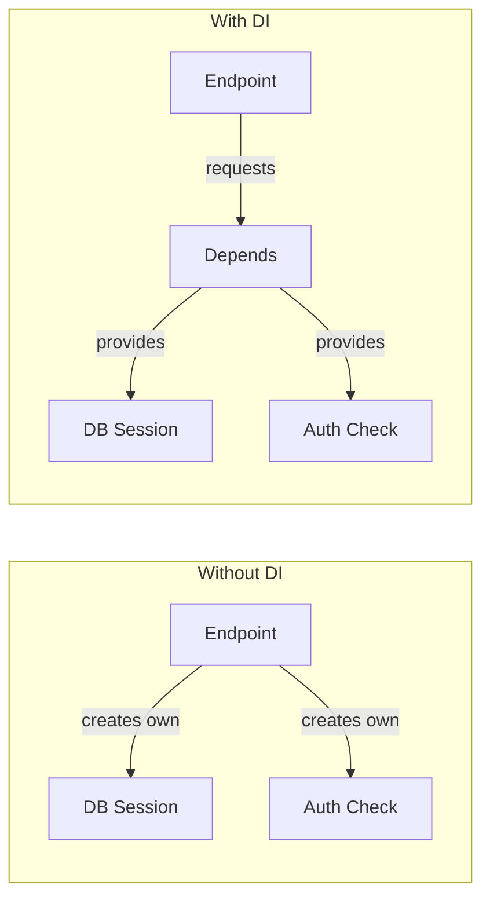
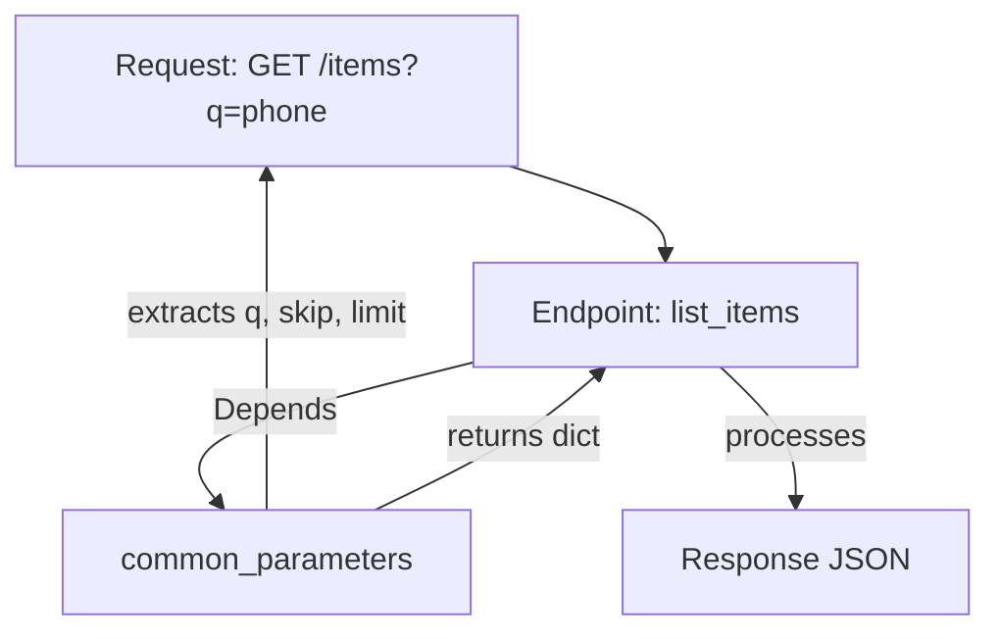

## Dependency Injection — Depends()

যতক্ষণ পর্যন্ত আমরা ছোট ছোট endpoint বানাচ্ছি, ততক্ষণ code সহজ মনে হচ্ছে। কিন্তু যখন project বড় হবে, তখন একই logic বারবার লেখা লাগবে — database session খোলা, user authenticate করা, pagination logic, logging। এই কোড কপি-পেস্ট করলে maintain করা কঠিন। ঠিক এই সমস্যার সমাধান হলো **Dependency Injection (DI)**।

FastAPI এর DI system হলো তার সবচেয়ে শক্তিশালী feature গুলোর একটা — যেটা code কে reusable, testable, আর clean রাখে। এই chapter এ আমরা `Depends()` নিয়ে বিস্তারিত শিখবো।

## Dependency Injection কী?

Dependency Injection হলো এমন একটা pattern — যেখানে একটা function নিজে তার dependency তৈরি না করে, বাইরে থেকে পায়। সহজ কথায় — "আমার database session দরকার, কিন্তু আমি নিজে সেটা খুলবো না — কেউ আমাকে দিয়ে দাও।"



Without DI তে প্রতিটা endpoint নিজে database session create করে, auth check করে। With DI তে endpoint শুধু বলে "আমার X দরকার" — আর FastAPI সেটা provide করে দেয়।

### কেন DI দরকার?

- **Reuse** — একই logic বারবার না লিখে এক জায়গায় রাখা
- **Testing** — test এর সময় real dependency কে fake/mock দিয়ে replace করা
- **Clean code** — endpoint এ শুধু business logic থাকে, setup code নয়
- **Lifecycle management** — database session খোলা আর বন্ধ করা automatic

## Depends() — Basic Usage

FastAPI তে dependency inject করতে `Depends()` ব্যবহার করা হয়। এটা একটা function কে dependency হিসেবে declare করে।

নিচের কোডে একটা simple dependency দেখানো হলো — common query parameter গুলো এক function এ রাখা হয়েছে।

```python
# Basic dependency
from fastapi import FastAPI, Depends

app = FastAPI()

def common_parameters(q: str | None = None, skip: int = 0, limit: int = 10):
    return {"q": q, "skip": skip, "limit": limit}

@app.get("/items")
def list_items(commons: dict = Depends(common_parameters)):
    return {"message": "Listing items", "params": commons}

@app.get("/products")
def list_products(commons: dict = Depends(common_parameters)):
    return {"message": "Listing products", "params": commons}
```

এই কোডে `common_parameters` হলো একটা dependency function — যেটা `q`, `skip`, `limit` নেয় আর একটা dict return করে। `Depends(common_parameters)` দিলে FastAPI স্বয়ংক্রিয়ভাবে এই function টা call করে, parameter গুলো request থেকে collect করে, আর result টা `commons` এ দেয়।

দুটো endpoint (`/items` আর `/products`) একই dependency use করছে — কিন্তু একই logic দুবার লেখা হয়নি। যদি পরে pagination logic পরিবর্তন করতে হয়, শুধু `common_parameters` function এ change করলেই হবে।

```bash
# Both endpoints use the same dependency
curl "http://127.0.0.1:8000/items?q=laptop&skip=0&limit=5"
```

```json
{
  "message": "Listing items",
  "params": {"q": "laptop", "skip": 0, "limit": 5}
}
```

## Dependency যেভাবে Resolve হয়

যখন একটা request আসে, FastAPI একটা chain ধরে dependency resolve করে। নিচের diagram তে সেটা দেখানো হলো।



FastAPI যখন `list_items` কে call করে, সে দেখে `commons: dict = Depends(common_parameters)`। তখন সে `common_parameters` কে call করে, সেই function এর parameter গুলোও request থেকে extract করে (যেহেতু `q`, `skip`, `limit` query parameter)। তারপর result টা `commons` এ দিয়ে endpoint call করে।

## Dependencies with Parameters

Dependency function নিজেও parameter নিতে পারে — আর সেই parameter গুলো request থেকে আসে। এভাবে dependency কে configurable করা যায়।

নিচের কোডে একটা pagination dependency দেখানো হলো — যেটা validation সহ parameter নেয়।

```python
# Pagination dependency with validation
from fastapi import FastAPI, Depends, Query
from pydantic import BaseModel

app = FastAPI()

class PaginationParams(BaseModel):
    skip: int = Query(0, ge=0)
    limit: int = Query(10, ge=1, le=100)

def get_pagination(pagination: PaginationParams):
    return pagination

@app.get("/articles")
def list_articles(pagination: PaginationParams = Depends(get_pagination)):
    return {"skip": pagination.skip, "limit": pagination.limit}
```

এই কোডে `get_pagination` হলো dependency — যেটা `PaginationParams` model থেকে parameter নেয়। `Query(0, ge=0)` দিয়ে validation — `skip` ০ বা তার বেশি, `limit` ১-১০০ এর মধ্যে। এখন যেকোনো endpoint এ `Depends(get_pagination)` দিলেই pagination পেয়ে যাবে।

## Yield Dependencies — Setup আর Cleanup

পর্যন্ত আমরা যে dependency দেখলাম সেগুলো শুধু value return করে। কিন্তু অনেক সময় setup আর cleanup দরকার — যেমন database session খোলার পর কাজ শেষে বন্ধ করা। এর জন্য `yield` ব্যবহার করা হয়।

নিচের কোডে একটা database session dependency দেখানো হলো — যেটা `yield` দিয়ে session দেয়, আর endpoint শেষ হলে session close করে।

```python
# Yield dependency for database session
from fastapi import FastAPI, Depends
from contextlib import contextmanager

app = FastAPI()

# Simulated database session
class DatabaseSession:
    def __init__(self):
        self.is_open = True
        print("Session opened")

    def query(self, table: str):
        if not self.is_open:
            raise RuntimeError("Session is closed")
        return f"Querying {table}"

    def close(self):
        self.is_open = False
        print("Session closed")

def get_db():
    # Setup: create session
    db = DatabaseSession()
    try:
        # Give session to endpoint
        yield db
    finally:
        # Cleanup: always close, even on error
        db.close()

@app.get("/users")
def list_users(db: DatabaseSession = Depends(get_db)):
    result = db.query("users")
    return {"data": result}
```

এই কোডে `get_db` function টা `yield` ব্যবহার করে:
1. `db = DatabaseSession()` — session খোলে (setup)
2. `yield db` — session টা endpoint কে দেয়
3. Endpoint কাজ শেষ করে বা error হলে — `finally` block এ `db.close()` চলে (cleanup)

`finally` ব্যবহার করা হয়েছে তাই error হলে ও session close হবে — কোনো leak হবে না। এটা database connection এর জন্য essential।

> [!note] yield dependency কতবার চলে
> প্রতিটা request এর জন্য dependency আলাদাভাবে চলে। যেমন `/users` এ request আসলে `get_db` চলবে, session খুলবে, endpoint চলবে, তারপর session close হবে। পরের request এ আবার নতুন session খুলবে। কোনো sharing নেই — প্রতিটা request independent।

## Nested Dependencies

একটা dependency আরেকটা dependency কে call করতে পারে। এভাবে dependency গুলো একটা chain বা tree তৈরি করে। এটা FastAPI এর DI এর সবচেয়ে শক্তিশালী দিক।

> [!tip] Dependencies চেইন করা যায় — এক dependency আরেকটাকে call করতে পারে
> তুমি এক dependency এর ভেতরে আরেকটা `Depends()` দিতে পারো। FastAPI স্বয়ংক্রিয়ভাবে পুরো chain resolve করে — প্রতিটা dependency তার নিজের dependency পাবে। এতে complex logic কে ছোট ছোট reusable piece এ ভাগ করা যায়।

নিচের কোডে nested dependency দেখানো হলো — `get_current_user` depend করে `get_db` আর `verify_token` উভয়ের উপর।

```python
# Nested dependencies
from fastapi import FastAPI, Depends, HTTPException, Header

app = FastAPI()

# Simulated database
fake_users_db = {
    "token_abc123": {"id": 1, "name": "Karim", "role": "admin"},
    "token_xyz789": {"id": 2, "name": "Rahim", "role": "user"},
}

def verify_token(authorization: str = Header(...)):
    # Extract token from Authorization header
    if not authorization.startswith("Bearer "):
        raise HTTPException(status_code=401, detail="Invalid auth header")
    token = authorization.replace("Bearer ", "")
    return token

def get_current_user(token: str = Depends(verify_token)):
    # This dependency depends on verify_token
    user = fake_users_db.get(token)
    if not user:
        raise HTTPException(status_code=401, detail="Invalid token")
    return user

@app.get("/me")
def get_profile(user: dict = Depends(get_current_user)):
    return {"user": user}
```

এই কোডে dependency chain টা এমন:

```mermaid
flowchart TD
    R[Request GET /me] --> EP[/me endpoint]
    EP -->|Depends| GCU[get_current_user]
    GCU -->|Depends| VT[verify_token]
    VT -->|Header| AUTH[Authorization header]
    VT -->|returns token| GCU
    GCU -->|looks up user| DB[fake_users_db]
    GCU -->|returns user| EP
    EP -->|response| RES[JSON Response]
```

যখন `/me` তে request আসে:
1. FastAPI দেখে `get_current_user` dependency আছে
2. `get_current_user` তার ভেতরে `verify_token` dependency আছে
3. `verify_token` `Authorization` header থেকে token extract করে
4. `get_current_user` সেই token দিয়ে user খোঁজে
5. Endpoint user পায় আর response দেয়

```bash
# Valid request with token
curl http://127.0.0.1:8000/me -H "Authorization: Bearer token_abc123"
```

```json
{"user": {"id": 1, "name": "Karim", "role": "admin"}}
```

```bash
# Invalid token
curl http://127.0.0.1:8000/me -H "Authorization: Bearer invalid_token"
```

```json
{"detail": "Invalid token"}
```

## Global Dependencies — Router আর App Level

পর্যন্ত আমরা dependency প্রতিটা endpoint এ আলাদা দিচ্ছি। কিন্তু কিছু dependency সব endpoint এ দরকার — যেমন API key check, logging, rate limiting। এগুলো প্রতিটা endpoint এ না দিয়ে global level এ দেওয়া যায়।

### App-level Dependencies

নিচের কোডে পুরো app এর জন্য একটা global dependency দেখানো হলো — সব request এ API key check হবে।

```python
# App-level global dependency
from fastapi import FastAPI, Depends, Header, HTTPException

def verify_api_key(x_api_key: str = Header(...)):
    if x_api_key != "my-secret-key":
        raise HTTPException(status_code=403, detail="Invalid API key")
    return x_api_key

# Apply to all endpoints in this app
app = FastAPI(dependencies=[Depends(verify_api_key)])

@app.get("/public")
def public_endpoint():
    return {"message": "This also requires API key"}

@app.get("/data")
def data_endpoint():
    return {"data": "secret data"}
```

এই কোডে `FastAPI(dependencies=[Depends(verify_api_key)])` দিয়ে পুরো app এ verify_api_key dependency যোগ করা হয়েছে। এখন `/public` আর `/data` — কোনো endpoint এই `Depends(verify_api_key)` explicitly দেওয়া নেই, কিন্তু দুটোতেই API key লাগবে।

### Router-level Dependencies

অনেক সময় পুরো app নয়, শুধু কিছু endpoint এ dependency দরকার। যেমন admin router এ auth দরকার, কিন্তু public router এ নয়। সেক্ষেত্রে router-level dependency ব্যবহার করা হয়।

```python
# Router-level dependencies
from fastapi import FastAPI, APIRouter, Depends, HTTPException

app = FastAPI()

def require_admin(user: dict = Depends(get_current_user)):
    if user["role"] != "admin":
        raise HTTPException(status_code=403, detail="Admin access required")
    return user

# All routes in this router require admin
admin_router = APIRouter(
    prefix="/admin",
    tags=["admin"],
    dependencies=[Depends(require_admin)]
)

@admin_router.get("/users")
def admin_list_users():
    return {"users": "all users"}

@admin_router.delete("/users/{user_id}")
def admin_delete_user(user_id: int):
    return {"deleted": user_id}

# Public router — no auth required
public_router = APIRouter(prefix="/public", tags=["public"])

@public_router.get("/info")
def public_info():
    return {"info": "public data"}

app.include_router(admin_router)
app.include_router(public_router)
```

এই কোডে:
- `admin_router` এ `dependencies=[Depends(require_admin)]` দেওয়া — এই router এর সব endpoint এ admin check হবে
- `public_router` এ কোনো dependency নেই — সবাই access করতে পারবে

> [!tip] Router vs App level
> App-level dependency সব endpoint এ apply হয়। Router-level dependency শুধু সেই router এর endpoint এ apply হয়। দুটোই থাকলে দুটোই চলবে। বেশিরভাগ ক্ষেত্রে router-level বেশি flexible।

## dependency_overrides — Testing এর জন্য

Testing এর সময় আসল database বা আসল auth ব্যবহার করা উচিত নয় — কারণ সেটা slow আর risky। এর বদলে dependency গুলোকে fake/mock version দিয়ে replace করা যায়। এর জন্য `dependency_overrides` ব্যবহার করা হয়।

নিচের কোডে দেখানো হলো কীভাবে test এর সময় database dependency কে mock দিয়ে replace করা যায়।

```python
# Testing with dependency overrides
from fastapi.testclient import TestClient
from fastapi import FastAPI, Depends

app = FastAPI()

# Real dependency — connects to actual database
def get_db():
    return {"connection": "real_database", "data": ["real", "data"]}

@app.get("/items")
def list_items(db: dict = Depends(get_db)):
    return {"source": db["connection"], "items": db["data"]}

# --- Test code ---
def mock_db():
    return {"connection": "mock_database", "data": ["mock", "test"]}

# Override the dependency for testing
app.dependency_overrides[get_db] = mock_db

client = TestClient(app)
response = client.get("/items")
print(response.json())
```

```text
{'source': 'mock_database', 'items': ['mock', 'test']}
```

এই কোডে `app.dependency_overrides[get_db] = mock_db` দিয়ে `get_db` কে `mock_db` দিয়ে replace করা হয়েছে। এখন যখন `/items` call হবে, FastAPI `get_db` না চালিয়ে `mock_db` চালাবে। Test এ real database লাগছে না — দ্রুত আর safe।

> [!important] dependency_overrides কেন শক্তিশালী
> এটা ছাড়া testing এর সময় আসল database, external API, বা file system touch করতে হতো — যেটা slow, flaky, আর risky। `dependency_overrides` দিয়ে যেকোনো dependency কে mock দিয়ে replace করা যায়, আর test শেষে `app.dependency_overrides.clear()` দিলে আবার original ফিরে আসে।

## Real Example: Pagination Dependency

সব একসাথে মিলিয়ে একটা আসল pagination dependency দেখি — যেটা যেকোনো endpoint এ reusable।

```python
# Reusable pagination dependency
from fastapi import FastAPI, Depends, Query
from pydantic import BaseModel
from typing import Generic, TypeVar, List

app = FastAPI()

T = TypeVar("T")

class Page(BaseModel, Generic[T]):
    items: List[T]
    total: int
    page: int
    size: int
    pages: int

class Pagination:
    def __init__(self, page: int = Query(1, ge=1), size: int = Query(10, ge=1, le=100)):
        self.page = page
        self.size = size
        self.skip = (page - 1) * size

def get_pagination(pagination: Pagination = Depends()):
    return pagination

def paginate(data: list, pagination: Pagination = Depends(get_pagination)) -> Page:
    total = len(data)
    items = data[pagination.skip : pagination.skip + pagination.size]
    pages = (total + pagination.size - 1) // pagination.size
    return Page(
        items=items,
        total=total,
        page=pagination.page,
        size=pagination.size,
        pages=pages
    )

# Usage in endpoints
fake_products = [f"Product {i}" for i in range(1, 55)]

@app.get("/products")
def list_products(page: Page = Depends(paginate)):
    # 'data' comes from somewhere — using fake_products for demo
    # In real life, paginate would receive the query result
    return page
```

এই কোডে:
- `Pagination` class — page আর size parameter সহ, `skip` calculate করে
- `get_pagination` — dependency হিসেবে Pagination instance দেয়
- `paginate` — data list আর pagination নিয়ে `Page` response তৈরি করে
- Endpoint এ `Depends(paginate)` দিলেই pagination ready

## Real Example: Auth Dependency

আরেকটা আসল example — authentication dependency। এটা বেশিরভাগ API তে দরকার হয়।

```python
# Authentication dependency chain
from fastapi import FastAPI, Depends, HTTPException, Header, status
from pydantic import BaseModel

app = FastAPI()

class User(BaseModel):
    id: int
    username: str
    role: str

# Simulated token store
token_store = {
    "admin_token": User(id=1, username="karim", role="admin"),
    "user_token": User(id=2, username="rahim", role="user"),
}

def get_token(authorization: str = Header(...)) -> str:
    if not authorization.startswith("Bearer "):
        raise HTTPException(
            status_code=status.HTTP_401_UNAUTHORIZED,
            detail="Invalid authorization header"
        )
    return authorization.removeprefix("Bearer ").strip()

def get_current_user(token: str = Depends(get_token)) -> User:
    user = token_store.get(token)
    if not user:
        raise HTTPException(
            status_code=status.HTTP_401_UNAUTHORIZED,
            detail="Invalid or expired token"
        )
    return user

def require_admin(user: User = Depends(get_current_user)) -> User:
    if user.role != "admin":
        raise HTTPException(
            status_code=status.HTTP_403_FORBIDDEN,
            detail="Admin access required"
        )
    return user

# Endpoints with different auth levels
@app.get("/profile")
def profile(user: User = Depends(get_current_user)):
    return user

@app.get("/admin/dashboard")
def admin_dashboard(user: User = Depends(require_admin)):
    return {"message": f"Welcome admin {user.username}"}
```

এই কোডে তিনটি dependency chain আছে:
- `get_token` — header থেকে token extract
- `get_current_user` — token থেকে user খোঁজে (depends on `get_token`)
- `require_admin` — user admin কি না check (depends on `get_current_user`)

`/profile` তে যেকোনো logged-in user access করতে পারবে। কিন্তু `/admin/dashboard` তে শুধু admin পারবে — কারণ সেটায় `require_admin` dependency দেওয়া।

## DI কেন Powerful?

| সুবিধা | ব্যাখ্যা |
|--------|---------|
| **Reusable** | এক logic একবার লেখো, সব endpoint এ use করো |
| **Testable** | `dependency_overrides` দিয়ে mock করো |
| **Clean** | Endpoint এ শুধু business logic |
| **Composable** | Dependency গুলো chain করো |
| **Automatic** | FastAPI সব নিজে থেকে resolve করে |
| **Type-safe** | Type hint থেকে Swagger docs তৈরি হয় |

## Summary

এই chapter এ আমরা শিখলাম:

- **Dependency Injection** হলো "আমার দরকার, তুমি দাও" pattern
- `Depends()` দিয়ে dependency declare করা
- Dependency function নিজেও parameter নিতে পারে
- `yield` দিয়ে setup + cleanup (database session)
- Nested dependency — এক dependency আরেকটাকে call করে
- App-level আর router-level global dependency
- `dependency_overrides` দিয়ে testing এ mock
- Real-world pagination আর auth dependency example
- DI code কে reusable, testable, আর clean রাখে

এই chapter দিয়ে FastAPI এর core concept গুলো শেষ। পরের chapter গুলোতে আমরা database integration, authentication, testing, আর deployment নিয়ে আলোচনা করবো — সবখানে এই DI concept টা ব্যবহার হবে।