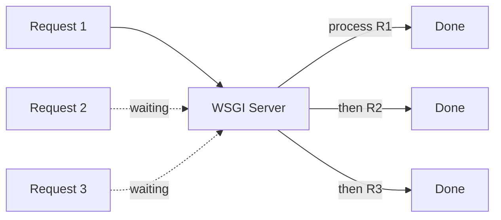
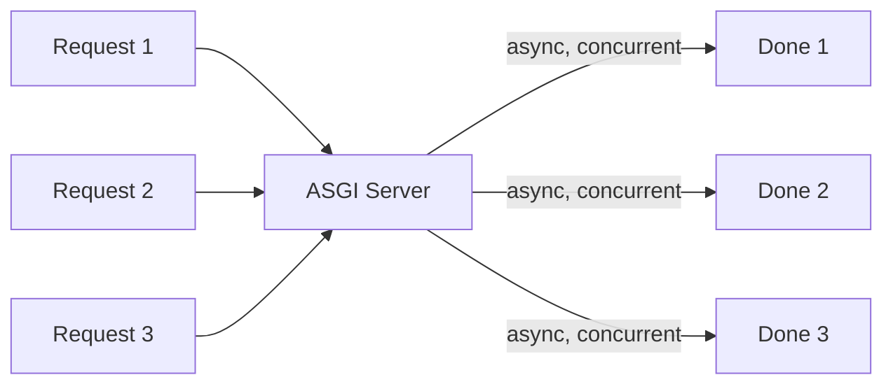
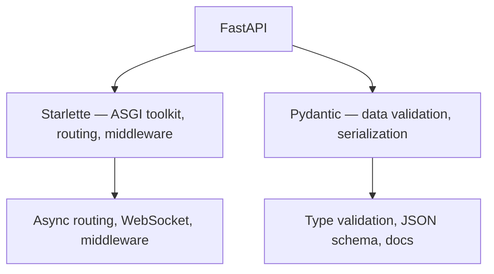

## FastAPI কী ও কেন শিখবে

তুমি হয়তো শুনেছো যে Python দিয়ে দ্রুত API বানানো যায় — কিন্তু Flask দিয়ে করলে একটু ধীর, Django দিয়ে করলে অনেক ভারী। আর তার মাঝে AI/ML model টা কীভাবে serve করবে সেটাই আলাদা ঝামেলা। ঠিক এই জায়গাতেই FastAPI আসে — দ্রুত, হালকা, async, আর type-safe।

আজকের এই chapter এ আমরা দেখবো FastAPI আসলে কী, কেন এটা এত জনপ্রিয়, আর কেন ২০২৬ সালে Python backend বানাতে গেলে FastAPI প্রথম পছন্দ হয়ে গেছে।

## FastAPI কী?

FastAPI হলো একটা **modern, fast, web framework** — Python দিয়ে API বানানোর জন্য। এটা Sebastián Ramírez ২০১৮ সালে তৈরি করেছিলেন, আর এখন এটা Python ecosystem এর সবচেয়ে জনপ্রিয় API framework গুলোর একটা।

সহজ কথায় বললে — FastAPI দিয়ে তুমি কয়েক লাইন কোড লিখেই একটা production-ready API বানিয়ে ফেলতে পারো, যেটাতে আছে:

- **Automatic validation** — request data টা ঠিক আছে কি না, সেটা অটোমেটিক check হয়
- **Auto documentation** — Swagger UI আর ReDoc docs নিজে থেকেই তৈরি হয়ে যায়
- **Async support** — হাজার হাজার request একসাথে handle করতে পারে
- **Type hints** — Python type hints থেকে সব validation আর docs তৈরি হয়

```python
# A complete FastAPI app in 5 lines
from fastapi import FastAPI

app = FastAPI()

@app.get("/")
def read_root():
    return {"message": "Hello, World!"}
```

উপরের কোডটা দেখো — মাত্র ৫ লাইন। কিন্তু এই ৫ লাইনের ভেতরে আছে একটা সম্পূর্ণ HTTP endpoint, automatic JSON response, আর `/docs` এ গেলে পুরো Swagger documentation। Flask এ এই সব পেতে হলে অনেক বেশি কোড লিখতে হতো আর তৃতীয় পক্ষের library লাগতো।

> [!tip] FastAPI শিখতে Python basics + HTTP জানা থাকলেই হবে
> তোমার Python এর function, dictionary, type hints আর HTTP method (GET, POST) সম্পর্কে ধারণা থাকলেই FastAPI শুরু করতে পারো। Web development এর অভিজ্ঞতা না থাকলেও চলবে।

## ASGI vs WSGI — কেন Async গুরুত্বপূর্ণ

Python এর web framework গুলো দুই ভাবে কাজ করে — WSGI আর ASGI। এই দুটোর পার্থক্য বুঝলে FastAPI এর গুরুত্ব পরিষ্কার হবে।

### WSGI (পুরোনো পদ্ধতি)

WSGI (Web Server Gateway Interface) হলো Python এর traditional web server interface। Flask, Django — এরা সবাই WSGI তে চলে। WSGI এর সমস্যা হলো এটা **synchronous** — একটা request handle করার সময় আরেকটা request কে অপেক্ষা করতে হয়।



মানে যদি তোমার API একটা database query করে যেটাতে ৫০০ms লাগে — সেই ৫০০ms সময় server ব্লক হয়ে থাকবে, আর অন্য কোনো request handle করতে পারবে না।

### ASGI (নতুন পদ্ধতি)

ASGI (Asynchronous Server Gateway Interface) হলো WSGI এর asynchronous ভার্সন। এটা **concurrent** — একই সময়ে অনেকগুলো request handle করতে পারে। FastAPI, Starlette, Django (ASGI mode) — এরা ASGI তে চলে।



ASGI তে যখন একটা request database বা external API এর জন্য অপেক্ষা করে, সেই সময়টাতে server অন্য request গুলো handle করতে পারে। এর ফলে একই hardware এ অনেক বেশি traffic handle করা যায়।

| বিষয় | WSGI | ASGI |
|-------|------|------|
| Model | Synchronous | Asynchronous |
| Concurrency | এক request এক সময় | একসাথে অনেক request |
| Frameworks | Flask, Django (traditional) | FastAPI, Starlette |
| Best for | CPU-heavy tasks | I/O-heavy, API, ML serving |
| Speed | মাঝারি | অনেক দ্রুত |

> [!note] Async সবসময় দ্রুত নয়
> Async যে সব ক্ষেত্রে দ্রুত — সেটা নয়। যদি তোমার API শুধু CPU-heavy calculation করে (যেমন image processing), সেক্ষেত্রে sync আর async এর পার্থক্য কম। Async এর সুবিধা সবচেয়ে বেশি যখন API অনেক I/O করে — database query, external API call, file read/write।

## Starlette + Pydantic = FastAPI

FastAPI নিজে একা কিছু নয় — এটা দুটো শক্তিশালী library কে combine করে বানানো:



### Starlette — ASGI Toolkit

Starlette হলো একটা lightweight ASGI framework/toolkit। এটা দেয় routing, middleware, WebSocket support, আর async request handling। FastAPI এর সব async capability আসলে Starlette থেকেই আসে। Starlette 1.0.0 (২০২৬ সালের stable release) এসে অনেক improvement নিয়ে এসেছে।

### Pydantic — Validation Engine

Pydantic হলো একটা data validation library। তুমি Python class লিখো type hints সহ — আর Pydantic সেটাকে validate করে, JSON এ serialize করে, আর schema তৈরি করে। FastAPI এর validation আর auto documentation ক্ষমতা Pydantic থেকেই আসে। Pydantic v2 (current) Rust core দিয়ে বানানো — তাই v1 এর চেয়ে ৫-৫০ গুণ দ্রুত।

এই দুটো মিলে FastAPI কে দেয়:
- Starlette এর কাছ থেকে — speed, async, routing
- Pydantic এর কাছ থেকে — validation, type safety, docs

## Performance Benchmarks

FastAPI এর performance নিয়ে কথা বললে সবাই reference করে third-party benchmarks। সবচেয়ে উল্লেখিয় হলো **TechEmpower Framework Benchmark** — যেখানে বিভিন্ন web framework এর request-per-second (RPS) পরিমাপ করা হয়।

FastAPI (uvicorn সহ) typical benchmark এ **১৫,০০০ থেকে ২০,০০০ RPS** দেয় — যেটা Python ecosystem এ অন্যতম দ্রুত।

| Framework | Language | Approx RPS | Async |
|-----------|----------|-----------|-------|
| FastAPI + uvicorn | Python | 15,000–20,000 | Yes |
| Flask + gunicorn | Python | ~2,000–5,000 | No |
| Django + gunicorn | Python | ~2,000–4,000 | Partial |
| Express.js | Node.js | ~15,000–25,000 | Yes |
| Spring Boot | Java | ~20,000–30,000 | Yes |

> [!note] Benchmark সবসময় বাস্তব নয়
> এই সংখ্যাগুলো "hello world" style benchmark থেকে নেওয়া। Real-world application এ database query, business logic, আর external API call থাকে — তাই actual RPS অনেক কম হবে। কিন্তু relative comparison ঠিক থাকে — FastAPI সবসময় Flask/Django এর চেয়ে দ্রুত।

## কেন FastAPI AI/ML Backend এ #1

এই একটা কারণেই FastAPI এত জনপ্রিয় হয়েছে। আজকে প্রায় প্রতিটা AI startup, ML team, বা LLM-based product — সবাই FastAPI ব্যবহার করে। কারণ কী?

### ১. Async — ML model serve করার জন্য পারফেক্ট

ML model inference এ সময় লাগে — GPU তে ২০০ms, CPU তে ২ সেকেন্ড। এই সময়টাতে server ব্লক হয়ে থাকলে চলবে না। Async হলে এক model inference চলাকালীন অন্য request গুলো queue তে থাকে, আর model ready হলে response পাঠানো হয়।

### ২. Pydantic — জটিল ML input/output সহজে validate

ML model এর input গুলো জটিল হয় — nested JSON, list of features, image base64। Pydantic দিয়ে এসব সহজে define আর validate করা যায়।

নিচের উদাহরণে একটা ML prediction endpoint দেখানো হলো — যেখানে input আসে features হিসেবে, আর output যায় prediction আর probability সহ।

```python
# ML prediction endpoint with FastAPI
from fastapi import FastAPI
from pydantic import BaseModel, Field
from typing import List

app = FastAPI()

class PredictionInput(BaseModel):
    features: List[float] = Field(..., min_length=1, max_length=100)

class PredictionOutput(BaseModel):
    prediction: int
    probability: float
    model_version: str

@app.post("/predict", response_model=PredictionOutput)
async def predict(input_data: PredictionInput):
    # In real life, call your ML model here
    result = sum(input_data.features) / len(input_data.features)
    prediction = 1 if result > 0.5 else 0
    return PredictionOutput(
        prediction=prediction,
        probability=result,
        model_version="v2.1.0"
    )
```

এই কোডে `PredictionInput` আর `PredictionOutput` দুটো Pydantic model — যেগুলো input আর output এর structure define করে। `response_model=PredictionOutput` দিয়ে আমরা নিশ্চিত করছি যে response টা exact এই structure এ যাবে। যদি কেউ ১০০ এর বেশি feature পাঠায়, `max_length=100` validation এ error দেবে — model crash করবে না।

### ৩. Auto docs — ML team এর জন্য বিশাল সুবিধা

ML engineer দের কাছে API docs গুরুত্বপূর্ণ — কারণ frontend team বা third-party user দের জানতে হয় API কী কী input নেয়। FastAPI এ `/docs` (Swagger) আর `/redoc` (ReDoc) অটোমেটিক তৈরি করে দেয় — কোনো extra code ছাড়া।

## Comparison: FastAPI vs Flask vs Django vs Express.js

এখন দেখি FastAPI আর অন্যান্য popular framework গুলোর মধ্যে পার্থক্য কী। এটা জানলে তুমি বুঝবে কখন কোনটা ব্যবহার করবে।

| বিষয় | FastAPI | Flask | Django | Express.js |
|-------|---------|-------|--------|-----------|
| Language | Python | Python | Python | JavaScript |
| Async | Native ASGI | No (sync) | Partial | Native |
| Validation | Pydantic (auto) | Manual | Manual/DRF | Manual |
| API Docs | Auto (Swagger) | Manual | Manual | Manual |
| Learning Curve | সহজ | সহজ | কঠিন | সহজ |
| Best for | API, ML backend | Simple API | Full web app | API, SPA backend |
| ORM | No (choose) | No | Yes (Django ORM) | No |
| Speed | দ্রুত | মাঝারি | ধীর | দ্রুত |

প্রতিটার নিজস্ব use case আছে:

- **FastAPI** — শুধু API বানাতে চাইলে, বিশেষ করে ML/AI backend, microservice
- **Flask** — ছোট, simple tool বা prototype বানাতে চাইলে
- **Django** — full web application (admin panel, auth, ORM সব একসাথে দরকার হলে)
- **Express.js** — JavaScript/TypeScript ecosystem এ থাকতে চাইলে, frontend আর backend একই ভাষায়

> [!tip] কখন FastAPI বেছে নেবে
> যদি তোমার দরকার হয় — শুধু API (HTML page নয়), async performance, auto validation, আর ML model serve করা। তাহলে FastAPI ই best choice। কিন্তু যদি তোমার admin panel, form, template rendering দরকার হয় — Django বেটার।

## FastAPI এর সীমাবদ্ধতা

FastAPI সব কিছু নয়। এর কিছু limitation ও আছে:

- **No built-in ORM** — Django এর মতো ORM নেই। SQLAlchemy বা Tortoise ORM আলাদা ব্যবহার করতে হয়।
- **No admin panel** — Django এর admin panel এর মতো কিছু নেই।
- **No template rendering** — শুধু API বানানোর জন্য, HTML page render করার জন্য নয়।
- **Learning async** — যদি Python async এ তুমি নতুন হও, প্রথমে একটু কনফিউশন হতে পারে।

কিন্তু এই limitation গুলো আসলে feature ই — FastAPI এর কাজ শুধু API, আর সেটাই দারুণ করে।

## এই Series এ তুমি যা শিখবে

এই FastAPI documentation series এ আমরা step by step শিখবো:

1. **Setup ও First App** — install করা, first API বানানো, run করা
2. **Path, Query ও Request Body** — parameter গ্রহণ করা, validation করা
3. **Pydantic v2 গভীরে** — data model, validator, serialization
4. **Dependency Injection** — reusable আর testable code লেখা
5. **Database Integration** — SQLAlchemy সহ database কানেক্ট করা
6. **Authentication** — JWT, OAuth2 দিয়ে secure API
7. **Testing** — pytest দিয়ে API test করা
8. **Deployment** — production এ deploy করা


প্রতিটা chapter এ real-world example থাকবে, code থাকবে, আর ব্যাখ্যা থাকবে — যাতে তুমি শুধু পড়ে না, বুঝে শিখো।

## Summary

এই chapter এ আমরা শিখলাম:

- **FastAPI** হলো modern, async Python web framework — API বানানোর জন্য
- **ASGI** async, **WSGI** sync — FastAPI ASGI তে চলে, তাই দ্রুত
- **Starlette** (routing, async) + **Pydantic** (validation) = FastAPI
- FastAPI **১৫,০০০-২০,০০০ RPS** দেয় — Python এ অন্যতম দ্রুত
- AI/ML backend এর জন্য FastAPI #1 choice — async, validation, auto docs
- Flask, Django, Express.js এর সাথে comparison এ FastAPI API এর জন্য best

পরের chapter এ আমরা FastAPI install করবো, প্রথম app বানাবো, আর Swagger docs দেখবো। চলো শুরু করি!