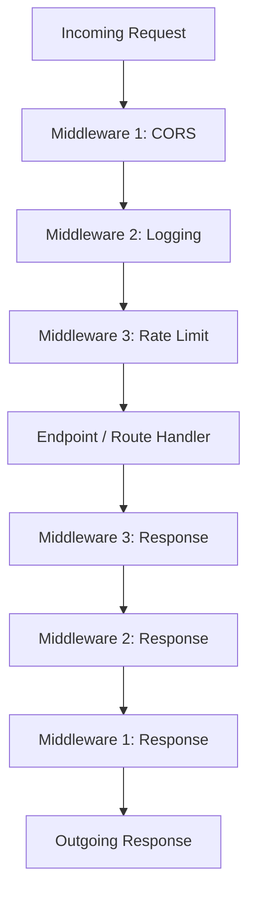
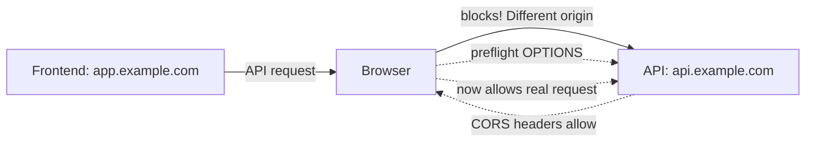
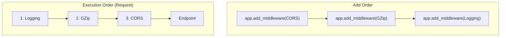

## Middleware ও CORS

তুমি একটা API বানালে — কিন্তু সামনে আরও অনেক কিছু আছে। Request আসার সাথে সাথে কি সরাসরি তোমার endpoint এ যাবে? নাহ্। আগে দরকার logging, CORS check, rate limiting, GZip compression — এই সব। এই জিনিসগুলোকে আমরা middleware দিয়ে handle করি।

এই chapter এ আমরা middleware কী, কীভাবে কাজ করে, CORS কেন দরকার, আর production-এ কীভাবে middleware সেট আপ করতে হয় — সব শিখবো।

## Middleware কী?

Middleware হলো এমন একটা layer — যেটা request আর response এর মাঝে বসে। প্রতিটা request প্রথমে middleware গুলোর ভেতর দিয়ে যায়, তারপর endpoint এ পৌঁছায়। আবার response ফেরার সময়ও middleware গুলোর ভেতর দিয়ে যায়।

সহজ কথায় — middleware হলো একটা "checkpoint"। Request আসলে সে check করবে, response যাবে সেও check করবে।



উপরের diagram টা খেয়াল করো — request টা প্রথমে Middleware 1 এ ঢোকে, তারপর 2, তারপর 3, তারপর endpoint এ। কিন্তু response ফেরার সময় উল্টা ক্রমে যায় — প্রথমে Middleware 3, তারপর 2, তারপর 1। এটাকে "onion model" ও বলে।

### Middleware দিয়ে কী করা যায়?

- **Logging** — কোন request আসলো, কত সময় লাগলো
- **Authentication** — request এ valid token আছে কি না
- **CORS** — cross-origin request গুলো allow করা
- **Compression** — response কে GZip দিয়ে compress করা
- **Rate limiting** — কেউ অতিরিক্ত request পাঠাচ্ছে কি না
- **Request modification** — header যোগ করা, body পরিবর্তন করা

## CORS — Cross-Origin Resource Sharing

তুমি হয়তো এই error দেখেছো: `Access-Control-Allow-Origin`। এটা CORS এর error। চলো বুঝি এটা আসলে কী।

Browser এর একটা security rule আছে — **Same-Origin Policy**। এর মানে হলো, যদি তোমার frontend `https://mysite.com` এ চলে, তাহলে সে শুধু `https://mysite.com` এর API তে request পাঠাতে পারবে। অন্য কোনো domain এ request পাঠালে browser সেটা block করে দেবে।

কিন্তু বাস্তবে আমরা চাই — frontend `https://app.example.com` এ থাকুক, আর API `https://api.example.com` এ। এই ক্ষেত্রে browser এই request block করবে। এই block তুলতেই CORS দরকার।



যখন browser দেখে যে request টা different origin এ যাচ্ছে, তখন সে আগে একটা **preflight request** (OPTIONS method) পাঠায়। API যদি সঠিক CORS headers দিয়ে reply করে, তবে browser actual request পাঠাতে দেয়।

## CORSMiddleware Setup

FastAPI তে CORS enable করা খুব সহজ — `CORSMiddleware` ব্যবহার করলেই হয়। নিচের কোডে একটা সম্পূর্ণ CORS setup দেখানো হলো।

```python
# CORS middleware setup
from fastapi import FastAPI
from fastapi.middleware.cors import CORSMiddleware

app = FastAPI()

app.add_middleware(
    CORSMiddleware,
    allow_origins=[
        "https://app.example.com",    # Frontend domain
        "https://admin.example.com",  # Admin panel
        "http://localhost:3000",      # Local dev frontend
    ],
    allow_credentials=True,           # Allow cookies/auth headers
    allow_methods=["GET", "POST", "PUT", "PATCH", "DELETE"],
    allow_headers=["Authorization", "Content-Type", "X-Request-ID"],
    max_age=3600,                     # Cache preflight response for 1 hour
)
```

এই কোডে যা যা হচ্ছে:

- `allow_origins` — কোন কোন domain থেকে request allow করবে, সেটা list আকারে দেওয়া
- `allow_credentials=True` — যদি cookie বা Authorization header পাঠাতে হয়, তাহলে এটা true রাখতে হবে
- `allow_methods` — কোন HTTP method গুলো allow করবে
- `allow_headers` — request এ কোন header গুলো থাকতে পারবে
- `max_age=3600` — preflight response টা browser ১ ঘণ্টা cache করে রাখবে, তারপর আবার preflight পাঠাবে

এই কনফিগ দিলে শুধু তিনটা domain থেকেই request আসতে পারবে। অন্য কোনো domain থেকে এলে browser সেটা block করবে।

> [!important] Production-এ `allow_origins=["*"]` দেবেন না!
> `allow_origins=["*"]` মানে যেকোনো domain থেকে request allow করা। এটা dev এর সময় ঠিক আছে, কিন্তু production-এ এটা বিপজ্জনক। যেকোনো malicious website তোমার API তে request পাঠাতে পারবে। শুধু তোমার নির্দিষ্ট frontend domain গুলো allow করো। আর `allow_credentials=True` দিলে `allow_origins=["*"]` কাজই করবে না — browser এটা reject করে।

## Custom Middleware তৈরি

FastAPI তে নিজের middleware বানানো যায় `@app.middleware("http")` decorator দিয়ে। নিচের কোডে একটা request logging middleware দেখানো হলো।

```python
# Custom request logging middleware
import time
import logging

logger = logging.getLogger("api")

@app.middleware("http")
async def log_requests(request: Request, call_next):
    start_time = time.time()

    # Process the request
    response = await call_next(request)

    # Calculate duration
    duration_ms = (time.time() - start_time) * 1000

    logger.info(
        f"method={request.method} path={request.url.path} "
        f"status={response.status_code} duration={duration_ms:.2f}ms"
    )

    # Add custom header to response
    response.headers["X-Process-Time"] = f"{duration_ms:.2f}ms"
    return response
```

এই middleware টা প্রতিটা request এর জন্য method, path, status code, আর duration log করছে। এছাড়া response এ একটা `X-Process-Time` header যোগ করছে।

`call_next(request)` হলো সেই function যেটা request কে পরবর্তী middleware বা endpoint এ পাঠায়। এর আগের code টা request processing এর আগে চলে, আর পরের code টা response ফেরার পর চলে।

### আরেকটা example — API key validation middleware

```python
# API key check middleware for specific routes
from fastapi import Request, HTTPException

@app.middleware("http")
async def api_key_middleware(request: Request, call_next):
    # Only check for /api/v1 routes
    if request.url.path.startswith("/api/v1"):
        api_key = request.headers.get("X-API-Key")
        if not api_key or api_key != "my-secret-key":
            raise HTTPException(status_code=401, detail="Invalid API key")

    return await call_next(request)
```

এই middleware টা শুধু `/api/v1` দিয়ে শুরু হওয়া route গুলোর জন্য API key check করে। যদি `X-API-Key` header এ সঠিক key না থাকে, তাহলে 401 error দেয়।

## Built-in Middleware গুলো

FastAPI (Starlette) এ কিছু built-in middleware আছে। চলো দেখি সেগুলো কী করে।

### GZipMiddleware

```python
# GZip compression for faster response
from fastapi.middleware.gzip import GZipMiddleware

app.add_middleware(GZipMiddleware, minimum_size=1000)
```

এই middleware response কে GZip দিয়ে compress করে। `minimum_size=1000` মানে শুধু যেসব response ১০০০ byte এর বেশি, সেগুলো compress হবে। ছোট response এর জন্য compression করলে উল্টো overhead বেশি হয়।

এটা খুব useful — কারণ বড় JSON response গুলো compress হলে network transfer অনেক কম সময়ে হয়।

### TrustedHostMiddleware

```python
# Only allow specific host headers
from fastapi.middleware.trustedhost import TrustedHostMiddleware

app.add_middleware(
    TrustedHostMiddleware,
    allowed_hosts=["example.com", "api.example.com", "*.example.com"],
)
```

এই middleware request এর `Host` header check করে। যদি কেউ ভুল host দিয়ে request পাঠায়, তাহলে 400 error দেয়। এটা HTTP Host Header attack প্রতিরোধ করে।

`*.example.com` দিলে যেকোনো subdomain allow করবে।

## Rate Limiting Middleware

API তে যদি কেউ অতিরিক্ত request পাঠায়, তাহলে server ক্ষতিগ্রস্ত হতে পারে। Rate limiting দিয়ে আমরা নির্দিষ্ট সময়ে কতগুলো request allow করব, সেটা নির্ধারণ করি।

নিচের কোডে একটা simple custom rate limiter দেখানো হলো।

```python
# Simple in-memory rate limiter
import time
from collections import defaultdict
from fastapi import Request, HTTPException

# Store request counts: {ip: [(timestamp, count)]}
request_counts: dict[str, list[float]] = defaultdict(list)
RATE_LIMIT = 60  # 60 requests per minute
WINDOW_SECONDS = 60

@app.middleware("http")
async def rate_limit_middleware(request: Request, call_next):
    client_ip = request.client.host
    now = time.time()

    # Remove old entries outside the window
    request_counts[client_ip] = [
        ts for ts in request_counts[client_ip]
        if now - ts < WINDOW_SECONDS
    ]

    # Check if limit exceeded
    if len(request_counts[client_ip]) >= RATE_LIMIT:
        raise HTTPException(
            status_code=429,
            detail="Rate limit exceeded. Try again later."
        )

    # Record this request
    request_counts[client_ip].append(now)

    return await call_next(request)
```

এই rate limiter টা প্রতিটা IP এর জন্য ৬০ সেকেন্ডে সর্বোচ্চ ৬০টা request allow করে। এর বেশি হলে 429 (Too Many Requests) error দেয়।

তবে এটা in-memory — single process এ কাজ করবে। যদি multiple worker চালাও, তাহলে Redis ভিত্তিক rate limiter দরকার। সেজন্য `slowapi` library ব্যবহার করতে পারো।

```python
# Rate limiting with slowapi (Redis-backed for production)
from slowapi import Limiter
from slowapi.util import get_remote_address
from slowapi.middleware import SlowAPIMiddleware

limiter = Limiter(key_func=get_remote_address, storage_uri="redis://localhost:6379")
app.state.limiter = limiter
app.add_middleware(SlowAPIMiddleware)

@app.get("/expensive-endpoint")
@limiter.limit("5/minute")
async def expensive_operation(request: Request):
    return {"status": "done"}
```

`slowapi` Redis ব্যবহার করে, তাই multiple worker এর সাথেও কাজ করে। `@limiter.limit("5/minute")` দিলে এই endpoint এ প্রতি মিনিটে সর্বোচ্চ ৫টা request allow করবে।

## Middleware Execution Order

FastAPI তে middleware গুলো যে ক্রমে add করা হয়, সে ক্রমেই চলে না। এখানে একটা গুরুত্বপূর্ণ নিয়ম আছে।



নিয়ম টা হলো — **last added middleware is first executed**। তুমি CORS, তারপর GZip, তারপর Logging add করলে — request আসার সময় ক্রম হবে: Logging → GZip → CORS → Endpoint।

কেন এমন? কারণ middleware গুলো stack আকারে থাকে। Last in, first out (LIFO)।

```python
# Order matters! Add in reverse of desired execution order
app.add_middleware(CORSMiddleware, ...)     # Executed 3rd (outermost for response)
app.add_middleware(GZipMiddleware, ...)     # Executed 2nd
app.add_middleware(LoggingMiddleware, ...)  # Executed 1st (innermost, closest to request)
```

উপরের কোডে Logging middleware সবার আগে execute হবে (request এর সময়), কারণ সে সবার শেষে add হয়েছে। এর মানে হলো — তোমার যে middleware টা সবচেয়ে আগে request দেখতে চাও, সেটা সবার শেষে add করতে হবে।

> [!note] Middleware add করার ক্রম নিয়ে ভাবো
> CORS সাধারণত প্রথম add করা উচিত, যাতে সে response এর সবচেয়ে বাইরে থাকে। Logging সবচেয়ে শেষে add করো, যাতে সে প্রতিটা request এর actual duration পায় (অন্য সব middleware এর সাথে)।

## Common Middleware Table

নিচের table তে common middleware গুলো আর তাদের purpose দেখানো হলো।

| Middleware | Purpose | When to Use |
|---|---|---|
| `CORSMiddleware` | Cross-origin request allow করা | Frontend আর API আলাদা domain এ থাকলে |
| `GZipMiddleware` | Response compress করা | বড় JSON response পাঠানো হলে |
| `TrustedHostMiddleware` | Host header validate করা | Production-এ security এর জন্য |
| `SessionMiddleware` | Cookie-based session | Session-based auth এর জন্য |
| `HTTPSRedirectMiddleware` | HTTP কে HTTPS এ redirect | Production-এ SSL enforce করতে |
| Custom Logging | Request/response log | সবসময় — debugging আর monitoring এর জন্য |
| Custom Rate Limit | Request count limit | Public API তে abuse prevent করতে |
| `SlowAPIMiddleware` | Production rate limiting | Multiple worker এর সাথে Redis ভিত্তিক limit |
| Custom Auth | Token validation | সব protected API তে |

## Production Example — সম্পূর্ণ Setup

এখন চলো একটা production-ready middleware setup দেখি — CORS, GZip, logging, trusted host সব একসাথে।

```python
# Production middleware setup
import time
import logging
from fastapi import FastAPI, Request
from fastapi.middleware.cors import CORSMiddleware
from fastapi.middleware.gzip import GZipMiddleware
from fastapi.middleware.trustedhost import TrustedHostMiddleware

# Configure logging
logging.basicConfig(level=logging.INFO)
logger = logging.getLogger("api")

app = FastAPI(title="My Production API", version="1.0.0")

# 1. Trusted Host (add first = executed last for request)
app.add_middleware(
    TrustedHostMiddleware,
    allowed_hosts=["api.example.com", "staging.example.com"],
)

# 2. CORS
app.add_middleware(
    CORSMiddleware,
    allow_origins=[
        "https://app.example.com",
        "https://admin.example.com",
    ],
    allow_credentials=True,
    allow_methods=["GET", "POST", "PUT", "PATCH", "DELETE"],
    allow_headers=["Authorization", "Content-Type"],
    max_age=3600,
)

# 3. GZip Compression
app.add_middleware(GZipMiddleware, minimum_size=1000)

# 4. Custom logging (add last = executed first for request)
@app.middleware("http")
async def production_logging(request: Request, call_next):
    request_id = request.headers.get("X-Request-ID", "unknown")
    start = time.time()

    response = await call_next(request)

    duration = (time.time() - start) * 1000
    logger.info(
        f"req_id={request_id} method={request.method} "
        f"path={request.url.path} status={response.status_code} "
        f"duration={duration:.0f}ms"
    )

    response.headers["X-Request-ID"] = request_id
    return response


@app.get("/health")
async def health_check():
    return {"status": "healthy", "service": "my-api"}
```

এই setup এ ৪টা middleware আছে। Execution order হবে (request এর জন্য):

1. **Logging** (সবার শেষে add, তাই প্রথম execute) — প্রতিটা request log করে, response time measure করে
2. **GZip** — response compress করে
3. **CORS** — cross-origin check করে, CORS header যোগ করে
4. **TrustedHost** — host header validate করে

Response ফেরার সময় উল্টা ক্রমে যাবে: TrustedHost → CORS → GZip → Logging।

`X-Request-ID` header দিয়ে প্রতিটা request track করা যায়। এটা production debugging এ খুব helpful — একটা specific request এর log খুঁজতে চাইলে শুধু request ID দিয়ে search করলেই হবে।

## Summary

চলো এক নজরে দেখে নিই কী কী শিখলাম:

- **Middleware** হলো request আর response এর মাঝের layer — logging, auth, CORS সব এখানে হয়
- **CORS** দরকার কারণ browser cross-origin request block করে — `CORSMiddleware` দিয়ে allow করা যায়
- **Custom middleware** `@app.middleware("http")` দিয়ে বানানো যায়
- **GZipMiddleware** response compress করে, **TrustedHostMiddleware** host validate করে
- **Rate limiting** দিয়ে abuse prevent করা যায় — production এ Redis ভিত্তিক `slowapi` use করো
- **Execution order** — last added middleware is first executed
- **Production-এ** `allow_origins=["*"]` কখনো দেবেন না — specific domain গুলো allow করো