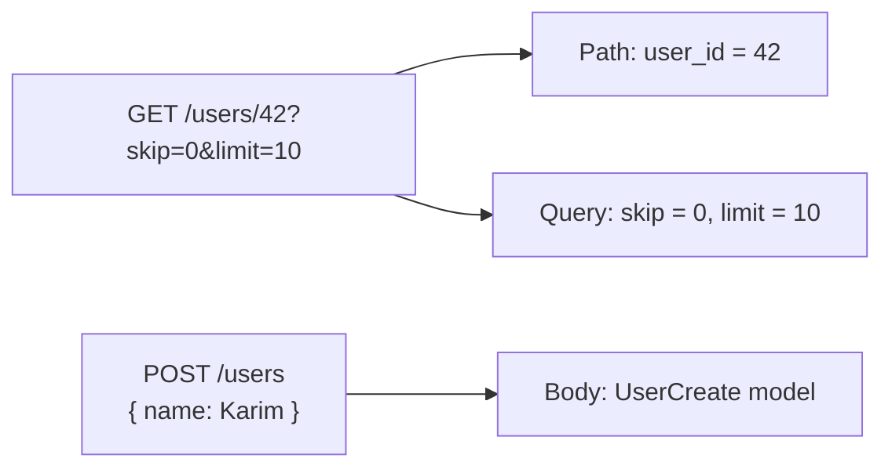

## Path, Query ও Request Body

গত chapter এ আমরা একটা basic API বানালাম। কিন্তু সেটাতে user কিছু input দিতে পারছিল না — শুধু fixed response আসছিল। আসল API তে user input দেয় — কোন user এর data চাই, কত নম্বর page চাই, বা নতুন data create করতে চায়। এই input গুলো আসে তিনভাবে: path parameter, query parameter, আর request body।

এই chapter এ আমরা এই তিনটি বিস্তারিত শিখবো — কীভাবে receive করতে হয়, validate করতে হয়, আর combine করতে হয়।

## Parameter গুলো কোথা থেকে আসে?

API request এ data তিন জায়গায় থাকতে পারে। নিচের টেবিলে দেখো কোন parameter কোথা থেকে আসে।

| Parameter Type | কোথায় | Example | FastAPI এ কীভাবে |
|---------------|--------|---------|------------------|
| **Path parameter** | URL এর ভেতর | `/users/42` | function parameter, type hint |
| **Query parameter** | URL এর পরে `?` দিয়ে | `/users?skip=0&limit=10` | function parameter with default |
| **Request body** | HTTP body তে (JSON) | `POST /users` + JSON body | Pydantic model parameter |



এই তিনটি আলাদাভাবে আর একসাথে ও use করা যায়। চলো একটা একটা করে দেখি।

## Path Parameters

Path parameter হলো URL এর ভেতরে থাকা variable। যেমন `/users/42` — এখানে `42` হলো user ID, যেটা URL এর path এই embedded।

নিচের কোডে একটা path parameter দেখানো হলো — `user_id` নামের একটা integer parameter URL থেকে extract হচ্ছে।

```python
# Path parameter example
from fastapi import FastAPI

app = FastAPI()

@app.get("/users/{user_id}")
def get_user(user_id: int):
    return {"user_id": user_id, "name": f"User {user_id}"}
```

এই কোডে `@app.get("/users/{user_id}")` — `{user_id}` হলো path parameter placeholder। Function এ `user_id: int` দেওয়া আছে, তাই FastAPI সেটাকে integer এ convert করবে। যদি কেউ `/users/abc` দেয়, তাহলে validation error আসবে — কারণ `abc` integer নয়।

```bash
# Valid request
curl http://127.0.0.1:8000/users/42
```

```json
{"user_id": 42, "name": "User 42"}
```

```bash
# Invalid request — not an integer
curl http://127.0.0.1:8000/users/abc
```

```json
{
  "detail": [
    {
      "type": "int_parsing",
      "loc": ["path", "user_id"],
      "msg": "Input should be a valid integer"
    }
  ]
}
```

FastAPI স্বয়ংক্রিয়ভাবে type check করে আর সুন্দর error message দেয় — কোনো extra code ছাড়া।

### Path Validation

শুধু type check নয়, path parameter এ validation ও যোগ করা যায়। `Path()` function দিয়ে constraint দেওয়া যায় — যেমন minimum length, maximum value।

নিচের কোডে `item_id` এর উপর validation দেখানো হলো — সেটি অবশ্যই ১ বা তার বেশি হতে হবে।

```python
# Path parameter with validation
from fastapi import FastAPI, Path

app = FastAPI()

@app.get("/items/{item_id}")
def get_item(item_id: int = Path(..., ge=1, le=1000)):
    return {"item_id": item_id}
```

এই কোডে `Path(..., ge=1, le=1000)` দিয়ে বলা হয়েছে — `item_id` অবশ্যই ১ থেকে ১০০০ এর মধ্যে হবে। `...` মানে required (default নেই), `ge` মানে greater-than-or-equal, `le` মানে less-than-or-equal। যদি কেউ `/items/0` বা `/items/5000` দেয়, validation error আসবে।

## Query Parameters

Query parameter হলো URL এর পরে `?` দিয়ে আসা parameter। যেমন `/users?skip=0&limit=10` — এখানে `skip=0` আর `limit=10` দুটো query parameter। সাধারণত filtering, sorting, pagination এর জন্য query parameter ব্যবহার করা হয়।

নিচের কোডে query parameter দেখানো হলো — `skip` আর `limit` দিয়ে pagination করা হচ্ছে।

```python
# Query parameter example
from fastapi import FastAPI

app = FastAPI()

fake_users = [
    {"id": 1, "name": "Karim"},
    {"id": 2, "name": "Rahim"},
    {"id": 3, "name": "Jamal"},
    {"id": 4, "name": "Kamal"},
    {"id": 5, "name": "Nadia"},
]

@app.get("/users")
def list_users(skip: int = 0, limit: int = 10):
    return fake_users[skip : skip + limit]
```

এই কোডে `skip: int = 0` আর `limit: int = 10` — দুটো query parameter, দুটোরই default value আছে। যদি user শুধু `/users` দেয়, তাহলে `skip=0, limit=10` ধরে নেবে। যদি `/users?skip=2&limit=2` দেয়, তাহলে ৩ আর ৪ নম্বর user দেখাবে।

```bash
# With query parameters
curl "http://127.0.0.1:8000/users?skip=2&limit=2"
```

```json
[{"id": 3, "name": "Jamal"}, {"id": 4, "name": "Kamal"}]
```

### Query Validation

Query parameter এ ও validation দেওয়া যায় — `Query()` function দিয়ে।

নিচের কোডে `skip` আর `limit` এর উপর validation দেওয়া হলো — দুটোই ০ বা তার বেশি হতে হবে, আর `limit` সর্বোচ্চ ১০০ হতে পারবে।

```python
# Query parameter with validation
from fastapi import FastAPI, Query

app = FastAPI()

@app.get("/products")
def list_products(
    skip: int = Query(0, ge=0),
    limit: int = Query(10, ge=1, le=100),
    q: str | None = Query(None, min_length=2, max_length=50)
):
    result = {"skip": skip, "limit": limit}
    if q:
        result["search"] = q
    return result
```

এই কোডে তিনটি query parameter আছে:
- `skip` — default 0, ০ বা তার বেশি (`ge=0`)
- `limit` — default 10, ১ থেকে ১০০ এর মধ্যে (`ge=1, le=100`)
- `q` — optional (`None`), কিন্তু দিলে অন্তত ২ আর সর্বোচ্চ ৫০ character

`str | None` হলো Python 3.10+ এর optional type syntax — মানে এই parameter টা string ও হতে পারে, আবার `None` ও (মানে দেওয়া হয়নি)।

> [!note] Optional vs Required
> Parameter এ default value দিলে সেটা optional। Default না দিলে required। `skip: int = 0` হলো optional, `skip: int` হলো required। `Query(None, ...)` দিলে ও optional হয়।

### একাধিক Query Parameter

এক API তে অনেক query parameter থাকতে পারে। কিন্তু function signature তে অনেক parameter দিলে code বড় আর অগোছালো হয়। সেক্ষেত্রে `Query` গুলো এক Pydantic model এ রাখা যায় (FastAPI 0.115+ feature)।

```python
# Multiple query params in a single model
from fastapi import FastAPI, Query
from pydantic import BaseModel
from typing import Annotated

app = FastAPI()

class ProductQuery(BaseModel):
    category: str | None = None
    min_price: float | None = Query(None, ge=0)
    max_price: float | None = Query(None, ge=0)
    sort_by: str = "name"
    order: str = Query("asc", pattern="^(asc|desc)$")

@app.get("/products")
def list_products(query: ProductQuery):
    return query.model_dump()
```

এই কোডে সব query parameter একটা `ProductQuery` model এ grouped করা হয়েছে। FastAPI স্বয়ংক্রিয়ভাবে বুঝে নেয় এই model টি query parameter থেকে তৈরি হবে। `order` এ `pattern="^(asc|desc)$"` দিয়ে নিশ্চিত করা হয়েছে যে শুধু `asc` বা `desc` ই accept হবে।

## Request Body

Path আর query parameter এর limitation হলো — এরা URL এ থাকে, তাই ছোট data এর জন্য ঠিক আছে কিন্তু বড় data (যেমন user registration form) এর জন্য উপযুক্ত নয়। বড় বা structured data এর জন্য **request body** ব্যবহার করা হয় — HTTP request এর body তে JSON আকারে পাঠানো হয়।

FastAPI এ request body define করতে Pydantic `BaseModel` ব্যবহার করা হয়।

নিচের কোডে একটা user registration endpoint দেখানো হলো — request body তে name, email, password আসে।

```python
# Request body with Pydantic model
from fastapi import FastAPI
from pydantic import BaseModel, EmailStr

app = FastAPI()

class UserCreate(BaseModel):
    name: str
    email: EmailStr
    age: int

@app.post("/users")
def create_user(user: UserCreate):
    return {
        "message": "User created",
        "user": user.model_dump()
    }
```

এই কোডে `UserCreate` হলো একটা Pydantic model — যেটা request body এর structure define করে। `user: UserCreate` দিলে FastAPI স্বয়ংক্রিয়ভাবে request body থেকে JSON parse করে, validate করে, আর `user` object টা function এ দেয়। যদি কেউ `email` ফেলে দেয় বা ভুল format এ দেয়, validation error আসবে।

```bash
# Send request body
curl -X POST http://127.0.0.1:8000/users \
  -H "Content-Type: application/json" \
  -d '{"name": "Karim", "email": "karim@example.com", "age": 25}'
```

```json
{
  "message": "User created",
  "user": {"name": "Karim", "email": "karim@example.com", "age": 25}
}
```

যদি কেউ ভুল data দেয়:

```bash
# Missing email field
curl -X POST http://127.0.0.1:8000/users \
  -H "Content-Type: application/json" \
  -d '{"name": "Karim", "age": 25}'
```

```json
{
  "detail": [
    {
      "type": "missing",
      "loc": ["body", "email"],
      "msg": "Field required"
    }
  ]
}
```

FastAPI স্বয়ংক্রিয়ভাবে বলে দেয় কোন field missing আর কোথায় — frontend এ সহজে error দেখানো যায়।

## Path + Query + Body Combine করা

আসল API তে এক request এ path, query, আর body — তিনটিই একসাথে থাকতে পারে। FastAPI স্বয়ংক্রিয়ভাবে বুঝে নেয় কোন parameter কোথা থেকে আসবে।

নিচের কোডে তিনটি parameter type একসাথে দেখানো হলো — path থেকে `user_id`, query থেকে `detailed`, আর body থেকে update data।

```python
# Combining path, query, and body parameters
from fastapi import FastAPI, Path, Query
from pydantic import BaseModel

app = FastAPI()

class UserUpdate(BaseModel):
    name: str | None = None
    email: str | None = None
    age: int | None = None

@app.put("/users/{user_id}")
def update_user(
    user_id: int = Path(..., ge=1),
    user: UserUpdate = None,
    detailed: bool = Query(False)
):
    result = {"user_id": user_id, "updated_data": user.model_dump(exclude_none=True)}
    if detailed:
        result["status"] = "updated_with_details"
    return result
```

FastAPI কীভাবে বুঝে নেয় কোন parameter কোথা থেকে আসবে?

| Parameter | FastAPI এর নিয়ম |
|-----------|----------------|
| `user_id: int = Path(...)` | `Path()` দিলে path parameter |
| `detailed: bool = Query(False)` | Primitive type + default = query parameter |
| `user: UserUpdate` | Pydantic model = request body |

> [!tip] Type দিয়ে নিয়ন্ত্রণ
> FastAPI parameter এর type দেখে সিদ্ধান্ত নেয় — primitive type (int, str, bool) থাকলে query parameter, Pydantic model থাকলে body। `Path()` বা `Query()` explicitly দিলে সেটাই গণ্য হয়।

## Response Model

যতক্ষণ পর্যন্ত আমরা function থেকে dictionary return করছি, ততক্ষণ response এর structure টা নিয়ন্ত্রণে নেই। কিন্তু production API তে response এর structure fix থাকা দরকার — যেন frontend নিশ্চিত হয় কোন field আসবে। এর জন্য `response_model` ব্যবহার করা হয়।

নিচের কোডে `response_model` দেখানো হলো — internal model আর public model আলাদা করা হয়েছে, যাতে password এর মতো sensitive data response এ না যায়।

```python
# Response model to control output structure
from fastapi import FastAPI
from pydantic import BaseModel

app = FastAPI()

class UserIn(BaseModel):
    name: str
    email: str
    password: str

class UserOut(BaseModel):
    name: str
    email: str

@app.post("/users", response_model=UserOut)
def create_user(user: UserIn):
    # user has password, but response_model filters it out
    return user
```

এই কোডে `UserIn` এ password field আছে (input এর জন্য), কিন্তু `UserOut` এ নেই (output এর জন্য)। `response_model=UserOut` দিলে FastAPI স্বয়ংক্রিয়ভাবে response টা `UserOut` model এ filter করে — password আউটপুটে যাবে না, এমনকি function `user` (যেটাতে password আছে) return করলে ও।

```bash
# Password is filtered from response
curl -X POST http://127.0.0.1:8000/users \
  -H "Content-Type: application/json" \
  -d '{"name": "Karim", "email": "karim@example.com", "password": "secret123"}'
```

```json
{"name": "Karim", "email": "karim@example.com"}
```

> [!important] response_model কেন দরকার
> `response_model` শুধু filter করে না — সেটা response এর structure guarantee করে। যদি function ভুলে অতিরিক্ত field return করে, সেটা বাদ যাবে। যদি required field missing থাকে, error আসবে। Swagger docs ও `response_model` থেকে তৈরি হয় — তাই frontend developer দেখতে পায় ঠিক কী structure আসবে।

## Status Codes

প্রতিটা HTTP response এ একটা status code থাকে — যেটা request এর outcome বোঝায়। FastAPI তে status code নিয়ন্ত্রণ করা যায়।

নিচের কোডে বিভিন্ন endpoint এ আলাদা status code দেখানো হলো।

```python
# Setting status codes
from fastapi import FastAPI, status
from pydantic import BaseModel

app = FastAPI()

class Item(BaseModel):
    name: str
    price: float

@app.post("/items", response_model=Item, status_code=status.HTTP_201_CREATED)
def create_item(item: Item):
    return item

@app.delete("/items/{item_id}", status_code=status.HTTP_204_NO_CONTENT)
def delete_item(item_id: int):
    return None
```

এই কোডে `status_code=status.HTTP_201_CREATED` দিয়ে POST endpoint এর status 201 (Created) করা হয়েছে — যেটা resource creation এর standard code। DELETE endpoint এ 204 (No Content) দেওয়া হয়েছে — যেটা বোঝায় delete হয়েছে কিন্তু কোনো body নেই।

সাধারণ status code গুলো:

| Code | নাম | কখন ব্যবহার |
|------|-----|-------------|
| 200 | OK | সাধারণ success (default) |
| 201 | Created | নতুন resource তৈরি হলে (POST) |
| 204 | No Content | Delete বা update হলে, body নেই |
| 400 | Bad Request | User ভুল data দিলে |
| 404 | Not Found | Resource পাওয়া যায়নি |
| 422 | Unprocessable Entity | Validation error (FastAPI default) |
| 500 | Internal Server Error | Server এ সমস্যা |

> [!note] 422 vs 400
> FastAPI validation error এ 422 দেয় (স্বয়ংক্রিয়ভাবে)। কিন্তু business logic error এর জন্য (যেমন "এই email দিয়ে already account আছে") তুমি নিজে 400 বা 409 দেবে — `HTTPException(status_code=400)` দিয়ে।

## Pagination Example

সব একসাথে মিলিয়ে একটা আসল pagination example দেখি। এটা এমন একটা endpoint যেটা path, query, body, response model, আর status code — সব একসাথে use করে।

> [!example] Real pagination endpoint
> একটা blog API তে post list দেখাতে হবে। User pagination দিতে পারবে (page, size), search করতে পারবে (q), আর filter করতে পারবে (author)। Response এ post গুলোর সাথে total count আর page info ও যাবে।

```python
# Complete pagination example
from fastapi import FastAPI, Query, status
from pydantic import BaseModel
from typing import List

app = FastAPI()

class Post(BaseModel):
    id: int
    title: str
    author: str
    content: str

class PaginatedPosts(BaseModel):
    posts: List[Post]
    total: int
    page: int
    size: int
    has_next: bool

# Fake database
all_posts = [
    Post(id=1, title="FastAPI Intro", author="Karim", content="..."),
    Post(id=2, title="Pydantic Guide", author="Rahim", content="..."),
    Post(id=3, title="ASGI Deep Dive", author="Karim", content="..."),
    Post(id=4, title="Deployment Guide", author="Jamal", content="..."),
    Post(id=5, title="Testing FastAPI", author="Karim", content="..."),
]

@app.get("/posts", response_model=PaginatedPosts)
def list_posts(
    page: int = Query(1, ge=1),
    size: int = Query(10, ge=1, le=50),
    q: str | None = Query(None, min_length=1),
    author: str | None = None
):
    filtered = all_posts

    # Filter by search query
    if q:
        filtered = [p for p in filtered if q.lower() in p.title.lower()]

    # Filter by author
    if author:
        filtered = [p for p in filtered if p.author == author]

    total = len(filtered)
    start = (page - 1) * size
    end = start + size
    page_posts = filtered[start:end]

    return PaginatedPosts(
        posts=page_posts,
        total=total,
        page=page,
        size=size,
        has_next=end < total
    )
```

এই কোডে অনেক কিছু একসাথে চলছে:

- `page` আর `size` — query parameter with validation (`ge=1` মানে অন্তত ১)
- `q` — optional search query, দিলে অন্তত ১ character
- `author` — optional filter
- `response_model=PaginatedPosts` — response structure fixed
- ভেতরে filtering, তারপর pagination logic
- `has_next` — frontend কে বলে আরও page আছে কি না

```bash
# Search posts by Karim, page 1, size 2
curl "http://127.0.0.1:8000/posts?author=Karim&page=1&size=2"
```

```json
{
  "posts": [
    {"id": 1, "title": "FastAPI Intro", "author": "Karim", "content": "..."},
    {"id": 3, "title": "ASGI Deep Dive", "author": "Karim", "content": "..."}
  ],
  "total": 3,
  "page": 1,
  "size": 2,
  "has_next": true
}
```

`has_next: true` মানে আরও data আছে — frontend এটা দেখে "Load More" button দেখাবে।

## Summary

এই chapter এ আমরা শিখলাম:

- **Path parameter** — URL এর ভেতরে, `Path()` দিয়ে validation
- **Query parameter** — URL এর পরে `?`, `Query()` দিয়ে validation
- **Request body** — JSON body, Pydantic model দিয়ে
- Path + Query + Body একসাথে use করা
- `response_model` দিয়ে response structure নিয়ন্ত্রণ
- Status code set করা (`status.HTTP_201_CREATED`)
- Real-world pagination example

পরের chapter এ আমরা Pydantic v2 নিয়ে গভীরভাবে শিখবো — validator, computed field, custom type সব নিয়ে।