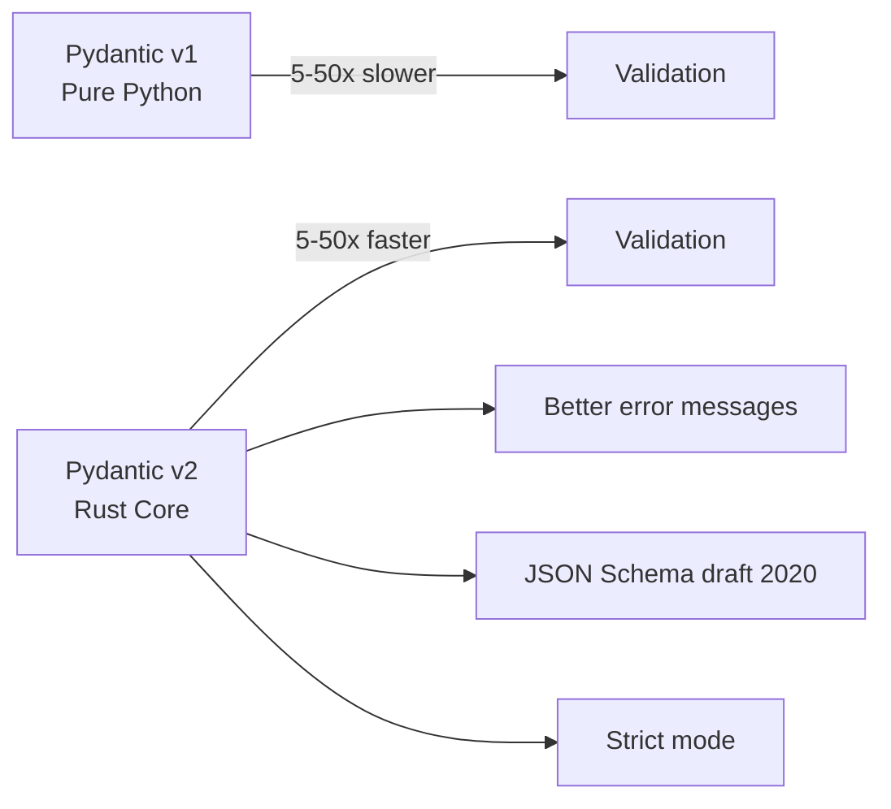

## Pydantic v2 গভীরে

গত দুই chapter এ আমরা Pydantic model ব্যবহার করলাম — কিন্তু বিস্তারিত জানলাম না। এই chapter এ আমরা Pydantic v2 নিয়ে গভীরে যাবো — কীভাবে এটা কাজ করে, validator কীভাবে লেখে, custom type কীভাবে বানায়, আর কেন এটা FastAPI এর হৃদপিণ্ড।

Pydantic হলো FastAPI এর validation engine। তুমি Python type hints লেখো — আর Pydantic সেটাকে data validation, serialization, আর JSON schema তে রূপান্তর করে। এটা ছাড়া FastAPI এর auto docs, validation, type safety — কিছুই থাকতো না।

## Pydantic v2 vs v1

Pydantic v2 হলো একটা বিশাল পরিবর্তন — পুরো core Rust দিয়ে rewrite করা হয়েছে। এর ফলে এটা v1 এর চেয়ে অনেক দ্রুত, আর feature ও বেশি।



| বিষয় | Pydantic v1 | Pydantic v2 |
|-------|-------------|-------------|
| Core language | Pure Python | Rust (pyo3) |
| Speed | Baseline | ৫-৫০ গুণ দ্রুত |
| Validation method | `@validator` | `@field_validator` |
| Config | inner `Config` class | `model_config` dict |
| Serialization | `.dict()`, `.json()` | `.model_dump()`, `.model_dump_json()` |
| JSON Schema | Draft 7 | Draft 2020-12 |
| Strict mode | No | Yes (`strict=True`) |

> [!important] Pydantic v1 থেকে v2 migration
> যদি তোমার কোনো পুরোনো project Pydantic v1 এ থাকে, v2 তে migrate করার সময় কিছু পরিবর্তন করতে হবে। সবচেয়ে common: `.dict()` হবে `.model_dump()`, `.json()` হবে `.model_dump_json()`, `@validator` হবে `@field_validator`, `Config` class হবে `model_config`। Pydantic এ `bump-pydantic` নামে একটা migration tool আছে যেটা অটোমেটিক change করে দেয়। আর FastAPI 0.100+ থেকে Pydantic v2 default support করে।

## BaseModel — Field আর Type

Pydantic এর সব কিছু `BaseModel` থেকে শুরু। একটা class বানাও `BaseModel` inherit করে, type hints দাও — আর সেটাই তোমার data model।

নিচের কোডে একটা basic model দেখানো হলো — বিভিন্ন type এর field সহ।

```python
# Basic Pydantic model with various types
from pydantic import BaseModel
from datetime import datetime

class Article(BaseModel):
    title: str
    content: str
    view_count: int = 0
    is_published: bool = False
    tags: list[str] = []
    published_at: datetime | None = None
```

এই কোডে প্রতিটা field এর type define করা — `str`, `int`, `bool`, `list[str]`, `datetime`, আর `| None` দিয়ে optional। যে field এ default value দেওয়া আছে (যেমন `view_count: int = 0`), সেগুলো optional — না দিলে default ধরে নেবে। যেগুলোতে default নেই (যেমন `title: str`), সেগুলো required।

### Common Field Types

Pydantic অনেক type support করে। নিচের টেবিলে common type গুলো দেখো।

| Type | Example | Validation |
|------|---------|------------|
| `str` | `"hello"` | যেকোনো string |
| `int` | `42` | Integer |
| `float` | `3.14` | Float |
| `bool` | `True` | Boolean |
| `EmailStr` | `"a@b.com"` | Email format check |
| `HttpUrl` | `"https://..."` | Valid URL |
| `datetime` | `"2026-07-07T..."` | ISO datetime |
| `date` | `"2026-07-07"` | ISO date |
| `UUID` | `"550e8400-..."` | UUID format |
| `list[str]` | `["a", "b"]` | List of strings |
| `dict[str, int]` | `{"a": 1}` | Dictionary |
| `Enum` | `Status.active` | Enum value |

> [!note] EmailStr আর HttpUrl এর জন্য extra package
> `EmailStr` ব্যবহার করতে হলে `email-validator` package install করতে হবে: `pip install email-validator`। `HttpUrl` built-in। না থাকলে `ImportError` আসবে।

## Field() দিয়ে Constraint

শুধু type দিলেই হয় না — অনেক সময় constraint দরকার। যেমন password অন্তত ৮ character, age ০-১২০ এর মধ্যে, username এ শুধু alphanumeric। এসব `Field()` দিয়ে করা যায়।

নিচের কোডে `Field()` দিয়ে বিভিন্ন constraint দেখানো হলো।

```python
# Field with constraints
from pydantic import BaseModel, Field

class Product(BaseModel):
    name: str = Field(
        ...,
        min_length=2,
        max_length=100,
        description="Product name"
    )
    price: float = Field(
        ...,
        gt=0,
        description="Must be positive"
    )
    quantity: int = Field(
        default=0,
        ge=0,
        le=10000,
        description="Stock quantity"
    )
    sku: str = Field(
        ...,
        pattern=r"^[A-Z]{3}-\d{4}$",
        description="Format: ABC-1234"
    )
```

এই কোডে প্রতিটা field এ আলাদা constraint আছে:
- `name` — ২ থেকে ১০০ character
- `price` — ০ এর বেশি (`gt` = greater than)
- `quantity` — ০ থেকে ১০০০০ এর মধ্যে, default 0
- `sku` — `^[A-Z]{3}-\d{4}$` pattern match (যেমন `ABC-1234`)

`description` দিলে সেটা Swagger docs এ দেখায় — API user দের জন্য helpful। `pattern` এ regex দিলে সেটা string validation এ ব্যবহার হয়।

## Field Validators

`Field()` দিয়ে basic constraint দেওয়া যায়। কিন্তু complex validation এর জন্য validator function লিখতে হয়। Pydantic v2 তে দুই ধরনের validator আছে — `@field_validator` (একটা field এর জন্য) আর `@model_validator` (পুরো model এর জন্য)।

### @field_validator

নিচের কোডে `@field_validator` দেখানো হলো — username কে lowercase করা আর password strength check করা হচ্ছে।

```python
# Field-level validator
from pydantic import BaseModel, field_validator

class UserRegistration(BaseModel):
    username: str
    password: str

    @field_validator("username")
    @classmethod
    def username_lowercase(cls, v: str) -> str:
        # Always store username in lowercase
        return v.lower().strip()

    @field_validator("password")
    @classmethod
    def password_strength(cls, v: str) -> str:
        if len(v) < 8:
            raise ValueError("Password must be at least 8 characters")
        if not any(c.isupper() for c in v):
            raise ValueError("Password must contain an uppercase letter")
        if not any(c.isdigit() for c in v):
            raise ValueError("Password must contain a digit")
        return v
```

এই কোডে দুটো validator আছে:
- `username_lowercase` — username টা lowercase আর strip করে (extra space remove)
- `password_strength` — password অন্তত ৮ character, একটা uppercase, একটা digit থাকতে হবে

`@classmethod` decorator টা আবশ্যক — কারণ validator class method হিসেবে কাজ করে। Function টা value (`v`) receive করে, process করে, আর return করে। যদি validation fail করে, `ValueError` raise করতে হয় — Pydantic সেটাকে nice error message এ রূপান্তর করে।

### @model_validator

একটা field এর validation নয়, বরং পুরো model এর মধ্যে relationship check করতে হলে `@model_validator` ব্যবহার করা হয়। যেমন — `password` আর `confirm_password` match করে কি না।

নিচের কোডে `@model_validator` দেখানো হলো।

```python
# Model-level validator
from pydantic import BaseModel, model_validator

class ChangePassword(BaseModel):
    current_password: str
    new_password: str
    confirm_password: str

    @model_validator(mode="after")
    def passwords_match(self) -> "ChangePassword":
        if self.new_password != self.confirm_password:
            raise ValueError("New password and confirm password do not match")
        if self.current_password == self.new_password:
            raise ValueError("New password must be different from current")
        return self
```

এই কোডে `mode="after"` দেওয়া আছে — মানে সব field validate হওয়ার পর এই validator চলবে। তখন `self.new_password` আর `self.confirm_password` দুটোই available। যদি দুটো match না করে, error দেবে। একইভাবে new password আর current password same হলে ও error দেবে।

> [!tip] mode="before" vs mode="after"
> `mode="before"` দিলে validator raw data তে চলে (type conversion এর আগে) — যেমন input পরিষ্কার করতে। `mode="after"` দিলে সব field validate হওয়ার পর চলে — যেমন cross-field validation। বেশিরভাগ ক্ষেত্রে `after` দরকার।

## Computed Fields

কখনো কখনো এমন field দরকার যেটা store করা নেই কিন্তু অন্য field থেকে calculate করা যায়। যেমন — `first_name` আর `last_name` থেকে `full_name`। এর জন্য `@computed_field` ব্যবহার করা হয়।

নিচের কোডে `@computed_field` দেখানো হলো।

```python
# Computed field example
from pydantic import BaseModel, computed_field

class Employee(BaseModel):
    first_name: str
    last_name: str
    base_salary: float
    bonus_percentage: float

    @computed_field
    @property
    def full_name(self) -> str:
        return f"{self.first_name} {self.last_name}"

    @computed_field
    @property
    def total_salary(self) -> float:
        return self.base_salary + (self.base_salary * self.bonus_percentage / 100)
```

এই কোডে দুটো computed field আছে:
- `full_name` — `first_name` আর `last_name` যোগ করে
- `total_salary` — `base_salary` + bonus calculate করে

`@property` আর `@computed_field` দুটোই দিতে হবে। Computed field গুলো `model_dump()` তে automatically আসে — আলাদা করে যোগ করতে হয় না। আর Swagger docs এ ও দেখায়।

## Nested Models আর List of Models

আসল application এ data একটা flat structure এ থাকে না — nested হয়। যেমন একটা Order এর ভেতরে অনেক Item, একটা User এর ভেতরে Address। Pydantic এ model এর ভেতর model রাখা যায়।

নিচের কোডে nested model আর list of model দেখানো হলো।

```python
# Nested models and lists
from pydantic import BaseModel
from typing import List
from datetime import datetime

class Address(BaseModel):
    street: str
    city: str
    zip_code: str
    country: str = "Bangladesh"

class OrderItem(BaseModel):
    product_name: str
    quantity: int
    unit_price: float

class Order(BaseModel):
    order_id: str
    customer_name: str
    shipping_address: Address
    items: List[OrderItem]
    created_at: datetime

    @computed_field
    @property
    def total_price(self) -> float:
        return sum(item.quantity * item.unit_price for item in self.items)
```

এই কোডে `Order` model এর ভেতরে `Address` (nested model) আর `List[OrderItem]` (list of model) আছে। যদি JSON এ nested structure আসে, Pydantic স্বয়ংক্রিয়ভাবে সব validate করবে।

নিচের JSON টা এই model এ validate হবে:

```python
# Using the nested model
order_data = {
    "order_id": "ORD-001",
    "customer_name": "Karim Ahmed",
    "shipping_address": {
        "street": "123 Main St",
        "city": "Dhaka",
        "zip_code": "1207"
    },
    "items": [
        {"product_name": "Laptop", "quantity": 1, "unit_price": 75000.0},
        {"product_name": "Mouse", "quantity": 2, "unit_price": 500.0}
    ],
    "created_at": "2026-07-07T10:30:00"
}

order = Order.model_validate(order_data)
print(order.total_price)  # 76000.0
print(order.shipping_address.city)  # Dhaka
```

`model_validate()` দিয়ে dictionary থেকে model instance তৈরি করা হয়েছে। nested address আর items সব স্বয়ংক্রিয়ভাবে validate আর convert হয়েছে। `total_price` computed field টা স্বয়ংক্রিয়ভাবে calculate হয়েছে।

## Serialization — model_dump() আর model_dump_json()

Model এর data কে dictionary বা JSON এ রূপান্তর করাকে serialization বলে। Pydantic v2 তে এর জন্য `model_dump()` আর `model_dump_json()` ব্যবহার করা হয়।

```python
# Serialization methods
from pydantic import BaseModel
from datetime import datetime

class BlogPost(BaseModel):
    title: str
    content: str
    author: str
    tags: list[str] = []
    published_at: datetime | None = None

post = BlogPost(
    title="FastAPI Guide",
    content="Learning FastAPI...",
    author="Karim",
    tags=["python", "api"]
)

# Convert to dictionary
print(post.model_dump())

# Convert to JSON string
print(post.model_dump_json(indent=2))

# Exclude specific fields
print(post.model_dump(exclude={"content"}))

# Include only specific fields
print(post.model_dump(include={"title", "author"}))
```

এই কোডে চারটি serialization দেখানো হলো:
- `model_dump()` — সম্পূর্ণ model কে dict এ রূপান্তর করে
- `model_dump_json()` — JSON string এ রূপান্তর করে, `indent` দিলে pretty print হয়
- `exclude={"content"}` — `content` বাদ দিয়ে বাকি সব
- `include={"title", "author"}` — শুধু `title` আর `author`

এই সুবিধা গুলো API response customize করার সময় খুব useful।

### model_config

Model এর behavior customize করার জন্য `model_config` ব্যবহার করা হয়। যেমন — অতিরিক্ত field allow করবে কি না, ORM mode চালু করবে কি না।

```python
# Model configuration
from pydantic import BaseModel, ConfigDict

class FlexibleModel(BaseModel):
    model_config = ConfigDict(
        extra="allow",           # Allow extra fields
        str_strip_whitespace=True, # Strip strings automatically
        str_min_length=1,        # Min length for all strings
        frozen=False,            # Allow mutation
    )
    name: str
```

এই কোডে `model_config` দিয়ে চারটি setting দেওয়া হয়েছে:
- `extra="allow"` — model এ define না থাকা field ও accept করবে
- `str_strip_whitespace=True` — সব string field এর extra space remove হবে
- `str_min_length=1` — সব string অন্তত ১ character হবে
- `frozen=False` — model instance mutable (default)

> [!note] frozen=True দিলে
> `frozen=True` দিলে model immutable হয়ে যায় — create করার পর কোনো field change করা যাবে না। এটা করলে `ValidationError` আসবে। কিছু ক্ষেত্রে (যেমন configuration) এটা useful।

## Custom Type with Annotated

Python এর `Annotated` দিয়ে নিজস্ব custom type বানানো যায় — যেটা reusable validation logic ধরে রাখে। যেমন সব জায়গায় same phone number validation দরকার — প্রতিটা model এ আলাদা validator না লিখে একটা custom type বানিয়ে সব জায়গায় ব্যবহার করা যায়।

নিচের কোডে `Annotated` দিয়ে phone number custom type দেখানো হলো।

```python
# Custom type with Annotated
from pydantic import BaseModel, Field, BeforeValidator
from typing import Annotated

def normalize_phone(v: str) -> str:
    # Remove spaces and dashes, add country code
    cleaned = v.replace(" ", "").replace("-", "")
    if not cleaned.startswith("+"):
        cleaned = "+880" + cleaned.lstrip("0")
    return cleaned

# Reusable phone number type
PhoneNumber = Annotated[str, BeforeValidator(normalize_phone), Field(pattern=r"^\+880\d{10}$")]

class Contact(BaseModel):
    name: str
    phone: PhoneNumber
    emergency_phone: PhoneNumber | None = None
```

এই কোডে `PhoneNumber` হলো একটা custom type — যেটা `Annotated[str, ...]` দিয়ে বানানো। এটা দুটি কাজ করে:
1. `BeforeValidator(normalize_phone)` — input টা normalize করে (space remove, country code add)
2. `Field(pattern=...)` — সেটা valid Bangladesh phone number কি না check করে

এখন যেকোনো model এ `phone: PhoneNumber` দিলেই এই validation পাবে — বারবার একই logic লেখার দরকার নেই।

## Full Example: User Registration Model

সব একসাথে মিলিয়ে একটা সম্পূর্ণ user registration model দেখি — যেটাতে field constraint, validator, computed field, nested model, আর custom type সব আছে।

```python
# Complete user registration model
from pydantic import (
    BaseModel, EmailStr, Field,
    field_validator, model_validator, computed_field,
    BeforeValidator
)
from typing import Annotated
from datetime import date

def normalize_username(v: str) -> str:
    return v.lower().strip()

Username = Annotated[str, BeforeValidator(normalize_username), Field(min_length=3, max_length=20)]

class Address(BaseModel):
    street: str = Field(min_length=5)
    city: str = Field(min_length=2)
    zip_code: str = Field(pattern=r"^\d{4}$")

class UserRegistration(BaseModel):
    username: Username
    email: EmailStr
    password: str = Field(min_length=8, max_length=128)
    confirm_password: str
    full_name: str = Field(min_length=2, max_length=100)
    birth_date: date
    address: Address

    @field_validator("password")
    @classmethod
    def validate_password(cls, v: str) -> str:
        if not any(c.isupper() for c in v):
            raise ValueError("Must contain at least one uppercase letter")
        if not any(c.isdigit() for c in v):
            raise ValueError("Must contain at least one digit")
        return v

    @field_validator("birth_date")
    @classmethod
    def validate_age(cls, v: date) -> date:
        # User must be at least 13 years old
        today = date.today()
        age = today.year - v.year - ((today.month, today.day) < (v.month, v.day))
        if age < 13:
            raise ValueError("Must be at least 13 years old")
        return v

    @model_validator(mode="after")
    def passwords_match(self) -> "UserRegistration":
        if self.password != self.confirm_password:
            raise ValueError("Passwords do not match")
        return self

    @computed_field
    @property
    def display_name(self) -> str:
        return self.full_name.split()[0]
```

এই model টা একটা সম্পূর্ণ registration form handle করে:
- `username` — custom type, ৩-২০ character, auto lowercase
- `email` — EmailStr দিয়ে format check
- `password` — ৮-১২৮ character, uppercase আর digit থাকতে হবে
- `confirm_password` — `model_validator` দিয়ে password এর সাথে match
- `birth_date` — ১৩ বছরের কম হলে error
- `address` — nested model, zip code ৪ digit
- `display_name` — `full_name` থেকে প্রথম নাম

যদি কেউ ভুল data দেয়:

```python
# Validation error example
try:
    user = UserRegistration(
        username="  Karim123  ",
        email="not-an-email",
        password="weak",
        confirm_password="weak",
        full_name="Karim Ahmed",
        birth_date="2020-01-01",
        address={"street": "St", "city": "Dhaka", "zip_code": "12345"}
    )
except Exception as e:
    print(e)
```

```text
5 validation errors for UserRegistration
email - Input should be a valid email address
password - String should have at least 8 characters
password - Must contain at least one uppercase letter
birth_date - Must be at least 13 years old
address.zip_code - String should match pattern "^\d{4}$"
```

সব error একসাথে দেখায় — একটা fix করে আবার try করলে বাকি গুলো দেখাবে না, সব একসাথে আসে। এটা frontend এর জন্য খুব সুবিধাজনক — একসাথে সব form error দেখানো যায়।

## Summary

এই chapter এ আমরা শিখলাম:

- **Pydantic v2** Rust core দিয়ে বানানো — v1 এর চেয়ে ৫-৫০ গুণ দ্রুত
- `BaseModel` দিয়ে data model, various field types
- `Field()` দিয়ে constraint (`min_length`, `ge`, `le`, `pattern`)
- `@field_validator` একটা field এর জন্য, `@model_validator` cross-field validation
- `@computed_field` দিয়ে calculated field
- Nested model আর list of model
- `model_dump()`, `model_dump_json()` দিয়ে serialization
- `model_config` দিয়ে behavior customize
- `Annotated` দিয়ে reusable custom type
- সম্পূর্ণ user registration model with full validation

পরের chapter এ আমরা Dependency Injection নিয়ে শিখবো — FastAPI এর সবচেয়ে শক্তিশালী feature গুলোর একটা।