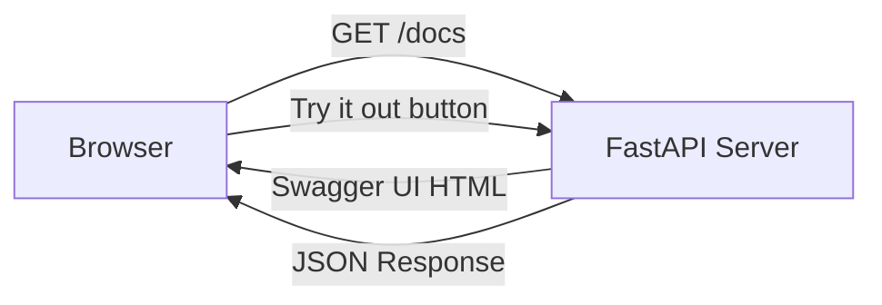

## Setup ও First FastAPI App

গত chapter এ আমরা দেখলাম FastAPI কী আর কেন শিখবে। এখন সময় হাত দেওয়ার — install করবো, প্রথম API বানাবো, run করবো, আর Swagger docs দেখবো। সব মিলিয়ে একদম zero থেকে একটা working API তৈরি করবো।

## Virtual Environment তৈরি করা

Python project শুরু করার আগে সবচেয়ে গুরুত্বপূর্ণ কাজ হলো virtual environment তৈরি করা। কেন? কারণ system Python এ সব package install করলে এক সময় conflict হবে — এক project এ FastAPI 0.115 লাগে, আরেকটায় 0.136। Virtual environment আলাদা রাখলে এই সমস্যা থাকে না।

### uv দিয়ে (Recommended, ২০২৬)

`uv` হলো নতুন Python package manager — Rust দিয়ে বানানো, তাই অত্যন্ত দ্রুত। ২০২৬ সালে Python ecosystem এ `uv` সবচেয়ে জনপ্রিয় choice হয়ে গেছে।

নিচের কমান্ডে `uv` দিয়ে একটা project তৈরি করা হলো। `uv init` project structure বানায়, `uv add` package install করে, আর `uv run` script চালায়।

```bash
# Create a new project with uv
uv init my_fastapi_app
cd my_fastapi_app

# Add FastAPI and uvicorn
uv add fastapi "uvicorn[standard]"

# Run the app
uv run uvicorn main:app --reload
```

### venv দিয়ে (Traditional)

যদি `uv` না থাকে বা traditional উপায়ে যেতে চাও, তাহলে Python এর built-in `venv` ব্যবহার করতে পারো। এটা সব OS এ থাকে, কোনো আলাদা install লাগে না।

```bash
# Create a virtual environment
python -m venv .venv

# Activate it (Windows)
.venv\Scripts\activate

# Activate it (macOS/Linux)
source .venv/bin/activate

# Install FastAPI and uvicorn
pip install fastapi "uvicorn[standard]"
```

`activate` করার পর terminal এ `(.venv)` লেখা দেখবে — মানে virtual environment active। এখন যেকোনো package install করলে সেটা শুধু এই project এ থাকবে, system এ নয়।

> [!tip] uv কেন ব্যবহার করবে
> `uv` প্রচলিত `pip` এর চেয়ে ১০-১০০ গুণ দ্রুত। এছাড়া `uv` একসাথে venv, package install, lockfile — সব করে। নতুন project শুরু করলে `uv` ব্যবহার করাই best practice।

## FastAPI আর uvicorn Install করা

FastAPI নিজে একটা framework — কিন্তু এটাকে চালানোর জন্য একটা ASGI server দরকার। সবচেয়ে জনপ্রিয় ASGI server হলো **uvicorn**। তাই দুটো একসাথে install করতে হয়।

```bash
# Install FastAPI and uvicorn with standard extras
pip install fastapi "uvicorn[standard]"
```

`uvicorn[standard]` এর `[standard]` অংশটা বলছে — uvicorn এর standard extra dependency গুলো install করো। এর মধ্যে আছে `httptools` (দ্রুত HTTP parser), `uvloop` (দ্রুত event loop), `websockets` — যেগুলো performance বাড়ায়।

install হওয়ার পর version check করে দেখো:

```bash
# Check installed versions
python -c "import fastapi; print(fastapi.__version__)"
python -c "import uvicorn; print(uvicorn.__version__)"
```

```text
0.136.0
0.34.0
```

## প্রথম FastAPI App

এবার আসল মজা — প্রথম API বানানো। একটা ফাইল তৈরি করো `main.py` নামে, আর নিচের কোড লেখো।

নিচের কোডে একটা সম্পূর্ণ FastAPI app আছে — `FastAPI()` দিয়ে app তৈরি, `@app.get("/")` দিয়ে একটা GET endpoint define, আর function টা JSON response return করে।

```python
# main.py — Your first FastAPI app
from fastapi import FastAPI

app = FastAPI()

@app.get("/")
def read_root():
    return {"message": "Hello, FastAPI!"}

@app.get("/health")
def health_check():
    return {"status": "healthy"}
```

কোডটা বুঝি লাইন বাই লাইন:

- `from fastapi import FastAPI` — FastAPI class টা import করা হয়েছে
- `app = FastAPI()` — একটা FastAPI application instance তৈরি করা হয়েছে
- `@app.get("/")` — এটা একটা decorator, যেটা বলছে "`/` path এ GET request আসলে এই function টা call করো"
- `def read_root()` — এই function টা চলবে, আর যা return করবে সেটা JSON এ যাবে
- `return {"message": "Hello, FastAPI!"}` — Python dictionary return করলে FastAPI সেটা অটোমেটিক JSON এ convert করে

## App টা Run করা

কোড লেখা হয়ে গেলে এখন সেটা run করতে হবে। uvicorn দিয়ে run করা যায়।

```bash
# Run the FastAPI app with hot reload
uvicorn main:app --reload
```

এই কমান্ডের অংশ গুলো বুঝি:

- `uvicorn` — ASGI server টা
- `main:app` — `main.py` ফাইলের ভেতরে `app` নামের object টা run করো
- `--reload` — code পরিবর্তন করলে অটোমেটিক server restart হবে

run করলে terminal এ এরকম আউটপুট দেখবে:

```text
INFO:     Uvicorn running on http://127.0.0.1:8000 (Press CTRL+C to quit)
INFO:     Started reloader process [12345] using WatchFiles
INFO:     Started server process [12346]
INFO:     Waiting for application startup.
INFO:     Application startup complete.
```

এখন browser এ `http://127.0.0.1:8000` গেলে দেখবে:

```json
{"message": "Hello, FastAPI!"}
```

আর `http://127.0.0.1:8000/health` গেলে:

```json
{"status": "healthy"}
```

> [!note] --reload flag সম্পর্কে
> `--reload` flag টা development এর জন্য — code পরিবর্তন করলে server অটোমেটিক restart হয়, তোমাকে manually বন্ধ করে চালু করতে হয় না। কিন্তু production এ এই flag দেবে না — কারণ এটা performance কমায় আর security risk থাকে। Production এ শুধু `uvicorn main:app` চালাবে।

## Auto Documentation — Swagger আর ReDoc

FastAPI এর সবচেয়ে দারুণ feature গুলোর একটা হলো automatic API documentation। তুমি কোনো extra code লেখো না — কিন্তু দুই ধরনের docs অটোমেটিক তৈরি হয়ে যায়।

### Swagger UI — `/docs`

Browser এ `http://127.0.0.1:8000/docs` গেলে একটা interactive API documentation দেখবে। এখানে প্রতিটা endpoint এর list আছে, ক্লিক করে parameter দিয়ে directly API test করা যায়, আর response দেখা যায়।



### ReDoc — `/redoc`

`http://127.0.0.1:8000/redoc` গেলে ReDoc style documentation দেখবে — যেটা সুন্দর আর পড়তে সুবিধা। এটা বেশি read-oriented, team documentation এর জন্য ভালো।

> [!tip] Docs customize করা
> `FastAPI(title="My API", description="...", version="1.0.0")` এভাবে title, description, version দিলে docs গুলোতে সেটা দেখাবে। এটা production API এর জন্য খুব useful।

## Project Structure Best Practices

ছোট project এ সব কোড এক ফাইলে রাখলেও চলে। কিন্তু project বড় হলে structure ঠিক রাখা জরুরি। নিচে একটা recommended structure দেখানো হলো।

```text
my_fastapi_app/
├── app/
│   ├── __init__.py
│   ├── main.py            # FastAPI app creation
│   ├── config.py          # Settings, environment variables
│   ├── database.py        # Database connection
│   ├── models/            # Pydantic models
│   │   ├── __init__.py
│   │   ├── user.py
│   │   └── item.py
│   ├── routers/           # Route definitions
│   │   ├── __init__.py
│   │   ├── users.py
│   │   └── items.py
│   └── services/          # Business logic
│       ├── __init__.py
│       └── user_service.py
├── tests/
│   ├── __init__.py
│   └── test_users.py
├── .env                   # Environment variables
├── pyproject.toml         # Dependencies (uv/poetry)
└── README.md
```

এই structure এ প্রতিটা folder এর নির্দিষ্ট দায়িত্ব আছে:

| Folder/File | কাজ |
|-------------|-----|
| `main.py` | FastAPI app তৈরি আর router include করা |
| `config.py` | environment variable, settings |
| `database.py` | database connection, session |
| `models/` | Pydantic data model (request/response) |
| `routers/` | API route definition (endpoint) |
| `services/` | business logic, database operation |
| `tests/` | test file |

নিচের কোডে `main.py` আর একটা router file দেখানো হলো — কীভাবে router আলাদা ফাইলে রেখে `main.py` তে include করা যায়।

```python
# app/routers/users.py — Router for user endpoints
from fastapi import APIRouter

router = APIRouter(prefix="/users", tags=["users"])

@router.get("/")
def list_users():
    return [{"id": 1, "name": "Karim"}, {"id": 2, "name": "Rahim"}]

@router.get("/{user_id}")
def get_user(user_id: int):
    return {"id": user_id, "name": "User " + str(user_id)}
```

এই কোডে `APIRouter` দিয়ে একটা router তৈরি করা হয়েছে। `prefix="/users"` দিলে এই router এর সব endpoint এর path এর আগে `/users` যোগ হবে। `tags=["users"]` দিলে Swagger docs এ endpoint গুলো "users" গ্রুপে দেখাবে।

এখন এই router টা `main.py` তে include করতে হবে।

```python
# app/main.py — Main application file
from fastapi import FastAPI
from app.routers import users

app = FastAPI(title="My API", version="1.0.0")

app.include_router(users.router)

@app.get("/")
def root():
    return {"message": "Welcome to My API"}
```

`include_router` দিয়ে router টা app এ যুক্ত করা হয়েছে। এখন `/users` আর `/users/{user_id}` দুটো endpoint ই available। নতুন feature যোগ করতে চাইলে শুধু নতুন router ফাইল বানিয়ে include করো — `main.py` খুলতে হবে না।

## প্রথম CRUD-style Endpoint

এবার একটা আসল endpoint বানাবো — যেটাতে data store করা, list করা, আর delete করা যায়। এটা একটা in-memory list দিয়ে করবো — database ছাড়াই।

নিচের কোডে একটা সম্পূর্ণ CRUD endpoint আছে — `POST` দিয়ে item যোগ, `GET` দিয়ে list দেখা, আর `DELETE` দিয়ে remove করা।

```python
# main.py — CRUD-style endpoints with in-memory storage
from fastapi import FastAPI, HTTPException
from pydantic import BaseModel
from typing import List

app = FastAPI(title="Task API")

class Task(BaseModel):
    id: int
    title: str
    done: bool = False

# In-memory storage (use a database in production)
tasks_db: List[Task] = []
next_id = 1

@app.post("/tasks", response_model=Task, status_code=201)
def create_task(task: Task):
    global next_id
    task.id = next_id
    next_id += 1
    tasks_db.append(task)
    return task

@app.get("/tasks", response_model=List[Task])
def list_tasks():
    return tasks_db

@app.delete("/tasks/{task_id}", status_code=204)
def delete_task(task_id: int):
    for i, task in enumerate(tasks_db):
        if task.id == task_id:
            tasks_db.pop(i)
            return
    raise HTTPException(status_code=404, detail="Task not found")
```

এই কোডে কী হচ্ছে:

- `Task` নামে একটা Pydantic model তৈরি করা হয়েছে — `id`, `title`, `done` field সহ
- `tasks_db` একটা in-memory list — temporary data store (production এ database ব্যবহার করবে)
- `POST /tasks` — নতুন task তৈরি করে, `status_code=201` দেয় (Created)
- `GET /tasks` — সব task এর list দেয়
- `DELETE /tasks/{task_id}` — task remove করে, `status_code=204` দেয় (No Content)
- `HTTPException` — task না পেলে 404 error দেয়

চলো এই API টা test করি। প্রথমে একটা task create করি:

```bash
# Create a new task
curl -X POST http://127.0.0.1:8000/tasks \
  -H "Content-Type: application/json" \
  -d '{"id": 0, "title": "Learn FastAPI", "done": false}'
```

```json
{"id": 1, "title": "Learn FastAPI", "done": false}
```

তারপর সব task এর list দেখি:

```bash
# List all tasks
curl http://127.0.0.1:8000/tasks
```

```json
[{"id": 1, "title": "Learn FastAPI", "done": false}]
```

> [!example] Real-world scenario
> তুমি একটা todo app বানাচ্ছো। Frontend React দিয়ে বানানো, backend FastAPI। এই endpoint গুলো দিয়ে frontend create, list, delete সব করতে পারবে। Swagger UI (`/docs`) তে গিয়ে সরাসরি test করতে পারো — কোনো curl বা Postman লাগে না।

## ASGI Server Comparison

FastAPI run করার জন্য ASGI server দরকার। কয়েকটা option আছে — কোনটা কখন ব্যবহার করবে?

| Server | Async | HTTP/2 | WebSocket | Best For |
|--------|-------|--------|-----------|----------|
| **uvicorn** | Yes | No | Yes | Development আর production (standard) |
| **hypercorn** | Yes | Yes | Yes | HTTP/2 দরকার হলে |
| **gunicorn** | No | No | No | uvicorn কে manage করতে (production) |

### uvicorn (সবচেয়ে জনপ্রিয়)

uvicorn হলো default ASGI server — FastAPI documentation এও এটাই recommend করা হয়। Development এ `--reload` সহ, production এ ছাড়া ব্যবহার করা হয়।

### hypercorn

hypercorn HTTP/2 আর HTTP/3 support করে। যদি তোমার API এ HTTP/2 দরকার হয় (যেমন server push, multiplexing), তাহলে hypercorn ব্যবহার করো।

### gunicorn + uvicorn workers (Production)

Production এ সবচেয়ে ভালো উপায় হলো **gunicorn** দিয়ে **uvicorn worker** চালানো। gunicorn process management করে, আর uvicorn async request handle করে।

```bash
# Production deployment with gunicorn + uvicorn workers
gunicorn main:app -w 4 -k uvicorn.workers.UvicornWorker -b 0.0.0.0:8000
```

এই কমান্ডে `-w 4` মানে ৪টা worker process, `-k` মানে worker class uvicorn। এতে ৪টা CPU core এ আলাদা process চলবে, আর প্রতিটা async request handle করবে।

> [!important] Worker count কত দেবে
> Worker সংখ্যা সাধারণত `(2 × CPU core) + 1` দেওয়া হয়। যেমন ৪ core CPU তে `(2×4)+1 = 9` worker। কিন্তু memory আর task এর ধরন অনুযায়ী adjust করতে হয়। বেশি worker মানে বেশি memory consumption।

## Hot Reload এ কাজ করা

Development এর সময় `--reload` flag টা খুব useful। কোড পরিবর্তন করে save করলেই server অটোমেটিক restart হয়ে যায় — তোমাকে আলাদা করে কিছু করতে হয় না।

```bash
# Run with hot reload (development only)
uvicorn main:app --reload --host 0.0.0.0 --port 8000
```

`--host 0.0.0.0` দিলে লোকাল নেটওয়ার্কের অন্য ডিভাইস থেকেও access করা যাবে (যেমন মোবাইল থেকে test করার সময়)। `--port` দিয়ে port পরিবর্তন করা যায়।

> [!warn] --reload production এ দেবে না
> `--reload` production এ ব্যবহার করবে না। এটা development এর জন্য — কারণ file watcher সব সময় চালু থাকে, যেটা CPU আর memory খায়। Production এ plain `uvicorn main:app` বা gunicorn ব্যবহার করো।

## Summary

এই chapter এ আমরা শিখলাম:

- **uv** বা **venv** দিয়ে virtual environment তৈরি করা
- `pip install fastapi "uvicorn[standard]"` দিয়ে install করা
- প্রথম FastAPI app বানানো — `FastAPI()` আর `@app.get()`
- `uvicorn main:app --reload` দিয়ে run করা
- `/docs` (Swagger) আর `/redoc` (ReDoc) এ auto documentation দেখা
- Project structure best practice — `routers/`, `models/`, `services/`
- CRUD-style endpoint বানানো — POST, GET, DELETE
- uvicorn vs hypercorn vs gunicorn comparison
- Production deployment — `gunicorn + uvicorn workers`

পরের chapter এ আমরা path parameter, query parameter, আর request body নিয়ে বিস্তারিত শিখবো — কীভাবে user এর দেওয়া data validate করা যায়।