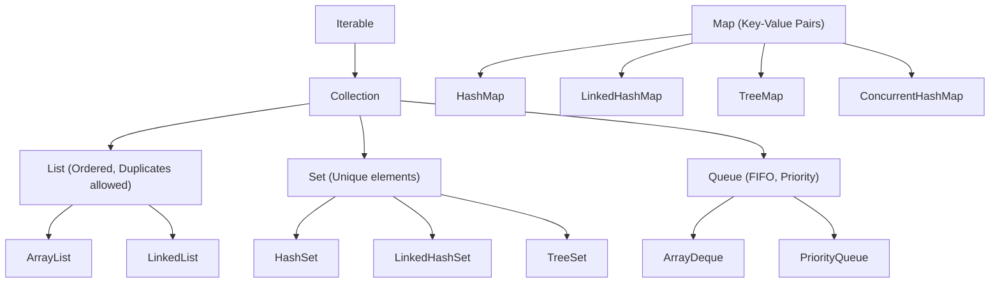

# Java Collections Framework

Java Collections Framework (JCF) হলো ডেটা স্টোর, প্রসেস এবং ম্যানিপুলেট করার জন্য একটি সমন্বিত স্থাপত্য। সাধারণ array-র fixed size-এর সীমাবদ্ধতা দূর করে ডায়নামিক memory ম্যানেজমেন্ট ও বহুল ব্যবহৃত ডেটা স্ট্রাকচার (যেমন ডায়নামিক array, লিঙ্কড লিস্ট, হ্যাশ টেবিল, ট্রি) এক্সেস করতে এটি ব্যবহৃত হয়।

---

## ১. কালেকশন ফ্রেমওয়ার্কের আর্কিটেকচারাল হায়ারার্কি



> [!important]
> মনে রাখবে `Map` কোনো `Collection` বা `Iterable` interface-কে ইনহেরিট করে না; এটি কী-ভ্যালু পেয়ারের সম্পূর্ণ স্বাধীন একটি ভিন্ন হায়ারার্কি।

---

## ২. Lists — ক্রমানুসারে সাজানো তালিকা

### `ArrayList` বনাম `LinkedList`:

| বৈশিষ্ট্য | `ArrayList` (ডিফল্ট পছন্দ) | `LinkedList` |
| :--- | :--- | :--- |
| **অভ্যন্তরীণ ডেটা স্ট্রাকচার** | রিসাইজেবল ডায়নামিক array | ডাবলি লিঙ্কড লিস্ট (Doubly Linked List) |
| **index এক্সেস (`get(i)`)** | **O(1) তাত্ক্ষণিক** | O(n) ধীর (নোড ট্রাভার্স করতে হয়) |
| **শুরুতে ডেটা ইনসার্ট/ডিলিট** | O(n) (এলিমেন্ট শিফট করতে হয়) | **O(1) তাত্ক্ষণিক** |
| **memory লোকালিটি (Cache)** | **চমৎকার (কনটিগুয়াস memory)** | খারাপ (র্যামের ছড়ানো নোড pointer) |

```java
import java.util.ArrayList;
import java.util.List;

public class ListDemo {
    public static void main(String[] args) {
        // Always program to the Interface (List), not implementation (ArrayList)
        List<String> servers = new ArrayList<>();

        servers.add("app-server-01");
        servers.add("app-server-02");
        servers.add(1, "db-primary"); // Insert at index 1

        System.out.println("প্রথম সার্ভার: " + servers.get(0));
        System.out.println("মোট সার্ভার: " + servers.size());
    }
}
```

---

## ৩. Sets — ডুপ্লিকেটমুক্ত ইউনিক কালেকশন

1. **`HashSet`**: কোনো নির্দিষ্ট ক্রম বজায় রাখে না। হ্যাশ টেবিলের ওপর ভিত্তি করে দ্রুততম O(1) লুকআপ প্রদান করে।
2. **`LinkedHashSet`**: ডেটা যোগ করার ক্রম (Insertion Order) অক্ষত রাখে।
3. **`TreeSet`**: ডেটাকে স্বয়ংক্রিয়ভাবে ছোট থেকে বড় সাজানো ক্রমে (Natural Sorted Order) রাখে (রেড-ব্ল্যাক ট্রি আর্কিটেকচার, O(log n) সময়)।

```java
import java.util.Set;
import java.util.HashSet;
import java.util.TreeSet;

public class SetDemo {
    public static void main(String[] args) {
        Set<Integer> scores = new HashSet<>(Set.of(50, 20, 80, 20, 90));
        System.out.println("HashSet (Unordered, unique): " + scores);

        Set<Integer> sortedScores = new TreeSet<>(scores);
        System.out.println("TreeSet (Sorted order): " + sortedScores); // [20, 50, 80, 90]
    }
}
```

---

## ৪. Maps — কী-ভ্যালু স্টোর ও HashMap এর গভীর কার্যপদ্ধতি

`HashMap` হলো Java-র সবচেয়ে জনপ্রিয় ডেটা স্ট্রাকচার।

### `HashMap` এর ভেতরের মেকানিজম (Internal Working):
1. **বাকেট array (Bucket Array)**: ডিফল্টভাবে ১৬টি বাকেট নিয়ে ইনিশিয়ালাইজ হয়।
2. **হ্যাশিং ও ইনডেক্সিং**: `put(key, value)` কল করলে কী-এর `hashCode()` method কল হয় এবং বিটওয়াইজ অপারেশনের মাধ্যমে বাকেট index নির্ধারিত হয়।
3. **কলিশন রেজোলিউশন (Collision Resolution)**: যদি দুটি আলাদা কী-এর হ্যাশ একই বাকেট index-এ পড়ে, তবে সেখানে লিঙ্কড লিস্ট নোড হিসেবে যুক্ত হয়।
4. **ট্রিফিকেশন (Treeification - Java 8+)**: কোনো একটি বাকেটে নোড সংখ্যা **৮ বা তার বেশি** হয়ে গেলে লিঙ্কড লিস্টটি স্বয়ংক্রিয়ভাবে একটি ব্যালান্সড **Red-Black Tree** তে রূপান্তরিত হয়। ফলে সবচেয়ে খারাপ পরিস্থিতিতেও লুকআপ O(n) থেকে নেমে **O(log n)** এ সুরক্ষিত থাকে!

```java
import java.util.HashMap;
import java.util.Map;

public class MapDemo {
    public static void main(String[] args) {
        Map<String, Integer> inventory = new HashMap<>();

        inventory.put("Laptop", 15);
        inventory.put("Keyboard", 40);

        // Modern getOrDefault method
        int monitors = inventory.getOrDefault("Monitor", 0);

        // computeIfAbsent: compute only if key does not exist
        inventory.computeIfAbsent("Mouse", k -> 50);

        // Iterating over key-value pairs cleanly
        for (var entry : inventory.entrySet()) {
            System.out.println(entry.getKey() + " -> " + entry.getValue() + " টি");
        }
    }
}
```

---

## ৫. আধুনিক immutable কালেকশন ফ্যাক্টরি (Java 9+)

Java 9 থেকে অত্যন্ত পরিচ্ছন্ন এক লাইনে আনমডিফায়েবল immutable কালেকশন তৈরি করা যায়:

```java
// Immutable collections — cannot call .add() or .put()!
List<String> immutableList = List.of("A", "B", "C");
Set<Integer> immutableSet   = Set.of(1, 2, 3);
Map<String, String> configs = Map.of("env", "prod", "port", "8080");
```

---

## ৬. সর্টিং: `Comparable` বনাম `Comparator`

- **`Comparable`**: object-এর নিজস্ব class-এর ভেতর `compareTo()` method দিয়ে ন্যাচারাল সর্টিং ডিফাইন করা।
- **`Comparator`**: ল্যাম্বডার সাহায্যে বাইরে থেকে যেকোনো কাস্টম শর্তে সর্ট করা:

```java
List<String> names = new ArrayList<>(List.of("Sadia", "Ali", "Masud", "Zubair"));

// Sort by string length ascending using Lambda Comparator
names.sort((s1, s2) -> Integer.compare(s1.length(), s2.length()));
// Or method reference: names.sort(Comparator.comparingInt(String::length));
```

---

## সারসংক্ষেপ

- দ্রুত ইনডেক্সিংয়ের জন্য `ArrayList` এবং ডুপ্লিকেটহীন ইউনিক ডেটার জন্য `HashSet` ডিফল্ট চয়েস।
- `HashMap` ও(১) এভারেজ স্পিডে কাজ করে এবং কলিশন এড়াতে ট্রিফিকেশন ব্যবহার করে।
- object-কে ম্যাপে নিরাপদে ব্যবহার করতে `equals()` ও `hashCode()` নিখুঁত হতে হবে।
- আধুনিক Java-তে `List.of()`, `Set.of()` দিয়ে দ্রুত immutable কালেকশন বানানো যায়।
- পরবর্তী অধ্যায়ে আমরা শিখব Generics ও Type Erasure মেকানিজম।
