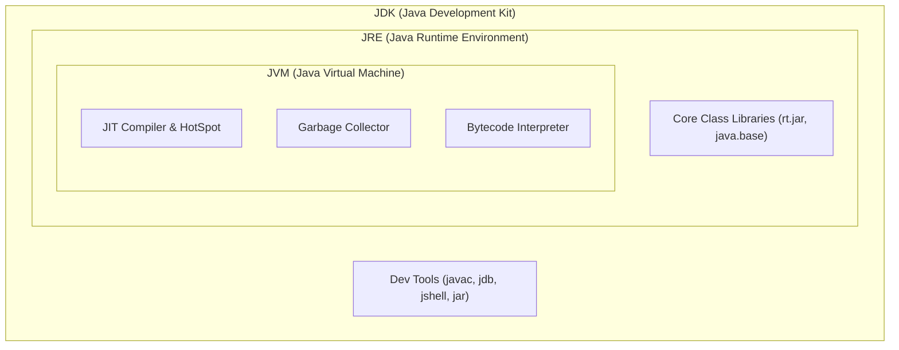

# Java কী ও JVM আর্কিটেকচার

Java হলো বিশ্বের সবচেয়ে প্রভাবশালী, নির্ভরযোগ্য ও বহুল ব্যবহৃত অবজেক্ট-ওরিয়েন্টেড এন্টারপ্রাইজ প্রোগ্রামিং ভাষা। ১৯৯৫ সালে সান মাইক্রোসিস্টেমসের (বর্তমানে ওরাকল) জেমস গসলিংয়ের নেতৃত্বে এটি তৈরি হয়। Java-এর মূল দর্শন ছিল **WORA (Write Once, Run Anywhere)** — অর্থাৎ একটি মেশিনে কোড লিখে কম্পাইল করলে তা যেকোনো অপারেটিং সিস্টেমে কোনো পরিবর্তন ছাড়াই নির্বাহ হতে পারবে।

আজকের আধুনিক **Java 21 LTS** শুধুমাত্র চিরাচরিত এন্টারপ্রাইজ সিস্টেমেই সীমাবদ্ধ নয়; এটি ক্লাউড-নেটিভ মাইক্রোসার্ভিসেস, হাই-থ্রুপুট ফিনটেক প্ল্যাটফর্ম, অ্যান্ড্রয়েড ডেভেলপমেন্ট এবং বিগ ডেটা ইঞ্জিনিয়ারিংয়ে (Apache Spark, Kafka) রাজত্ব করছে।

---

## ১. Java কেন শিখবে?

সি বা সি++ এ সরাসরি মেশিন কোডে কম্পাইল হয়, যার ফলে এক ওএসের বাইনারি অন্য ওএসে চলে না এবং মেমরি ম্যানেজমেন্ট প্রোগ্রামারকে নিজে করতে হয়। পাইথনে কোড সহজে লেখা গেলেও তা ইন্টারপ্রেটেড হওয়ায় তুলনামূলক ধীরগতির।

Java এই দুই চরমপন্থার মাঝে একটি নিখুঁত ভারসাম্য তৈরি করেছে:
1. **প্ল্যাটফর্ম স্বাধীনতা (Platform Independence)**: সোর্স কোড সরাসরি মেশিন কোডে কম্পাইল না হয়ে প্ল্যাটফর্ম-নিরপেক্ষ **বাইটকোডে (.class)** রূপান্তরিত হয়।
2. **অটোমেটিক মেমরি ম্যানেজমেন্ট**: আধুনিক ও উচ্চক্ষমতাসম্পন্ন **Garbage Collector (GC)** রিলিজ হওয়া অবজেক্টগুলোর মেমরি নিজে থেকেই মুক্ত করে, ফলে মেমরি লিকের ঝুঁকি হ্রাস পায়।
3. **উচ্চ গতিসম্পন্ন JIT কম্পাইলার**: ঘন ঘন এক্সিকিউট হওয়া কোডকে (HotSpot) রানটাইমে সরাসরি অপটিমাইজড নেটিভ মেশিন কোডে রূপান্তর করে প্রায় সি++ এর কাছাকাছি পারফরম্যান্স প্রদান করে।
4. **শক্তিশালী টাইপ সেফটি ও ব্যাকওয়ার্ড কম্প্যাটিবিলিটি**: ২০ বছর আগের লেখা Java কোডও কোনো পরিবর্তন ছাড়াই আধুনিক Java 21 রানটাইমে নির্বিঘ্নে চলতে পারে।

```java
// Main application entry point
public class Main {
    public static void main(String[] args) {
        // Output greeting to the standard console
        System.out.println("Hello, Java 21 World!");
    }
}
```

### প্রথম কোডের লাইন-বাই-লাইন বিশ্লেষণ:

1. **`public class Main`**:
   - Java-তে সমস্ত কোড কোনো না কোনো ক্লাসের ভেতরে থাকতে হয়।
   - ক্লাসের নাম `Main` হলে সোর্স ফাইলের নাম অবশ্যই `Main.java` হতে হবে।
   - `public` এক্সেস মডিফায়ার নির্দেশ করে এই ক্লাসটি যেকোনো প্যাকেজ বা ওএস রানটাইম থেকে এক্সেসযোগ্য।
2. **`public static void main(String[] args)`**:
   - এটি Java অ্যাপ্লিকেশনের এক্সিকিউশন এন্ট্রি পয়েন্ট।
   - `public`: JVM যাতে বাইরে থেকে এই মেথড কল করতে পারে।
   - `static`: ক্লাসের কোনো অবজেক্ট তৈরি না করেই যেন JVM সরাসরি মেথডটি এক্সিকিউট করতে পারে।
   - `void`: মেথডটি ওএস-কে কোনো মান রিটার্ন করে না।
   - `String[] args`: কমান্ড-লাইন থেকে পাস করা স্ট্রিং আর্গুমেন্টের অ্যারে।
3. **`System.out.println("Hello, Java 21 World!");`**:
   - `System`: Java স্ট্যান্ডার্ড লাইব্রেরির একটি বিল্ট-ইন ক্লাস (`java.lang.System`)।
   - `out`: স্ট্যান্ডার্ড আউটপুট স্ট্রিম নির্দেশক স্ট্যাটিক মেম্বার (`PrintStream`)।
   - `println()`: কনসোলে টেক্সট প্রিন্ট করে স্বয়ংক্রিয়ভাবে নতুন লাইনে চলে যাওয়ার মেথড।
   - লাইনের শেষে সেমিকোলন (`;`) বাধ্যতামূলক।

---

## ২. JDK বনাম JRE বনাম JVM

বিগিনারদের কাছে এই তিনটি শব্দের পার্থক্য প্রায়শই গুলিয়ে যায়। চলো আর্কিটেকচারাল হায়ারার্কিটি সহজে বুঝি:



| উপাদান | পূর্ণরূপ | প্রধান দায়িত্ব |
| :--- | :--- | :--- |
| **JVM** | Java Virtual Machine | বাইটকোড এক্সিকিউট করে, মেমরি বরাদ্দ করে এবং প্ল্যাটফর্ম-স্পেসিফিক মেশিন ইন্সট্রাকশনে রূপান্তর করে। |
| **JRE** | Java Runtime Environment | JVM এবং কোড রান করার জন্য প্রয়োজনীয় স্ট্যান্ডার্ড ক্লাস লাইব্রেরিসমূহের সমষ্টি। |
| **JDK** | Java Development Kit | কোড কম্পাইল ও ডেভেলপ করার সম্পূর্ণ প্যাকেজ (javac কম্পাইলার, 디বাগার, jshell এবং JRE সহ)। |

> [!note]
> Java 11 এর পর থেকে ওরাকল আলাদাভাবে স্ট্যান্ডঅ্যালোন JRE ডাউনলোড দেওয়া বন্ধ করেছে। আধুনিক ডেভেলপমেন্টে শুধুমাত্র **JDK** ইনস্টল করলেই স্বয়ংক্রিয়ভাবে রানটাইম সহ সবকিছু পাওয়া যায়।

---

## ৩. বাইটকোড ও JIT কম্পাইলেশন মেকানিজম

Java কোড কীভাবে এক্সিকিউট হয় তার পূর্ণ পাইপলাইন:

1. **সোর্স কোড (`.java`)**: মানুষের পাঠযোগ্য সাধারণ টেক্সট ফাইল।
2. **কম্পাইলেশন (`javac Main.java`)**: Java কম্পাইলার সোর্স কোড পরীক্ষা করে প্ল্যাটফর্ম-নিরপেক্ষ **বাইটকোড (`Main.class`)** ফাইল তৈরি করে।
3. **ক্লাস লোডার (Class Loader)**: JVM রান করার সময় প্রয়োজনীয় ক্লাসগুলো মেমরিতে লোড ও বাইটকোড ভেরিফায়ার দিয়ে ভ্যালিডেট করে।
4. **ইন্টারপ্রেটার (Interpreter)**: বাইটকোডকে এক লাইন এক লাইন করে মেশিন কোডে রূপান্তর করে তৎক্ষণাৎ এক্সিকিউট করে (দ্রুত স্টার্টআপের জন্য)।
5. **JIT কম্পাইলার (Just-In-Time Compiler)**: ইন্টারপ্রেটার চলাকালীন যে কোডগুলো বারবার এক্সিকিউট হচ্ছে (হটস্পট লুপ বা ঘন ঘন কল হওয়া মেথড), সেগুলোকে রিয়েলটাইমে সরাসরি অত্যন্ত অপটিমাইজড নেটিভ মেশিন কোডে কম্পাইল করে মেমরিতে ক্যাশ করে রাখে।

> [!tip]
> এই ইন্টারপ্রেটার + JIT হাইব্রিড আর্কিটেকচারের কারণেই Java অ্যাপ্লিকেশন স্টার্ট হওয়ার কিছুক্ষণ পর (Warm-up Period শেষে) সি বা সি++ কোডের প্রায় সমান দ্রুতগতিতে চলতে শুরু করে!

---

## ৪. টার্মিনালে কোড রান করার পদ্ধতি

### ট্র্যাডিশনাল পদ্ধতি (Java 1 থেকে বর্তমান):
```bash
# ১. সোর্স কোড কম্পাইল করে বাইটকোড (.class) তৈরি করো
javac Main.java

# ২. JVM এর মাধ্যমে ক্লাস ফাইল এক্সিকিউট করো (.class এক্সটেনশন ছাড়া)
java Main
```

### আধুনিক সিঙ্গেল-ফাইল পদ্ধতি (Java 11+):
Java 11 থেকে কোনো ম্যানুয়াল `javac` কম্পাইল ধাপ ছাড়াই সরাসরি `.java` ফাইল রান করা যায়:
```bash
java Main.java
```

### ইন্টারেক্টিভ REPL (`jshell` - Java 9+):
পাইথনের মতো টার্মিনালে তাৎক্ষণিক কোড টেস্ট করতে Java-তে রয়েছে `jshell`:
```bash
$ jshell
|  Welcome to JShell -- Version 21
jshell> int x = 10;
x ==> 10
jshell> System.out.println(x * 5);
50
```

---

## ৫. C++ vs Python vs Java vs Rust — সারসংক্ষেপ

| বিষয় | C++ | Python | Java 21 | Rust |
| :--- | :--- | :--- | :--- | :--- |
| **এক্সিকিউশন মডেল** | Native Binary | Interpreted | Bytecode + JIT | Native Binary |
| **মেমরি ম্যানেজমেন্ট** | Manual (`malloc`/`free`) | GC (Reference Counting) | **Modern GC (G1/ZGC)** | Ownership (No GC) |
| **প্ল্যাটফর্ম স্বাধীনতা** | না (Recompile লাগে) | হ্যাঁ (ইন্টারপ্রেটার সাপেক্ষে) | **হ্যাঁ (WORA)** | না (Recompile লাগে) |
| **কনকারেন্সি** | OS Threads | GIL বাধা | **Virtual Threads (Loom)** | OS Threads (Fearless) |
| **এন্টারপ্রাইজ অ্যাডপশন**| সিস্টেমস/গেমিং | এআই/স্ক্রিপ্টিং | **বিশ্বের #১ এন্টারপ্রাইজ ব্যাকএন্ড** | আধুনিক ক্লাউড/টুলস |

---

## সারসংক্ষেপ

- Java হলো প্ল্যাটফর্ম-স্বাধীন অবজেক্ট-ওরিয়েন্টেড ভাষা যা বাইটকোড ও JVM আর্কিটেকচারের ওপর কাজ করে।
- JDK তে থাকে ডেভেলপমেন্ট টুলস (`javac`), আর JVM নির্বাহ করে মেমরি ও বাইটকোড এক্সিকিউশন।
- আধুনিক Java 21 এ রয়েছে ভার্চুয়াল থ্রেডস, প্যাটার্ন ম্যাচিং ও আধুনিক সিনট্যাক্স।
- পরবর্তী অধ্যায়ে আমরা Java-এর সিনট্যাক্স, প্রিমিটিভ ডেটা টাইপ, র্যাপার ক্লাস এবং `var` টাইপ ইনফারেন্স শিখব।
