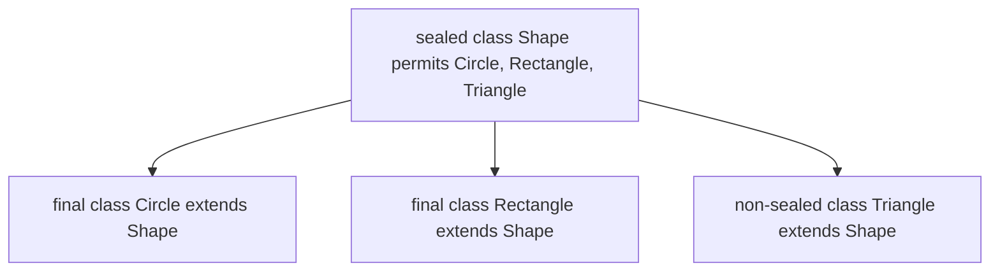

# Modern Data Modeling — Records ও Sealed Classes

ঐতিহ্যবাহী Java-তে সাধারণ একটি ডেটা হোল্ডার class (DTO / Value Object) লিখতে গিয়ে ডেভেলপারদের ঘণ্টার পর ঘণ্টা বয়লারপ্লেট কোড (প্রাইভেট ফিল্ড, constructor, গেটার, সেটার, `equals`, `hashCode`, `toString`) লিখতে হতো। Java 16 এবং 17-এ যুক্ত হওয়া দুটি অত্যন্ত শক্তিশালী ফিচার — **Records** এবং **Sealed Classes** — আধুনিক Java-কে পাইথন বা রাস্টের মতো সংক্ষিপ্ত ও টাইপ-সেফ ডেটা মডেলিংয়ের ক্ষমতা এনে দিয়েছে।

---

## ১. Records (Java 16+) — বয়লারপ্লেট-মুক্ত immutable ডেটা

একটি রেকর্ড হলো একটি স্বচ্ছ, immutable ডেটা ক্যারিয়ার। এক লাইনে সম্পূর্ণ DTO ডিফাইন করা যায়:

```java
// Just ONE line creates an immutable data class!
public record UserResponse(Long id, String username, String email) {}
```

### এই এক লাইনের পেছনে Java compiler যা যা স্বয়ংক্রিয়ভাবে তৈরি করে:
1. সমস্ত কম্পোনেন্টের জন্য `private final` ফিল্ড।
2. সমস্ত ফিল্ড ইনিশিয়ালাইজ করার একটি পূর্ণ ক্যানোনিকাল constructor (Canonical Constructor)।
3. প্রতিটি ফিল্ডের জন্য রিডার method — মনে রাখবে এর নাম `getId()` নয়, বরং সরাসরি কম্পোনেন্টের নামে `id()`, `username()`, `email()`।
4. গভীর ফিল্ড সমতা যাচাইকারী `equals()` এবং `hashCode()` method।
5. সুন্দর ডিবাগ প্রিন্টের জন্য `toString()` method (যেমন: `UserResponse[id=1, username=karim, email=...]`)।

```java
public class RecordDemo {
    public static void main(String[] args) {
        var user = new UserResponse(101L, "masud", "masud@example.com");

        // Accessing component values
        System.out.println("ইউজারনেম: " + user.username());
        System.out.println("ইমেইল: " + user.email());

        // Built-in toString and equals
        System.out.println(user); // UserResponse[id=101, username=masud, ...]
    }
}
```

---

## ২. কম্প্যাক্ট constructor (Validation ও ডিফল্ট মান)

রেকর্ড তৈরিতে ইনপুট ডেটা ভ্যালিডেট করার জন্য parameter বন্ধনী ছাড়াই একটি বিশেষ **Compact Constructor** লেখা যায়:

```java
public record BankAccountRecord(String accountNumber, double balance) {
    // Compact constructor for validation
    public BankAccountRecord {
        if (balance < 0) {
            throw new IllegalArgumentException("ব্যালেন্স ঋণাত্মক হতে পারে না!");
        }
        if (accountNumber == null || accountNumber.isBlank()) {
            throw new IllegalArgumentException("অ্যাকাউন্ট নম্বর আবশ্যক!");
        }
        // No need to write: this.balance = balance; — Compiler does it automatically!
    }
}
```

### রেকর্ডের কিছু বিধিনিষেধ:
- রেকর্ডগুলো বাই ডিফল্ট `final`, তাই অন্য কোনো class রেকর্ডকে ইনহেরিট করতে পারে না।
- রেকর্ড অন্য কোনো class-কে `extends` করতে পারে না (কারণ এটি ইতিমধ্যে গোপনে `java.lang.Record` এক্সটেন্ড করে)। তবে এটি যেকোনো interface `implements` করতে পারে।
- রেকর্ডে কোনো অতিরিক্ত নন-স্ট্যাটিক ইনস্ট্যান্স ফিল্ড যুক্ত করা যায় না।

---

## ৩. Sealed Classes ও Interfaces (Java 17+)

সাধারণত একটি class `public` হলে যে কেউ তাকে ইনহেরিট করতে পারে, আর `final` হলে কেউ ইনহেরিট করতে পারে না। কিন্তু যদি তুমি চাও **"শুধুমাত্র আমার অনুমোদিত কয়েকটি নির্দিষ্ট ক্লাসই একে ইনহেরিট করতে পারবে, বাইরের কোনো class পারবে না"**?

এই সীমাবদ্ধতা প্রয়োগ করতেই এসেছে **Sealed Classes**:



```java
// 1. Sealed base class declaring permitted subclasses
public abstract sealed class PaymentMethod 
    permits CardPayment, BkashPayment, CryptoPayment {
    
    public abstract void pay(double amount);
}

// 2. Permitted subclasses MUST declare one of: final, sealed, or non-sealed
public final class CardPayment extends PaymentMethod {
    @Override public void pay(double amount) { /* ... */ }
}

public final class BkashPayment extends PaymentMethod {
    @Override public void pay(double amount) { /* ... */ }
}

public non-sealed class CryptoPayment extends PaymentMethod {
    @Override public void pay(double amount) { /* ... */ }
}
```

### সাব-class-এর ৩টি বাধ্যবাধকতা:
অনুমোদিত প্রতিটি সাব-class-কে অবশ্যই নিচের যেকোনো একটি কি-ওয়ার্ড দিয়ে ঘোষণা করতে হয়:
1. **`final`**: এই সাব-class থেকে আর কোনো চাইল্ড class তৈরি করা যাবে না।
2. **`sealed`**: এই সাব-ক্লাসটিও নিয়ন্ত্রিতভাবে নিজের চাইল্ডদের অনুমতি দেবে।
3. **`non-sealed`**: এই সাব-class-এর পর থেকে যে কেউ স্বাধীনভাবে ইনহেরিট করতে পারবে।

---

## ৪. Sealed Types ও Pattern Matching এর যুগলবন্দী

Sealed class-এর সবচেয়ে বড় জাদু প্রকাশ পায় যখন এটিকে আধুনিক `switch` এক্সপ্রেশনের সাথে ব্যবহার করা হয়। যেহেতু compiler নিশ্চিত জানে যে `PaymentMethod` এর সম্ভাব্য চাইল্ড কেবল ৩টিই, তাই কোনো `default` কেস ছাড়াই এক্সহস্টিভ সুইচ লেখা যায়:

```java
public class PaymentService {
    public static String getPaymentStatus(PaymentMethod method) {
        // No default branch needed! Compiler verifies all permitted subtypes are covered
        return switch (method) {
            case CardPayment c   -> "ক্রেডিট/ডেবিট কার্ড প্রসেসিং";
            case BkashPayment b  -> "বিকাশ মোবাইল ওয়ালেট পেমেন্ট";
            case CryptoPayment cp -> "ব্লকচেইন ক্রিপ্টো ট্রানজ্যাকশন";
        };
    }
}
```

> [!tip]
> ভবিষ্যতে যদি তুমি `PaymentMethod` এ নতুন কোনো ভ্যারিয়েন্ট (যেমন `CashPayment`) যোগ করো, তবে কোডের যেসব জায়গায় সুইচ লেখা আছে সেখানে compiler তৎক্ষণাৎ compile error দিয়ে সতর্ক করবে যে নতুন পেমেন্ট method-টি এখনো হ্যান্ডেল করা হয়নি!

---

## সারসংক্ষেপ

- `record` হলো ডেটা-ক্যারিয়ার object তৈরির সবচেয়ে পরিষ্কার, সুরক্ষিত ও immutable পদ্ধতি।
- রেকর্ডে কম্প্যাক্ট constructor দিয়ে দ্রুত ইনপুট ভ্যালিডেশন করা যায়।
- `sealed` class ও interface inheritance-এর পরিধি নির্দিষ্ট অনুমোদিত সাব-class-এ সীমাবদ্ধ রাখে।
- Sealed class-এর সাথে Pattern Matching Switch মিলিত হয়ে ডোমেইন মডেলিংয়ে নিখুঁত compile-time টাইপ সেফটি নিশ্চিত করে।
- পরবর্তী অধ্যায়ে আমরা শিখব Java-র string ইন্টারনালস, memory মডেল ও String Pool।
