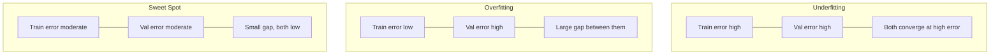
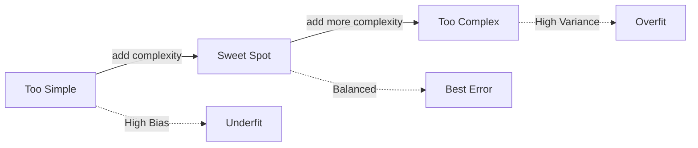

## Bias-Variance Tradeoff কী

ML এর সবচেয়ে গুরুত্বপূর্ণ concept গুলোর একটি। ভাবো তুমি dartboard এ তীর ছুঁড়ছো:

- সব তীর এক জায়গায় পড়ছে, কিন্তু center থেকে দূরে → **High Bias** (systematic ভুল)
- তীর গুলো ছড়িয়ে ছিটিয়ে পড়ছে, কেউ center এ কেউ বাইরে → **High Variance** (inconsistent)
- সব তীর center এর কাছে জমায় → **Sweet Spot** (নিখুঁত!)

Model এর ক্ষেত্রেও একই। খুব simple model = high bias (underfit), খুব complex model = high variance (overfit)। আমাদের balance খুঁজতে হবে।

## Mathematical Decomposition

Expected prediction error কে তিনটা ভাগে ভাগ করা যায়:

`Expected Error = Bias² + Variance + Irreducible Error`

- **Bias²**: Model এর average prediction actual থেকে কতটা দূরে
- **Variance**: Model এর prediction গুলো কতটা ছড়িয়ে আছে (data পরিবর্তন হলে কতটা বদলায়)
- **Irreducible Error**: ডেটাতে থাকা noise — কোনো model এ কমানো সম্ভব না

## High Bias = Underfitting

Model খুব simple — ডেটার pattern ধরতে পারে না।

```python
import numpy as np
from sklearn.linear_model import LinearRegression
from sklearn.preprocessing import PolynomialFeatures

# Non-linear data
X = np.sort(np.random.rand(100, 1) * 10, axis=0)
y = np.sin(X).ravel() + np.random.randn(100) * 0.1

# Linear model on non-linear data = UNDERFIT
model = LinearRegression()
model.fit(X, y)
train_score = model.score(X, y)
print(f"Linear model R²: {train_score:.4f}")  # Very low — underfit!
```

লক্ষণ: Training error আর test error দুটোই বেশি। Model শিখতেই পারে না।

## High Variance = Overfitting

Model খুব complex — training data মুখস্থ করে ফেলে, নতুন data এ fail করে।

```python
# Degree 15 polynomial = OVERFIT
poly = PolynomialFeatures(degree=15)
X_poly = poly.fit_transform(X)
overfit_model = LinearRegression()
overfit_model.fit(X_poly, y)
train_r2 = overfit_model.score(X_poly, y)  # Very high
print(f"Overfit model train R²: {train_r2:.4f}")  # ~0.99 — memorized!
```

লক্ষণ: Training error খুব কম, কিন্তু test error অনেক বেশি। ব্যবধান (gap) বড়।

## Learning Curves

এটাই সবচেয়ে ভালো diagnostic tool। X-axis এ training data size, Y-axis এ error। দুটা line: train error আর validation error।



```python
from sklearn.model_selection import learning_curve
import numpy as np

# Generate learning curve data
train_sizes, train_scores, val_scores = learning_curve(
    estimator=LinearRegression(),
    X=X, y=y,
    train_sizes=np.linspace(0.1, 1.0, 10),
    cv=5,
    scoring='neg_mean_squared_error'
)

train_mean = -train_scores.mean(axis=1)
val_mean = -val_scores.mean(axis=1)

print("Train size | Train MSE | Val MSE")
for i, size in enumerate(train_sizes):
    print(f"  {size:9.0f} | {train_mean[i]:9.4f} | {val_mean[i]:.4f}")
```

## Bias কমানোর উপায়

| Technique | কীভাবে | উদাহরণ |
|-----------|--------|--------|
| বেশি complex model | Model এর capacity বাড়াও | Polynomial degree বাড়াও |
| Feature যোগ করো | নতুন informative feature | Domain knowledge থেকে |
| Regularization কমাও | Penalty কমাও | alpha কমাও |

## Variance কমানোর উপায়

| Technique | কীভাবে |
|-----------|--------|
| বেশি data দাও | Training data বাড়াও |
| Regularization বাড়াও | L1/L2 penalty বাড়াও |
| Simpler model | Complexity কমাও |
| Ensemble | Bagging, Random Forest |
| Dropout | Deep learning এ |

## The Sweet Spot

Model complexity বাড়ানো শুরুতে bias দ্রুত কমে। কিন্তু একসময় variance বাড়তে শুরু করে। যে বিন্দুতে total error সবচেয়ে কম — সেটাই sweet spot।



## Cross-Validation

K-fold cross-validation একটি powerful tool। Data কে K ভাগে ভাগ করো, প্রতিবার K-1 ভাগে train, বাকি ভাগে validate। K বার করে average নাও। যদি বিভিন্ন fold এ score অনেক আলাদা হয় — overfitting এর লক্ষণ।

```python
from sklearn.model_selection import cross_val_score
from sklearn.tree import DecisionTreeRegressor

model = DecisionTreeRegressor(max_depth=3)
scores = cross_val_score(model, X, y, cv=5, scoring='r2')
print(f"CV scores: {scores}")
print(f"Mean: {scores.mean():.4f} ± {scores.std():.4f}")
# High std between folds = high variance = overfitting
```

| Symptom | High Bias | High Variance |
|---------|-----------|---------------|
| Train error | বেশি | খুব কম |
| Val error | বেশি | বেশি (gap বড়) |
| CV std | কম | বেশি |
| সমাধান | Complex model | Regularization / বেশি data |

> [!danger] "More data always helps" — ভুল ধারণা!
# High bias (underfitting) থাকলে ডেটা যোগ করা কোনো লাভ করবে না। কারণ model এর capacity ই নেই pattern শেখার। প্রথমে learning curve দেখো — যদি train আর val error কাছাকাছি থাকে কিন্তু দুটোই high হয়, তাহলে data না, **model complexity** বাড়াতে হবে।

> [!tip] Learning Curve সবচেয়ে ভালো Diagnostic
# Model underfit নাকি overfit — এক নজরে বুঝতে learning curve আঁকো। Train আর validation error এর গ্যাপ আর magnitude দেখে সঠিক সমাধান choose করা যায়। কোনো অনুমান না করে ডেটা দিয়ে diagnose করো।

## Summary

Bias-Variance tradeoff হলো model complexity এর balance খুঁজে বের করা। High bias = underfitting (simple model), high variance = overfitting (complex model)। Learning curve এ যদি train আর val error দুটোই high হয় → underfit, যদি gap বড় হয় → overfit। Underfit হলে model complex করো, overfit হলে regularization বা বেশি data দাও। কখনো অন্ধের মতো data যোগ করবে না — প্রথমে diagnose করো।