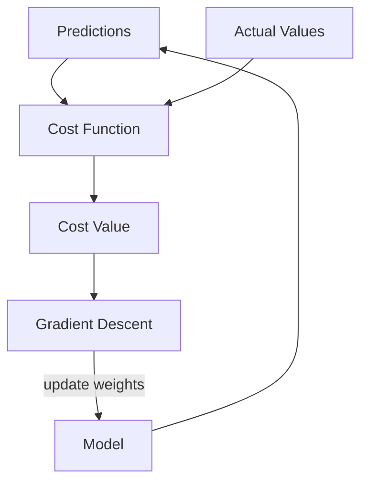
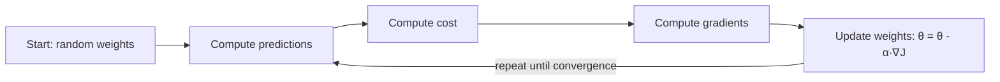

## Cost Function কী ও কেন দরকার

Machine Learning এ **model "learns"** মানে কী? এর সহজ অর্থ হলো — model তার **cost (ভুল) minimize** করে। Cost function হলো সেই measuring stick যা দিয়ে আমরা বলি model কতটা ভুল করছে।

ভাবো তুমি তুলো দিয়ে একটা target এ তীর ছুঁড়ছো। Cost function হলো তীরটা target থেকে কতদূরে পড়লো সেটার পরিমাপ। লক্ষ্য হলো এই দূরত্ব যতনা সম্ভব কমানো।



## Regression Cost Functions

### MSE (Mean Squared Error)

সবচেয়ে বেশি ব্যবহৃত। প্রতিটা prediction error কে square করে গড় বের করে।

`MSE = (1/n) Σ(yᵢ - ŷᵢ)²`

Square করা হয় কারণ: (১) ঋণাত্মক আর ধনাত্মক error যেন ক্যানসেল না হয়, (২) বড় error গুলো বেশি penalty পায়।

### MAE (Mean Absolute Error)

Error এর absolute value নেয়, square করে না। Outlier থাকলে MSE এর চেয়ে ভালো, কারণ বড় error কে বাড়িয়ে দেখায় না।

### Huber Loss

MSE আর MAE এর মিশ্রণ। ছোট error এ MSE এর মতো behave করে, বড় error এ MAE এর মতো। Outlier robust কিন্তু MSE এর মতো smooth।

| Cost Function | সূত্র | কখন ব্যবহার |
|--------------|-------|------------|
| **MSE** | `(1/n)Σ(y-ŷ)²` | Default choice, outlier কম |
| **MAE** | `(1/n)Σ\|y-ŷ\|` | Outlier বেশি |
| **Huber** | MSE/MAE hybrid | Robust + smooth |

```python
import numpy as np

def mse(y_true, y_pred):
    # Mean Squared Error from scratch
    return np.mean((y_true - y_pred) ** 2)

def mae(y_true, y_pred):
    # Mean Absolute Error
    return np.mean(np.abs(y_true - y_pred))

def huber_loss(y_true, y_pred, delta=1.0):
    # Huber: MSE for small errors, MAE for large
    error = y_true - y_pred
    is_small = np.abs(error) <= delta
    squared = 0.5 * error ** 2
    linear = delta * (np.abs(error) - 0.5 * delta)
    return np.mean(np.where(is_small, squared, linear))

# Test
y_true = np.array([3.0, 5.0, 2.5, 7.0])
y_pred = np.array([2.5, 5.0, 3.0, 9.0])  # last prediction is bad

print(f"MSE:   {mse(y_true, y_pred):.4f}")
print(f"MAE:   {mae(y_true, y_pred):.4f}")
print(f"Huber: {huber_loss(y_true, y_pred):.4f}")
```

## Classification Cost Functions

### Cross-Entropy

Classification এর জন্য সবচেয়ে বেশি ব্যবহৃত। Model যখন probability predict করে, cross-entropy মাপে সেই probability actual label এর সাথে কতটা match করে।

**Binary Cross-Entropy:**

`BCE = -(1/n) Σ[y·log(p) + (1-y)·log(1-p)]`

**Multiclass Cross-Entropy:**

`CE = -Σ yᵢ·log(pᵢ)`

### Hinge Loss

SVM এ ব্যবহৃত হয়। `L = max(0, 1 - y·ŷ)`।

## Gradient Descent: পাহাড় থেকে নামা

ভাবো তুমি একটা পাহাড়ের উপরে দাঁড়িয়ে আছো, চোখ বন্ধ। নিচে নামতে হবে। তুমি পায়ের নিচের ঢাল অনুভব করো, যেদিকে ঢাল নিচে সেদিকে এক কদম পা বাড়াও। আবার ঢাল অনুভব করো, আবার নামো। এভাবে একসময় পৌঁছে যাবে সবচেয়ে নিচে (minimum)। এটাই Gradient Descent।

### Mathematical Derivation

Cost function `J(θ)` কে minimize করতে হবে। প্রতিটা parameter θ-এর সাপেক্ষে partial derivative নিই (gradient)। তারপর সেই gradient এর বিপরীত দিকে এক কদম যাই।

`θ = θ - α · ∂J/∂θ`

যেখানে `α` = learning rate (কদমের দৈর্ঘ্য)।

### Learning Rate

| Learning Rate | ফলাফল | লক্ষণ |
|--------------|--------|--------|
| খুব বেশি | Diverge (উপরে উঠে যায়!) | Loss বাড়তে থাকে, NaN |
| খুব কম | খুব ধীর | Loss প্রায় স্থির |
| ঠিকঠাক | দ্রুত converge | Loss দ্রুত কমে |



## Gradient Descent এর ধরন

### Batch Gradient Descent

পুরো dataset একসাথে নিয়ে gradient হিসাব করে। সঠিক direction, কিন্তু ধীর যদি dataset বড় হয়।

### Stochastic Gradient Descent (SGD)

প্রতিটা sample আলাদাভাবে নেয়। খুব দ্রুত, কিন্তু noisy (এলোমেলো) path।

### Mini-batch Gradient Descent

সবচেয়ে popular — 32/64/128 টা sample এর batch নেয়। Batch আর SGD এর ভালো দিক দুটো পায়।

| Type | Data per step | Speed | Stability |
|------|--------------|-------|-----------|
| Batch | Full dataset | ধীর | খুব stable |
| SGD | 1 sample | দ্রুত | Noisy |
| Mini-batch | 32–256 | দ্রুত | Balanced |

## Learning Rate Scheduling

Learning rate স্থির না রেখে ধীরে ধীরে কমানো যায়। শুরুতে দ্রুত এগিয়ে যাওয়া যায়, শেষে সূক্ষ্মভাবে minimum এ পৌঁছানো যায়।

- **Step decay**: নির্দিষ্ট epoch পরপর lr অর্ধেক করা
- **Exponential decay**: `lr = lr₀ × decay^epoch`
- **Cosine annealing**: cosine wave এর মতো smoothly কমে

## Python: Gradient Descent from Scratch

```python
import numpy as np

# Linear regression: y = mx + b
# Goal: find optimal m and b using gradient descent

X = np.array([1, 2, 3, 4, 5], dtype=float)
y = np.array([2, 4, 6, 8, 10], dtype=float)  # y = 2x

m = 0.0  # initial slope
b = 0.0  # initial intercept
lr = 0.01  # learning rate
epochs = 100
n = len(X)

for epoch in range(epochs):
    # Predictions
    y_pred = m * X + b
    
    # Gradients (partial derivatives of MSE)
    dm = (-2 / n) * np.sum(X * (y - y_pred))
    db = (-2 / n) * np.sum(y - y_pred)
    
    # Update parameters
    m = m - lr * dm
    b = b - lr * db
    
    if epoch % 20 == 0:
        cost = np.mean((y - y_pred) ** 2)
        print(f"Epoch {epoch}: m={m:.4f}, b={b:.4f}, cost={cost:.4f}")

print(f"\nFinal: y = {m:.2f}x + {b:.2f}")
# Final: y = 2.00x + 0.00  (perfect!)
```

## Modern Optimizers

### Momentum

SGD এ একটা "velocity" যোগ করে — আগের দিক মনে রাখে। ফলে oscillation কমে, দ্রুত converge করে।

### RMSprop

প্রতিটা parameter এর জন্য আলাদা learning rate — যেগুলো বেশি update হয় সেগুলোর rate কমে যায়।

### Adam

Momentum + RMSprop এর সমন্বয়। বর্তমানে সবচেয়ে popular optimizer। বেশিরভাগ deep learning model এ default।

| Optimizer | Key Idea | Best For |
|-----------|---------|----------|
| **SGD** | Vanilla gradient | Simple models |
| **Momentum** | Accumulate past gradients | Faster convergence |
| **RMSprop** | Adaptive per-parameter lr | Non-stationary data |
| **Adam** | Momentum + adaptive lr | Most deep learning |

> [!danger] Exploding / Vanishing Gradients
# Deep neural network এ gradient খুব বড় (exploding) বা খুব ছোট (vanishing) হয়ে যেতে পারে। Exploding হলে loss = NaN, vanishing হলে early layers কিছুই শেখে না। সমাধান: gradient clipping, batch normalization, ReLU activation, residual connections।

> [!tip] Feature Normalization
# Gradient descent চালানোর আগে **সব feature scale করো** (StandardScaler / MinMaxScaler)। নাহলে এক feature এর range বড় হলে সেটা gradient কে dominate করবে, training ধীর আর unstable হবে।

## Summary

Cost function model এর ভুল মাপে — regression এ MSE/MAE/Huber, classification এ cross-entropy। Gradient descent সেই cost minimize করে পাহাড় থেকে নামার মতো করে। Learning rate খুব গুরুত্বপূর্ণ — ঠিকঠাক না হলে training fail করবে। Mini-batch GD সবচেয়ে practical, আর Adam optimizer বর্তমানে default choice। Feature scaling আর gradient stability সবসময় মাথায় রাখতে হবে।