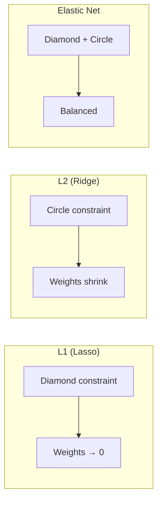

## Linear Regression গভীরে

আগের chapter গুলোতে আমরা `sklearn` দিয়ে linear regression চালিয়েছি। কিন্তু ভেতরে কী হয়? Model কীভাবে সঠিক weights বের করে? এই chapter এ আমরা mathematics-এ ডুব দেবো।

## OLS (Ordinary Least Squares)

Linear regression এর লক্ষ্য হলো এমন একটা line বা hyperplane খুঁজে বের করা যা data points থেকে সবচেয়ে কম দূরে থাকে। "Least Squares" মানে error এর square করে যোগ করা — আর সেটি minimize করা।

Cost function: `J(w) = Σ(yᵢ - Xᵢw)²`

## The Normal Equation

Gradient descent ছাড়াও সরাসরি formula দিয়ে optimal weights বের করা যায়:

`w = (XᵀX)⁻¹ Xᵀy`

প্রতিটা অংশের অর্থ:

- **XᵀX**: Feature গুলোর covariance structure
- **(XᵀX)⁻¹**: এটা inverse — singular matrix হলে কাজ করবে না
- **Xᵀy**: Feature আর target এর সম্পর্ক
- **w**: Optimal weights

```python
import numpy as np

# Normal equation from scratch
X = np.array([[1, 1], [1, 2], [1, 3], [1, 4]])  # bias column added
y = np.array([2, 4, 6, 8])

# w = (X^T X)^{-1} X^T y
XtX = X.T @ X
XtX_inv = np.linalg.inv(XtX)
Xty = X.T @ y
w = XtX_inv @ Xty
print(f"Weights: {w}")  # Should give slope=2, intercept=0
```

> [!note] Normal Equation vs Gradient Descent
# Normal equation সরাসরি উত্তর দেয়, কিন্তু `(XᵀX)⁻¹` হিসাবের complexity O(n³) — বড় dataset এ অসম্ভব ধীর। Feature যদি ১০০০+ হয় gradient descent ই better। ছোট dataset এ normal equation ভালো।

## Gradient Descent for Linear Regression

বড় dataset এ gradient descent ব্যবহার করা হয়। প্রতিটা iteration এ weights update করা হয়।

```python
# Gradient descent for linear regression
from sklearn.preprocessing import StandardScaler
import numpy as np

X = np.random.rand(100, 3)  # 100 samples, 3 features
true_w = np.array([2.0, -1.0, 0.5])
y = X @ true_w + 0.5 + np.random.randn(100) * 0.1

scaler = StandardScaler()
X_scaled = scaler.fit_transform(X)

w = np.zeros(X.shape[1])
b = 0.0
lr = 0.1

for epoch in range(200):
    y_pred = X_scaled @ w + b
    error = y_pred - y
    dw = (2 / len(y)) * X_scaled.T @ error
    db = (2 / len(y)) * np.sum(error)
    w -= lr * dw
    b -= lr * db

print(f"Weights: {w}")  # Close to [2.0, -1.0, 0.5]
print(f"Bias: {b:.4f}")
```

## Assumptions of Linear Regression

Linear regression কিছু assumption এর উপর ভিত্তি করে কাজ করে। এগুলো ভঙ্গ হলে ফলাফল বিশ্বস্ত হবে না।

| Assumption | অর্থ | Violation হলে |
|-----------|------|--------------|
| **Linearity** | X আর y এর সম্পর্ক linear | Underfit, wrong predictions |
| **Homoscedasticity** | Error এর spread সব জায়গায় সমান | Confidence interval ভুল |
| **Independence** | Observations independent | Biased estimates |
| **No multicollinearity** | Feature গুলো পরস্পর নির্ভরশীল না | Unstable weights |
| **Normal residuals** | Error গুলো normal distribution | p-values অবিশ্বস্ত |

## Logistic Regression

Classification এর জন্য linear regression কাজ করে না — কারণ output কে 0 আর 1 এর মধ্যে রাখতে হয়। সেজন্য **sigmoid function** ব্যবহার করা হয়।

`σ(z) = 1 / (1 + e⁻ᶻ)`

Sigmoid যেকোনো real number কে 0 আর 1 এর মধ্যে squeeze করে দেয়। ফলে output কে probability হিসেবে interpret করা যায়।

```python
import numpy as np

def sigmoid(z):
    return 1 / (1 + np.exp(-z))

# Sigmoid maps any value to (0, 1)
for val in [-5, -1, 0, 1, 5]:
    print(f"sigmoid({val:3d}) = {sigmoid(val):.4f}")
```

### Logistic Regression Cost = Cross-Entropy

Linear regression এ MSE ব্যবহার হয়, কিন্তু logistic regression এ MSE non-convex (একাধিক local minimum)। তাই **cross-entropy** ব্যবহার করা হয় — যা convex আর সুন্দরভাবে optimize করা যায়।

`J = -Σ[y·log(σ(z)) + (1-y)·log(1-σ(z))]`

## Regularization: Overfitting প্রতিরোধ

Model যদি training data মুখস্থ করে ফেলে (overfit), নতুন data এ খারাপ কাজ করে। Regularization হলো weight গুলোকে ছোট রাখা যাতে model সহজে মুখস্থ না করতে পারে।

### L1 Regularization (Lasso)

Cost এ `λ·Σ|w|` যোগ করা হয়। অপ্রয়োজনীয় feature এর weight **একদম শূন্য** হয়ে যায় — ফলে automatic feature selection হয়।

### L2 Regularization (Ridge)

Cost এ `λ·Σw²` যোগ করা হয়। Weight গুলো ধীরে ধীরে ছোট হয়, কিন্তু শূন্য হয় না। সব feature থেকে যায়।

### Elastic Net

L1 + L2 এর সমন্বয়। দুইয়ের সুবিধা পাওয়া যায়।



| Property | L1 (Lasso) | L2 (Ridge) | Elastic Net |
|---------|-----------|-----------|-------------|
| **Penalty** | `\|w\|` | `w²` | `α|w| + (1-α)w²` |
| **Sparse weights** | হ্যাঁ (কিছু = 0) | না | আংশিক |
| **Feature selection** | Automatic | না | Partial |
| **Multicollinearity** | একটা বেছে নেয় | সব রাখে | Balanced |

## Python: Ridge, Lasso, ElasticNet

```python
from sklearn.linear_model import Ridge, Lasso, ElasticNet
from sklearn.preprocessing import StandardScaler
from sklearn.model_selection import train_test_split
import numpy as np

# Generate data with some irrelevant features
np.random.seed(42)
X = np.random.randn(200, 10)
y = X[:, 0] * 3 + X[:, 1] * (-2) + np.random.randn(200) * 0.5
# Only feature 0 and 1 matter, rest are noise

X_train, X_test, y_train, y_test = train_test_split(X, y, test_size=0.2)

# ALWAYS scale before regularization
scaler = StandardScaler()
X_train_s = scaler.fit_transform(X_train)
X_test_s = scaler.transform(X_test)

ridge = Ridge(alpha=1.0).fit(X_train_s, y_train)
lasso = Lasso(alpha=0.1).fit(X_train_s, y_train)
elastic = ElasticNet(alpha=0.1, l1_ratio=0.5).fit(X_train_s, y_train)

print("Lasso weights:", np.round(lasso.coef_, 2))
# Most weights will be 0 — automatic feature selection!
print("Ridge weights:", np.round(ridge.coef_, 2))
# All weights small but non-zero
print(f"\nLasso R²:  {lasso.score(X_test_s, y_test):.4f}")
print(f"Ridge R²:  {ridge.score(X_test_s, y_test):.4f}")
```

### Lambda (Alpha) Parameter

`alpha` বাড়ালে regularization বাড়ে (model simpler), কমালে কমে (model complex)। বেশি বেশি বাড়ালে model underfit করবে, একদম শূন্য হলে overfit করবে।

> [!tip] Feature Scaling অপরিহার্য
# Regularization weight গুলোর magnitude এর উপর নির্ভর করে। যদি এক feature এর range ০–১০০০ আর আরেকটার ০–১ হয়, তাহলে regularization বড় range ওয়ালা feature কে বেশি penalty দেবে — যা ভুল। তাই **StandardScaler** বা **MinMaxScaler** ব্যবহার করো।

> [!warn] Multicollinearity সতর্কতা
# Feature গুলো যদি পরস্পর খুব সম্পর্কিত (high correlation) হয়, linear regression weights unstable হয়ে যায়। Ridge regression এই সমস্যা handle করতে পারে, কিন্তু Lasso একটা feature এলোমেলোভাবে বেছে নিতে পারে। Feature correlation check করে highly correlated feature বাদ দাও।

## Summary

Linear regression এর দুটো সমাধান: Normal Equation (সরাসরি, ছোট dataset) আর Gradient Descent (iterative, বড় dataset)। Logistic regression classification এর জন্য sigmoid আর cross-entropy ব্যবহার করে। Regularization overfitting প্রতিরোধ করে — L1 (Lasso) feature selection করে, L2 (Ridge) weight shrink করে, Elastic Net দুটোর balance দেয়। Feature scaling আর multicollinearity check regularization এর আগে অপরিহার্য।