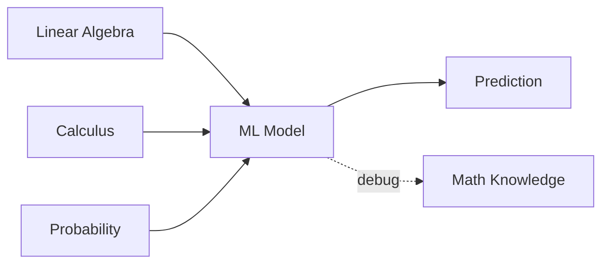

## Mathematics কেন দরকার

অনেকে ভাবে ML শিখলেই math জানা লাগবে না। ভুল ধারণা। তুমি যখন model debug করো, যখন loss কমছে না, যখন prediction ঠিক আসছে না — তখন math ছাড়া তুমি অন্ধের মতো এলোমেলো চেষ্টা করবে। Math বুঝলে তুমি জানবে **কেন** সমস্যা হচ্ছে এবং **কোথায়** খুঁজতে হবে।

ভাবো একটা গাড়ি — তুমি চালাতে পারো ইঞ্জিন না বুঝেও। কিন্তু গাড়ি খারাপ হলে mechanic এর কাছে যেতে হয় যিনি ইঞ্জিন বোঝেন। ML এ তুমি নিজেই mechanic হতে চাও, তাই math দরকার।



## Vectors ও Matrices

**Vector** হলো সংখ্যার একটা তালিকা। যেমন একজন মানুষের `[height, weight, age]` = `[170, 65, 25]` — এটাই একটা vector।

**Matrix** হলো সংখ্যার একটা গ্রিড (table)। ১০০০ জন মানুষের ডেটা হলো একটা matrix — ১০০০ টা row, ৩ টা column।

```python
import numpy as np

# Vector — 1D array
v1 = np.array([1, 2, 3])
v2 = np.array([4, 5, 6])

# Dot product — how similar two vectors are
dot = np.dot(v1, v2)  # 1*4 + 2*5 + 3*6 = 32
print(f"Dot product: {dot}")

# Matrix — 2D array
A = np.array([[1, 2], [3, 4]])
B = np.array([[5, 6], [7, 8]])

# Matrix multiplication (NOT element-wise!)
C = A @ B  # or np.matmul(A, B)
print(f"Matmul result:\n{C}")

# Transpose — flip rows and columns
print(f"A transposed:\n{A.T}")
```

### Dot Product এর অর্থ

Dot product শুধু গাণিতিক operation না — এর ভাবগত অর্থ হলো **দুটো vector কতটা একই দিকে যাচ্ছে**। Dot product বড় = একই দিক, ছোট বা ঋণাত্মক = বিপরীত দিক।

Neural network এ প্রতিটা neuron মূলত একটা dot product হিসাব করে — input আর weight এর।

### Matrix Multiplication

এটা ML এ সবচেয়ে বেশি ব্যবহৃত operation। একসাথে হাজার হাজার data point এর calculation করা যায়।

```python
# 100 samples, 3 features each
X = np.random.rand(100, 3)
# 3 weights
W = np.array([0.5, 1.2, -0.3])

# Predictions for ALL 100 samples at once
predictions = X @ W  # shape: (100,)
```

## Matrix Operations

### Transpose

Row আর column অদলবদল করা। `A.T`। ব্যবহার: `X^T X` এর মতো expression এ।

### Inverse

`A⁻¹` — এমন একটা matrix যেটার সাথে A গুণ করলে identity matrix পাওয়া যায়। Not all matrices have an inverse (singular matrices). Normal equation এ দরকার হয়।

### Determinant

একটা scalar যা বলে দেয় matrix টার inverse আছে কি না। `det = 0` হলে inverse নেই।

```python
A = np.array([[4, 7], [2, 6]])

det = np.linalg.det(A)          # determinant
A_inv = np.linalg.inv(A)        # inverse
eigenvalues, eigenvectors = np.linalg.eig(A)  # eigenvalues

print(f"Determinant: {det:.2f}")
print(f"Eigenvalues: {eigenvalues}")
```

### Eigenvalues ও Eigenvectors (সংক্ষেপে)

ভাবো একটা matrix একটা transformation — যেমন একটা ছবিকে stretch বা rotate করা। Eigenvalue বলে দেয় কতটা stretch হলো, eigenvector বলে দেয় কোন দিকে এখনও অপরিবর্তিত রয়ে গেছে। PCA (Principal Component Analysis) এ এটা ব্যবহার হয়।

## Calculus Essentials

### Derivative

Derivative বলে দেয় একটা function কোন দিকে বাড়ছে বা কমছে। পাহাড়ের ঢালের কথা ভাবো — ঢালের direction আর magnitude জানলে কোন দিকে নামলে সবচেয়ে দ্রুত নিচে যাওয়া যায় সেটা derivative।

### Partial Derivative

একাধিক variable থাকলে, একটা variable ধরে রেখে বাকিগুলোর সাপেক্ষে derivative নিই। যেমন `f(x, y)` এর x এর সাপেক্ষে partial derivative = শুধু x পরিবর্তন করলে f কতটা বদলায়।

### Chain Rule

যখন ফাংশনের ভেতরে ফাংশন থাকে: `f(g(x))`। তখন `df/dx = df/dg × dg/dx`।

**Gradient Descent কেন এসব দরকার?** কারণ loss function টিকে minimize করতে হয়। আর কোন দিকে নামলে loss কমবে — সেটা derivative বলে দেয়। Neural network এ backpropagation হলো শুধু chain rule এর বারবার প্রয়োগ।

```python
# Numerical derivative of f(x) = x^2 at x=3
def f(x):
    return x ** 2

h = 0.0001
slope = (f(3 + h) - f(3 - h)) / (2 * h)
print(f"Derivative of x^2 at x=3: {slope:.2f}")  # Should be 6.0
```

## Probability Basics

**Probability (সম্ভাবনা)** বলে দেয় কোনো event ঘটার সম্ভাবনা কত। মান ০ থেকে ১।

- **Random Variable**: যেমন একটা dice ছোঁড়ার ফলাফল (১–৬)
- **Expectation (প্রত্যাশা)**: গড় ফলাফল। একটা dice এর expectation = 3.5
- **Variance (ভেদাঙ্ক)**: ফলাফল গড় থেকে কতটা ছড়িয়ে থাকে

```python
import numpy as np

# Simulate rolling a die 10000 times
rolls = np.random.randint(1, 7, size=10000)
print(f"Mean (expectation): {rolls.mean():.2f}")    # ~3.5
print(f"Variance: {rolls.var():.2f}")               # ~2.92
```

## Information Theory (সংক্ষেপে)

### Entropy

Entropy মাপে একটা distribution কতটা **unpredictable**। একটা fair coin (50/50) এর entropy বেশি, একটা biased coin (99/1) এর কম। Decision Tree split করার সময় entropy কমানোর চেষ্টা করে।

### KL Divergence

দুটো distribution এর মধ্যে পার্থক্য মাপে। Variational Autoencoder, t-SNE — এসবে ব্যবহার হয়। মান সবসময় ≥ ০ এবং asymmetric (D(P||Q) ≠ D(Q||P))।

## Math Concept → ML Application

| Math Concept | ML Application |
|-------------|----------------|
| **Dot product** | Neural network neuron, cosine similarity |
| **Matrix multiplication** | Batch predictions, layer operations |
| **Eigenvalues/vectors** | PCA, dimensionality reduction |
| **Derivative / chain rule** | Gradient descent, backpropagation |
| **Probability** | Naive Bayes, generative models |
| **Entropy** | Decision trees, cross-entropy loss |
| **KL divergence** | VAE, model distillation |

## NumPy Practical

```python
import numpy as np

# Create vectors and matrices
v = np.array([1.0, 2.0, 3.0])
M = np.array([[1, 0, 2], [0, 1, 3], [1, 1, 0]])

# Matrix-vector multiplication
result = M @ v  # shape: (3,)
print(f"Result: {result}")

# Element-wise operations (Hadamard product)
A = np.array([[1, 2], [3, 4]])
B = np.array([[5, 6], [7, 8]])
print(f"Element-wise multiply:\n{A * B}")

# Solve linear system Ax = b
b = np.array([5, 11])
x = np.linalg.solve(A, B[:, 0] if A.shape[1] == 2 else b)
print(f"Solution: {x}")
```

> [!tip] Formula না, Concept বুঝো
# সব formula মুখস্থ করার দরকার নেই। কিন্তু **concept** বুঝতে হবে — dot product কী করে, gradient কী মানে দেয়, entropy কেন গুরুত্বপূর্ণ। এই ধারণাগুলো থাকলে তুমি যেকোনো নতুন algorithm দ্রুত শিখতে পারবে। NumPy documentation আর Wikipedia ই যথেষ্ট reference।

## Summary

ML এর ভিত্তি হলো math — Linear Algebra (vectors, matrices), Calculus (derivatives, chain rule), আর Probability (random variables, distributions)। এগুলো না বুঝে শুধু library ব্যবহার করলে সমস্যা এলে আটকে যাবে। Dot product, matrix multiplication, gradient — এই তিনটা concept সবচেয়ে গুরুত্বপূর্ণ। NumPy দিয়ে নিজে হাতে এসব operation করে দেখো, তাহলে concept পরিষ্কার হবে।