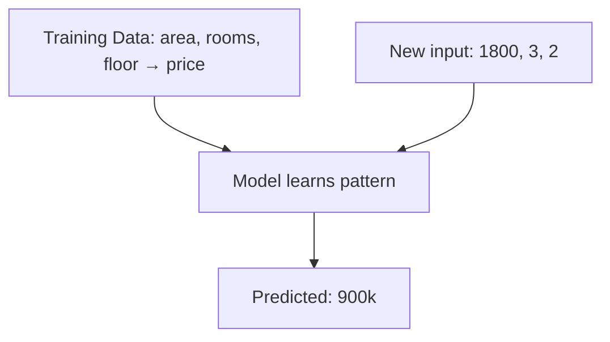

## Supervised Learning কী

**Supervised Learning** হলো এমন ML যেখানে model কে label করা ডেটা দিয়ে শেখানো হয়। প্রতিটা input এর সাথে সঠিক answer (label) দেওয়া থাকে — ঠিক যেন teacher প্রশ্ন আর উত্তর একসাথে দেখাচ্ছে।



Supervised learning দুই ধরনের হয় — **Regression** আর **Classification**।

| Type | Output | উদাহরণ |
|------|--------|--------|
| Regression | Continuous number | দাম, temperature, age |
| Classification | Category/label | spam/ham, cat/dog, disease type |

## Regression — Continuous Value Predict

Regression এ output একটা number হয় — যেমন ঘরের দাম, temperature, কারো salary। সবচেয়ে basic হলো **Linear Regression**।

### Linear Regression

Linear regression ধরে নেয় input আর output এর মধ্যে একটা straight line relationship আছে।

```python
from sklearn.linear_model import LinearRegression
from sklearn.model_selection import train_test_split
from sklearn.metrics import mean_squared_error, r2_score
import numpy as np

# House data: area (sqft) → price
X = np.array([[800], [1000], [1200], [1500], [1800], [2000], [2500], [3000]])
y = np.array([400, 500, 600, 750, 900, 1000, 1250, 1500])  # in thousands

# Train/test split
X_train, X_test, y_train, y_test = train_test_split(X, y, test_size=0.25, random_state=42)

# Train model
model = LinearRegression()
model.fit(X_train, y_train)

# Predict
predictions = model.predict(X_test)
print(f"Slope: {model.coef_[0]:.2f}")
print(f"Intercept: {model.intercept_:.2f}")
print(f"R² Score: {r2_score(y_test, predictions):.4f}")
```

মডেল যেটা শেখে তা হলো: `price = slope × area + intercept`। একটা সরল রেখা।

## Classification — Category Predict

Classification এ output একটা category হয়। যেমন: email spam না not spam, tumor malignant না benign। সবচেয়ে simple classifier হলো **Logistic Regression**।

### Logistic Regression

নাম এ regression আছে, কিন্তু এটা classification algorithm। Output হিসেবে ০ থেকে ১ এর মধ্যে একটা probability দেয়।

```python
from sklearn.linear_model import LogisticRegression
from sklearn.datasets import load_iris
from sklearn.model_selection import train_test_split
from sklearn.metrics import accuracy_score

# Load iris dataset
iris = load_iris()
X = iris.data
y = iris.target

# Train/test split
X_train, X_test, y_train, y_test = train_test_split(
    X, y, test_size=0.3, random_state=42
)

# Train classifier
clf = LogisticRegression(max_iter=200)
clf.fit(X_train, y_train)

# Predict
predictions = clf.predict(X_test)
print(f"Accuracy: {accuracy_score(y_test, predictions):.2%}")
```

| Algorithm | Output | Use Case |
|-----------|--------|----------|
| Linear Regression | Number | Price, temperature |
| Logistic Regression | Category | Binary classification |
| Decision Tree | Category | Rule-based |
| Random Forest | Category | Ensemble, robust |
| SVM | Category | Complex boundary |

## Train/Test Split — কেন দরকার

Model কে যে ডেটা দিয়ে train করা হয়েছে, সে ডেটাতে সে ভালো predict করবে — এটা obvious। কিন্তু আসল প্রশ্ন হলো, নতুন ডেটাতে কেমন করবে? সেই জন্য ডেটা দুই ভাগ করা হয়।

```python
from sklearn.model_selection import train_test_split

X_train, X_test, y_train, y_test = train_test_split(
    X, y,
    test_size=0.2,      # 20% test data
    random_state=42,    # reproducibility
    stratify=y          # class balance maintain
)
```

```text
  All Data (100%)
  ┌──────────────────────────────┐
  │                              │
  │  ████████████ 80% Training   │  ← Model শেখে এখান থেকে
  │  ████ 20% Testing            │  ← এখানে evaluate হয়
  │                              │
  └──────────────────────────────┘
```

> [!danger] Data Leakage সাবধান!
# Data leakage হয় যখন test ডেটা থেকে information train এ চলে যায়। যেমন: preprocessing করার আগে split না করলে, বা future ডেটা accidentally feature এ চলে এলে। ফলে training accuracy অনেক বেশি দেখায়, কিন্তু real world এ model ব্যর্থ হয়। সবসময় split আগে করো, preprocessing পরে।

## Overfitting vs Underfitting

```text
  Underfitting          Good Fit           Overfitting

    ●  ●                    ●                     ●
      ●  ●                ●   ●                 ●   ●
         ●              ●       ●              ●       ●
                         ●   ●                    ●   ●
                           ●                        ●

  খুব simple           Balanced              Training data মুখস্থ
  high bias            low bias/variance     high variance
  low train acc        good train acc        very high train acc
  low test acc         good test acc         low test acc
```

| Problem | Training Score | Test Score | সমাধান |
|---------|---------------|------------|--------|
| Underfitting | কম | কম | Complex model, বেশি feature |
| Overfitting | অনেক বেশি | কম | Regularization, বেশি data |
| Good Fit | ভালো | ভালো | ✅ ঠিক আছে |

```python
from sklearn.tree import DecisionTreeClassifier

# Overfitting example — too deep tree
overfit_model = DecisionTreeClassifier(max_depth=None)
overfit_model.fit(X_train, y_train)
print(f"Train: {overfit_model.score(X_train, y_train):.2%}")  # 100%
print(f"Test:  {overfit_model.score(X_test, y_test):.2%}")    # lower

# Controlled model
good_model = DecisionTreeClassifier(max_depth=3, min_samples_leaf=5)
good_model.fit(X_train, y_train)
print(f"Train: {good_model.score(X_train, y_train):.2%}")
print(f"Test:  {good_model.score(X_test, y_test):.2%}")
```

> [!tip] সবসময় simple দিয়ে শুরু করো
# Complex model দিয়ে শুরু করবে না। আগে একটা simple baseline বানাও — Logistic Regression বা Decision Tree। দেখো accuracy কত। তারপর ধীরে ধীরে complex model এ যাও। অনেক সময় simple model ই যথেষ্ট ভালো হয়।

## Practical — House Price Prediction

পুরো একটা regression workflow:

```python
from sklearn.linear_model import LinearRegression
from sklearn.preprocessing import StandardScaler
from sklearn.pipeline import Pipeline
from sklearn.metrics import mean_squared_error, r2_score
from sklearn.model_selection import train_test_split
import numpy as np

# Synthetic data
np.random.seed(42)
area = np.random.randint(600, 4000, 200)
rooms = np.random.randint(1, 6, 200)
price = area * 0.5 + rooms * 50 + np.random.normal(0, 50, 200)

X = np.column_stack([area, rooms])
y = price

# Pipeline: scale + model
pipeline = Pipeline([
    ("scaler", StandardScaler()),
    ("model", LinearRegression())
])

X_train, X_test, y_train, y_test = train_test_split(X, y, test_size=0.2, random_state=42)
pipeline.fit(X_train, y_train)

predictions = pipeline.predict(X_test)
print(f"MSE:  {mean_squared_error(y_test, predictions):.2f}")
print(f"RMSE: {np.sqrt(mean_squared_error(y_test, predictions)):.2f}")
print(f"R²:   {r2_score(y_test, predictions):.4f}")
```

## Summary

Supervised learning এ labeled ডেটা দিয়ে model শেখানো হয়। Regression continuous value predict করে (দাম), classification category predict করে (spam/ham)। সবসময় train/test split করো, overfitting এর দিকে খেয়াল রাখো। Simple model দিয়ে শুরু করো, data leakage এড়াও। Linear আর Logistic regression হলো সবার প্রথম step।