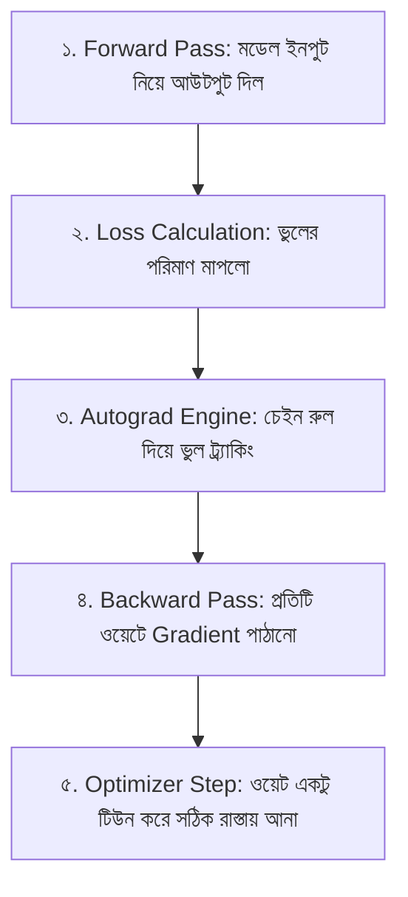
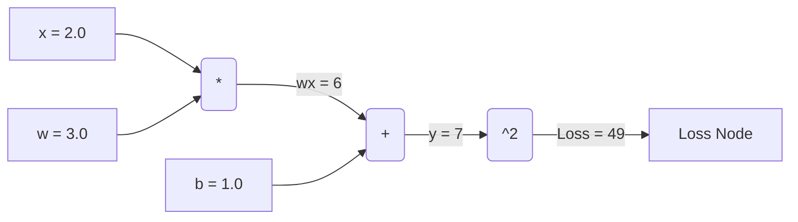

## Autograd Engine — Automatic Differentiation

PyTorch এর প্রাণকেন্দ্রে রয়েছে **Autograd Engine**। 

নিউরাল নেটওয়ার্ক কীভাবে শেখে? সে একটি ভবিষ্যদ্বাণী (Prediction) করে, ভুলের পরিমাণ (Loss) মেপে দেখে, এবং তারপর নিজের ভেতরের ওয়েট (Weights) বা প্যারামিটারগুলো একটু টিউন করে ভুল কমায়। 

এই **ভুল কমানোর জন্য কোন ওয়েটকে কতটা পরিবর্তন করতে হবে**—তা নির্ধারণ করার জন্য দরকার গাণিতিক ঢাল বা ডেরিভেটিভ (Gradient $\frac{\partial L}{\partial w}$)। Autograd নিজে থেকে সম্পূর্ণ ক্যালকুলাস ও চেইন রুল প্রয়োগ করে প্রতিটি ওয়েটের গ্র্যাডিয়েন্ট বের করে দেয়।

---

## 💡 সহজ কথায় Autograd এবং Gradient কী?

ধরে নাও তুমি লক্ষ্যভেদে তীর ছুড়ছো:
- ১ম তীর লক্ষ্যবস্তুর ১০ সেন্টিমিটার ডানপাশে লাগলো (এটি হলো Loss বা ভুল)।
- এখন পরবর্তী তীরে সঠিক লক্ষ্যভেদ করতে হলে ধনুকের কোণ **কতটা বামে ঘুরাতে হবে**—সেই দিকনির্দেশনাই হলো **Gradient**!

নিউরাল নেটওয়ার্কে হাজার হাজার বা কোটি কোটি এমন "ধনুকের কোণ" (Weights) থাকে। হাত দিয়ে প্রতিটি ওয়েটের জন্য ডেরিভেটিভ গণনাকরা অসম্ভব। Autograd ব্যাকগ্রাউন্ডে পুরো হিসেবটি অটোমেটিক্যালি করে দেয়!



---

## `requires_grad=True` এবং Computational Graph

যখন কোনো Tensor এ `requires_grad=True` সেট করা হয়, PyTorch সেই টেন্সরের ওপর সংঘটিত সব গাণিতিক অপারেশন গোপন খাতায় ট্র্যাক করে একটি **Computational Graph (DAG)** তৈরি করে।

```python
import torch

# 1. Create tensor with gradient tracking enabled
x = torch.tensor(2.0, requires_grad=True)
w = torch.tensor(3.0, requires_grad=True)
b = torch.tensor(1.0, requires_grad=True)

# 2. Forward Pass: Compute y = w * x + b
y = w * x + b  # y = 3 * 2 + 1 = 7.0

# 3. Compute Loss: L = y^2
loss = y ** 2  # loss = 7^2 = 49.0

print("Loss value:", loss.item())
```



---

## Backpropagation trigger: `loss.backward()`

গ্রাফের শেষে `loss.backward()` কল করলেই উল্টো দিক থেকে ডেরিভেটিভ বের হওয়া শুরু হয় (Backpropagation) এবং প্রতিটি `requires_grad=True` থাকা ইনপুটের `.grad` অ্যাট্রিবিউটে গ্র্যাডিয়েন্ট মান জমা হয়।

```python
# Trigger Backpropagation
loss.backward()

# Gradients calculation check via Chain Rule:
# dL/dy = 2 * y = 14
# dy/dw = x = 2
# dL/dw = (dL/dy) * (dy/dw) = 14 * 2 = 28.0

print(f"Gradient dL/dw: {w.grad}") # Output: tensor(28.)
print(f"Gradient dL/dx: {x.grad}") # Output: tensor(42.)
print(f"Gradient dL/db: {b.grad}") # Output: tensor(14.)
```

---

## 🛑 গ্র্যাডিয়েন্ট ট্র্যাকিং ডিসেবল করা: `torch.no_grad()`

### কেন `torch.no_grad()` ব্যবহার করবো?
যখন তুমি মডেল ট্রেইনিং শেষ করে শুধু **ভ্যালিডেশন বা ইনফারেন্স (Prediction)** করবে, তখন তোমার আর ওয়েট আপডেট করার প্রয়োজন নেই।

সে সময় `torch.no_grad()` ব্লকের ভেতর কোড চালালে:
- Autograd মেমরি ট্র্যাকিং বন্ধ থাকে।
- RAM / VRAM অনেক বেঁচে যায়।
- মডেলের আউটপুট দ্রুত জেনারেট হয়!

```python
# Model Evaluation / Inference Loop (Fast & Memory Efficient)
with torch.no_grad():
    prediction = model(input_tensor)
    # Computational Graph তৈরি হবে না!
```

---

## ⚠️ গুরুত্বপূর্ণ সতর্কতা: Gradient Accumulation

> [!warning] গ্র্যাডিয়েন্ট নিজে থেকে জিরো (0) হয় না!
> PyTorch এ `.backward()` কল করলে লুপে আগের গ্র্যাডিয়েন্ট মুছে যায় না, বরং পুরোনোর সাথে নতুন গ্র্যাডিয়েন্ট যোগ হতে থাকে (`.grad += new_grad`)!
> তাই ট্রেনিং লুপের প্রতি স্টেপে অবশ্যই **`optimizer.zero_grad()`** কল করে আগের ধাপের গ্র্যাডিয়েন্ট মুছে ফেলতে হয়!
