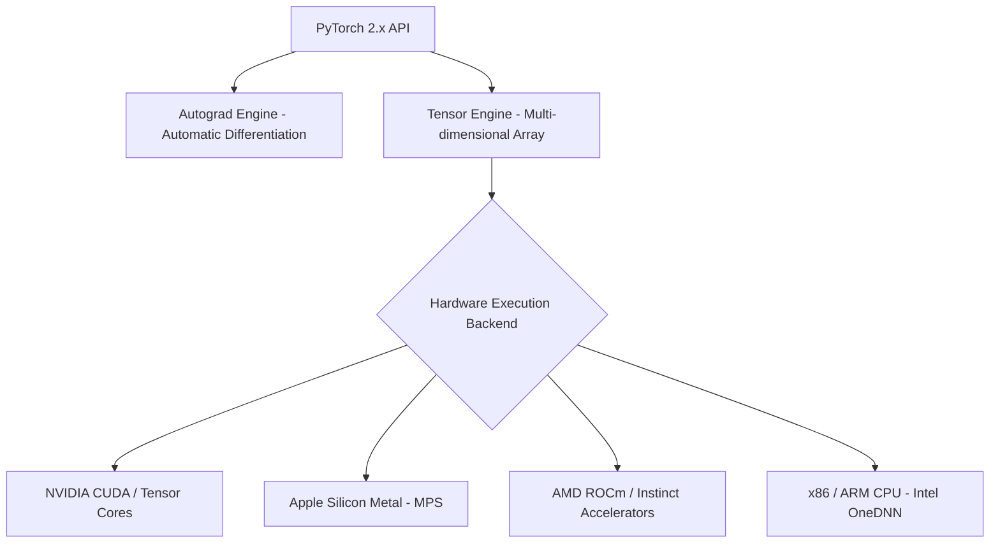

## PyTorch কী ও কেন ডিপ লার্নিং এর সেরা choice

**PyTorch** হলো Meta AI (Facebook) দ্বারা তৈরি পৃথিবীর সবচেয়ে জনপ্রিয়, নমনীয় এবং বহুল ব্যবহৃত **Deep Learning & Artificial Intelligence Framework**।

২০২৬ সালে দাঁড়য়ে পৃথিবীর ৯৫%+ AI/ML গবেষণা, LLM (Large Language Model), Vision Transformers, Diffusion Models (Image Generation) এবং OpenAI / HuggingFace এর প্রায় সব মডেল PyTorch কেন্দ্রিক।

---

## PyTorch কেন ইন্ডাস্ট্রির এক নম্বর?

অন্যান্য ফ্রেমওয়ার্কের (যেমন TensorFlow 1.x) তুলনায় PyTorch এর বিজয়ী হওয়ার কারণগুলো:

1. **Dynamic Computation Graph (Eager Execution)**: Python কোডের মতোই লাইন-বাই-라인 সাথে সাথে এক্সিকিউট হয়। ফলে `print()` বা стандарт standard Python debugger (`pdb`) দিয়ে মডেল ডিবাগ করা যায়।
2. **PyTorch 2.x Compiler Era**: `torch.compile` প্রবর্তনের ফলে Eager Mode এর ফ্লেক্সিবিলিটি ধরে রেখে Graph Mode এর মতো ২০০%-৩০০% স্পিড-আপ পাওয়া যায়।
3. **Rich Ecosystem**: HuggingFace Transformers, torchvision, torchaudio, timm, vLLM, DeepSpeed — সব PyTorch এ তৈরি।
4. **PyTorch Pythonic API**: এটি ব্যবহারে মনে হয় সাধারণ NumPy কোড লিখছো, কিন্তু ব্যাকগ্রাউন্ডে শক্তিশালী GPU Acceleration কাজ করছে।



---

## PyTorch Ecosystem & Framework comparison

| বৈশিষ্ট্য | PyTorch 2.x | TensorFlow / Keras | JAX |
| :--- | :--- | :--- | :--- |
| **Primary Execution** | Dynamic (Eager) + JIT Compiler (`torch.compile`) | Static Graph / Keras Eager | Pure Functional + XLA |
| **Research Adoption** | > 90% in NeurIPS, ICLR, CVPR | ~ 10% Legacy Production | Gaining in LLM Research (Google) |
| **Debugging** | অত্যন্ত সহজ (Standard Python Debugger) | জটিল (Graph Trace Error) | Functional Functional Trace |
| **Hardware Support** | NVIDIA CUDA, Apple MPS, AMD ROCm, Intel GPU | NVIDIA CUDA, TPU | Google TPU, NVIDIA CUDA |

---

## PyTorch 2.6 / 2.7 Modern Features (2026 Snapshot)

PyTorch 2.x এর নতুন মাইলফলকগুলো:
- **`torch.compile()`**: জাস্ট-ইন-টাইম সি-প্লাস-প্লাস ও Triton কার্নেল জেনারেশন।
- **FlexAttention**: কোনো কাস্টম CUDA C++ না লিখে বিশুদ্ধ পাইথনে স্লাইডিং উইন্ডো বা ডায়নামিক এটেনশন প্যাটার্ন লেখার সুবিধা।
- **Native MPS Acceleration**: Mac M1/M2/M3/M4 চিপসেটে শতভাগ ডিপ লার্নিং ট্রেইনিং সাপোর্ট।
- **`torch.compiler.save_cache_artifacts` (Mega Cache)**: কম্পাইল করা গ্রাফ ট্রানজিশন ক্যাশ করে দ্রুত স্টার্টআপ টাইম পাওয়া।

---

## PyTorch ইনস্টলেশন গাইড

আপনার হার্ডওয়্যার কনফিগারেশন অনুযায়ী PyTorch ইনস্টল করার কমান্ড:

```bash
# NVIDIA GPU (CUDA 12.x) - Recommended for AI
pip install torch torchvision torchaudio --index-url https://download.pytorch.org/whl/cu124

# Apple Silicon Mac (M1/M2/M3/M4) or CPU only
pip install torch torchvision torchaudio

# Verify PyTorch installation and hardware support in Python
python -c "import torch; print(torch.__version__); print('CUDA Available:', torch.cuda.is_available()); print('MPS Available:', torch.backends.mps.is_available())"
```

> [!tip] Python version compatibility
> ২০২৬ সালে PyTorch 2.6+ চালাতে Python 3.10, 3.11, 3.12 বা 3.13 সবচেয়ে উপযোগী।
