## PyTorch 2.x torch.compile & TorchInductor

PyTorch 2.0+ ফ্রেমওয়ার্কের সবচেয়ে যুগান্তকারী বিপ্লব হলো **`torch.compile()`**। 

---

## 💡 কেন `torch.compile()` ব্যবহার করবো?

পূর্বে PyTorch এ Eager Mode ব্যবহৃত হতো। অর্থাৎ প্রতিটি লাইনে আলাদা আলাদা মেমরি রিড/রাইট হতো। 

**সহজ রূপক (Analogy):** 
ধরে নাও তুমি একটি রেসিপি রান্না করছো। 
- **Eager Mode (পুরোনো উপায়):** পেঁয়াজ কাটার পর বাটি ধুয়ে রাখলে, আবার রসুন কাটার পর বাটি ধুয়ে রাখলে, আবার মরিচ কাটার পর বাটি ধুয়ে রাখলে। এতে ধোয়া-ধুইর চক্করে (Memory Access Overhead) রান্নার সময় ৪ গুণ বেশি লাগে!
- **Compiled Mode (`torch.compile`):** সব উপাদান একসাথে প্রসেস করে একবারে কড়াইতে তুলে দিলে (Kernel Fusion)। এতে সময় ও শক্তি উভয়ই বিশাল পরিমাণে বাঁচে!

`torch.compile` ব্যাকগ্রাউন্ডে তোমার পাইথন নিউরাল নেটওয়ার্ক কোডকে বিশ্লেষণ করে অপটিমাইজড **Triton / C++ Kernels** জেনারেট করে দেয়, ফলে মেমরি ট্রাফিক ৮০% কমে যায় এবং মডেল ৫০% থেকে ৩০০% পর্যন্ত ফাস্ট হয়ে যায়!

```mermaid
flowchart TD
    subgraph "Eager Mode (Uncompiled - Slow Memory Access)"
        E1[Read Tensor A & B from GPU VRAM] --> E2[Launch Add CUDA Kernel]
        E2 --> E3[Write Result X to VRAM]
        E3 --> E4[Read X & C from VRAM]
        E4 --> E5[Launch ReLU CUDA Kernel]
        E5 --> E6[Write Final Output Y to VRAM]
    end

    subgraph "Compiled Mode (torch.compile - Single Memory Pass)"
        C1[Read Tensor A, B, C from VRAM once] --> C2[Single Fused Triton Kernel: Add + ReLU]
        C2 --> C3[Write Final Output Y to VRAM once]
    end
```



---

## 1. `torch.compile` ব্যবহারের নিয়ম

`torch.compile()` ব্যবহার করার জন্য মাত্র ১ লাইন কোড যোগ করাই যথেষ্ট:

```python
import torch
import torch.nn as nn

class TransformerBlock(nn.Module):
    def __init__(self, embed_dim=512):
        super().__init__()
        self.fc1 = nn.Linear(embed_dim, embed_dim * 4)
        self.act = nn.GELU()
        self.fc2 = nn.Linear(embed_dim * 4, embed_dim)

    def forward(self, x):
        return self.fc2(self.act(self.fc1(x)))

model = TransformerBlock().cuda()

# 🚀 1-Line PyTorch 2.x Compiler Speedup!
compiled_model = torch.compile(
    model,
    mode="default",      # Options: 'default', 'reduce-overhead', 'max-autotune'
    backend="inductor"   # Default TorchInductor Triton Compiler
)

# Use compiled_model exactly like standard PyTorch model!
input_tensor = torch.randn(32, 512).cuda()
out = compiled_model(input_tensor)
```

---

## 2. Compilation Modes & Trade-offs

| Compilation Mode | First Run Startup Delay | Training / Inference Speedup | Typical Use Case |
| :--- | :--- | :--- | :--- |
| **`mode="default"`** | কয়েকমূহুর্ত (Fast Compilation) | ১৫% - ৩০% স্পিড-আপ | Development & Standard Models |
| **`mode="reduce-overhead"`** | কিছুটা বেশি | CUDA Graph Integration (মেমরি ওভারহেড কমায়) | Small Batch Size Inference |
| **`mode="max-autotune"`** | বেশ কয়েক মিনিট (Triton Benchmarking) | ৫০% - ২০০%+ সর্বাধুনিক স্পিড | Large Transformer / Production Deploy |

---

## 3. FlexAttention (PyTorch 2.6 / 2.7 Feature)

PyTorch 2.6+ এ যুক্ত হয়েছে **FlexAttention**। 

পূর্বে FlashAttention এ কাস্টম মাস্ক (যেমন Sliding Window, Document Mask, ALiBi) প্রয়োগ করতে গেলে C++/CUDA কার্নেল পুনর্লিখন করতে হতো। FlexAttention খাঁটি পাইথনে ডাইনামিক এটেনশন মাস্ক লিখতে দেয় যা `torch.compile` দিয়ে অটো-অপটিমাইজড ট্রাইটন কার্নেলে কনভার্ট হয়!

```python
# Modern FlexAttention Usage Pattern (PyTorch 2.6+)
from torch.nn.attention.flex_attention import flex_attention, create_block_mask

def sliding_window_mask(b, h, q_idx, kv_idx):
    # Only attend to tokens within distance of 128
    return (q_idx - kv_idx >= 0) & (q_idx - kv_idx <= 128)

# Runs fused attention at FlashAttention speeds with custom logic!
# output = flex_attention(query, key, value, block_mask=block_mask)
```

> [!tip] First Execution Warmup
> `torch.compile()` প্রথমবার এক্সিকিউট করার সময় জাস্ট-ইন-টাইম কম্পাইলেশনের কারণে কয়েক সেকেন্ড সময় বেশি নিতে পারে। এরপর থেকে প্রতিটি ব্যাচ সুপারফাস্ট স্পিডে চলবে।
