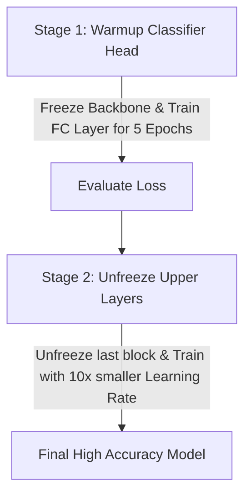

## Transfer Learning & Model Fine-tuning

প্রোডাকশন কাস্টম প্রজেক্টে শুরু থেকে মেগা মডেল ট্রেইনিং করা সময়সাপেক্ষ ও অত্যন্ত ব্যয়বহুল।

**Transfer Learning** এর মাধ্যমে বিলিয়ন স্যাম্পলে ট্রেইনড প্রি-ট্রেইন্ড মডেলের (যেমন ResNet, EfficientNet, ViT, Llama, Mistral) অর্জিত জ্ঞান ব্যবহার করে আমাদের নিজস্ব কাস্টম ছোট ডেটাসেটে দ্রুত ফাইন-টিউন করে সেরা রেজাল্ট পাওয়া যায়।

---

## 1. Computer Vision Transfer Learning with `torchvision.models`

Image Classification এর জন্য প্রিটেইন্ড ResNet50 ফাইন-টিউন করার পূর্ণাঙ্গ গাইড:

```python
import torch
import torch.nn as nn
from torchvision.models import resnet50, ResNet50_Weights

# 1. Load Pretrained ResNet50 with latest SOTA Weights
weights = ResNet50_Weights.DEFAULT
model = resnet50(weights=weights)

# 2. Freeze all Backbone Feature Extractor Layers
for param in model.parameters():
    param.requires_grad = False  # Freeze layer weights

# 3. Replace the final Output Layer (Classifier Head) with custom classes
num_classes = 5 # Example: 5 types of flower classification
in_features = model.fc.in_features # 2048 for ResNet50

# Replacing fc with custom trainable layer (requires_grad is automatically True for new layer)
model.fc = nn.Sequential(
    nn.Linear(in_features, 256),
    nn.ReLU(),
    nn.Dropout(0.4),
    nn.Linear(256, num_classes)
)

# Send to GPU
device = torch.device("cuda" if torch.cuda.is_available() else "cpu")
model.to(device)

# Only model.fc parameters will be updated in optimizer!
optimizer = torch.optim.AdamW(model.fc.parameters(), lr=1e-3)
```

---

## 2. Fine-Tuning Strategy: Two-Stage Fine-tuning



```python
# Unfreezing Layer4 for Stage 2 Fine-Tuning
for name, param in model.named_parameters():
    if "layer4" in name or "fc" in name:
        param.requires_grad = True # Unfreeze layer4

# Re-initialize optimizer with differential learning rates
optimizer = torch.optim.AdamW([
    {'params': model.layer4.parameters(), 'lr': 1e-5}, # Lower LR for backbone
    {'params': model.fc.parameters(), 'lr': 1e-4}      # Higher LR for new head
])
```

---

## 3. Parameter-Efficient Fine-Tuning (PEFT / LoRA) for LLMs

২০২৬ সালে Large Language Model (LLM) এবং Vision Transformer ফাইন-টিউন করার ইন্ডাস্ট্রিয়াল মানদণ্ড হলো **LoRA (Low-Rank Adaptation)**।

LoRA মূল মডেলের বিলিয়ন বিলিয়ন ওয়েট না বদলে পাশে একটি ক্ষুদ্র Low-rank Matrix ($A \times B$) যুক্ত করে ট্রেইন করে। ফলে ৯৯% GPU VRAM বেঁচে যায়!

```python
# Modern HuggingFace PEFT + PyTorch LoRA Setup Example
from peft import LoraConfig, get_peft_model

# 1. Define LoRA Configuration
peft_config = LoraConfig(
    r=16,                         # Rank dimension
    lora_alpha=32,                # Scaling factor
    target_modules=["q_proj", "v_proj"], # Target Attention Layers
    lora_dropout=0.05,
    bias="none",
    task_type="CAUSAL_LM"
)

# 2. Wrap PyTorch Model with LoRA
# model = get_peft_model(base_llm_model, peft_config)
# model.print_trainable_parameters()
# Output: trainable params: 4,194,304 || all params: 7,000,000,000 || trainable%: 0.06%
```

---

## Summary Best Practices for Fine-Tuning

- **কাস্টম ডেটাসেট ছোট হলে**: Backbone Layer সম্পূর্ণ ফ্রিজ রাখো (`requires_grad = False`), শুধু ফাইনাল লেয়ার ট্রেইন করো।
- **কাস্টম ডেটাসেট বড় হলে**: Two-stage Fine-Tuning অনুসরণ করো।
- **Learning Rate**: ফাইন-টিউনিং এ সবসময় প্রি-ট্রেইন্ড ব্যাকবোনের জন্য খুব ছোট LR ($10^{-5}$ থেকে $10^{-6}$) ব্যবহার করবে যাতে অর্জিত ওয়েট নষ্ট না হয়ে যায়।
