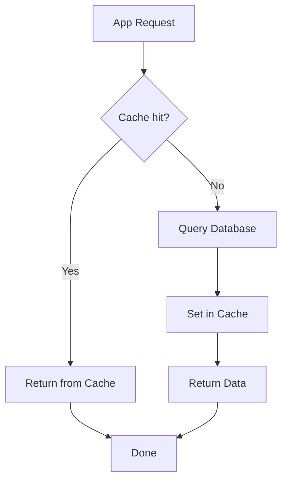

# Caching Patterns

Caching is the most powerful technique for performance optimization. Instead of fetching data from a slow database, you read from a fast cache (Redis). But there are many patterns for deciding when to put data in the cache, when to remove it, and how to keep it consistent. Each has its own trade-offs.

## Cache-Aside (Lazy Loading)

Cache-aside is the most common pattern. The application checks the cache first — if the data is there, it returns it (cache hit). If not, it reads from the database and stores it in the cache (cache miss). The logic is entirely in the application's hands.

The diagram below shows the full flow of cache-aside:



The Python code below implements the cache-aside pattern. The `get_user` function first checks Redis, and if it doesn't find the data, it fetches it from the database and stores it in the cache. Setting a TTL is important so stale data doesn't linger.

```python
import redis
import json

r = redis.Redis(host="localhost", port=6379, decode_responses=True)

def get_user(user_id):
    # Step 1: Check cache first
    cache_key = f"user:{user_id}"
    cached = r.get(cache_key)

    if cached:
        print("Cache HIT!")
        return json.loads(cached)

    # Step 2: Cache miss - fetch from database
    print("Cache MISS - querying DB...")
    user = db_query("SELECT * FROM users WHERE id = %s", user_id)

    if user:
        # Step 3: Store in cache with TTL (5 minutes)
        r.setex(cache_key, 300, json.dumps(user))

    return user
```

## Write-Through Cache

In the write-through pattern, data is written to both the cache and the database at the same time. The advantage is that the cache is always consistent with the database. The disadvantage is higher write latency (two writes are needed).

```python
def update_user(user_id, new_data):
    cache_key = f"user:{user_id}"

    # Step 1: Write to database
    db_update("UPDATE users SET name = %s WHERE id = %s",
              new_data["name"], user_id)

    # Step 2: Write to cache simultaneously
    r.setex(cache_key, 300, json.dumps(new_data))

    return new_data
```

## Write-Behind (Write-Back)

In the write-behind pattern, data is written to the cache first, then asynchronously to the database. Writes are very fast (only a cache write), but if the system crashes, cached data can be lost. Great for high-write scenarios.

```python
import threading

def write_behind_update(user_id, data):
    cache_key = f"user:{user_id}"

    # Step 1: Immediately write to cache
    r.setex(cache_key, 300, json.dumps(data))

    # Step 2: Async write to database
    def async_db_write():
        db_update("UPDATE users SET ...", data)

    thread = threading.Thread(target=async_db_write)
    thread.start()

    return data
```

## Cache Invalidation

Cache invalidation means removing outdated data from the cache. There are two main approaches: explicit deletion (remove from cache immediately when data is updated) and TTL-based eviction (automatically removed after a set time).

```python
def delete_user_cache(user_id):
    # Explicit invalidation - remove from cache
    r.delete(f"user:{user_id}")

    # Pattern-based invalidation (careful in production)
    for key in r.scan_iter(f"user:{user_id}:*"):
        r.delete(key)

def set_with_strategy(key, value, data_type="default"):
    # Different TTL for different data types
    ttl_map = {
        "user_profile": 1800,      # 30 minutes
        "product_list": 600,       # 10 minutes
        "config": 3600,            # 1 hour
        "session": 86400,          # 1 day
        "analytics": 120,          # 2 minutes
    }
    ttl = ttl_map.get(data_type, 300)
    r.setex(key, ttl, json.dumps(value))
```

## Cache Stampede Prevention

When a cache miss occurs, many requests rush to the database simultaneously — this is called a cache stampede. To prevent it, a lock is used: one request takes the lock, queries the database, and the rest read from the cache.

The code below implements stampede prevention using a Redis distributed lock. One request gets the lock, queries the database, and populates the cache. Other requests check the cache again after a short sleep.

```python
import time
import uuid

def get_with_lock(key, db_fetch_func, ttl=300):
    # Quick cache check
    cached = r.get(key)
    if cached:
        return json.loads(cached)

    # Try to acquire lock
    lock_key = f"lock:{key}"
    lock_id = str(uuid.uuid4())

    # SETNX with expiration for distributed lock
    if r.set(lock_key, lock_id, nx=True, ex=10):
        try:
            # This request fetches from DB
            data = db_fetch_func()
            r.setex(key, ttl, json.dumps(data))
            return data
        finally:
            # Release lock (only if we still own it)
            if r.get(lock_key) == lock_id:
                r.delete(lock_key)
    else:
        # Another request is fetching - wait and retry
        time.sleep(0.1)
        return get_with_lock(key, db_fetch_func, ttl)
```

## TTL Strategy

Not all data gets the same TTL. Frequently changing data gets a short TTL, and stable data gets a long TTL. Tuning this keeps the right balance between performance and consistency.

| Data Type | Recommended TTL | Why |
|-----------|----------------|-----|
| User session | 1-7 days | Login must stay active |
| User profile | 15-30 min | Changes occasionally |
| Product catalog | 10-30 min | Doesn't change often |
| Configuration | 1-6 hours | Rarely changes |
| Real-time stats | 1-5 min | Changes frequently |
| Computed report | 1-24 hours | Expensive to compute |

## Memory Management and Eviction

Redis has finite memory. You set a `maxmemory` limit, and when memory fills up, keys are evicted based on the eviction policy. Choosing the wrong policy can cause important keys to be deleted.

The config below shows Redis memory management settings. `maxmemory` is the total RAM limit, and the eviction policy determines which keys get removed when memory is full.

```text
# redis.conf settings
maxmemory 256mb
maxmemory-policy allkeys-lru

# Common eviction policies:
# allkeys-lru     - Evict least recently used (any key)
# volatile-lru    - Evict LRU among keys with TTL only
# allkeys-lfu     - Evict least frequently used
# volatile-ttl    - Evict keys with shortest TTL
# noeviction      - Return error when memory full (write fails)
```

## Eviction Policy Comparison

| Policy | Strategy | Best For |
|--------|----------|----------|
| `allkeys-lru` | Least Recently Used (all keys) | General purpose caching |
| `volatile-lru` | LRU (only TTL keys) | Mixed cache + persistent data |
| `allkeys-lfu` | Least Frequently Used | Access frequency matters |
| `volatile-ttl` | Shortest TTL first | Predictable eviction |
| `noeviction` | Reject writes | Critical data, no data loss |

> [!warn] Cache Invalidation — The Hardest Problem in Computer Science
> Phil Karlton famously said there are only two hard problems in computer science: cache invalidation and naming things. If the cache has stale data, users see wrong information. If you remove it, performance drops. Write-through, TTL, explicit invalidation — none is perfect. Understand the trade-offs of each, choose the right combination, and always monitor cache hit rate and staleness in production.