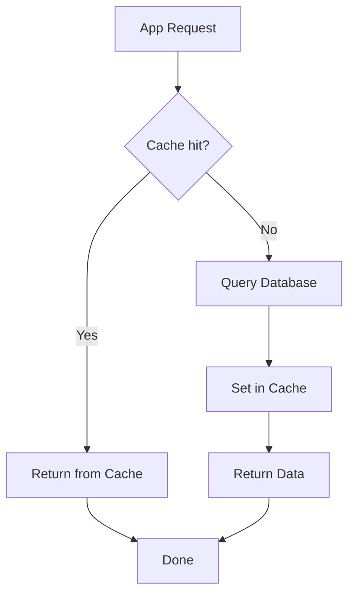

## Caching Patterns

Caching হলো performance optimization এর সবচেয়ে শক্তিশালী technique। ধীর database থেকে ডেটা না এনে fast cache (Redis) থেকে read করা। কিন্তু cache এ ডেটা কখন রাখবে, কখন মুছবে, কীভাবে consistent রাখবে — এসব নিয়ে অনেকগুলো pattern আছে। প্রতিটার trade-off আলাদা।

## Cache-Aside (Lazy Loading)

Cache-aside হলো সবচেয়ে common pattern। Application প্রথমে cache check করে — থাকলে return (cache hit), না থাকলে database থেকে read করে cache এ রাখে (cache miss)। Logic সম্পূর্ণ application এর হাতে।

নিচের diagram এ দেখানো হলো cache-aside এর পুরো flow:



নিচের Python কোডে cache-aside pattern implement করা হয়েছে। `get_user` function প্রথমে Redis থেকে খোঁজে, না পেলে database থেকে আনে, তারপর cache এ রাখে। TTL দেওয়া গুরুত্বপূর্ণ যাতে stale ডেটা চলে না যায়।

```python
import redis
import json

r = redis.Redis(host="localhost", port=6379, decode_responses=True)

def get_user(user_id):
    # Step 1: Check cache first
    cache_key = f"user:{user_id}"
    cached = r.get(cache_key)

    if cached:
        print("Cache HIT!")
        return json.loads(cached)

    # Step 2: Cache miss - fetch from database
    print("Cache MISS - querying DB...")
    user = db_query("SELECT * FROM users WHERE id = %s", user_id)

    if user:
        # Step 3: Store in cache with TTL (5 minutes)
        r.setex(cache_key, 300, json.dumps(user))

    return user
```

## Write-Through Cache

Write-through pattern এ ডেটা write করার সময় cache আর database দুটোতেই একসাথে write হয়। সুবিধা হলো cache সবসময় database এর সাথে consistent। অসুবিধা হলো write latency বেশি (দুটো write করতে হয়)।

```python
def update_user(user_id, new_data):
    cache_key = f"user:{user_id}"

    # Step 1: Write to database
    db_update("UPDATE users SET name = %s WHERE id = %s",
              new_data["name"], user_id)

    # Step 2: Write to cache simultaneously
    r.setex(cache_key, 300, json.dumps(new_data))

    return new_data
```

## Write-Behind (Write-Back)

Write-behind pattern এ প্রথমে cache এ write হয়, তারপর asynchronously database এ write হয়। Write খুব দ্রুত (শুধু cache write), কিন্তু crash হলে cache এর ডেটা হারাতে পারে। High-write scenario এ দারুণ।

```python
import threading

def write_behind_update(user_id, data):
    cache_key = f"user:{user_id}"

    # Step 1: Immediately write to cache
    r.setex(cache_key, 300, json.dumps(data))

    # Step 2: Async write to database
    def async_db_write():
        db_update("UPDATE users SET ...", data)

    thread = threading.Thread(target=async_db_write)
    thread.start()

    return data
```

## Cache Invalidation

Cache invalidation হলো cache থেকে পুরনো ডেটা মুছে ফেলা। দুটো main approach: explicit deletion (ডেটা update হলে সাথে সাথে cache থেকে মুছে ফেলা) আর TTL-based eviction (নির্দিষ্ট সময় পর অটোমেটিক মুছে যাওয়া)।

```python
def delete_user_cache(user_id):
    # Explicit invalidation - remove from cache
    r.delete(f"user:{user_id}")

    # Pattern-based invalidation (careful in production)
    for key in r.scan_iter(f"user:{user_id}:*"):
        r.delete(key)

def set_with_strategy(key, value, data_type="default"):
    # Different TTL for different data types
    ttl_map = {
        "user_profile": 1800,      # 30 minutes
        "product_list": 600,       # 10 minutes
        "config": 3600,            # 1 hour
        "session": 86400,          # 1 day
        "analytics": 120,          # 2 minutes
    }
    ttl = ttl_map.get(data_type, 300)
    r.setex(key, ttl, json.dumps(value))
```

## Cache Stampede Prevention

Cache miss হলে অনেক request একসাথে database এ চলে যায় — একে cache stampede বলে। এটা prevent করতে lock ব্যবহার করা হয়: একটা request lock নিয়ে database query করে, বাকিরা cache থেকে read করে।

নিচের কোডে stampede prevention implement করা হয়েছে Redis distributed lock দিয়ে। একটা request lock পেলে database query করে আর cache populate করে, বাকি request গুলো short sleep এর পর cache check করে।

```python
import time
import uuid

def get_with_lock(key, db_fetch_func, ttl=300):
    # Quick cache check
    cached = r.get(key)
    if cached:
        return json.loads(cached)

    # Try to acquire lock
    lock_key = f"lock:{key}"
    lock_id = str(uuid.uuid4())

    # SETNX with expiration for distributed lock
    if r.set(lock_key, lock_id, nx=True, ex=10):
        try:
            # This request fetches from DB
            data = db_fetch_func()
            r.setex(key, ttl, json.dumps(data))
            return data
        finally:
            # Release lock (only if we still own it)
            if r.get(lock_key) == lock_id:
                r.delete(lock_key)
    else:
        # Another request is fetching - wait and retry
        time.sleep(0.1)
        return get_with_lock(key, db_fetch_func, ttl)
```

## TTL Strategy

সব ডেটা একই TTL পাবে না। Frequently changing ডেটা short TTL পাবে, stable ডেটা long TTL পাবে। এটা tune করা performance আর consistency এর balance ঠিক রাখে।

| Data Type | Recommended TTL | কেন |
|-----------|----------------|-----|
| User session | 1-7 days | Login active থাকলে দরকার |
| User profile | 15-30 min | মাঝে মাঝে change হয় |
| Product catalog | 10-30 min | বেশি change হয় না |
| Configuration | 1-6 hours | খুব কম change হয় |
| Real-time stats | 1-5 min | প্রায়ই change হয় |
| Computed report | 1-24 hours | ব্যয়বহুল compute |

## Memory Management ও Eviction

Redis এ memory finite। `maxmemory` সেট করা হয়, আর memory ভরে গেলে eviction policy অনুযায়ী key মুছে ফেলা হয়। সঠিক policy না বাছলে important key মুছে যেতে পারে।

নিচের config এ Redis memory management সেট করা দেখানো হলো। `maxmemory` total RAM limit, আর eviction policy নির্ধারণ করে memory ভরে গেলে কোন key মুছবে।

```text
# redis.conf settings
maxmemory 256mb
maxmemory-policy allkeys-lru

# Common eviction policies:
# allkeys-lru     - Evict least recently used (any key)
# volatile-lru    - Evict LRU among keys with TTL only
# allkeys-lfu     - Evict least frequently used
# volatile-ttl    - Evict keys with shortest TTL
# noeviction      - Return error when memory full (write fails)
```

## Eviction Policy Comparison

| Policy | Strategy | Best For |
|--------|----------|----------|
| `allkeys-lru` | Least Recently Used (all keys) | General purpose caching |
| `volatile-lru` | LRU (only TTL keys) | Mixed cache + persistent data |
| `allkeys-lfu` | Least Frequently Used | Access frequency matters |
| `volatile-ttl` | Shortest TTL first | Predictable eviction |
| `noeviction` | Reject writes | Critical data, no data loss |

> [!danger] Cache Invalidation — কম্পিউটার সায়েন্সের সবচেয়ে কঠিন সমস্যা
> # Phil Karlton বলেছেন — কম্পিউটার সায়েন্সে মাত্র দুটো hard problem আছে: cache invalidation আর naming things। Cache এ stale ডেটা থাকলে user ভুল তথ্য দেখবে, মুছে ফেললে performance কমবে। Write-through, TTL, explicit invalidation — কোনটাও perfect নয়। প্রতিটার trade-off বুঝে সঠিক combination বাছতে হবে, আর production এ always cache hit rate আর staleness monitor করতে হবে।