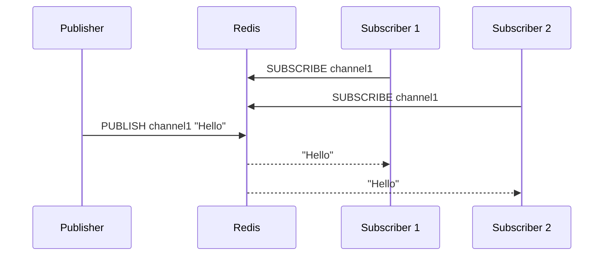
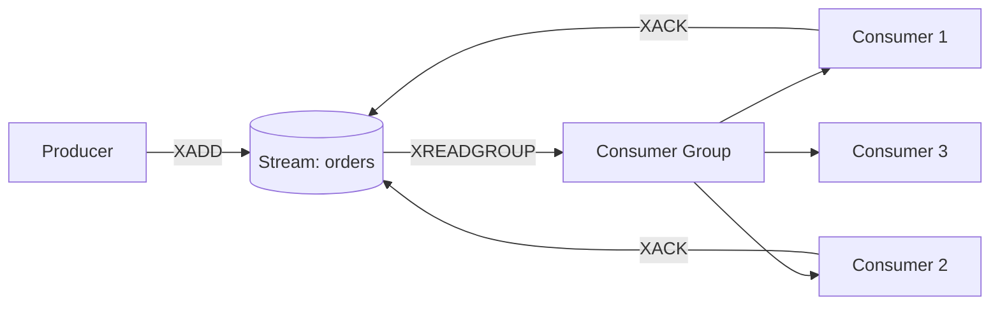

# Streams and Pub/Sub

Redis is not just a cache — it's also a powerful messaging platform. There are two messaging mechanisms: Pub/Sub and Streams. Pub/Sub is real-time fire-and-forget, while Streams provide a durable message log with consumer groups. They serve different purposes.

## Pub/Sub — Real-time Broadcast

Pub/Sub (Publish/Subscribe) is Redis's real-time messaging system. A publisher sends a message to a channel, and subscribers listen to that channel. The key point: if a subscriber is not online when a message is published, the message is lost — there's no persistence.

The diagram below shows how a producer publishes a message and multiple consumers subscribe to it:



The commands below show the basic operations of Pub/Sub. You need to open two terminals — subscribe in one, and publish in the other.

```text
# Terminal 1 - Subscribe to a channel
127.0.0.1:6379> SUBSCRIBE news
Reading messages... (press Ctrl-C to quit)

# Terminal 2 - Publish a message
127.0.0.1:6379> PUBLISH news "Breaking: Redis 8.0 released!"
(integer) 1

# Terminal 1 sees:
1) "message"
2) "news"
3) "Breaking: Redis 8.0 released!"
```

You can also do pattern-based subscriptions. With `PSUBSCRIBE`, you can use wildcard patterns to subscribe to many channels at once.

```text
# Subscribe to all channels starting with "user:"
127.0.0.1:6379> PSUBSCRIBE user:*

# Messages from user:login, user:logout, user:signup all received
```

## Streams — Durable Message Log

Streams are Redis's durable message log — like a miniature version of Apache Kafka. Each message gets a unique ID, it persists, and consumers can read messages at any time. `XADD` adds a message, and `XRANGE` reads messages.

```text
127.0.0.1:6379> XADD orders * customer "Karim" product "Laptop" price "1200"
"1700000000000-0"
127.0.0.1:6379> XADD orders * customer "Sadia" product "Phone" price "800"
"1700000000001-0"
127.0.0.1:6379> XRANGE orders - +
1) 1) "1700000000000-0"
   2) 1) "customer"
      2) "Karim"
      3) "product"
      4) "Laptop"
      5) "price"
      6) "1200"
2) 1) "1700000000001-0"
   2) 1) "customer"
      2) "Sadia"
      3) "product"
      4) "Phone"
      5) "price"
      6) "800"
127.0.0.1:6379> XLEN orders
(integer) 2
127.0.0.1:6379> XREAD COUNT 2 STREAMS orders 0
1) 1) "orders"
   2) 1) 1) "1700000000000-0"
         2) 1) "customer" 2) "Karim" 3) "product" 4) "Laptop" 5) "price" 6) "1200"
      2) 1) "1700000000001-0"
         2) 1) "customer" 2) "Sadia" 3) "product" 4) "Phone" 5) "price" 6) "800"
```

`XREAD` reads messages, and with the `BLOCK` option, you can wait for new messages to arrive.

## Consumer Groups

Consumer groups are the most powerful feature of Streams. A stream can have many messages, and they can be distributed among multiple consumers. Each message is processed by only one consumer. `XREADGROUP` reads messages, and `XACK` acknowledges them.

The diagram below shows how a consumer group works — a producer adds messages, and the consumer group distributes them:



```text
127.0.0.1:6379> XGROUP CREATE orders order_processors $ MKSTREAM
OK
127.0.0.1:6379> XADD orders * task "process_payment" amount "5000"
"1700000000002-0"
127.0.0.1:6379> XREADGROUP GROUP order_processors worker-1 COUNT 1 STREAMS orders >
1) 1) "orders"
   2) 1) 1) "1700000000002-0"
         2) 1) "task" 2) "process_payment" 3) "amount" 4) "5000"
127.0.0.1:6379> XACK orders order_processors 1700000000002-0
(integer) 1
```

## Pending Entries List (PEL) and Dead Letter

When a consumer reads a message but hasn't acknowledged it with `XACK`, it stays in the pending list. You can view it with `XPENDING` and reassign it to another consumer with `XCLAIM` (recovering messages from a crashed consumer).

```text
127.0.0.1:6379> XPENDING orders order_processors
1) (integer) 1
2) "1700000000002-0"
3) "1700000000002-0"
4) 1) 1) "worker-1"
      2) "1"

# Reassign pending message to a different worker
127.0.0.1:6379> XAUTOCLAIM orders order_processors worker-2 0 1700000000002-0
```

## Python Example — Producer and Consumer

The Python code below shows a complete producer-consumer system. The producer adds orders to the stream, and workers in a consumer group process them, complete with error handling and acknowledgment.

```python
import redis
import json
import time

r = redis.Redis(host="localhost", port=6379, decode_responses=True)

# Producer - add orders to stream
def add_order(customer, product, amount):
    order_id = r.xadd("orders", {
        "customer": customer,
        "product": product,
        "amount": str(amount),
        "timestamp": str(time.time())
    })
    print(f"Order added: {order_id}")
    return order_id

# Add some orders
add_order("Karim", "Laptop", 1200)
add_order("Sadia", "Phone", 800)
add_order("Rahim", "Tablet", 500)
```

The consumer code below reads messages, processes them, and acknowledges them. If it crashes, the message stays in the pending list, and another consumer can recover it.

```python
# Consumer - process orders from consumer group
def process_orders(worker_name):
    # Ensure consumer group exists
    try:
        r.xgroup_create("orders", "processors", id="$", mkstream=True)
    except redis.ResponseError:
        pass  # Group already exists

    while True:
        # Read new messages (">" means never-delivered)
        messages = r.xreadgroup(
            groupname="processors",
            consumername=worker_name,
            streams={"orders": ">"},
            count=5,
            block=5000
        )

        if not messages:
            print(f"{worker_name}: No new messages, waiting...")
            continue

        for stream, msg_list in messages:
            for msg_id, fields in msg_list:
                print(f"{worker_name} processing: {fields['customer']} "
                      f"ordered {fields['product']}")

                try:
                    # Simulate processing
                    process_payment(fields)

                    # Acknowledge successful processing
                    r.xack("orders", "processors", msg_id)
                    print(f"{worker_name} acknowledged: {msg_id}")

                except Exception as e:
                    print(f"{worker_name} FAILED on {msg_id}: {e}")
                    # Message stays in PEL for retry

def process_payment(order_data):
    # Simulate payment processing
    if float(order_data["amount"]) > 10000:
        raise ValueError("Amount too large, manual review needed")
    print(f"  Payment processed: ${order_data['amount']}")

# Run consumer (in separate processes or containers)
process_orders("worker-1")
```

## Pub/Sub vs Streams Comparison

| Feature | Pub/Sub | Streams |
|---------|---------|---------|
| Persistence | No — fire and forget | Yes — durable |
| Offline consumer | Message lost | Message preserved |
| Consumer groups | No | Yes |
| Message replay | Not possible | Possible (by ID/range) |
| Delivery guarantee | At-most-once | At-least-once (with XACK) |
| Best for | Real-time notifications, chat | Order processing, task queue |
| Memory | Low (no storage) | Higher (stores messages) |

## Python Pub/Sub Example

The code below shows a real-time notification system using Pub/Sub. The main caveat — if the subscriber is offline, messages are lost.

```python
import redis
import threading

r = redis.Redis(host="localhost", port=6379, decode_responses=True)

# Subscriber - runs in background thread
def listen_notifications():
    pubsub = r.pubsub()
    pubsub.subscribe("notifications")

    for message in pubsub.listen():
        if message["type"] == "message":
            print(f"Received: {message['data']}")

thread = threading.Thread(target=listen_notifications, daemon=True)
thread.start()

# Publisher - send notifications
r.publish("notifications", "User Karim just logged in")
r.publish("notifications", "New order #1234 placed")
r.publish("notifications", "System backup completed")
```

> [!note] Pub/Sub is Fire-and-Forget
> Pub/Sub does not persist messages. If a subscriber is not connected at that moment, the message is lost forever. If you need reliability, use Streams — messages are durable, there are consumer groups, and there's acknowledgment. Pub/Sub is only for real-time notifications and live chat where message loss is acceptable.