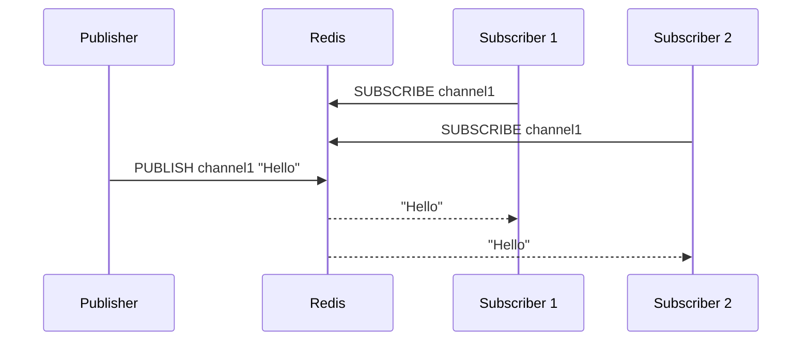
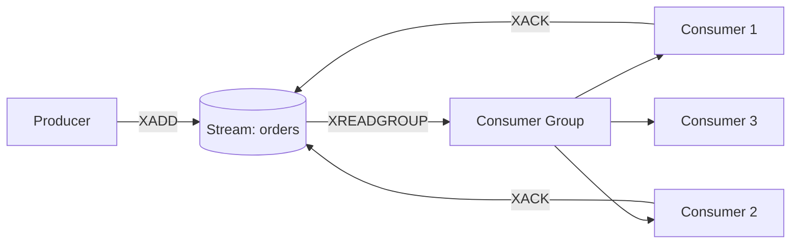

## Streams ও Pub/Sub

Redis শুধু cache নয় — এটা একটা powerful messaging platform ও। Pub/Sub আর Streams দুটো messaging mechanism আছে। Pub/Sub real-time fire-and-forget, আর Streams durable message log with consumer groups। দুটোর ব্যবহার আলাদা।

## Pub/Sub — Real-time Broadcast

Pub/Sub (Publish/Subscribe) হলো Redis এর real-time messaging system। Publisher message publish করে একটা channel এ, subscriber গুলো সেই channel listen করে। মূল বিষয়: message publish হওয়ার সময় subscriber online না থাকলে message হারিয়ে যায় — কোনো persistence নেই।

নিচের diagram এ দেখানো হলো কীভাবে producer message publish করে আর multiple consumer subscribe করে:



নিচের command গুলোতে Pub/Sub এর basic operation দেখানো হলো। দুটা terminal খুলে একটায় subscribe, আরেকটায় publish করতে হয়।

```text
# Terminal 1 - Subscribe to a channel
127.0.0.1:6379> SUBSCRIBE news
Reading messages... (press Ctrl-C to quit)

# Terminal 2 - Publish a message
127.0.0.1:6379> PUBLISH news "Breaking: Redis 8.0 released!"
(integer) 1

# Terminal 1 sees:
1) "message"
2) "news"
3) "Breaking: Redis 8.0 released!"
```

Pattern-based subscription ও করা যায়। `PSUBSCRIBE` দিয়ে wildcard pattern match করে একসাথে অনেক channel subscribe করা যায়।

```text
# Subscribe to all channels starting with "user:"
127.0.0.1:6379> PSUBSCRIBE user:*

# Messages from user:login, user:logout, user:signup all received
```

## Streams — Durable Message Log

Streams হলো Redis এর durable message log — Apache Kafka এর ছোট version। প্রতিটা message একটা unique ID পায়, persist করে থাকে, আর consumer যেকোনো সময় message read করতে পারে। `XADD` দিয়ে message add, `XRANGE` দিয়ে read করা হয়।

```text
127.0.0.1:6379> XADD orders * customer "Karim" product "Laptop" price "1200"
"1700000000000-0"
127.0.0.1:6379> XADD orders * customer "Sadia" product "Phone" price "800"
"1700000000001-0"
127.0.0.1:6379> XRANGE orders - +
1) 1) "1700000000000-0"
   2) 1) "customer"
      2) "Karim"
      3) "product"
      4) "Laptop"
      5) "price"
      6) "1200"
2) 1) "1700000000001-0"
   2) 1) "customer"
      2) "Sadia"
      3) "product"
      4) "Phone"
      5) "price"
      6) "800"
127.0.0.1:6379> XLEN orders
(integer) 2
127.0.0.1:6379> XREAD COUNT 2 STREAMS orders 0
1) 1) "orders"
   2) 1) 1) "1700000000000-0"
         2) 1) "customer" 2) "Karim" 3) "product" 4) "Laptop" 5) "price" 6) "1200"
      2) 1) "1700000000001-0"
         2) 1) "customer" 2) "Sadia" 3) "product" 4) "Phone" 5) "price" 6) "800"
```

`XREAD` দিয়ে message read করা যায়, আর `BLOCK` option দিয়ে নতুন message আসা পর্যন্ত অপেক্ষা করা যায়।

## Consumer Groups

Consumer group হলো Streams এর সবচেয়ে শক্তিশালী feature। একটা stream এ অনেক message আছে, সেগুলো একাধিক consumer এর মধ্যে distribute করা যায়। প্রতিটা message শুধু একজন consumer process করে। `XREADGROUP` দিয়ে read, `XACK` দিয়ে acknowledge করা হয়।

নিচের diagram এ consumer group এর কাজ দেখানো হলো — producer message add করে, consumer group সেগুলো distribute করে:



```text
127.0.0.1:6379> XGROUP CREATE orders order_processors $ MKSTREAM
OK
127.0.0.1:6379> XADD orders * task "process_payment" amount "5000"
"1700000000002-0"
127.0.0.1:6379> XREADGROUP GROUP order_processors worker-1 COUNT 1 STREAMS orders >
1) 1) "orders"
   2) 1) 1) "1700000000002-0"
         2) 1) "task" 2) "process_payment" 3) "amount" 4) "5000"
127.0.0.1:6379> XACK orders order_processors 1700000000002-0
(integer) 1
```

## Pending Entries List (PEL) ও Dead Letter

Consumer message read করে কিন্তু `XACK` করেনি — সেটা pending list এ থাকে। `XPENDING` দিয়ে দেখা যায়, `XCLAIM` দিয়ে অন্য consumer এ পাঠানো যায় (crashed consumer এর message recovery)।

```text
127.0.0.1:6379> XPENDING orders order_processors
1) (integer) 1
2) "1700000000002-0"
3) "1700000000002-0"
4) 1) 1) "worker-1"
      2) "1"

# Reassign pending message to a different worker
127.0.0.1:6379> XAUTOCLAIM orders order_processors worker-2 0 1700000000002-0
```

## Python Example — Producer ও Consumer

নিচের Python কোডে একটা complete producer-consumer system দেখানো হলো। Producer order add করে stream এ, consumer group এর worker গুলো process করে। Error handling আর acknowledgment সহ।

```python
import redis
import json
import time

r = redis.Redis(host="localhost", port=6379, decode_responses=True)

# Producer - add orders to stream
def add_order(customer, product, amount):
    order_id = r.xadd("orders", {
        "customer": customer,
        "product": product,
        "amount": str(amount),
        "timestamp": str(time.time())
    })
    print(f"Order added: {order_id}")
    return order_id

# Add some orders
add_order("Karim", "Laptop", 1200)
add_order("Sadia", "Phone", 800)
add_order("Rahim", "Tablet", 500)
```

নিচের consumer code এ message read করে, process করে, আর acknowledge করে। crashed হলে message pending list এ থাকে, অন্য consumer recover করতে পারে।

```python
# Consumer - process orders from consumer group
def process_orders(worker_name):
    # Ensure consumer group exists
    try:
        r.xgroup_create("orders", "processors", id="$", mkstream=True)
    except redis.ResponseError:
        pass  # Group already exists

    while True:
        # Read new messages (">" means never-delivered)
        messages = r.xreadgroup(
            groupname="processors",
            consumername=worker_name,
            streams={"orders": ">"},
            count=5,
            block=5000
        )

        if not messages:
            print(f"{worker_name}: No new messages, waiting...")
            continue

        for stream, msg_list in messages:
            for msg_id, fields in msg_list:
                print(f"{worker_name} processing: {fields['customer']} "
                      f"ordered {fields['product']}")

                try:
                    # Simulate processing
                    process_payment(fields)

                    # Acknowledge successful processing
                    r.xack("orders", "processors", msg_id)
                    print(f"{worker_name} acknowledged: {msg_id}")

                except Exception as e:
                    print(f"{worker_name} FAILED on {msg_id}: {e}")
                    # Message stays in PEL for retry

def process_payment(order_data):
    # Simulate payment processing
    if float(order_data["amount"]) > 10000:
        raise ValueError("Amount too large, manual review needed")
    print(f"  Payment processed: ${order_data['amount']}")

# Run consumer (in separate processes or containers)
process_orders("worker-1")
```

## Pub/Sub vs Streams Comparison

| Feature | Pub/Sub | Streams |
|---------|---------|---------|
| Persistence | না — fire and forget | হ্যাঁ — durable |
| Offline consumer | Message হারায় | Message preserved |
| Consumer groups | না | হ্যাঁ |
| Message replay | সম্ভব নয় | সম্ভব (by ID/range) |
| Delivery guarantee | At-most-once | At-least-once (with XACK) |
| Best for | Real-time notifications, chat | Order processing, task queue |
| Memory | Low (no storage) | Higher (stores messages) |

## Python Pub/Sub Example

নিচের কোডে Pub/Sub দিয়ে real-time notification system দেখানো হলো। মূল সতর্কতা — subscriber offline থাকলে message হারিয়ে যায়।

```python
import redis
import threading

r = redis.Redis(host="localhost", port=6379, decode_responses=True)

# Subscriber - runs in background thread
def listen_notifications():
    pubsub = r.pubsub()
    pubsub.subscribe("notifications")

    for message in pubsub.listen():
        if message["type"] == "message":
            print(f"Received: {message['data']}")

thread = threading.Thread(target=listen_notifications, daemon=True)
thread.start()

# Publisher - send notifications
r.publish("notifications", "User Karim just logged in")
r.publish("notifications", "New order #1234 placed")
r.publish("notifications", "System backup completed")
```

> [!note] Pub/Sub হলো Fire-and-Forget
> # Pub/Sub এ message persist করে না। Subscriber সেই মুহূর্তে connected না থাকলে message চিরতরে হারিয়ে যায়। Reliability দরকার হলে Streams ব্যবহার করতে হবে — সেখানে message durable, consumer group আছে, acknowledgment আছে। Pub/Sub শুধু real-time notification আর live chat এর জন্য যেখানে message loss acceptable।