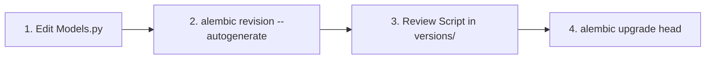

## Database Migrations with Alembic

প্রোডাকশন ডেটাবেজে টেবিল তৈরি, কলাম সংশোধন বা ইনডেক্স যোগ করার জন্য কখনো `Base.metadata.create_all()` ব্যবহার করা উচিত নয় — কারণ এটি বিদ্যমান টেবিল অল্টার করতে পারে না!

SQLAlchemy এর অফিসিয়াল মাইগ্রেশন টুল হলো **Alembic**।

---

## Alembic Initialization & Setup

Alembic ইনস্টল এবং প্রোজেক্ট ইনিশিয়ালাইজেশন:

```bash
pip install alembic

# Initialize Alembic setup in your project directory
alembic init alembic
```

এই কমান্ডটি আপনার প্রজেক্টে একটি `alembic/` ডিরেক্টরি এবং একটি `alembic.ini` কনফিগারেশন ফাইল তৈরি করবে:

```
my_project/
│── alembic/
│   ├── versions/       # Contains all migration script files
│   ├── env.py          # Migration environment setup script
│   └── script.py.mako
│── alembic.ini         # Main configuration file
└── app/
    └── models.py       # SQLAlchemy Base and Models
```

---

## `env.py` কনফিগারেশন

Alembic যাতে আপনার মডেলের স্ট্রাকচার বুঝতে পারে, তার জন্য `alembic/env.py` ফাইলে মডেলের `Base.metadata` লিঙ্ক করতে হয়:

```python
# alembic/env.py
from logging.config import fileConfig
from sqlalchemy import engine_from_config, pool
from alembic import context

# 1. Import your SQLAlchemy models Base
from app.models import Base  # <-- Update this import!

config = context.config

# 2. Set target_metadata
target_metadata = Base.metadata  # <-- Link your metadata here!
```

---

## Step-by-Step Migration Workflow



### ১. স্বয়ংক্রিয় মাইগ্রেশন স্ক্রিপ্ট তৈরি করা
মডেলে নতুন কলাম বা পরিবর্তন যোগ করার পর মাইগ্রেশন জেনারেট করুন:

```bash
alembic revision --autogenerate -m "Add email column to user model"
```
Alembic মডেলের সাথে ডেটাবেজের বর্তমান অবস্থা তুলনা করে `alembic/versions/` ফোল্ডারে একটি `.py` ফাইল জেনারেট করবে:

```python
# alembic/versions/abc123_add_email_column.py
"""Add email column to user model"""
from alembic import op
import sqlalchemy as sa

def upgrade() -> None:
    op.add_column('users', sa.Column('email', sa.String(length=100), nullable=True))

def downgrade() -> None:
    op.drop_column('users', 'email')
```

### ২. মাইগ্রেশন ডেটাবেজে অ্যাপ্লাই করা
```bash
# Upgrade database schema to the latest version
alembic upgrade head
```

### ৩. মাইগ্রেশন রোলব্যাক (Downgrade) করা
যদি কোনো ভুল হয়ে থাকে এবং ১ ধাপ পেছনে ফেরত যেতে চান:

```bash
# Rollback one migration step back
alembic downgrade -1
```

---

## Useful Alembic CLI Commands Cheat Sheet

| Command | Purpose |
| :--- | :--- |
| `alembic revision --autogenerate -m "msg"` | মডেলে পরিবর্তনের ওপর ভিত্তি করে মাইগ্রেশন ফাইল বানায় |
| `alembic upgrade head` | সব প্যান্ডিং মাইগ্রেশন ডেটাবেজে রান করে |
| `alembic downgrade -1` | সর্বশেষ মাইগ্রেশনটি রোলব্যাক করে |
| `alembic current` | ডেটাবেজের বর্তমান মাইগ্রেশন হ্যাশ/ভার্সন দেখায় |
| `alembic history` | প্রজেক্টের সব মাইগ্রেশনের হিস্ট্রি দেখায় |

> [!important] Async SQLAlchemy Alembic Setup
> Async App এর ক্ষেত্রে `alembic init -t async alembic` কমান্ড দিয়ে async template ইনিশিয়ালাইজ করতে হয়। এটি `env.py` তে `asyncio` রানার অটোমেটিক সেটআপ করে দেয়!
