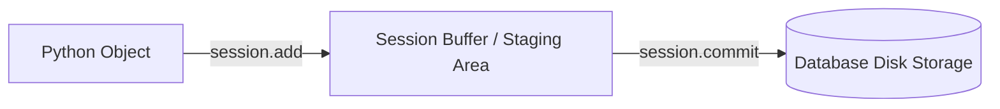

## CRUD Operations & Modern Select

SQLAlchemy 2.0 এ ডেটাবেজে **Create, Read, Update, Delete (CRUD)** অপারেশন পরিচালিত হয় **`Session`** অবজেক্ট এবং **`select()`** এক্সপ্রেশনের মাধ্যমে।

---

## 💡 `Session` কী এবং কেন এটি ব্যবহার করবো?

সহজ ভাষায় বলতে গেলে — **`Session` হলো একটি কেনাকাটার ট্রলি (Shopping Cart)** এর মতো। 

তুমি যখন নতুন ইউজার যোগ করো বা বিদ্যমান তথ্য আপডেট করো, SQLAlchemy সাথে সাথে ডেটাবেজে পরিবর্তনগুলো পাঠায় না। সেগুলোকে একটি "খসড়া তালিকা" বা **Staging Area** তে জমা রাখে। 

- **`session.add(obj)`**: ট্রলিতে নতুন পন্ন রাখার মতো খসড়া তালিকায় আইটেম যোগ করা।
- **`session.commit()`**: ক্যাশ কাউন্টারে গিয়ে কেনাকাটার বিল পরিশোধ করে নিশ্চিত করার মতো — অর্থাৎ খসড়া তালিকার পরিবর্তনগুলো স্থায়ীভাবে ডেটাবেজে ডিস্কে সেভ করা!



---

## Create Operation (নতুন রেকর্ড যোগ করা)

```python
from sqlalchemy.orm import Session
from sqlalchemy import select, update, delete

# engine = create_engine(...)

# Creating new records (Create)
with Session(engine) as session:
    new_user = User(
        username="masud_dev",
        email="masud@example.com",
        bio="Full-Stack & AI Engineer"
    )
    
    # ১. খসড়া তালিকায় নতুন ইউজার যোগ করলাম
    session.add(new_user)
    
    # ২. ডেটাবেজে স্থায়ীভাবে সেভ করলাম
    session.commit() 
    
    # Commit করার পর ডেটাবেজ থেকে auto-generated id অটো চলে আসবে!
    print(f"Created User ID: {new_user.id}")
```

---

## 1. READ Operations (তথ্য খোঁজা ও পড়া)

SQLAlchemy 2.0 এ তথ্য রিড করার নিয়ম হলো **`select()`** দিয়ে প্রশ্ন তৈরি করা এবং **`session.scalars()`** দিয়ে উত্তর এক্সট্র্যাক্ট করা।

### ❓ কেন `session.scalars()` ব্যবহার করবো?
- `session.execute(select(User))` ব্যবহার করলে SQLAlchemy প্রতিটি রো কে একটি Tuple আকারে ফেরত দেয়: `(UserObject,)`
- `session.scalars(select(User))` ব্যবহার করলে SQLAlchemy সরাসরি পাইথন `User` অবজেক্ট ফেরত দেয়, যা ব্যবহার করা ১০০% সহজ ও পাইথনিক!

### Single Element Fetching (একক রেকর্ড খোঁজা)
```python
with Session(engine) as session:
    # ১. প্রাইমারি কি (ID) দিয়ে সরাসরি খোঁজা (সবচেয়ে দ্রুত)
    user = session.get(User, 1)

    # ২. কন্ডিশন দিয়ে প্রথম রেকর্ডটি খোঁজা (না পেলে None রিটার্ন করবে)
    stmt = select(User).where(User.username == "masud_dev")
    user = session.scalars(stmt).first()

    # ৩. ঠিক ১টি রেকর্ড আশা করলে one() ব্যবহার করা (না পেলে বা একাধিক পেলে Error দিবে)
    stmt = select(User).where(User.email == "masud@example.com")
    user = session.scalars(stmt).one()
```

### Multiple Elements Fetching & Pagination
```python
with Session(engine) as session:
    # একাধিক কন্ডিশন (AND Logic) এবং ফিল্টারিং
    stmt = (
        select(User)
        .where(User.is_active == True)
        .where(User.username.like("%masud%"))
        .order_by(User.id.desc())
        .limit(10)   # ১ম ১০ টি রো
        .offset(0)   # শুরু কোথায় থেকে হবে (Pagination)
    )
    
    active_users = session.scalars(stmt).all()
    for u in active_users:
        print(u.username, u.email)
```

---

## 2. UPDATE Operations (তথ্য আপডেট করা)

SQLAlchemy এর একটি চমৎকার ফিচার হলো **Dirty Tracking**। তুমি যখন ডেটাবেজ থেকে কোনো অবজেক্ট লোড করো, SQLAlchemy গোপনে তার ওপর নজর রাখে।

```python
with Session(engine) as session:
    # ১. ইউজার লোড করলাম
    user = session.scalars(select(User).where(User.id == 1)).first()
    
    if user:
        # ২. সাধারণ পাইথন ভ্যারিয়েবলের মতো মান বদলে দিলাম
        user.bio = "Updated Bio 2026"
        user.is_active = True
        
        # ৩. commit করার সাথে সাথে SQLAlchemy নিজে থেকেই UPDATE SQL রান করবে!
        session.commit()
```

### Bulk Update (একসাথে হাজার হাজার রেকর্ড আপডেট করা)
```python
with Session(engine) as session:
    stmt = (
        update(User)
        .where(User.is_active == False)
        .values(bio="Deactivated Account")
    )
    session.execute(stmt)
    session.commit()
```

---

## 3. DELETE Operations (তথ্য মুছে ফেলা)

```python
# একক অবজেক্ট মোছা
with Session(engine) as session:
    user = session.get(User, 1)
    if user:
        session.delete(user)
        session.commit()

# বাল্ক বা একসাথে অনেক রো মোছা
with Session(engine) as session:
    stmt = delete(User).where(User.is_active == False)
    session.execute(stmt)
    session.commit()
```
