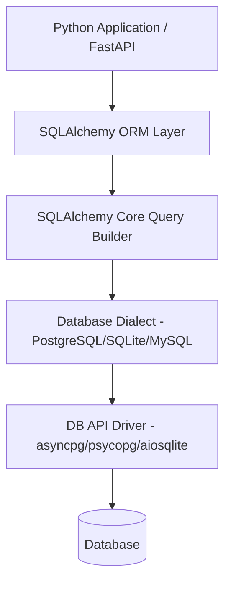

## SQLAlchemy কী ও 2.0 Paradigm

Python এ ডেটাবেজের সাথে কাজ করার জন্য **SQLAlchemy** হলো সবচেয়ে বিখ্যাত, শক্তিশালী এবং ইন্ডাস্ট্রি স্ট্যান্ডার্ড SQL Toolkit ও Object Relational Mapper (ORM)। 

২০২৬ সালে দাঁড়িয়ে FastAPI, Flask, Django (with SQLAlchemy), Celery, Data Engineering Pipeline বা AI Service — যেকোনো জায়গায় Python ডেটাবেজ লেয়ারের মূল চালিকাশক্তি হলো SQLAlchemy 2.0+।

---

## SQLAlchemy কেন ব্যবহার করবে?

সরাসরি Raw SQL query (যেমন `sqlite3` বা `psycopg2`) লিখলে কিছু সমস্যা তৈরি হয়:
1. **SQL Injection Security Risk**
2. **Database Lock-in** (PostgreSQL থেকে MySQL এ যেতে হলে SQL syntax বদলাতে হয়)
3. **Type Safety নেই** (IDE autocompletion পাওয়া যায় না)
4. **Complex Joins & Data Mapping এর ঝঞ্ঝাট**

SQLAlchemy এই সমস্যাগুলো সমাধান করে Pythonic Object Syntax এবং Type-Safe Query Builder প্রদান করে।



---

## 2.0 Paradigm: 1.x vs 2.0 এর মূল পার্থক্য

SQLAlchemy 1.4/2.0 ভার্সনে একটা বৈপ্লবিক পরিবর্তন এসেছে যাকে বলা হয় **SQLAlchemy 2.0 Unified Paradigm**। 

পুরোনো (1.x) স্টাইল আর আধুনিক (2.0+) স্টাইলের তুলনামূলক উদাহরণ:

### ❌ পুরোনো স্টাইল (SQLAlchemy 1.x legacy - এড়িয়ে চলবে)
```python
# Legacy 1.x style: session.query() - deprecated!
users = session.query(User).filter(User.age >= 18).all()
```

### ✅ আধুনিক স্টাইল (SQLAlchemy 2.0+ Standard)
```python
from sqlalchemy import select

# Modern 2.0 style: explicit select() statement
stmt = select(User).where(User.age >= 18)
users = session.scalars(stmt).all()
```

> [!important] Modern SQLAlchemy Rule
> ২০২৬ সালে সব নতুন প্রজেক্টে `session.query()` ব্যবহার না করে `select()`, `execute()`, `scalars()` ব্যবহার করতে হবে। এতে Type Checker (Mypy, Pyright) এবং IDE Autocomplete ১০০% নির্ভুল কাজ করে।

---

## SQLAlchemy এর দুটি মূল আর্কিটেকচার

SQLAlchemy দুটি লেয়ারে বিভক্ত:

1. **SQLAlchemy Core**: SQL Abstraction Layer। এখানে Table, Column, Engine, Connection নিয়ে কাজ করা হয়। এটি SQL Expression Syntax প্রদান করে।
2. **SQLAlchemy ORM**: Domain Model Mapper। এটি Python Class এর সাথে Database Table কে ম্যাপিং করে এবং Unit of Work Pattern মেনে চলে।

| বৈশিষ্ট্য | Core | ORM |
| :--- | :--- | :--- |
| **Primary Unit** | `Table`, `Column` objects | Python `Class` (Declarative Model) |
| **Query Style** | `select(table.c.name)` | `select(User).where(...)` |
| **Performance** | সর্বোচ্চ গতি (High Throughput) | সামান্য Overhead, তবে চমৎকার Developer Experience |
| **Use Case** | Data Analytics, Bulk ETL Pipeline | Web Application, REST API, Microservices |

---

## ইনস্টলেশন ও সেটআপ

SQLAlchemy 2.0+ এবং ড্রাইভার ইনস্টল করার কমান্ড:

```bash
# Basic PostgreSQL setup with SQLAlchemy 2.0
pip install "sqlalchemy>=2.0.0" psycopg

# Async PostgreSQL (asyncpg) setup
pip install "sqlalchemy[asyncio]>=2.0.0" asyncpg

# SQLite (Built-in) or Async SQLite
pip install "sqlalchemy[asyncio]" aiosqlite
```

> [!tip] Type Safety এর জন্য Pydantic / Mypy Support
> SQLAlchemy 2.0 এ PEP 484 Native Type Hints সাপোর্টেড। তাই `Mapped[str]` এবং `mapped_column()` ব্যবহার করলে কোনো extra mypy plugin ছাড়াই শতভাগ static typing সুবিধা পাওয়া যায়!
